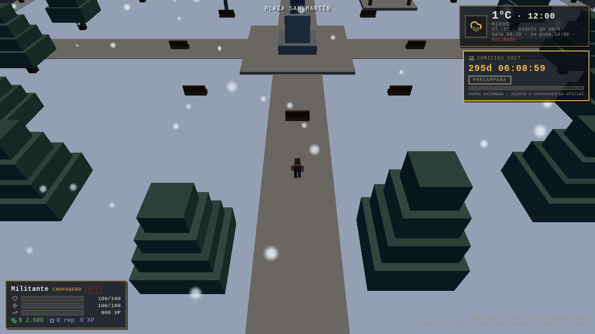

# Esquel 2027

RPG voxel online en el navegador, ambientado en la ciudad de **Esquel (Chubut,
Argentina)**: simulación política satírica, militancia territorial en tiempo real y
un motor de inteligencia que mide el pulso del pueblo barrio por barrio.

> **Estado: Fase 1 entregada.** El cliente 3D ya corre: la cuadrícula de Esquel en
> voxels, el clima y la hora reales de la ciudad, el ciclo solar, la nieve
> patagónica, tres edificios emblemáticos inyectados por dirección y el HUD con la
> cuenta regresiva a los comicios 2027. Detalle en
> [`docs/prompts/FASE-1-entrega.md`](docs/prompts/FASE-1-entrega.md).



---

## Los tres pilares

**Ciudad voxel georreferenciada.** La cuadrícula real de Esquel —Av. Alvear, 25 de
Mayo, San Martín, Fontana, Rivadavia, la Plaza San Martín, La Trochita— con la
silueta de La Hoya, el Cerro 21 y La Zeta al fondo. Hora local (UTC-3) y clima en
vivo: si en Esquel está nevando, en el juego está nevando, y los afiches se despegan
antes.

**Militancia como bucle de juego.** Diez rangos, de *Chopanero* a *Candidato
Provincial*. Se sube pegando afiches, repartiendo volantes, cebando mates, ganando
duelos de chicana en la esquina y sosteniendo movilizaciones donde nueve militantes
coordinados valen más que catorce dispersos — literalmente, la fórmula lo dice.

**El pulso del pueblo.** Un onboarding de 30 segundos y la telemetría del juego
alimentan un motor de inteligencia que mapea sentimiento e intención de voto por
barrio y franja etaria, siempre con seudónimo rotativo, k-anonimato ≥ 15 y
consentimiento revocable.

## Arquitectura en una línea

Navegador (Three.js) ⇄ **Hostinger** (PHP 8 + MySQL: identidad, datos, inteligencia)
y ⇄ **VPS** (Node + Colyseus: mundo autoritativo, misiones, voz espacial).
Detalle en [`docs/architecture/deployment-dual.md`](docs/architecture/deployment-dual.md).

## Estructura

```
client/       Cliente 3D voxel (Three.js + Vite)          → estático en Hostinger
server-vps/   Servidor autoritativo (Node + Colyseus)     → VPS Linux
backend-php/  API REST, identidad, MySQL, inteligencia    → Hostinger
shared/       Contratos, constantes y fórmulas            → lo importan los tres
tools/        Pipelines de datos e integridad de CI
docs/         Arquitectura, diseño y políticas
```

Responsabilidad archivo por archivo en
[`docs/architecture/monorepo.md`](docs/architecture/monorepo.md).

## Arranque

```bash
npm install
npm run dev              # cliente 3D en http://localhost:5173
npm run check:all        # typecheck + balance + schemas
npm run prefabs          # regenera las fachadas emblemáticas

# base de datos
mysql -u USER -p DB < backend-php/database/schema.sql
for f in backend-php/database/seeds/*.sql; do mysql -u USER -p DB < "$f"; done
```

Requiere Node ≥ 20.11 (≥ 22.6 para correr los scripts TS sin `tsx`), PHP ≥ 8.1 y
MySQL 8 o MariaDB 10.6+.

## Verificaciones

| Comando | Qué garantiza |
|---|---|
| `npm run typecheck` | `strict` completo en `/shared` y `/tools` |
| `npm run check:balance` | Que fórmulas, tabla de rangos y seeds SQL no puedan divergir, y que se cumplan las 7 invariantes de diseño |
| `npm run validate:schemas` | Que el JSON Schema compile, que validen los ejemplos y las fachadas reales, y que el tipo TypeScript esté en paridad |
| `npm run build:client` | Que el bundle del cliente 3D compile |

## Documentación

| Documento | Para qué |
|---|---|
| [Estructura del monorepo](docs/architecture/monorepo.md) | Qué hace cada carpeta y cada archivo |
| [Despliegue dual](docs/architecture/deployment-dual.md) | Hostinger + VPS, API REST, flujos, escalado, seguridad |
| [Fórmulas de balance](docs/game-design/balance-formulas.md) | Toda la matemática del juego |
| [Privacidad y telemetría](docs/architecture/privacidad-telemetria.md) | Reglas duras del motor de inteligencia |
| [Tono y espíritu](docs/game-design/politica-editorial.md) | De qué se ríe el juego y los tres límites |
| [Elecciones 2027](docs/game-design/elecciones-2027.md) | El end-game: fases, veda y cuenta regresiva |
| [Entrega de la Fase 1](docs/prompts/FASE-1-entrega.md) | Motor voxel, clima real y fachadas: qué se hizo y cómo se verificó |
| [Traspaso al PROMPT 1](docs/prompts/PROMPT-1-handoff.md) | Plan de fases, auditoría y decisiones pendientes |

## Controles

`WASD` mover · `Shift` correr · `Espacio` saltar · arrastrar para girar la cámara ·
rueda para acercar · `C` cambia entre tercera persona e isométrica · `F3` diagnóstico.

Parámetros de URL para probar: `?hora=19.5` fuerza la hora de Esquel, `?spawn=-64,4`
te deja frente a la Municipalidad, `?hud=0` saca el HUD.

## Advertencias

Las facciones, los cargos y los personajes del juego son **ficticios**. La sátira
apunta a las prácticas de la rosca, no a personas reales con nombre y apellido.

Los cortes de intención de voto que produce el motor **no son una encuesta
representativa** del padrón de Esquel: la muestra es autoseleccionada y todo reporte
sale con su tamaño de muestra y su margen de error a la vista.
