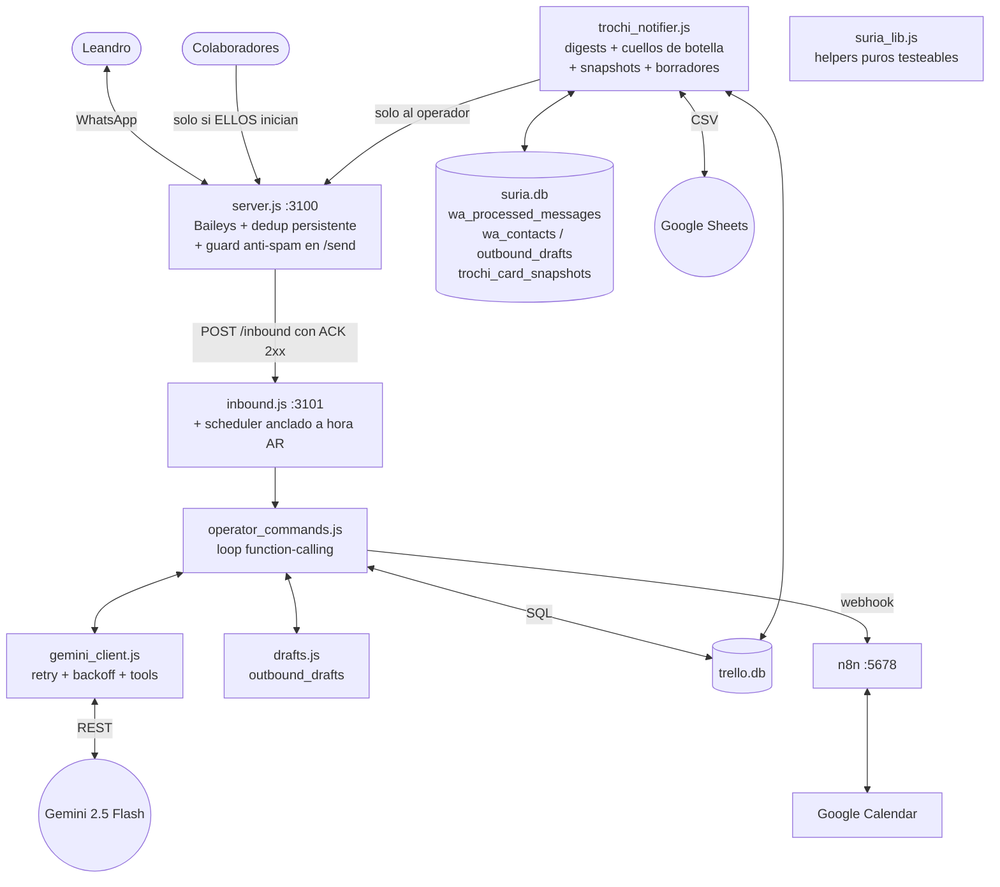

# SURIA Copiloto v2 — Especificación Técnica de Implementación

**Proyecto:** Copiloto inteligente WhatsApp + Trochi + Google Calendar (Subsecretaría de Turismo de Esquel)
**Autor del diseño:** Fable 5 (Claude) — para ejecución por **Antigravity** en el VPS
**Fecha:** 2026-07-19
**Versión objetivo:** v2.0

---

## 0. Cómo usar este documento (instrucciones para Antigravity)

Este documento es **autocontenido y ejecutable paso a paso**. Contiene:

- El diagnóstico completo de bugs del código actual (§1).
- La arquitectura objetivo (§2).
- Migraciones SQL **aditivas** (no destruyen nada) (§3).
- **3 módulos nuevos**: `suria_lib.js`, `gemini_client.js`, `drafts.js` (§4).
- Los **4 archivos corregidos completos** listos para reemplazar: `server.js`, `inbound.js`, `operator_commands.js`, `trochi_notifier.js` (§5–§8).
- Suite de pruebas unitarias + script de smoke test de integración (§9).
- Runbook de despliegue con backups y rollback (§10).
- Manual de operación para Leandro (§11).
- Diseño de los Moonshots: detector de cuellos de botella (implementado), multi-tenant SaaS (diseño por fases), resúmenes periódicos (implementado) (§12).

### Orden de ejecución obligatorio

1. **Backups** de `suria.db` y `trello.db` (§10.1). No saltear.
2. Aplicar migración `001_copiloto_v2.sql` (§3). Opcionalmente `002_seed_wa_contacts.sql`.
3. Crear los 3 módulos nuevos en `/opt/suria/` (§4).
4. Reemplazar los 4 archivos existentes (§5–§8). Verificar sintaxis con `node --check <archivo>` en cada uno.
5. Crear y correr los tests unitarios (`node --test /opt/suria/test/suria_lib.test.js`) (§9.1). **Todos deben pasar antes de reiniciar servicios.**
6. Reiniciar servicios en orden: `systemctl restart suria-inbound && systemctl restart suria-whatsapp`.
7. Correr el smoke test de integración (§9.2) y la checklist manual (§9.3).

### Prerrequisitos a verificar antes de empezar

```bash
node -v            # Debe ser >= 18.17 (node:test lo requiere). Si es 20+, mejor.
npm ls better-sqlite3 --prefix /opt/suria          # ya instalado (lo usa el código actual)
npm ls @whiskeysockets/baileys --prefix /opt/whatsapp
# IMPORTANTE: NO actualizar Baileys en este despliegue. El código usa makeInMemoryStore,
# que fue eliminado en Baileys 7.x. Mantener la versión pinneada actual (6.x).
sqlite3 --version  # CLI necesario para migraciones y backups
```

**No se agrega ninguna dependencia npm nueva.** Todo usa Node core (`node:test`, `https`, `crypto`) y `better-sqlite3` ya presente.

---

## 1. Diagnóstico: bugs confirmados en el código actual

Cada bug fue verificado leyendo el código fuente provisto. La columna "Fix" indica la sección de este documento donde se corrige.

| # | Severidad | Archivo | Bug | Fix |
|---|-----------|---------|-----|-----|
| B1 | 🔴 Crítica | `server.js` | **Dedup prematuro**: `recentlyProcessed.add(msgId)` se ejecuta *antes* de descargar la media y *antes* de confirmar que el webhook respondió 2xx. Si `downloadMedia()` devuelve `null` (rekeying, clave expirada) o si `inbound` está caído, el mensaje ya quedó marcado como procesado → el reintento de desencriptado de Baileys que llega después con el contenido completo se descarta como "Duplicado ignorado" → **mensaje perdido para siempre**. | §5 |
| B2 | 🔴 Crítica | `server.js` | **Dedup por conexión y volátil**: `const recentlyProcessed = new Set()` vive dentro de `connectToWhatsApp()`. Cada reconexión (frecuentes con Baileys) crea un Set vacío → las redeliveries de WhatsApp tras reconectar se procesan de nuevo (duplicados). Además el TTL de 5 min es menor que la ventana real de redelivery offline. | §5 |
| B3 | 🔴 Crítica | `server.js` | **`rekey: true` no es una opción de Baileys**. La firma real es `downloadMediaMessage(msg, type, options, { logger, reuploadRequest })`. Sin `reuploadRequest: sock.updateMediaMessage`, cuando la media key expiró (rekeying, mensaje viejo) la descarga falla sin recuperación posible: Baileys nunca le pide al teléfono que re-suba el archivo. | §5 |
| B4 | 🔴 Crítica | `server.js` | **Webhook fire-and-forget**: `forwardToWebhook()` no espera ni verifica el status. Si `suria-inbound` está reiniciándose, el payload se pierde en silencio (y por B1, sin reintento posible). | §5 |
| B5 | 🔴 Crítica | `operator_commands.js` | **El audio viaja dos veces**: tras transcribir la nota de voz, `handleOperatorMessage` llama a `callGeminiWithTools(promptContext, media)` con `media` **todavía apuntando al audio crudo**. Gemini recibe la transcripción como texto Y el binario de nuevo → doble procesamiento, confusión multimodal, tokens duplicados, y a veces re-transcripción dentro de la respuesta. | §7 |
| B6 | 🟠 Alta | `operator_commands.js` | **No hay loop de function calling**: el resultado de cada tool se devuelve *directo al chat* en vez de reinyectarse como `functionResponse` para que Gemini lo sintetice. Consecuencia visible: `get_staff_schedules` le tira a Leandro el **CSV crudo** de la planilla en el WhatsApp. | §4.2, §7 |
| B7 | 🟠 Alta | `operator_commands.js` | **Sin fecha/hora actual en el prompt**: Gemini no puede resolver "hoy", "mañana", "el viernes" para `create_calendar_meeting` ni para horarios. Adivina o alucina fechas. | §7 |
| B8 | 🟠 Alta | `operator_commands.js` | `get_employee_brief` ejecuta `notifier.checkMeetingReminders()` como "mock" → **efecto colateral**: dispara briefings de reuniones no pedidos hacia Leandro cada vez que pide una ficha de empleado. | §7 |
| B9 | 🟠 Alta | `server.js` | **`/send` sin guard**: cualquier proceso local puede mandar mensajes a números fríos que jamás escribieron al bot → riesgo real de baneo de la cuenta nueva. Directriz de negocio: *bajo ninguna circunstancia* enviar a quien no inició chat. | §5 |
| B10 | 🟡 Media | `operator_commands.js` | `create_calendar_meeting` hace `dateTimeString.split(' ')`: rompe con formato ISO `2026-07-20T15:00` (queda hora `10:00` default y fecha con basura) y con `DD/MM/YYYY`. | §4.1, §7 |
| B11 | 🟡 Media | `inbound.js` | Worker con `setInterval(24h)` anclado a la hora de boot del servicio → los briefings salen a cualquier hora (ej. 03:47 si el servicio reinició de madrugada). Además `setInterval` de 24h acumula drift. | §6 |
| B12 | 🟡 Media | `trochi_notifier.js` | Prompt de briefing con **"Juan" hardcodeado**: `"En qué está trabajando Juan actualmente"` aunque la reunión sea con cualquier otra persona. | §8 |
| B13 | 🟡 Media | `trochi_notifier.js` | `trelloDb` se abre **una sola vez al cargar el módulo**. Si Docker recrea el archivo del volumen (redeploy de Trochi), el handle queda roto para siempre hasta reiniciar el servicio. | §8 |
| B14 | 🟢 Baja | `operator_commands.js` | Errores de Gemini (429/503, red) devuelven `''` → Leandro ve "❓ No entendí" cuando en realidad fue un error de infraestructura. Sin reintentos ni backoff. | §4.2 |
| B15 | 🟢 Baja | `server.js` | `viewOnceMessage`/`ephemeralMessage` están en `IGNORE_TYPES`, pero son **wrappers** que contienen el mensaje real adentro (`.message`). Hoy se descartan fotos/audios enviados como "ver una vez" o en chats con mensajes temporales. | §4.1, §5 |
| B16 | 🟢 Baja | `operator_commands.js` | Variable `parts` sombreada (declarada dos veces en scopes anidados de `callGeminiWithTools`); funciona pero es frágil. Se elimina con el refactor a `gemini_client.js`. | §4.2 |

### Decisiones de diseño transversales (justificación)

1. **Dedup persistente con máquina de estados** (`wa_processed_messages` en SQLite) en lugar del Set en memoria. Estados: `in_flight` → `delivered` | `failed`. Solo `delivered` bloquea reintentos. Un `in_flight` viejo (>90s) o un `failed` se reprocesan. Esto resuelve B1+B2+B4 de raíz y sobrevive reinicios y reconexiones. El Set en memoria se conserva solo como *hot-cache* de mensajes ya entregados (evita el hit a SQLite en el caso común).
2. **El mensaje se marca `delivered` únicamente cuando el webhook de inbound respondió 2xx.** Es el único punto del pipeline donde tenemos certeza de que el mensaje llegó al cerebro del copiloto. Antes de eso, cualquier fallo deja el estado en `failed` y el reintento de Baileys (o la próxima redelivery) vuelve a intentar.
3. **Separación transcripción / razonamiento** para audio (flujo en dos pasos): la transcripción se hace con un prompt quirúrgico a temperatura 0 **sin tools**; el texto resultante entra al pipeline de tools **sin el binario adjunto**. Gemini razona siempre sobre texto limpio.
4. **Loop de function calling real** con política híbrida: las tools **mutantes** (crear tarjeta, agendar reunión, vincular teléfono) devuelven confirmación determinística directa (sin segunda pasada por el modelo → cero riesgo de que Gemini "adorne" o distorsione lo que se hizo, y cero riesgo de doble ejecución); las tools **de consulta** (`get_staff_schedules`, `get_employee_brief`, `detect_bottlenecks`, `get_weekly_summary`) reinyectan sus datos como `functionResponse` para que Gemini redacte la respuesta natural. Esto resuelve B6 y la "distracción por contexto gigante": la planilla ya no vive en el prompt base, solo entra cuando la tool se invoca, y filtrada.
5. **Política anti-baneo aplicada en el punto de salida** (`/send` del daemon): no importa quién programe un envío (worker, n8n, un bug futuro), el guard es la última línea de defensa. Whitelist = números que iniciaron conversación (`wa_contacts`) + el operador. Todo lo demás → HTTP 403 + evento `WA_BLOCKED_OUTBOUND` auditado.
6. **Borradores con aprobación humana** (`outbound_drafts`): las alertas de inactividad y asignaciones de tarjetas generan un borrador informal (nombre de pila, tono argentino) que se manda **solo a Leandro**, con comandos de un toque: `enviar D-XXXX`, `enviar D-XXXX: <texto editado>`, `descartar D-XXXX`. Si el destinatario nunca escribió al bot, el bot **se niega a enviarlo incluso aprobado** y le entrega a Leandro el texto para copiar/pegar desde su WhatsApp personal. La política es inviolable por diseño.

---

## 2. Arquitectura objetivo v2



**Principios:**

- `suria_lib.js` concentra toda la lógica pura (clasificación de mensajes, decisión de dedup, teléfonos, fechas, filtrado de CSV) → **testeable sin red, sin DB, sin Baileys**.
- `gemini_client.js` es el único punto de contacto con la API de Gemini → retry/backoff y el loop de tools viven en un solo lugar.
- Ningún módulo envía WhatsApp a nadie que no sea el operador, salvo `/send` que aplica el guard.
- Todo lo nuevo en `suria.db` es aditivo; `trello.db` (Trochi) se toca **solo** con los INSERT de tarjetas que ya existían (se abre `readonly` en todas las consultas nuevas).

---

## 3. Migraciones de base de datos

### 3.1 `/opt/suria/migrations/001_copiloto_v2.sql` (obligatoria, idempotente)

```sql
-- SURIA Copiloto v2 — migración aditiva sobre /opt/suria/suria.db
-- Idempotente: se puede correr múltiples veces sin daño.

-- Máquina de estados de deduplicación de mensajes entrantes (resuelve B1/B2/B4).
CREATE TABLE IF NOT EXISTS wa_processed_messages (
  msg_id          TEXT PRIMARY KEY,
  remote_jid      TEXT,
  msg_type        TEXT,
  status          TEXT NOT NULL DEFAULT 'in_flight',  -- in_flight | delivered | failed
  attempts        INTEGER NOT NULL DEFAULT 0,
  first_seen_at   TEXT,
  last_attempt_at TEXT,
  delivered_at    TEXT,
  fail_reason     TEXT
);
CREATE INDEX IF NOT EXISTS idx_wapm_first_seen ON wa_processed_messages(first_seen_at);

-- Whitelist de contactos que INICIARON conversación con el bot (guard anti-baneo, B9).
CREATE TABLE IF NOT EXISTS wa_contacts (
  phone            TEXT PRIMARY KEY,   -- solo dígitos
  jid              TEXT,
  push_name        TEXT,
  first_inbound_at TEXT,
  last_inbound_at  TEXT,
  inbound_count    INTEGER NOT NULL DEFAULT 0
);

-- Borradores de mensajes salientes con aprobación humana.
CREATE TABLE IF NOT EXISTS outbound_drafts (
  draft_id     TEXT PRIMARY KEY,       -- formato D-XXXX
  target_phone TEXT,                   -- puede ser '' si el empleado no tiene número vinculado
  target_name  TEXT,
  draft_text   TEXT NOT NULL,
  reason       TEXT,                   -- 'inactividad' | 'asignación de tarjeta' | ...
  status       TEXT NOT NULL DEFAULT 'pending',
               -- pending | approved_sent | edited_sent | discarded | handed_off
  created_at   TEXT,
  resolved_at  TEXT,
  final_text   TEXT
);

-- Snapshots diarios de tarjetas de Trochi para calcular deltas (partes diarios/semanales).
CREATE TABLE IF NOT EXISTS trochi_card_snapshots (
  snapshot_date TEXT NOT NULL,         -- YYYY-MM-DD (hora de Argentina)
  card_id       INTEGER NOT NULL,
  list_id       INTEGER,
  list_title    TEXT,
  card_title    TEXT,
  due_date      TEXT,
  member_ids    TEXT,                  -- CSV de user_ids
  PRIMARY KEY (snapshot_date, card_id)
);

-- Estas dos ya deberían existir (el código actual las usa); se crean por las dudas
-- para que un suria.db fresco no rompa nada:
CREATE TABLE IF NOT EXISTS wa_identity_map (
  lid_jid           TEXT PRIMARY KEY,
  pn_jid            TEXT,
  phone_e164        TEXT,
  last_seen_at      TEXT,
  resolution_status TEXT,
  source            TEXT
);

CREATE TABLE IF NOT EXISTS inbound_pending_identity (
  id                  INTEGER PRIMARY KEY AUTOINCREMENT,
  original_remote_jid TEXT,
  message_text        TEXT,
  push_name           TEXT,
  timestamp           TEXT,
  resolved_at         TEXT,
  lead_id             TEXT
);

-- El operador siempre está habilitado como destino de /send:
INSERT OR IGNORE INTO wa_contacts (phone, jid, push_name, first_inbound_at, last_inbound_at, inbound_count)
VALUES ('5491136434814', '5491136434814@s.whatsapp.net', 'Leandro (Operador)', datetime('now'), datetime('now'), 1);
```

Aplicar con:

```bash
sqlite3 /opt/suria/suria.db < /opt/suria/migrations/001_copiloto_v2.sql
```

### 3.2 `/opt/suria/migrations/002_seed_wa_contacts.sql` (opcional, recomendada)

Siembra `wa_contacts` con los números que **ya respondieron** al bot históricamente (eventos `REPLIED`), para que el guard no bloquee conversaciones existentes. **Correr solo si la tabla `leads` existe en suria.db** (`sqlite3 /opt/suria/suria.db ".tables" | grep -w leads`):

```sql
INSERT OR IGNORE INTO wa_contacts (phone, jid, push_name, first_inbound_at, last_inbound_at, inbound_count)
SELECT
  REPLACE(REPLACE(REPLACE(l.phone, ' ', ''), '-', ''), '+', '') AS phone,
  '' AS jid,
  l.name AS push_name,
  MIN(e.timestamp),
  MAX(e.timestamp),
  COUNT(*)
FROM events e
JOIN leads l ON e.lead_id = l.lead_id
WHERE e.event_type = 'REPLIED'
  AND l.phone IS NOT NULL
  AND LENGTH(REPLACE(REPLACE(REPLACE(l.phone, ' ', ''), '-', ''), '+', '')) >= 8
GROUP BY 1;
```

### 3.3 Variable de entorno nueva (opcional)

`WA_OUTBOUND_POLICY` en el servicio `suria-whatsapp`:

- `strict` (**default si no está seteada**): guard activo. Nadie recibe mensajes salvo que haya iniciado chat o sea el operador.
- `legacy`: guard desactivado (comportamiento actual). **Solo para emergencias**; queda logueado en cada envío. Si algún día reactivás el outreach en frío de SURIA-leads, activás esto a consciencia.

Para setearla (opcional, el default ya es lo que querés):

```bash
sudo systemctl edit suria-whatsapp
# En el editor agregar:
# [Service]
# Environment=WA_OUTBOUND_POLICY=strict
sudo systemctl daemon-reload
```

---

## 4. Módulos nuevos

### 4.1 `/opt/suria/suria_lib.js` — helpers puros (NUEVO)

**Por qué existe:** toda la lógica de decisión (clasificar mensajes de Baileys, decidir dedup, normalizar teléfonos argentinos, parsear fechas, filtrar la planilla) queda en funciones puras sin I/O → se testean con `node --test` sin levantar WhatsApp ni tocar bases. Es también el primer paso de replicabilidad multi-tenant: nada acá depende de Esquel ni de un número concreto.

```javascript
'use strict';

// ═══════════════════════════════════════════════════════════════════════════
// SURIA lib — funciones puras compartidas por server.js, inbound.js,
// operator_commands.js y trochi_notifier.js. SIN I/O: todo testeable.
// ═══════════════════════════════════════════════════════════════════════════

// ── Teléfonos ──────────────────────────────────────────────────────────────

function normalizePhone(input) {
  if (!input) return '';
  return String(input).replace(/@.*$/, '').replace(/[^0-9]/g, '');
}

// Compara dos teléfonos tolerando prefijos (549 vs 54 vs local): matchea por
// igualdad exacta o por últimos 10 dígitos.
function samePhone(a, b) {
  const ca = normalizePhone(a);
  const cb = normalizePhone(b);
  if (!ca || !cb) return false;
  if (ca === cb) return true;
  return ca.length >= 10 && cb.length >= 10 && ca.slice(-10) === cb.slice(-10);
}

// Variantes de un número argentino (con/sin 549, 54, local) para búsquedas en DB.
function argPhoneVariants(base) {
  const clean = normalizePhone(base);
  const variants = new Set();
  if (!clean) return [];
  variants.add(clean);
  if (clean.startsWith('549')) {
    variants.add('54' + clean.slice(3));
    variants.add(clean.slice(2));
    variants.add(clean.slice(3));
  } else if (clean.startsWith('54')) {
    variants.add('549' + clean.slice(2));
    variants.add(clean.slice(2));
  } else {
    variants.add('54' + clean);
    variants.add('549' + clean);
  }
  return [...variants];
}

// ── Nombres ────────────────────────────────────────────────────────────────

// "MARÍA laura González" -> "María". Para que los borradores suenen humanos.
function firstName(displayName) {
  if (!displayName) return '';
  const first = String(displayName).trim().split(/\s+/)[0];
  if (!first) return '';
  return first.charAt(0).toUpperCase() + first.slice(1).toLowerCase();
}

// ── Clasificación de mensajes de Baileys (corazón del fix de dedup) ────────

// Tipos que son señalización pura: jamás traen contenido para el copiloto.
const SIGNALING_TYPES = new Set([
  'protocolMessage',
  'reactionMessage',
  'senderKeyDistributionMessage',
  'pollCreationMessage',
  'pollUpdateMessage',
  'liveLocationMessage',
  'templateMessage',
  'editedMessage',
  'keepInChatMessage',
  'botInvokeMessage',
]);

// WAMessageStubType.CIPHERTEXT === 1 en Baileys: mensaje que AÚN no se pudo
// desencriptar (llegará un reintento con el contenido real).
const STUB_CIPHERTEXT = 1;

/**
 * Clasifica un msg de messages.upsert en:
 *  - 'ciphertext': no desencriptado todavía → NUNCA marcar como procesado.
 *  - 'signaling' : señalización (reacciones, polls, etc.) → ignorar sin marcar.
 *  - 'empty'     : sin texto ni media útil → ignorar sin marcar.
 *  - 'content'   : contenido real → procesar (y recién ahí jugar el dedup).
 * Además desanida wrappers (ephemeral / viewOnce / documentWithCaption), que el
 * código anterior descartaba por error (B15).
 *
 * @returns {{kind: string, msgType: string, body: string, hasMedia?: boolean, inner?: object}}
 */
function classifyUpsertMessage(msg) {
  const messageObj = (msg && msg.message) || null;

  if (!messageObj || Object.keys(messageObj).length === 0 || msg.messageStubType === STUB_CIPHERTEXT) {
    return { kind: 'ciphertext', msgType: 'unknown', body: '' };
  }

  // Desanidar wrappers: el mensaje real viene adentro.
  let inner = messageObj;
  for (let i = 0; i < 3; i++) {
    if (inner.ephemeralMessage && inner.ephemeralMessage.message) { inner = inner.ephemeralMessage.message; continue; }
    if (inner.viewOnceMessage && inner.viewOnceMessage.message) { inner = inner.viewOnceMessage.message; continue; }
    if (inner.viewOnceMessageV2 && inner.viewOnceMessageV2.message) { inner = inner.viewOnceMessageV2.message; continue; }
    if (inner.documentWithCaptionMessage && inner.documentWithCaptionMessage.message) { inner = inner.documentWithCaptionMessage.message; continue; }
    break;
  }

  const keys = Object.keys(inner).filter(k => k !== 'messageContextInfo');
  const msgType = keys[0] || 'unknown';

  const body =
    inner.conversation ||
    (inner.extendedTextMessage && inner.extendedTextMessage.text) ||
    (inner.imageMessage && inner.imageMessage.caption) ||
    (inner.documentMessage && inner.documentMessage.caption) ||
    '';

  if (msgType === 'unknown') {
    return { kind: 'ciphertext', msgType, body: '' };
  }
  if (!body && SIGNALING_TYPES.has(msgType)) {
    return { kind: 'signaling', msgType, body: '' };
  }

  const hasMedia = !!(inner.imageMessage || inner.audioMessage || inner.documentMessage);
  if (!body && !hasMedia) {
    return { kind: 'empty', msgType, body: '' };
  }
  return { kind: 'content', msgType, body, hasMedia, inner };
}

/**
 * Decisión de deduplicación sobre la fila persistida en wa_processed_messages.
 *  - Sin fila            → 'process' (primera vez que lo vemos).
 *  - status 'delivered'  → 'skip'    (ya llegó sano al inbound; duplicado real).
 *  - status 'in_flight'  → 'skip' si el intento es reciente (otro upsert
 *                          concurrente lo está procesando), 'process' si quedó
 *                          colgado (crash a mitad de pipeline).
 *  - status 'failed'     → 'process' (el reintento de Baileys es bienvenido).
 */
function dedupDecision(row, nowMs, opts = {}) {
  const inFlightTtlMs = opts.inFlightTtlMs || 90 * 1000;
  if (!row) return 'process';
  if (row.status === 'delivered') return 'skip';
  if (row.status === 'in_flight') {
    const last = Date.parse(row.last_attempt_at || row.first_seen_at || '') || 0;
    return (nowMs - last) < inFlightTtlMs ? 'skip' : 'process';
  }
  return 'process';
}

// ── Fechas ─────────────────────────────────────────────────────────────────

/**
 * Parsea lo que Gemini o Leandro puedan tirar como fecha-hora:
 * 'YYYY-MM-DD HH:mm', 'YYYY-MM-DDTHH:mm[:ss]', 'YYYY-MM-DD', 'DD/MM/YYYY[ HH:mm]'.
 * Devuelve { date: 'YYYY-MM-DD', time: 'HH:mm' } o null si no se entiende (B10).
 */
function parseDateTimeString(s, defaults = { time: '10:00' }) {
  if (!s) return null;
  const str = String(s).trim().replace('T', ' ');

  let m = str.match(/^(\d{4})-(\d{2})-(\d{2})(?:\s+(\d{1,2}):(\d{2}))?/);
  if (m) {
    const time = m[4] != null ? String(m[4]).padStart(2, '0') + ':' + m[5] : defaults.time;
    return { date: m[1] + '-' + m[2] + '-' + m[3], time };
  }

  m = str.match(/^(\d{1,2})\/(\d{1,2})\/(\d{4})(?:\s+(\d{1,2}):(\d{2}))?/);
  if (m) {
    const time = m[4] != null ? String(m[4]).padStart(2, '0') + ':' + m[5] : defaults.time;
    return {
      date: m[3] + '-' + String(m[2]).padStart(2, '0') + '-' + String(m[1]).padStart(2, '0'),
      time
    };
  }
  return null;
}

/**
 * Fecha/hora actual en America/Argentina/Buenos_Aires, independiente del TZ
 * del VPS. { iso: 'YYYY-MM-DD', time: 'HH:mm', weekday: 'sábado' }.
 */
function nowInBuenosAires(d = new Date()) {
  const fmt = new Intl.DateTimeFormat('es-AR', {
    timeZone: 'America/Argentina/Buenos_Aires',
    year: 'numeric', month: '2-digit', day: '2-digit',
    hour: '2-digit', minute: '2-digit', hour12: false,
    weekday: 'long'
  });
  const parts = {};
  for (const p of fmt.formatToParts(d)) parts[p.type] = p.value;
  // Algunos ICU devuelven '24' para medianoche con hourCycle h24: normalizar.
  const hour = parts.hour === '24' ? '00' : parts.hour;
  return {
    iso: parts.year + '-' + parts.month + '-' + parts.day,
    time: hour + ':' + parts.minute,
    weekday: (parts.weekday || '').toLowerCase()
  };
}

// ── Planilla de horarios ───────────────────────────────────────────────────

/**
 * Reduce el CSV de horarios ANTES de mandarlo a Gemini (anti "contexto gigante").
 * Si la consulta menciona nombres que matchean filas, devuelve header + esas
 * filas. Si no hay match claro (ej. "¿quién viene hoy?"), devuelve el CSV
 * completo capado a maxChars.
 */
function filterScheduleCsv(csv, query, maxChars = 12000) {
  if (!csv) return '';
  const lines = csv.split(/\r?\n/).filter(l => l.trim() !== '');
  if (!query || lines.length <= 2) return csv.slice(0, maxChars);

  const words = String(query).toLowerCase()
    .split(/[^a-záéíóúüñ]+/i)
    .filter(w => w.length >= 3 && !['quien', 'quién', 'viene', 'horario', 'horarios', 'turno', 'turnos', 'hoy', 'semana', 'para', 'los', 'las', 'del'].includes(w));

  if (words.length > 0) {
    const header = lines[0];
    const matched = lines.slice(1).filter(l => {
      const ll = l.toLowerCase();
      return words.some(w => ll.includes(w));
    });
    if (matched.length > 0 && matched.length < lines.length - 1) {
      return [header].concat(matched).join('\n').slice(0, maxChars);
    }
  }
  return csv.slice(0, maxChars);
}

module.exports = {
  normalizePhone,
  samePhone,
  argPhoneVariants,
  firstName,
  classifyUpsertMessage,
  dedupDecision,
  parseDateTimeString,
  nowInBuenosAires,
  filterScheduleCsv,
  SIGNALING_TYPES,
  STUB_CIPHERTEXT,
};
```

---

### 4.2 `/opt/suria/gemini_client.js` — cliente Gemini unificado (NUEVO)

**Por qué existe:** hoy hay **tres** implementaciones distintas de llamadas a Gemini repartidas en dos archivos, ninguna con reintentos (B14), y el "loop" de tools no reinyecta resultados (B6). Este módulo centraliza: reintentos con backoff exponencial ante 429/5xx, `systemInstruction` como campo nativo de la API (separa instrucciones del contenido del usuario → mejora la multimodalidad porque la imagen/audio queda como contenido puro), y el **loop real de function calling** con `functionResponse`.

**Detalle del protocolo:** en la API REST v1beta, el turno de respuesta de una tool se envía como `role: "user"` con parts `functionResponse` (mismo orden que los `functionCall` recibidos). Las tools mutantes pueden cortar el loop devolviendo `{ __direct: true, text }` — ver justificación en §1 (decisión 4).

```javascript
'use strict';

// ═══════════════════════════════════════════════════════════════════════════
// Cliente único de Gemini para SURIA.
//  - generateText(prompt, {media, systemInstruction, temperature})
//  - runWithTools({systemInstruction, userParts, tools, executors, maxTurns})
// Reintentos con backoff exponencial ante 429 / 5xx / errores de red.
// ═══════════════════════════════════════════════════════════════════════════

require('dotenv').config({ path: '/opt/suria/.env' });
const https = require('https');

const GEMINI_API_KEY = process.env.GEMINI_API_KEY;
const GEMINI_MODEL = process.env.GEMINI_MODEL || 'gemini-2.5-flash';
const BASE_URL = 'https://generativelanguage.googleapis.com/v1beta/models';

function sleep(ms) {
  return new Promise(resolve => setTimeout(resolve, ms));
}

function postJson(url, body, timeoutMs = 90000) {
  return new Promise((resolve, reject) => {
    const data = JSON.stringify(body);
    const urlObj = new URL(url);
    const req = https.request({
      hostname: urlObj.hostname,
      port: 443,
      path: urlObj.pathname + urlObj.search,
      method: 'POST',
      headers: {
        'Content-Type': 'application/json',
        'Content-Length': Buffer.byteLength(data)
      }
    }, (res) => {
      let respBody = '';
      res.on('data', chunk => respBody += chunk);
      res.on('end', () => {
        let parsed = null;
        try { parsed = JSON.parse(respBody); } catch (e) { /* respuesta no-JSON */ }
        resolve({ status: res.statusCode, ok: res.statusCode < 400, data: parsed, raw: respBody });
      });
    });
    req.setTimeout(timeoutMs, () => {
      req.destroy(new Error('Gemini timeout tras ' + timeoutMs + 'ms'));
    });
    req.on('error', reject);
    req.write(data);
    req.end();
  });
}

/**
 * POST a generateContent con reintentos. Lanza Error si agota los intentos
 * (los callers deciden el mensaje amigable — nunca más "" silencioso, B14).
 */
async function generateContent(payload, { retries = 3 } = {}) {
  if (!GEMINI_API_KEY) throw new Error('GEMINI_API_KEY no configurada en /opt/suria/.env');
  const url = `${BASE_URL}/${GEMINI_MODEL}:generateContent?key=${GEMINI_API_KEY}`;

  let lastErr = null;
  for (let attempt = 0; attempt <= retries; attempt++) {
    try {
      const res = await postJson(url, payload);
      if (res.ok) return res.data;
      if (res.status === 429 || res.status >= 500) {
        lastErr = new Error(`Gemini HTTP ${res.status} (transitorio)`);
      } else {
        // 400/403: error de payload o de clave — reintentar no ayuda.
        throw new Error(`Gemini HTTP ${res.status}: ${String(res.raw).slice(0, 300)}`);
      }
    } catch (e) {
      if (/Gemini HTTP 4/.test(e.message) && !/429/.test(e.message)) throw e;
      lastErr = e;
    }
    if (attempt < retries) {
      const waitMs = 1000 * Math.pow(2, attempt); // 1s, 2s, 4s
      console.log(`[Gemini] Reintento ${attempt + 1}/${retries} en ${waitMs}ms (${lastErr.message})`);
      await sleep(waitMs);
    }
  }
  throw lastErr || new Error('Gemini: error desconocido');
}

function extractText(data) {
  const parts = data?.candidates?.[0]?.content?.parts || [];
  return parts.map(p => p.text || '').join('').trim();
}

/**
 * Llamada simple (texto y opcionalmente 1 media inline). Usada para
 * transcripción de audio (temperature 0) y redacción de briefs/digests.
 */
async function generateText(prompt, { media = null, systemInstruction = null, temperature = 0.3 } = {}) {
  const parts = [{ text: prompt }];
  if (media && media.data && media.mimeType) {
    parts.push({ inlineData: { mimeType: media.mimeType.split(';')[0].trim(), data: media.data } });
  }
  const payload = {
    contents: [{ role: 'user', parts }],
    generationConfig: { temperature }
  };
  if (systemInstruction) {
    payload.systemInstruction = { parts: [{ text: systemInstruction }] };
  }
  const data = await generateContent(payload);
  return extractText(data);
}

/**
 * Loop de function calling real (fix de B6).
 *
 * @param {object} opts
 * @param {string} opts.systemInstruction  Instrucciones de sistema (rol, fecha actual, tono).
 * @param {Array}  opts.userParts          Parts del turno del usuario (texto + inlineData opcional).
 * @param {Array}  opts.tools              [{ functionDeclarations: [...] }]
 * @param {object} opts.executors          { toolName: async (args) => result }
 *        Si un executor devuelve { __direct: true, text }, el loop corta y ese
 *        texto es la respuesta final (tools mutantes: confirmación determinística).
 *        Cualquier otro valor se reinyecta como functionResponse (tools de consulta).
 * @param {number} opts.maxTurns           Tope de vueltas del loop (default 5).
 * @returns {{text: string, toolCalls: string[], exhausted?: boolean}}
 */
async function runWithTools({ systemInstruction, userParts, tools, executors, maxTurns = 5, temperature = 0.2 }) {
  const contents = [{ role: 'user', parts: userParts }];
  const toolCalls = [];

  for (let turn = 0; turn < maxTurns; turn++) {
    const payload = {
      contents,
      tools,
      generationConfig: { temperature }
    };
    if (systemInstruction) {
      payload.systemInstruction = { parts: [{ text: systemInstruction }] };
    }

    const data = await generateContent(payload);
    const candidate = data?.candidates?.[0];
    const parts = candidate?.content?.parts || [];
    const calls = parts.filter(p => p.functionCall);

    if (calls.length === 0) {
      return { text: extractText(data), toolCalls };
    }

    // Registrar el turno del modelo tal cual (necesario para el historial).
    contents.push({ role: 'model', parts });

    const responseParts = [];
    for (const call of calls) {
      const name = call.functionCall.name;
      const args = call.functionCall.args || {};
      toolCalls.push(name);
      console.log(`[Gemini ToolCall] ${name}(${JSON.stringify(args).slice(0, 200)})`);

      let result;
      const executor = executors[name];
      if (!executor) {
        result = { error: `Tool desconocida: ${name}` };
      } else {
        try {
          result = await executor(args);
        } catch (e) {
          console.error(`[Gemini ToolCall] ${name} lanzó error:`, e.message);
          result = { error: e.message };
        }
      }

      if (result && result.__direct) {
        // Acción mutante ejecutada: respuesta determinística, fin del loop.
        return { text: result.text, toolCalls };
      }

      responseParts.push({ functionResponse: { name, response: { result } } });
    }

    contents.push({ role: 'user', parts: responseParts });
  }

  return { text: '', toolCalls, exhausted: true };
}

module.exports = { generateText, runWithTools, generateContent };
```

---

### 4.3 `/opt/suria/drafts.js` — borradores con aprobación humana (NUEVO)

**Por qué existe:** materializa la directriz anti-baneo. Cualquier módulo puede *proponer* un mensaje a un colaborador, pero el único camino de salida es: crear borrador → mostrarlo a Leandro → Leandro aprueba (`enviar D-XXXX`), edita (`enviar D-XXXX: texto`) o descarta. La tabla `outbound_drafts` deja auditoría completa de qué se propuso, qué se aprobó y qué se bloqueó.

```javascript
'use strict';

// ═══════════════════════════════════════════════════════════════════════════
// Gestión de borradores salientes (outbound_drafts en suria.db).
// Nada de este módulo envía WhatsApp: solo persiste y formatea.
// El envío ocurre en operator_commands.js vía /send (que aplica el guard).
// ═══════════════════════════════════════════════════════════════════════════

const db = require('./db.js');

function newDraftId() {
  return 'D-' + Math.random().toString(36).slice(2, 6).toUpperCase();
}

function createDraft({ targetName, targetPhone, text, reason }) {
  let draftId = newDraftId();
  for (let i = 0; i < 5; i++) {
    const exists = db.query('SELECT draft_id FROM outbound_drafts WHERE draft_id = ?', [draftId]);
    if (!exists.length) break;
    draftId = newDraftId();
  }
  db.query(
    `INSERT INTO outbound_drafts (draft_id, target_phone, target_name, draft_text, reason, status, created_at)
     VALUES (?, ?, ?, ?, ?, 'pending', ?)`,
    [draftId, String(targetPhone || '').replace(/[^0-9]/g, ''), targetName || '', text, reason || '', new Date().toISOString()]
  );
  return getDraft(draftId);
}

function getDraft(draftId) {
  const rows = db.query('SELECT * FROM outbound_drafts WHERE draft_id = ?', [String(draftId).toUpperCase()]);
  return rows.length ? rows[0] : null;
}

function listPending(limit = 20) {
  return db.query(
    `SELECT * FROM outbound_drafts WHERE status = 'pending' ORDER BY created_at DESC LIMIT ?`,
    [limit]
  );
}

function resolve(draftId, status, finalText = null) {
  db.query(
    `UPDATE outbound_drafts SET status = ?, resolved_at = ?, final_text = ? WHERE draft_id = ?`,
    [status, new Date().toISOString(), finalText, String(draftId).toUpperCase()]
  );
  return getDraft(draftId);
}

function markSent(draftId, finalText, mode) {
  return resolve(draftId, mode === 'edited_sent' ? 'edited_sent' : 'approved_sent', finalText);
}

function markHandedOff(draftId) {
  return resolve(draftId, 'handed_off');
}

function discard(draftId) {
  const d = getDraft(draftId);
  if (!d || d.status !== 'pending') return null;
  return resolve(draftId, 'discarded');
}

// Mensaje completo que ve Leandro cuando nace un borrador.
function formatForOperator(draft) {
  const phoneInfo = draft.target_phone
    ? `📱 ${draft.target_phone}`
    : '⚠️ sin número vinculado (usá "vincular <usuario> con <número>")';
  return `✉️ *Borrador ${draft.draft_id}* → *${draft.target_name}*  (${phoneInfo})\n` +
         `Motivo: ${draft.reason}\n\n` +
         `"${draft.draft_text}"\n\n` +
         `Respondé:\n` +
         `• *enviar ${draft.draft_id}* → lo mando tal cual\n` +
         `• *enviar ${draft.draft_id}: <tu texto>* → lo mando editado\n` +
         `• *descartar ${draft.draft_id}*`;
}

// Versión corta para el listado "borradores".
function formatShort(draft) {
  const age = draft.created_at ? draft.created_at.slice(0, 16).replace('T', ' ') : '';
  return `• *${draft.draft_id}* → ${draft.target_name} (${draft.reason}, ${age})\n  "${String(draft.draft_text).slice(0, 90)}${String(draft.draft_text).length > 90 ? '…' : ''}"`;
}

module.exports = {
  createDraft,
  getDraft,
  listPending,
  markSent,
  markHandedOff,
  discard,
  formatForOperator,
  formatShort,
};
```

---

## 5. `/opt/whatsapp/server.js` — CORREGIDO COMPLETO

### Cambios clave y justificación

| Cambio | Bug que resuelve | Diseño |
|---|---|---|
| Dedup con máquina de estados persistida en `wa_processed_messages` + hot-cache en memoria a nivel **módulo** (no por conexión) | B1, B2 | Un mensaje solo queda `delivered` cuando inbound respondió 2xx. `failed` e `in_flight` viejos se reprocesan. Sobrevive reconexiones y reinicios del servicio. |
| `classifyUpsertMessage()` de `suria_lib` reemplaza la lógica ad-hoc de `IGNORE_TYPES` | B15 | Los mensajes cifrados (`msg.message` vacío o `messageStubType === CIPHERTEXT`) **jamás** tocan el dedup: el reintento de desencriptado de Baileys entra limpio. Wrappers ephemeral/viewOnce se desanidan en vez de descartarse. |
| `downloadMediaMessage(..., { logger, reuploadRequest: sock.updateMediaMessage })` + 3 reintentos con backoff (1.5s/3s/6s) + validación de buffer | B3 | `reuploadRequest` es el mecanismo oficial de Baileys: ante media key expirada (rekeying), le pide al teléfono re-subir el archivo y reintenta. Si igual falla, el mensaje queda `failed` (no `delivered`) → el próximo upsert lo reintenta. |
| `forwardToWebhook` ahora devuelve promesa, con timeout de 15s y 3 intentos con backoff | B4 | El estado `delivered` se escribe únicamente tras un 2xx real del inbound. |
| Guard anti-baneo en `POST /send` (`WA_OUTBOUND_POLICY=strict` por defecto) | B9 | Whitelist = `wa_contacts` (quien nos escribió primero) + operador. Rechazo con HTTP 403 `blocked_by_policy` + evento auditado `WA_BLOCKED_OUTBOUND`. |
| Registro de `wa_contacts` en cada mensaje entrante con contenido | B9 | El acto de escribirle al bot habilita a esa persona como destino para siempre (es la definición exacta de tu directriz). |
| Limpieza de `wa_processed_messages` (> 7 días) al arrancar y cada 12h | — | La tabla no crece sin límite. |

**Nota operativa:** el procesamiento de mensajes ahora es secuencial por mensaje (se espera el ACK del webhook antes de marcar estado). Con el volumen de un operador + equipo chico esto es correcto y más seguro; si algún día hay cientos de mensajes/minuto, se paraleliza por chat.

### Código completo — reemplazar `/opt/whatsapp/server.js`

```javascript
'use strict';

const http = require('http');
const { makeWASocket, useMultiFileAuthState, DisconnectReason, fetchLatestBaileysVersion, makeInMemoryStore, downloadMediaMessage } = require('@whiskeysockets/baileys');
const QRCode = require('qrcode');
const fs = require('fs');
const https = require('https');
const pino = require('pino');

const { randomUUID } = require('crypto');
const db = require('../suria/db.js');
const { classifyUpsertMessage, dedupDecision, normalizePhone } = require('../suria/suria_lib.js');

const PORT = 3100;
const SESSIONS_DIR = '/opt/whatsapp/sessions';
const OPERATOR_PHONE = '5491136434814';

// 'strict' (default): /send solo a contactos que iniciaron chat, o al operador.
// 'legacy': sin guard (solo para emergencias; queda logueado).
const OUTBOUND_POLICY = process.env.WA_OUTBOUND_POLICY || 'strict';

// State
let sock = null;
let currentQR = null;
let isConnected = false;
let connectedPhone = null;
let connectedName = null;
let webhookUrl = process.env.INBOUND_WEBHOOK_URL || 'http://localhost:3101/inbound';
let reconnecting = false;

// In-memory store para contacts/LID mapping
const store = makeInMemoryStore({});

// LID resolution helpers
let jidNormalizedUser;
try {
  const baileys = require('@whiskeysockets/baileys');
  jidNormalizedUser = baileys.jidNormalizedUser;
} catch(e) {
  jidNormalizedUser = (jid) => jid;
}

function extractPhoneFromJid(jid) {
  if (!jid) return null;
  const m = jid.match(/^(\d+)@s\.whatsapp\.net$/);
  return m ? m[1] : null;
}

function isLidJid(jid) {
  if (!jid) return false;
  if (jid.includes('@lid')) return true;
  if (jid.includes('@s.whatsapp.net')) return false;
  if (jid.includes('@g.us')) return false;
  const numPart = jid.replace(/@.*$/, '');
  return /^\d{10,}$/.test(numPart) && numPart.length > 13;
}

async function resolveRemoteJid(sock, remoteJid) {
  const result = {
    originalRemoteJid: remoteJid,
    resolvedRemoteJid: remoteJid,
    resolvedPhone: null,
    wasLid: false,
    resolutionStatus: 'unchanged'
  };

  if (!remoteJid) {
    result.resolutionStatus = 'missing';
    return result;
  }

  if (remoteJid.includes('@s.whatsapp.net')) {
    result.resolvedPhone = extractPhoneFromJid(remoteJid);
    result.resolutionStatus = 'pn-direct';
    return result;
  }

  if (remoteJid.includes('@g.us')) {
    result.resolutionStatus = 'group-ignored';
    return result;
  }

  result.wasLid = true;

  // Intento 0: buscar en wa_identity_map (DB cache LID→phone)
  try {
    const lidBase = remoteJid.replace(/:.*@lid/, '@lid');
    const lidCached = db.query(
      'SELECT phone_e164 FROM wa_identity_map WHERE lid_jid = ? OR lid_jid = ? LIMIT 1',
      [remoteJid, lidBase]
    );
    if (lidCached.length > 0 && lidCached[0].phone_e164) {
      const cachedPhone = lidCached[0].phone_e164.replace(/[^0-9]/g, '');
      result.resolvedRemoteJid = cachedPhone + '@s.whatsapp.net';
      result.resolvedPhone = cachedPhone;
      result.resolutionStatus = 'lid-resolved-db-cache';
      console.log('[WA-LID] DB cache: ' + remoteJid + ' -> ' + cachedPhone);
      return result;
    }
  } catch(e_cache) { /* silencioso */ }

  try {
    const lidMapping = sock && sock.signalRepository && sock.signalRepository.lidMapping;
    if (lidMapping && typeof lidMapping.getPNForLID === 'function') {
      const pn = await lidMapping.getPNForLID(remoteJid);
      if (pn) {
        const normalized = jidNormalizedUser ? jidNormalizedUser(pn) : pn;
        result.resolvedRemoteJid = normalized;
        result.resolvedPhone = extractPhoneFromJid(normalized);
        result.resolutionStatus = 'lid-resolved';
        return result;
      }
    }
    result.resolutionStatus = 'lid-unresolved';

    // Intento 2: buscar en store.contacts
    try {
      const contacts = store.contacts || {};
      const lidClean = remoteJid.replace(/@.*$/, '');
      for (const [jid, contact] of Object.entries(contacts)) {
        if (!jid.includes('@s.whatsapp.net')) continue;
        const contactLid = (contact.lid || '').replace(/@.*$/, '');
        if (contactLid === lidClean) {
          const phone = extractPhoneFromJid(jid);
          if (phone && phone.length >= 8) {
            result.resolvedRemoteJid = jid;
            result.resolvedPhone = phone;
            result.resolutionStatus = 'lid-resolved-store';
            return result;
          }
        }
      }
    } catch(e2) { /* silencioso */ }
  } catch(e) {
    result.resolutionStatus = 'lid-error';
    result.resolutionError = e.message;
  }

  return result;
}

function normalizeJid(remoteJid) {
  if (!remoteJid) return '';
  if (remoteJid.includes('@s.whatsapp.net')) {
    return remoteJid;
  }
  if (remoteJid.includes('@g.us')) {
    return remoteJid;
  }
  if (/^\d+$/.test(remoteJid)) {
    return remoteJid + '@s.whatsapp.net';
  }
  return remoteJid;
}

// ── Dedup persistente (wa_processed_messages) ──────────────────────────────
// Hot-cache a nivel módulo: sobrevive reconexiones de Baileys (fix B2).
const recentlyDelivered = new Map(); // msgId -> ts entrega

function getProcessedRow(msgId) {
  try {
    const rows = db.query('SELECT * FROM wa_processed_messages WHERE msg_id = ?', [msgId]);
    return rows.length ? rows[0] : null;
  } catch (e) {
    console.error('[WA-DEDUP] getProcessedRow error:', e.message);
    return null; // ante error de DB, preferimos procesar (riesgo de duplicado < riesgo de pérdida)
  }
}

function markInFlight(msgId, remoteJid, msgType, existingRow) {
  const now = new Date().toISOString();
  try {
    if (existingRow) {
      db.query(
        `UPDATE wa_processed_messages
         SET status = 'in_flight', attempts = attempts + 1, last_attempt_at = ?, fail_reason = NULL
         WHERE msg_id = ?`,
        [now, msgId]
      );
    } else {
      db.query(
        `INSERT OR REPLACE INTO wa_processed_messages
         (msg_id, remote_jid, msg_type, status, attempts, first_seen_at, last_attempt_at)
         VALUES (?, ?, ?, 'in_flight', 1, ?, ?)`,
        [msgId, remoteJid || '', msgType || '', now, now]
      );
    }
  } catch (e) {
    console.error('[WA-DEDUP] markInFlight error:', e.message);
  }
}

function markDelivered(msgId) {
  try {
    db.query(
      `UPDATE wa_processed_messages SET status = 'delivered', delivered_at = ? WHERE msg_id = ?`,
      [new Date().toISOString(), msgId]
    );
  } catch (e) {
    console.error('[WA-DEDUP] markDelivered error:', e.message);
  }
  recentlyDelivered.set(msgId, Date.now());
  const t = setTimeout(() => recentlyDelivered.delete(msgId), 10 * 60 * 1000);
  if (t.unref) t.unref();
}

function markFailed(msgId, reason) {
  try {
    db.query(
      `UPDATE wa_processed_messages SET status = 'failed', fail_reason = ? WHERE msg_id = ?`,
      [String(reason || '').slice(0, 200), msgId]
    );
  } catch (e) {
    console.error('[WA-DEDUP] markFailed error:', e.message);
  }
}

function cleanupProcessedMessages() {
  try {
    const cutoff = new Date(Date.now() - 7 * 24 * 60 * 60 * 1000).toISOString();
    db.query(`DELETE FROM wa_processed_messages WHERE first_seen_at < ?`, [cutoff]);
    console.log('[WA-DEDUP] Limpieza de wa_processed_messages (> 7 días) OK');
  } catch (e) {
    console.error('[WA-DEDUP] cleanup error:', e.message);
  }
}

// ── Contactos entrantes (whitelist del guard anti-baneo) ───────────────────

function registerInboundContact(jid, resolvedPhone, pushName) {
  try {
    const phone = resolvedPhone || normalizePhone(jid);
    if (!phone || phone.length < 8) return;
    const now = new Date().toISOString();
    const existing = db.query('SELECT phone FROM wa_contacts WHERE phone = ?', [phone]);
    if (existing.length) {
      db.query(
        `UPDATE wa_contacts
         SET last_inbound_at = ?, inbound_count = inbound_count + 1,
             push_name = CASE WHEN ? != '' THEN ? ELSE push_name END,
             jid = CASE WHEN ? != '' THEN ? ELSE jid END
         WHERE phone = ?`,
        [now, pushName || '', pushName || '', jid || '', jid || '', phone]
      );
    } else {
      db.query(
        `INSERT INTO wa_contacts (phone, jid, push_name, first_inbound_at, last_inbound_at, inbound_count)
         VALUES (?, ?, ?, ?, ?, 1)`,
        [phone, jid || '', pushName || '', now, now]
      );
      console.log('[WA-GUARD] Contacto habilitado (inició chat):', phone, pushName || '');
    }
  } catch (e) {
    console.error('[WA-GUARD] registerInboundContact error:', e.message);
  }
}

// Guard del /send: ¿está permitido escribirle a este número?
function checkOutboundAllowed(targetPhone) {
  if (OUTBOUND_POLICY === 'legacy') {
    return { allowed: true, reason: 'policy-legacy' };
  }
  const phone = normalizePhone(targetPhone);
  if (!phone) return { allowed: false, reason: 'numero-invalido' };
  if (phone === OPERATOR_PHONE || (phone.length >= 10 && phone.slice(-10) === OPERATOR_PHONE.slice(-10))) {
    return { allowed: true, reason: 'operador' };
  }
  try {
    const rows = db.query(
      `SELECT phone FROM wa_contacts WHERE phone = ? OR (LENGTH(phone) >= 10 AND substr(phone, -10) = substr(?, -10)) LIMIT 1`,
      [phone, phone]
    );
    if (rows.length) return { allowed: true, reason: 'contacto-inbound' };
  } catch (e) {
    console.error('[WA-GUARD] checkOutboundAllowed error:', e.message);
    // Ante error de DB en modo strict: bloquear. Ser conservador protege la cuenta.
  }
  return { allowed: false, reason: 'nunca-inicio-chat' };
}

// ── DB helpers ─────────────────────────────────────────────────────────────

function findLeadByJid(jid) {
  try {
    const phone = jid.replace(/@.*$/, '');
    const rows = db.getRows('leads');
    const match = rows.find(r =>
      r.get('phone') === phone ||
      r.get('whatsapp_jid') === jid
    );
    return match ? match.get('lead_id') : null;
  } catch (e) {
    console.error('[WA] findLeadByJid error:', e.message);
    return null;
  }
}

function logOutboundEvent(jid, message, template_id = '', batch_id = '', event_type = 'WA_SENT') {
  try {
    const event_id = 'EVT-' + randomUUID().slice(0, 8).toUpperCase();
    const lead_id = findLeadByJid(jid) || 'unknown';
    db.appendRow('events', {
      event_id,
      lead_id,
      batch_id,
      timestamp: new Date().toISOString(),
      event_type,
      channel: 'whatsapp',
      template_id,
      copy_variant: '',
      sources_checked: '',
      google_queries_run: '',
      results_checked_count: '',
      evidence_links: '',
      notes: message.slice(0, 500),
    });
    console.log(`[WA] Evento ${event_type}: ${event_id} lead:${lead_id} to:${jid}`);
    return event_id;
  } catch (e) {
    console.error('[WA] logOutboundEvent error:', e.message);
    return null;
  }
}

// ── Baileys connection ──────────────────────────────────────────────────────

// Custom pino logger that intercepts retry receipts to extract sender_pn -> LID mapping
function createBaileysLogger() {
  const baseLogger = pino({ level: 'info' });

  const handler = {
    get(target, prop) {
      if (prop === 'info' || prop === 'debug' || prop === 'warn') {
        return function(...args) {
          try {
            const obj = args[0];
            if (obj && obj.msgAttrs && obj.msgAttrs.sender_pn) {
              const senderPn = obj.msgAttrs.sender_pn;
              const fromLid = obj.msgAttrs.from;
              if (fromLid && fromLid.includes('@lid') && senderPn.includes('@s.whatsapp.net')) {
                const phone = senderPn.replace(/@.*$/, '');
                if (phone && phone.length >= 8) {
                  try {
                    db.query(
                      `INSERT OR REPLACE INTO wa_identity_map (lid_jid, pn_jid, phone_e164, last_seen_at, resolution_status, source) VALUES (?, ?, ?, ?, ?, ?)`,
                      [fromLid, senderPn, phone, new Date().toISOString(), 'retry-receipt-sender_pn', 'baileys-logger-intercept']
                    );
                    console.log('[WA-LID] retry-receipt sender_pn cached: ' + fromLid + ' -> ' + phone);
                  } catch(dbErr) { /* silent */ }
                }
              }
            }
          } catch(e) { /* silent */ }
          return target[prop].apply(target, args);
        };
      }
      if (prop === 'child') {
        return function(...args) {
          const child = target.child.apply(target, args);
          return new Proxy(child, handler);
        };
      }
      return target[prop];
    }
  };

  return new Proxy(baseLogger, handler);
}

function sleep(ms) {
  return new Promise(resolve => setTimeout(resolve, ms));
}

async function connectToWhatsApp() {
  const { state, saveCreds } = await useMultiFileAuthState(SESSIONS_DIR);
  const { version } = await fetchLatestBaileysVersion();
  console.log('[WA] Versión WA:', version.join('.'));

  const logger = createBaileysLogger();

  sock = makeWASocket({
    auth: state,
    version,
    browser: ['SURIA', 'Chrome', '1.0.0'],
    connectTimeoutMs: 60000,
    defaultQueryTimeoutMs: 60000,
    keepAliveIntervalMs: 30000,
    logger,
  });
  store.bind(sock.ev);

  sock.ev.on('creds.update', saveCreds);

  sock.ev.on('connection.update', async (update) => {
    const { connection, lastDisconnect, qr } = update;

    if (qr) {
      currentQR = qr;
      isConnected = false;
      console.log('[WA] QR generado — escaneá en http://<VPS>:3100/qr');
    }

    if (connection === 'open') {
      isConnected = true;
      currentQR = null;
      reconnecting = false;
      connectedPhone = sock.user?.id?.split(':')[0] ?? null;
      connectedName = sock.user?.name ?? null;
      console.log(`[WA] Conectado como ${connectedName} (${connectedPhone})`);
    }

    if (connection === 'close') {
      isConnected = false;
      connectedPhone = null;
      connectedName = null;
      const code = lastDisconnect?.error?.output?.statusCode;
      const shouldReconnect = code !== DisconnectReason.loggedOut;
      console.log(`[WA] Conexión cerrada (code ${code}), reconnect=${shouldReconnect}`);

      // Resetear flag al cerrar para evitar quedar trabados tras expirar el QR
      reconnecting = false;

      if (code === DisconnectReason.loggedOut) {
        console.log('[WA] Dispositivo desvinculado (401). Limpiando credenciales y generando nuevo QR...');
        try {
          fs.rmSync(SESSIONS_DIR, { recursive: true, force: true });
        } catch (e) {
          console.error('[WA] Error eliminando sesiones:', e.message);
        }
        setTimeout(() => connectToWhatsApp(), 5000);
      } else if (shouldReconnect) {
        setTimeout(() => connectToWhatsApp(), 5000);
      }
    }
  });

  // LID mapping update listener
  sock.ev.on('lid-mapping.update', async (mappings) => {
    if (!mappings || mappings.length === 0) return;
    console.log(`[WA-LID] lid-mapping.update: ${mappings.length} mappings nuevos`);
    try {
      const data = JSON.stringify({ mappings });
      const options = {
        hostname: 'localhost',
        port: 3101,
        path: '/lid-mapping-update',
        method: 'POST',
        headers: { 'Content-Type': 'application/json', 'Content-Length': Buffer.byteLength(data) }
      };
      const req = http.request(options, (res) => {
        console.log(`[WA-LID] lid-mapping-update response: ${res.statusCode}`);
      });
      req.on('error', (e) => console.error('[WA-LID] lid-mapping-update error:', e.message));
      req.write(data);
      req.end();
    } catch(e) {
      // silencioso
    }
  });

  // Listener para chats.phoneNumberShare — cachear LID->PN en DB
  sock.ev.on('chats.phoneNumberShare', ({ lid, jid }) => {
    try {
      const phone = extractPhoneFromJid(jid) || jid.replace(/@.*/, '');
      if (phone && phone.length >= 8) {
        db.query(
          'INSERT OR REPLACE INTO wa_identity_map (lid_jid, pn_jid, phone_e164, last_seen_at, resolution_status, source) VALUES (?, ?, ?, ?, ?, ?)',
          [lid, jid, phone, new Date().toISOString(), 'phoneNumberShare', 'baileys-event']
        );
        console.log('[WA-LID] phoneNumberShare cached: ' + lid + ' -> ' + phone);
      }
    } catch(e) { /* silencioso */ }
  });

  // ── Descarga de media con recuperación ante rekeying (fix B3) ────────────
  async function downloadMediaWithRetry(msg, msgType, maxAttempts = 3) {
    for (let attempt = 1; attempt <= maxAttempts; attempt++) {
      try {
        const buffer = await downloadMediaMessage(
          msg,
          'buffer',
          {},
          {
            logger,
            // Mecanismo oficial de Baileys ante media keys expiradas (rekeying):
            // le pide al teléfono que re-suba el archivo y reintenta la descarga.
            reuploadRequest: sock.updateMediaMessage
          }
        );

        if (buffer && Buffer.isBuffer(buffer) && buffer.length > 0) {
          let mimetype = '';
          if (msgType === 'imageMessage') {
            mimetype = msg.message?.imageMessage?.mimetype || 'image/jpeg';
          } else if (msgType === 'audioMessage') {
            mimetype = msg.message?.audioMessage?.mimetype || 'audio/ogg; codecs=opus';
          } else if (msgType === 'documentMessage') {
            mimetype = msg.message?.documentMessage?.mimetype || 'application/octet-stream';
          }
          console.log(`[WA] Descarga OK (intento ${attempt}). ${buffer.length} bytes, ${mimetype}`);
          return { mimeType: mimetype, data: buffer.toString('base64') };
        }
        console.error(`[WA] Descarga intento ${attempt}/${maxAttempts}: buffer vacío o nulo`);
      } catch (e) {
        console.error(`[WA] Descarga intento ${attempt}/${maxAttempts} falló:`, e.message);
      }
      if (attempt < maxAttempts) {
        await sleep(1500 * Math.pow(2, attempt - 1)); // 1.5s, 3s
      }
    }
    return null;
  }

  // ── Pipeline de un mensaje entrante ──────────────────────────────────────
  async function processUpsertMessage(msg) {
    const msgId = msg.key.id;

    // 1. Clasificar ANTES de tocar el dedup. Los mensajes cifrados jamás
    //    se marcan: el reintento de desencriptado de Baileys debe entrar limpio.
    const cls = classifyUpsertMessage(msg);

    if (cls.kind === 'ciphertext') {
      console.log(`[WA] Aún cifrado (${msgId}) de ${msg.key.remoteJid}. Esperando reintento de Baileys; NO se marca procesado.`);
      return;
    }
    if (cls.kind === 'signaling') {
      console.log(`[WA] Señalización ignorada (${cls.msgType}) de ${msg.key.remoteJid}`);
      return;
    }
    if (cls.kind === 'empty') {
      console.log(`[WA] Mensaje vacío ignorado (${cls.msgType}) de ${msg.key.remoteJid}`);
      return;
    }

    // 2. Dedup: hot-cache primero, después la máquina de estados en SQLite.
    if (recentlyDelivered.has(msgId)) {
      console.log('[WA] Duplicado (hot-cache):', msgId);
      return;
    }
    const row = getProcessedRow(msgId);
    const decision = dedupDecision(row, Date.now());
    if (decision === 'skip') {
      console.log(`[WA] Duplicado (estado ${row.status}):`, msgId);
      return;
    }

    markInFlight(msgId, msg.key.remoteJid, cls.msgType, row);

    // 3. Resolver identidad (LID → phone) y registrar contacto entrante.
    const resolved = await resolveRemoteJid(sock, msg.key.remoteJid);
    const from = resolved.resolvedRemoteJid || normalizeJid(msg.key.remoteJid);

    if (resolved.wasLid) {
      console.log(`[WA-LID] ${msg.key.remoteJid} → status: ${resolved.resolutionStatus}${resolved.resolvedPhone ? ' → ' + resolved.resolvedPhone : ''}`);
    }

    registerInboundContact(from, resolved.resolvedPhone, msg.pushName);

    console.log(`[WA] Mensaje de ${from}: ${(cls.body || '(' + cls.msgType + ')').slice(0, 60)}`);

    // 4. Media (imagen/audio): descargar ANTES de decidir el estado final.
    let mediaPayload = null;
    if (cls.msgType === 'imageMessage' || cls.msgType === 'audioMessage') {
      console.log(`[WA] Descargando multimedia (${cls.msgType})...`);
      mediaPayload = await downloadMediaWithRetry(msg, cls.msgType);
      if (!mediaPayload) {
        // CRÍTICO (fix B1): NO queda 'delivered'. Si Baileys re-emite el mensaje
        // (retry receipt / redelivery), se reintenta la descarga desde cero.
        markFailed(msgId, 'media-download-failed');
        console.error(`[WA] Media irrecuperable por ahora (${msgId}). Queda 'failed' a la espera de redelivery.`);
        return;
      }
    }

    if (!webhookUrl) {
      markFailed(msgId, 'no-webhook-configured');
      return;
    }

    // 5. Forward con ACK: solo un 2xx del inbound marca 'delivered' (fix B4).
    const payload = {
      from,
      body: cls.body,
      timestamp: msg.messageTimestamp,
      type: cls.msgType,
      id: msg.key.id,
      key: {
        ...msg.key,
        remoteJid: resolved.resolvedRemoteJid
      },
      message: msg.message,
      messageTimestamp: msg.messageTimestamp,
      pushName: msg.pushName,
      waIdentity: {
        originalRemoteJid: resolved.originalRemoteJid,
        resolvedPhone: resolved.resolvedPhone,
        wasLid: resolved.wasLid,
        resolutionStatus: resolved.resolutionStatus
      },
      media: mediaPayload
    };

    const delivered = await forwardToWebhookWithRetry(payload);
    if (delivered) {
      markDelivered(msgId);
    } else {
      markFailed(msgId, 'webhook-failed');
      console.error(`[WA] Webhook inalcanzable para ${msgId}. Queda 'failed' para reintento.`);
    }
  }

  sock.ev.on('messages.upsert', async ({ messages, type }) => {
    if (type !== 'notify') return;
    for (const msg of messages) {
      if (msg.key.fromMe) continue;
      try {
        await processUpsertMessage(msg);
      } catch (e) {
        console.error('[WA] processUpsertMessage error:', e.stack || e.message);
        try { markFailed(msg.key.id, 'exception: ' + e.message); } catch (e2) { /* silencioso */ }
      }
    }
  });
}

// ── Webhook forwarding con ACK y reintentos ─────────────────────────────────

function forwardToWebhookOnce(payload, timeoutMs = 15000) {
  return new Promise((resolve) => {
    try {
      const data = JSON.stringify(payload);
      const url = new URL(webhookUrl);
      const options = {
        hostname: url.hostname,
        port: url.port || (url.protocol === 'https:' ? 443 : 80),
        path: url.pathname + url.search,
        method: 'POST',
        headers: { 'Content-Type': 'application/json', 'Content-Length': Buffer.byteLength(data) },
      };
      const req = (url.protocol === 'https:' ? https : http).request(options, (res) => {
        res.resume(); // drenar
        console.log(`[WA] Webhook → ${res.statusCode}`);
        resolve(res.statusCode >= 200 && res.statusCode < 300);
      });
      req.setTimeout(timeoutMs, () => {
        req.destroy(new Error('webhook timeout'));
      });
      req.on('error', (e) => {
        console.error('[WA] Webhook error:', e.message);
        resolve(false);
      });
      req.write(data);
      req.end();
    } catch (e) {
      console.error('[WA] forwardToWebhookOnce error:', e.message);
      resolve(false);
    }
  });
}

async function forwardToWebhookWithRetry(payload, maxAttempts = 3) {
  for (let attempt = 1; attempt <= maxAttempts; attempt++) {
    const ok = await forwardToWebhookOnce(payload);
    if (ok) return true;
    if (attempt < maxAttempts) {
      await sleep(2000 * Math.pow(2, attempt - 1)); // 2s, 4s
    }
  }
  return false;
}

// ── HTTP helpers ────────────────────────────────────────────────────────────

function readBody(req) {
  return new Promise((resolve, reject) => {
    let body = '';
    req.on('data', (chunk) => { body += chunk; });
    req.on('end', () => {
      try { resolve(body ? JSON.parse(body) : {}); }
      catch (e) { reject(new Error('JSON inválido')); }
    });
    req.on('error', reject);
  });
}

function send(res, status, obj) {
  const data = JSON.stringify(obj);
  res.writeHead(status, { 'Content-Type': 'application/json' });
  res.end(data);
}

// ── HTTP server ─────────────────────────────────────────────────────────────

const server = http.createServer(async (req, res) => {
  const url = req.url.split('?')[0];

  // GET /status
  if (req.method === 'GET' && url === '/status') {
    return send(res, 200, {
      connected: isConnected,
      qrPending: !!currentQR && !isConnected,
      phone: connectedPhone,
      pushName: connectedName,
      webhookUrl: webhookUrl || null,
      outboundPolicy: OUTBOUND_POLICY,
    });
  }

  // GET /qr  →  HTML page with auto-refresh QR
  if (req.method === 'GET' && url === '/qr') {
    res.writeHead(200, { 'Content-Type': 'text/html; charset=utf-8' });

    if (isConnected) {
      return res.end(`<!DOCTYPE html><html><head><meta charset="utf-8"><title>SURIA WhatsApp</title></head>
        <body style="display:flex;justify-content:center;align-items:center;height:100vh;margin:0;background:#0a2e0a;font-family:sans-serif">
        <div style="text-align:center"><h1 style="color:#4caf50;font-size:3em">✅ Conectado</h1>
        <p style="color:#ccc;font-size:1.3em">WhatsApp vinculado correctamente</p>
        <p style="color:#666">Ya podés cerrar esta página</p></div></body></html>`);
    }

    if (!currentQR) {
      return res.end(`<!DOCTYPE html><html><head><meta charset="utf-8">
        <meta http-equiv="refresh" content="3">
        <title>SURIA WhatsApp - Esperando QR...</title></head>
        <body style="display:flex;justify-content:center;align-items:center;height:100vh;margin:0;background:#111;font-family:sans-serif">
        <div style="text-align:center">
        <h1 style="color:#fff">SURIA WhatsApp</h1>
        <div style="width:80px;height:80px;border:6px solid #333;border-top:6px solid #4caf50;border-radius:50%;animation:spin 1s linear infinite;margin:40px auto"></div>
        <style>@keyframes spin{to{transform:rotate(360deg)}}</style>
        <p style="color:#ccc;font-size:1.2em">Generando QR...</p>
        <p style="color:#666">Esta página se actualiza automáticamente cada 3 segundos</p>
        </div></body></html>`);
    }

    try {
      const qrImage = await QRCode.toDataURL(currentQR, { width: 400, margin: 2 });
      return res.end(`<!DOCTYPE html><html><head><meta charset="utf-8">
        <meta http-equiv="refresh" content="5">
        <title>SURIA WhatsApp - Escanear QR</title></head>
        <body style="display:flex;justify-content:center;align-items:center;height:100vh;margin:0;background:#111;font-family:sans-serif">
        <div style="text-align:center">
        <h1 style="color:#fff">SURIA WhatsApp</h1>
        <p style="color:#ccc;font-size:1.2em">Escaneá este QR con WhatsApp de SURIA</p>
        
        <p style="color:#4caf50;font-size:0.9em">📱 WhatsApp → Dispositivos vinculados → Vincular dispositivo</p>
        <p style="color:#666;font-size:0.8em">Auto-refresh cada 5s | ${new Date().toLocaleTimeString("es-AR")}</p>
        </div></body></html>`);
    } catch (e) {
      return res.end(`<!DOCTYPE html><html><head><meta charset="utf-8">
        <meta http-equiv="refresh" content="3">
        <title>SURIA WhatsApp - Error</title></head>
        <body style="display:flex;justify-content:center;align-items:center;height:100vh;margin:0;background:#111;font-family:sans-serif">
        <div style="text-align:center"><h1 style="color:#f44336">Error generando QR</h1>
        <p style="color:#ccc">${e.message}</p>
        <p style="color:#666">Reintentando...</p></div></body></html>`);
    }
  }

  // POST /send  →  Enviar mensaje (con guard anti-baneo, fix B9)
  if (req.method === 'POST' && url === '/send') {
    try {
      const { number, message } = await readBody(req);
      if (!number || !message) return send(res, 400, { error: 'Faltan parámetros: number, message' });
      if (!isConnected) return send(res, 503, { error: 'WhatsApp no conectado' });

      const jid = normalizeJid(number);

      const guard = checkOutboundAllowed(number);
      if (!guard.allowed) {
        console.warn(`[WA-GUARD] Envío BLOQUEADO a ${jid} (${guard.reason}). Política: ${OUTBOUND_POLICY}`);
        logOutboundEvent(jid, `[BLOQUEADO:${guard.reason}] ${message}`, 'GUARD', '', 'WA_BLOCKED_OUTBOUND');
        return send(res, 403, {
          error: 'blocked_by_policy',
          reason: guard.reason,
          hint: 'El destinatario nunca inició chat con el bot. Política anti-baneo activa (WA_OUTBOUND_POLICY=strict). El mensaje debe salir del WhatsApp personal del operador.'
        });
      }
      if (OUTBOUND_POLICY === 'legacy') {
        console.warn(`[WA-GUARD] Política legacy activa: envío sin verificación a ${jid}`);
      }

      await sock.sendMessage(jid, { text: message });
      logOutboundEvent(jid, message);
      return send(res, 200, { success: true, message: 'Enviado', jid });
    } catch (e) {
      console.error('[WA] Error en /send:', e.message);
      return send(res, 500, { error: e.message });
    }
  }

  // POST /webhook-url  →  Configurar webhook
  if (req.method === 'POST' && url === '/webhook-url') {
    try {
      const { url } = await readBody(req);
      if (!url) return send(res, 400, { error: 'Falta parámetro: url' });
      webhookUrl = url;
      console.log('[WA] Webhook URL actualizado:', webhookUrl);
      return send(res, 200, { success: true, webhookUrl });
    } catch (e) {
      return send(res, 500, { error: e.message });
    }
  }

  // GET /health
  if (req.method === 'GET' && url === '/health') {
    return send(res, 200, { ok: true, connected: isConnected });
  }

  res.writeHead(404);
  res.end();
});

server.listen(PORT, '0.0.0.0', () => {
  console.log(`[WA] Servidor escuchando en puerto ${PORT} (outbound policy: ${OUTBOUND_POLICY})`);
});

// Limpieza de la tabla de dedup: al arrancar y cada 12 horas.
cleanupProcessedMessages();
const cleanupTimer = setInterval(cleanupProcessedMessages, 12 * 60 * 60 * 1000);
if (cleanupTimer.unref) cleanupTimer.unref();

connectToWhatsApp().catch(console.error);
```

---

## 6. `/opt/suria/inbound.js` — CORREGIDO COMPLETO

### Cambios clave y justificación

| Cambio | Bug que resuelve | Diseño |
|---|---|---|
| Scheduler anclado a hora argentina (tick de 30s + `lastRun` por día) en reemplazo del `setInterval(24h)` | B11 | Cada tarea corre a una hora fija de Buenos Aires (07:55 horarios, 08:05 inactividad, 08:10 briefs, 08:20 parte diario, lunes 08:30 cuellos de botella, viernes 17:30 resumen semanal, 23:50 snapshot). Sin drift, sin depender de la hora de boot. La clave `lastRun[tarea] = fecha` garantiza una sola ejecución por día aunque el tick pise el mismo minuto dos veces. |
| `findLeadByPhone` refactorizado sobre `argPhoneVariants()` de `suria_lib` | — | Misma lógica, ahora testeable unitariamente. |
| Números desconocidos: antes de descartar, se dispara `notifier.suggestEmployeeLink()` | — | Si el `pushName` del desconocido matchea un usuario de Trochi, Leandro recibe la sugerencia de vinculación (`vincular X con NNN`) → onboarding semiautomático de empleados que además los habilita en la whitelist del guard (porque ellos iniciaron el chat). |
| Endpoint `GET /drafts` (JSON de borradores pendientes) | — | Debug/observabilidad sin tocar WhatsApp. |

### Código completo — reemplazar `/opt/suria/inbound.js`

```javascript
'use strict';
const http = require('http');
const { randomUUID } = require('crypto');
const { appendRow, getRows } = require('./db');
require('dotenv').config();

const { handleOperatorMessage, isOperator, isOperatorCommand } = require('./operator_commands');
const { argPhoneVariants, nowInBuenosAires } = require('./suria_lib.js');

const PORT = 3101;

function normalizePhone(jid) {
  if (!jid) return '';
  return jid.replace(/@.*$/, '').replace(/[^0-9]/g, '');
}

function findLeadByPhone(rawPhone) {
  const base = rawPhone.replace(/[^0-9]/g, '');
  if (!base || base.length < 8) return null;

  const db = require('./db');
  const variants = argPhoneVariants(base);
  const last8 = base.slice(-8);

  for (const variant of variants) {
    const results = db.query(
      `SELECT * FROM leads WHERE REPLACE(REPLACE(REPLACE(phone, ' ', ''), '-', ''), '+', '') = ? AND status NOT IN ('DO_NOT_CONTACT', 'LOST', 'WON') LIMIT 1`,
      [variant]
    );
    if (results.length > 0) {
      console.log('[INBOUND] Phone match: ' + rawPhone + ' → ' + variant + ' = ' + results[0].name);
      return results[0].lead_id;
    }
  }

  const fallback = db.query(
    `SELECT * FROM leads WHERE REPLACE(REPLACE(REPLACE(phone, ' ', ''), '-', ''), '+', '') LIKE ? AND status NOT IN ('DO_NOT_CONTACT', 'LOST', 'WON') LIMIT 1`,
    ['%' + last8]
  );
  if (fallback.length > 0) {
    console.log('[INBOUND] Phone fallback match: ' + rawPhone + ' → last8:' + last8 + ' = ' + fallback[0].name);
    return fallback[0].lead_id;
  }
  return null;
}

async function httpPost(url, body) {
  return new Promise((resolve, reject) => {
    const urlObj = new URL(url);
    const https = url.startsWith('https') ? require('https') : require('http');
    const data = JSON.stringify(body);
    const req = https.request({
      hostname: urlObj.hostname,
      port: urlObj.port || (url.startsWith('https') ? 443 : 80),
      path: urlObj.pathname + urlObj.search,
      method: 'POST',
      headers: {
        'Content-Type': 'application/json',
        'Content-Length': Buffer.byteLength(data)
      }
    }, (res) => {
      let respBody = '';
      res.on('data', chunk => respBody += chunk);
      res.on('end', () => {
        resolve({ ok: res.statusCode < 400, status: res.statusCode });
      });
    });
    req.on('error', reject);
    req.write(data);
    req.end();
  });
}

async function handleInbound(payload) {
  const { from, body, timestamp, type, id, waIdentity, pushName } = payload;
  const db = require('./db');

  // Extrae número de un LID si es posible
  function extractPhoneFromLid(lid) {
    if (!lid) return null;
    const match = lid.match(/^(\d{8,})@/);
    return match ? match[1] : null;
  }

  let senderPhone;

  if (waIdentity && waIdentity.resolvedPhone) {
    senderPhone = waIdentity.resolvedPhone;

    if (waIdentity.wasLid && waIdentity.originalRemoteJid) {
      try {
        db.query(
          `INSERT OR REPLACE INTO wa_identity_map
           (lid_jid, pn_jid, phone_e164, last_seen_at, resolution_status, source)
           VALUES (?, ?, ?, ?, ?, ?)`,
          [waIdentity.originalRemoteJid, payload.key && payload.key.remoteJid ? payload.key.remoteJid : from,
           senderPhone, new Date().toISOString(), 'lid-resolved', 'baileys-runtime']
        );
      } catch(e) { /* silencioso */ }
    }
  } else if (waIdentity && waIdentity.wasLid && waIdentity.resolutionStatus !== 'pn-direct') {
    let resolvedPhone = null;

    const lidForQuery = waIdentity.originalRemoteJid || '';
    const lidBase = lidForQuery.replace(/:([0-9]+)@lid/, '@lid');
    const cached = db.query(
      'SELECT phone_e164 FROM wa_identity_map WHERE lid_jid = ? OR lid_jid = ? LIMIT 1',
      [lidForQuery, lidBase]
    );
    if (cached.length > 0 && cached[0].phone_e164) {
      resolvedPhone = cached[0].phone_e164;
      console.log('[INBOUND] LID resuelto desde caché:', waIdentity.originalRemoteJid, '→', resolvedPhone);
    }
    else {
      const extracted = extractPhoneFromLid(waIdentity.originalRemoteJid);
      if (extracted) {
        const testLead = findLeadByPhone(extracted);
        if (testLead) {
          resolvedPhone = extracted;
          console.log('[INBOUND] Número extraído del LID matchea lead:', waIdentity.originalRemoteJid, '→', resolvedPhone);
        } else {
          console.log('[INBOUND] Número extraído del LID NO matchea lead, descartando extracción:', extracted);
        }
      }
    }

    if (resolvedPhone) {
      senderPhone = resolvedPhone;
    } else {
      const msgText = (body) ||
                      (payload.message && payload.message.conversation) ||
                      (payload.message && payload.message.extendedTextMessage && payload.message.extendedTextMessage.text) ||
                      (payload.message && payload.message.imageMessage && payload.message.imageMessage.caption) || '';
      try {
        db.query(
          `INSERT INTO inbound_pending_identity
           (original_remote_jid, message_text, push_name, timestamp)
           VALUES (?, ?, ?, ?)`,
          [waIdentity.originalRemoteJid || (payload.key && payload.key.remoteJid) || from,
           msgText, pushName || '', new Date().toISOString()]
        );
        console.log('[INBOUND] LID no resuelto, guardado como pendiente:', waIdentity.originalRemoteJid);
      } catch(e) { /* silencioso */ }
      return { status: 'pending-identity' };
    }
  } else {
    senderPhone = normalizePhone(from);
  }

  const phone = senderPhone;
  const jid = from;
  const ts = (() => { try { if (!timestamp) return new Date().toISOString(); const d = new Date(typeof timestamp === "number" ? timestamp * 1000 : timestamp); return isNaN(d.getTime()) ? new Date().toISOString() : d.toISOString(); } catch(e) { return new Date().toISOString(); } })();
  const lowerBody = (body || '').toLowerCase();

  // OPERATOR CHECK — Leandro es el operador
  if (isOperator(phone) && isOperatorCommand(body)) {
    console.log('[OPERATOR] Comando de Leandro: ' + body);
    try {
      const respuesta = await handleOperatorMessage(body, phone, payload.media);
      if (respuesta) {
        console.log('[OPERATOR] Respuesta: ' + respuesta.slice(0, 80));
        try {
          await httpPost('http://localhost:3100/send', {
            number: phone,
            message: respuesta
          });
        } catch (e) {
          console.error('[OPERATOR] Error al enviar respuesta:', e.message);
        }
        const event_id = 'EVT-OP-' + randomUUID().slice(0, 8).toUpperCase();
        appendRow('events', {
          event_id,
          lead_id: 'OPERATOR',
          batch_id: '',
          timestamp: ts,
          event_type: 'OPERATOR_COMMAND',
          channel: 'whatsapp',
          template_id: 'OPERATOR',
          copy_variant: '',
          sources_checked: '',
          google_queries_run: '',
          results_checked_count: '',
          evidence_links: '',
          notes: 'Comando: ' + body + ' | Respuesta: ' + respuesta.slice(0, 200),
        });
        return { success: true, event_id, operator: true };
      }
    } catch (e) {
      console.error('[OPERATOR] Handler error:', e.message);
    }
    return { success: true, operator: true, noResponse: true };
  }

  if (isOperator(phone)) {
    console.log('[OPERATOR->LEAD] Mensaje no-comando de Leandro, tratando como reply de lead: ' + body);
  }

  const foundLead = findLeadByPhone(phone);

  if (!foundLead && !isOperator(phone)) {
    console.log('[INBOUND] Número no reconocido, descartando:', phone, '| texto:', (body||'').slice(0,50));
    // Onboarding semiautomático: si el pushName matchea un usuario de Trochi,
    // sugerirle a Leandro el comando de vinculación. Fire-and-forget.
    try {
      const notifier = require('./trochi_notifier.js');
      notifier.suggestEmployeeLink(phone, pushName || '').catch(() => {});
    } catch (e) { /* silencioso */ }
    return { status: 'unknown-number-discarded' };
  }

  const lead_id = foundLead || 'OPERATOR';

  const event_id = 'EVT-' + randomUUID().slice(0, 8).toUpperCase();
  appendRow('events', {
    event_id,
    lead_id,
    batch_id: '',
    timestamp: ts,
    event_type: 'REPLIED',
    channel: 'whatsapp',
    template_id: '',
    copy_variant: '',
    sources_checked: '',
    google_queries_run: '',
    results_checked_count: '',
    evidence_links: '',
    notes: body || '',
  });
  console.log('[INBOUND] Evento REPLIED registrado:', event_id, 'lead:', lead_id, 'from:', phone);

  if (lowerBody.includes('baja')) {
    const opt_event_id = 'EVT-' + randomUUID().slice(0, 8).toUpperCase();
    appendRow('events', {
      event_id: opt_event_id,
      lead_id,
      batch_id: '',
      timestamp: ts,
      event_type: 'OPTED_OUT',
      channel: 'whatsapp',
      template_id: '',
      copy_variant: '',
      sources_checked: '',
      google_queries_run: '',
      results_checked_count: '',
      evidence_links: '',
      notes: 'Opt-out solicitado: ' + body,
    });

    appendRow('blacklist', {
      phone,
      whatsapp_jid: jid,
      email: '',
      reason: 'opt_out',
      added_at: ts,
      added_by: 'suria-auto',
    });
    console.log('[INBOUND] OPTED_OUT + Blacklist registrados para:', phone);
    return { success: true, event_id, opt_out: true, lead_id };
  }

  return { success: true, event_id, opt_out: false, lead_id };
}

function readBody(req) {
  return new Promise((resolve, reject) => {
    let data = '';
    req.on('data', c => { data += c; });
    req.on('end', () => { try { resolve(JSON.parse(data)); } catch(e) { reject(e); } });
    req.on('error', reject);
  });
}

const server = http.createServer(async (req, res) => {
  if (req.method === 'GET' && req.url === '/health') {
    res.writeHead(200, { 'Content-Type': 'application/json' });
    return res.end(JSON.stringify({ ok: true }));
  }

  // Observabilidad: borradores pendientes en JSON (solo lectura, localhost)
  if (req.method === 'GET' && req.url === '/drafts') {
    try {
      const drafts = require('./drafts.js');
      res.writeHead(200, { 'Content-Type': 'application/json' });
      return res.end(JSON.stringify({ pending: drafts.listPending() }));
    } catch (e) {
      res.writeHead(500, { 'Content-Type': 'application/json' });
      return res.end(JSON.stringify({ error: e.message }));
    }
  }

  if (req.method === 'POST' && req.url === '/inbound') {
    let payload;
    try { payload = await readBody(req); } catch(e) {
      res.writeHead(400, { 'Content-Type': 'application/json' });
      return res.end(JSON.stringify({ error: 'JSON inválido' }));
    }
    try {
      const result = await handleInbound(payload);
      res.writeHead(200, { 'Content-Type': 'application/json' });
      return res.end(JSON.stringify(result));
    } catch(e) {
      console.error('[INBOUND] Error:', e.message);
      res.writeHead(500, { 'Content-Type': 'application/json' });
      return res.end(JSON.stringify({ error: e.message }));
    }
  }

  if (req.method === 'POST' && req.url === '/lid-mapping-update') {
    let payload;
    try { payload = await readBody(req); } catch(e) {
      res.writeHead(400, { 'Content-Type': 'application/json' });
      return res.end(JSON.stringify({ error: 'JSON inválido' }));
    }
    const { mappings } = payload || {};
    if (!mappings || !Array.isArray(mappings)) {
      res.writeHead(400, { 'Content-Type': 'application/json' });
      return res.end(JSON.stringify({ error: 'invalid mappings' }));
    }

    const db = require('./db');
    let updated = 0;
    for (const mapping of mappings) {
      const { lid, pn } = mapping;
      if (!lid || !pn) continue;

      const phone = pn.replace(/@.*$/, '').replace(/[^0-9]/g, '');
      try {
        db.query(
          `INSERT OR REPLACE INTO wa_identity_map
           (lid_jid, pn_jid, phone_e164, last_seen_at, resolution_status, source)
           VALUES (?, ?, ?, ?, ?, ?)`,
          [lid, pn, phone, new Date().toISOString(), 'lid-resolved', 'baileys-event']
        );
        updated++;

        const pending = db.query(
          'SELECT * FROM inbound_pending_identity WHERE original_remote_jid = ? AND resolved_at IS NULL',
          [lid]
        );
        for (const p of pending) {
          const lead_id = findLeadByPhone(phone);
          if (lead_id) {
            const event_id = 'EVT-RETRY-' + Date.now() + '-' + Math.random().toString(36).slice(2, 6).toUpperCase();
            appendRow('events', {
              event_id,
              lead_id,
              batch_id: '',
              timestamp: p.timestamp,
              event_type: 'REPLIED',
              channel: 'whatsapp',
              template_id: '',
              copy_variant: '',
              sources_checked: '',
              google_queries_run: '',
              results_checked_count: '',
              evidence_links: '',
              notes: p.message_text || '',
            });
            db.query(
              'UPDATE inbound_pending_identity SET resolved_at = ?, lead_id = ? WHERE id = ?',
              [new Date().toISOString(), lead_id, p.id]
            );
            console.log('[INBOUND] Pendiente resuelto:', p.id, 'lead:', lead_id);
          }
        }
      } catch(e) { /* silencioso */ }
    }

    res.writeHead(200, { 'Content-Type': 'application/json' });
    return res.end(JSON.stringify({ updated }));
  }

  res.writeHead(404);
  res.end();
});

// ── Worker periódico anclado a hora argentina (fix B11) ────────────────────
function startTrochiWorker() {
  const notifier = require('./trochi_notifier.js');

  const lastRun = {}; // nombre de tarea -> 'YYYY-MM-DD' de última ejecución

  async function runTask(name, fn) {
    try {
      console.log(`[Worker] Ejecutando tarea: ${name}`);
      const out = await fn();
      console.log(`[Worker] Tarea ${name} OK`, typeof out !== 'undefined' ? String(JSON.stringify(out)).slice(0, 200) : '');
    } catch (e) {
      console.error(`[Worker] Tarea ${name} ERROR:`, e.message);
    }
  }

  const DIAS_LABORALES = ['lunes', 'martes', 'miércoles', 'jueves', 'viernes'];

  const TASKS = [
    { name: 'descargar-horarios',  at: '07:55', days: null,            fn: () => notifier.downloadSchedules() },
    { name: 'alerta-inactividad',  at: '08:05', days: DIAS_LABORALES,  fn: () => notifier.checkInactiveEmployees() },
    { name: 'briefs-reuniones',    at: '08:10', days: null,            fn: () => notifier.checkMeetingReminders() },
    { name: 'parte-diario',        at: '08:20', days: DIAS_LABORALES,  fn: () => notifier.sendDailyDigest() },
    { name: 'cuellos-de-botella',  at: '08:30', days: ['lunes'],       fn: () => notifier.runBottleneckScan() },
    { name: 'resumen-semanal',     at: '17:30', days: ['viernes'],     fn: () => notifier.sendWeeklyDigest() },
    { name: 'snapshot-tarjetas',   at: '23:50', days: null,            fn: () => notifier.snapshotCards() },
  ];

  // Al arrancar: horarios frescos y snapshot base para que los deltas
  // del parte diario tengan contra qué comparar.
  setTimeout(() => {
    runTask('descargar-horarios(boot)', () => notifier.downloadSchedules());
    runTask('snapshot-tarjetas(boot)', () => notifier.snapshotCards());
  }, 10000);

  setInterval(() => {
    const now = nowInBuenosAires();
    for (const task of TASKS) {
      if (task.at !== now.time) continue;
      if (task.days && !task.days.includes(now.weekday)) continue;
      if (lastRun[task.name] === now.iso) continue; // ya corrió hoy
      lastRun[task.name] = now.iso;
      runTask(task.name, task.fn);
    }
  }, 30 * 1000);
}

server.listen(PORT, '0.0.0.0', () => {
  console.log('[INBOUND] suria-inbound corriendo en puerto', PORT);
  startTrochiWorker();
});
```

---

## 7. `/opt/suria/operator_commands.js` — CORREGIDO COMPLETO

### Cambios clave y justificación

| Cambio | Bug que resuelve | Diseño |
|---|---|---|
| **Flujo de audio en dos pasos real**: transcripción quirúrgica (temperature 0, sin tools) y luego `media = null` antes de la fase cognitiva | B5 | El audio crudo jamás llega a la llamada con tools. Gemini razona solo sobre la transcripción. Si la transcripción falla o viene vacía, se le avisa a Leandro en vez de procesar silencio. |
| Loop de function calling vía `gemini_client.runWithTools()` con política híbrida | B6, B16 | Tools **mutantes** (crear tarjeta, agendar, vincular) → confirmación determinística (`__direct`). Tools **de consulta** (`get_staff_schedules`, `get_employee_brief`, `detect_bottlenecks`, `get_weekly_summary`, `list_pending_drafts`) → `functionResponse` para que Gemini sintetice. Se acabó el CSV crudo en el chat. |
| `systemInstruction` nativo con **fecha/hora actual de Argentina** y protocolo OCR explícito | B7 | Gemini resuelve "hoy/mañana/el viernes" contra la fecha real. El protocolo OCR instruye extraer nombres, fechas, horas, mails y teléfonos de capturas ANTES de decidir acciones. La instrucción vive separada del contenido del usuario → la imagen entra "limpia" (mejor multimodalidad, sin distracción de contexto gigante). |
| `get_employee_brief` reescrito: junta datos reales (tarjetas, checklists, actividad) y los devuelve como datos para síntesis | B8 | Se eliminó el `checkMeetingReminders()` espurio. `trello.db` se abre `readonly`. |
| `create_calendar_meeting` con `parseDateTimeString()` | B10 | Acepta `YYYY-MM-DD HH:mm`, ISO con `T`, `DD/MM/YYYY`; si no entiende, pregunta en vez de agendar cualquier cosa. Se envía `timezone` explícito a n8n. |
| Comandos de borradores con prioridad máxima: `borradores`, `enviar D-XXXX[: texto]`, `descartar D-XXXX` | — | Determinísticos (regex, sin IA): aprobar un mensaje saliente no puede depender de la interpretación de un modelo. Si `/send` devuelve 403 (guard), se le explica a Leandro y se le da el texto para copiar/pegar desde su WhatsApp personal. |
| Errores de Gemini visibles + guard de tamaño de imagen (14 MB base64) | B14 | Leandro distingue "no entendí" de "se cayó Gemini". El límite inline de la API es 20 MB por request; 14 MB de base64 (~10.5 MB binarios) deja margen para el resto del payload. |
| `create_trochi_card` acepta `dueDate` | — | La columna `due_date` ya existe en Trochi; ahora "para el viernes" queda persistido y alimenta el detector de vencidas. |

**Mejora multimodal (OCR "infalible"):** la fiabilidad de extracción sobre capturas de chat se ataca en cuatro frentes simultáneos: (1) instrucción de sistema con protocolo de extracción explícito y fecha actual para anclar fechas relativas; (2) imagen como `inlineData` limpio sin la planilla de horarios contaminando el contexto (la planilla ahora solo entra vía tool); (3) `temperature 0.2` en la fase de tools; (4) mimeType saneado (`split(';')[0]`) y tamaño validado. No existe el 100% teórico, pero esta combinación elimina las tres causas de fallo observadas: distracción por contexto, fechas relativas sin ancla y payloads malformados.

### Código completo — reemplazar `/opt/suria/operator_commands.js`

```javascript
'use strict';
require('dotenv').config({ path: '/opt/suria/.env' });
const db = require('./db.js');
const { execSync } = require('child_process');
const Database = require('better-sqlite3');
const notifier = require('./trochi_notifier.js');
const drafts = require('./drafts.js');
const gemini = require('./gemini_client.js');
const { samePhone, parseDateTimeString, nowInBuenosAires } = require('./suria_lib.js');

const OPERATOR_PHONE = '5491136434814';
const OPERATOR_NUMBER = OPERATOR_PHONE; // backward compat
const WA_SERVICE = 'http://localhost:3100';
const N8N_EMAIL = 'http://localhost:5678/webhook/MRcPQQSwG98zkH3j/webhook/suria-email';
const N8N_CALENDAR = 'http://localhost:5678/webhook/boR03xH2gEcXIwtY/webhook/suria-calendar';
const TRELLO_DB_PATH = '/var/lib/docker/volumes/leanboard_leanboard-data/_data/trello.db';

// Límite de media inline hacia Gemini (la API acepta ~20MB por request total).
const MAX_INLINE_MEDIA_BASE64 = 14 * 1024 * 1024;

function isOperator(phone) {
  return samePhone(phone, OPERATOR_PHONE);
}

// HTTP POST sin dependencias externas
function httpPost(url, body) {
  return new Promise((resolve, reject) => {
    const https = url.startsWith('https') ? require('https') : require('http');
    const data = JSON.stringify(body);
    const urlObj = new URL(url);
    const req = https.request({
      hostname: urlObj.hostname,
      port: urlObj.port || (url.startsWith('https') ? 443 : 80),
      path: urlObj.pathname + urlObj.search,
      method: 'POST',
      headers: {
        'Content-Type': 'application/json',
        'Content-Length': Buffer.byteLength(data)
      }
    }, (res) => {
      let respBody = '';
      res.on('data', chunk => respBody += chunk);
      res.on('end', () => {
        try {
          const parsed = JSON.parse(respBody);
          resolve({ ok: res.statusCode < 400, status: res.statusCode, data: parsed });
        } catch {
          resolve({ ok: res.statusCode < 400, status: res.statusCode, body: respBody });
        }
      });
    });
    req.on('error', reject);
    req.write(data);
    req.end();
  });
}

// ── Ejecutores de tools ─────────────────────────────────────────────────────

// Ejecutar creación de tarjeta en Trochi SQLite (tool mutante → respuesta directa)
function executeCreateTrochiCard(args) {
  let trelloDb;
  try {
    trelloDb = new Database(TRELLO_DB_PATH);
    trelloDb.pragma('journal_mode = WAL');
  } catch (e) {
    return `❌ Error conectando a la base de datos de Trochi: ${e.message}`;
  }

  try {
    const { boardTitle, listTitle, cardTitle, description, checklistItems, assignee, dueDate } = args;

    // 1. Encontrar el tablero
    let board = null;
    if (boardTitle) {
      board = trelloDb.prepare(`SELECT id, title FROM boards WHERE LOWER(title) LIKE LOWER(?) LIMIT 1`).get(`%${boardTitle}%`);
    }
    if (!board) {
      board = trelloDb.prepare(`SELECT id, title FROM boards WHERE id = 1`).get(); // Turismo Esquel
    }
    if (!board) {
      board = trelloDb.prepare(`SELECT id, title FROM boards LIMIT 1`).get();
    }
    if (!board) {
      return `❌ No encontré ningún tablero en Trochi.`;
    }

    // 2. Encontrar la columna/lista
    let list = null;
    if (listTitle) {
      list = trelloDb.prepare(`SELECT id, title FROM lists WHERE board_id = ? AND LOWER(title) LIKE LOWER(?) LIMIT 1`).get(board.id, `%${listTitle}%`);
    }
    if (!list) {
      list = trelloDb.prepare(`SELECT id, title FROM lists WHERE board_id = ? ORDER BY position LIMIT 1`).get(board.id);
    }
    if (!list) {
      return `❌ No encontré ninguna columna en el tablero "${board.title}".`;
    }

    // 3. Posición
    const maxPosRow = trelloDb.prepare(`SELECT MAX(position) as maxPos FROM cards WHERE list_id = ?`).get(list.id);
    const position = (maxPosRow && maxPosRow.maxPos ? maxPosRow.maxPos : 0) + 65536.0;

    // 4. Fecha límite (opcional)
    let dueDateIso = null;
    if (dueDate) {
      const parsed = parseDateTimeString(dueDate, { time: '18:00' });
      if (parsed) dueDateIso = parsed.date + 'T' + parsed.time + ':00';
    }

    // 5. Insertar tarjeta (created_by = 2 Leandro)
    const cardResult = trelloDb.prepare(`
      INSERT INTO cards (list_id, title, description, position, due_date, created_by, created_at)
      VALUES (?, ?, ?, ?, ?, ?, ?)
    `).run(list.id, cardTitle, description || '', position, dueDateIso, 2, new Date().toISOString());

    const cardId = cardResult.lastInsertRowid;

    // 6. Checklist
    if (checklistItems && checklistItems.length > 0) {
      const checklistResult = trelloDb.prepare(`
        INSERT INTO checklists (card_id, title)
        VALUES (?, ?)
      `).run(cardId, 'Checklist');
      const checklistId = checklistResult.lastInsertRowid;

      let itemPos = 65536.0;
      const insertItem = trelloDb.prepare(`
        INSERT INTO checklist_items (checklist_id, text, is_checked, position, created_by, created_at)
        VALUES (?, ?, 0, ?, 2, ?)
      `);

      for (const itemText of checklistItems) {
        insertItem.run(checklistId, itemText, itemPos, new Date().toISOString());
        itemPos += 65536.0;
      }
    }

    // 7. Asignado
    let assigneeMsg = '';
    if (assignee) {
      const user = trelloDb.prepare(`
        SELECT id, display_name, username FROM users
        WHERE LOWER(username) = LOWER(?) OR LOWER(display_name) LIKE LOWER(?)
        LIMIT 1
      `).get(assignee, `%${assignee}%`);

      if (user) {
        trelloDb.prepare(`
          INSERT OR IGNORE INTO card_members (card_id, user_id)
          VALUES (?, ?)
        `).run(cardId, user.id);

        assigneeMsg = ` Asignada a *${user.display_name}*.`;

        // Genera un borrador para el empleado y se lo manda a Leandro (nunca al empleado).
        notifier.notifyCardAssignment(cardId, user.id).catch(err => {
          console.error('[Notifier Assignment Error]', err.message);
        });
      } else {
        assigneeMsg = ` (No encontré al usuario "${assignee}" para asignarle la tarea).`;
      }
    }

    return `✅ *Tarjeta creada en Trochi*\n` +
           `📌 Tarea: *${cardTitle}*\n` +
           `📋 Tablero: _${board.title}_ ➔ Columna: _${list.title}_\n` +
           `${dueDateIso ? `📅 Vence: ${dueDateIso.slice(0, 16).replace('T', ' ')}\n` : ''}` +
           `${checklistItems && checklistItems.length ? `📝 Checklist creado con ${checklistItems.length} ítems.\n` : ''}` +
           `${assigneeMsg}`;
  } catch (e) {
    console.error('[Create Card Error]', e.message);
    return `❌ Error al insertar tarjeta: ${e.message}`;
  } finally {
    try { trelloDb.close(); } catch(e){}
  }
}

// Ficha de empleado: SOLO junta datos (fix B8: sin efectos colaterales).
// Devuelve un objeto que Gemini sintetiza vía functionResponse.
function collectEmployeeBriefData(username) {
  let tdb;
  try {
    tdb = new Database(TRELLO_DB_PATH, { readonly: true });
    const user = tdb.prepare(`
      SELECT id, username, display_name FROM users
      WHERE LOWER(username) = LOWER(?) OR LOWER(display_name) LIKE LOWER(?)
      LIMIT 1
    `).get(username, `%${username}%`);
    if (!user) return { error: `No existe ningún empleado "${username}" en Trochi.` };

    const tarjetasPendientes = tdb.prepare(`
      SELECT c.title as titulo, c.description as descripcion, c.due_date as vence, l.title as lista
      FROM cards c
      JOIN card_members cm ON c.id = cm.card_id
      JOIN lists l ON c.list_id = l.id
      WHERE cm.user_id = ? AND LOWER(l.title) NOT IN ('done', 'archivados', 'done / terminados')
    `).all(user.id);

    const checklistPendientes = tdb.prepare(`
      SELECT ci.text as item, c.title as tarjeta
      FROM checklist_items ci
      JOIN checklists ch ON ci.checklist_id = ch.id
      JOIN cards c ON ch.card_id = c.id
      WHERE ci.assigned_user_id = ? AND ci.is_checked = 0
    `).all(user.id);

    const actividad = tdb.prepare(`
      SELECT MAX(day) as ultimo_dia_activo,
             ROUND(COALESCE(SUM(seconds), 0) / 3600.0, 1) as horas_ultimos_7_dias
      FROM online_time
      WHERE user_id = ? AND day >= date('now', '-7 days')
    `).get(user.id);

    return {
      empleado: user.display_name,
      usuario_trochi: user.username,
      tarjetas_pendientes: tarjetasPendientes,
      checklist_items_pendientes: checklistPendientes,
      actividad_reciente: actividad
    };
  } catch (e) {
    return { error: e.message };
  } finally {
    try { if (tdb) tdb.close(); } catch (e) {}
  }
}

// ── Declaración de tools para Gemini ────────────────────────────────────────

function buildToolDeclarations() {
  return [
    {
      functionDeclarations: [
        {
          name: "create_trochi_card",
          description: "Crea una nueva tarjeta de tarea o requerimiento en un tablero y columna de Trochi.",
          parameters: {
            type: "OBJECT",
            properties: {
              boardTitle: { type: "STRING", description: "El nombre aproximado del tablero (ej. 'Turismo Esquel'). Omitir si no se especifica." },
              listTitle: { type: "STRING", description: "El nombre aproximado de la columna/lista (ej. 'TO DO', 'DOING', 'DONE'). Omitir si no se especifica." },
              cardTitle: { type: "STRING", description: "El título sintético de la tarea (obligatorio)." },
              description: { type: "STRING", description: "La descripción detallada de la tarea o idea." },
              checklistItems: { type: "ARRAY", items: { type: "STRING" }, description: "Elementos de checklist o pasos a seguir." },
              assignee: { type: "STRING", description: "Nombre de pila o usuario de la persona asignada (ej. 'Juan')." },
              dueDate: { type: "STRING", description: "Fecha límite en formato YYYY-MM-DD si el operador la menciona (resolver 'el viernes' con la fecha actual). Omitir si no hay." }
            },
            required: ["cardTitle"]
          }
        },
        {
          name: "create_calendar_meeting",
          description: "Programa una reunión o evento en Google Calendar y permite invitar a un participante por correo.",
          parameters: {
            type: "OBJECT",
            properties: {
              title: { type: "STRING", description: "El título de la reunión (ej: 'Reunión con Juan')." },
              dateTimeString: { type: "STRING", description: "Fecha y hora en formato 'YYYY-MM-DD HH:mm' (ej: '2026-07-20 15:00'). Resolver expresiones relativas ('mañana', 'el viernes') usando la fecha actual provista." },
              email: { type: "STRING", description: "Correo electrónico del invitado para que le llegue a su calendario. Omitir si no hay." }
            },
            required: ["title", "dateTimeString"]
          }
        },
        {
          name: "link_employee_phone",
          description: "Vincula a un empleado/usuario de Trochi con su número de teléfono de WhatsApp para alertas y borradores.",
          parameters: {
            type: "OBJECT",
            properties: {
              username: { type: "STRING", description: "Nombre de pila o usuario en Trochi (ej. 'Juan')." },
              phone: { type: "STRING", description: "Número de celular completo con código de país (ej. '5491133333333')." }
            },
            required: ["username", "phone"]
          }
        },
        {
          name: "get_employee_brief",
          description: "Obtiene los datos crudos de un empleado en Trochi (tareas pendientes, checklists, actividad reciente) para armar una ficha o brief.",
          parameters: {
            type: "OBJECT",
            properties: {
              username: { type: "STRING", description: "Nombre del empleado (ej. 'Juan')." }
            },
            required: ["username"]
          }
        },
        {
          name: "get_staff_schedules",
          description: "Consulta la planilla de horarios y turnos de los informantes turísticos. Usar SIEMPRE que pregunten por horarios, turnos, quién viene o disponibilidad de informantes.",
          parameters: {
            type: "OBJECT",
            properties: {
              query: { type: "STRING", description: "La consulta en texto libre (ej: 'quién viene hoy', 'horario de Yanela')." }
            },
            required: []
          }
        },
        {
          name: "detect_bottlenecks",
          description: "Escanea Trochi buscando cuellos de botella: tarjetas estancadas, vencidas, personas sobrecargadas, checklists viejos y responsables ausentes. Usar cuando pregunten qué está trabado, demorado o en riesgo.",
          parameters: { type: "OBJECT", properties: {} }
        },
        {
          name: "get_weekly_summary",
          description: "Obtiene los datos agregados de actividad de la última semana (tarjetas creadas/completadas, horas por persona, eventos) para redactar un resumen ejecutivo.",
          parameters: { type: "OBJECT", properties: {} }
        },
        {
          name: "list_pending_drafts",
          description: "Lista los borradores de mensajes salientes pendientes de aprobación del operador.",
          parameters: { type: "OBJECT", properties: {} }
        }
      ]
    }
  ];
}

function buildToolExecutors() {
  return {
    // ── Mutantes: confirmación determinística, cortan el loop ──
    create_trochi_card: async (args) => ({ __direct: true, text: executeCreateTrochiCard(args) }),

    link_employee_phone: async (args) => ({ __direct: true, text: notifier.linkEmployeePhone(args.username, args.phone) }),

    create_calendar_meeting: async (args) => {
      const parsed = parseDateTimeString(args.dateTimeString);
      if (!parsed) {
        return { __direct: true, text: `❌ No pude interpretar la fecha "${args.dateTimeString}". Decímela como "2026-07-20 15:00" y la agendo al toque.` };
      }
      const postData = {
        action: 'create_event',
        title: args.title,
        date: parsed.date,
        start_time: parsed.time,
        end_time: parsed.time,
        duration_min: 45,
        timezone: 'America/Argentina/Buenos_Aires',
        description: 'Reunión coordinada desde SURIA'
      };
      if (args.email) postData.email = args.email;

      const calendarRes = await httpPost(N8N_CALENDAR, postData);
      if (calendarRes.ok) {
        return {
          __direct: true,
          text: `📅 *Reunión agendada*\nAsunto: ${args.title}\nFecha: ${parsed.date} a las ${parsed.time}${args.email ? `\nInvitación enviada a: *${args.email}*` : ''}`
        };
      }
      return { __direct: true, text: `❌ n8n devolvió un error al agendar (HTTP ${calendarRes.status}). Revisá el workflow suria-calendar.` };
    },

    // ── Consulta: devuelven datos, Gemini redacta la respuesta ──
    get_staff_schedules: async (args) => {
      const csv = await notifier.getStaffSchedulesContext(args.query || '');
      const now = nowInBuenosAires();
      return {
        hoy: `${now.weekday} ${now.iso} ${now.time}`,
        nota: 'El personal administrativo (quienes NO figuran en esta planilla) trabaja siempre lunes a viernes de 8:00 a 14:00.',
        planilla_csv: csv
      };
    },

    get_employee_brief: async (args) => collectEmployeeBriefData(args.username),

    detect_bottlenecks: async () => notifier.detectBottlenecksData(),

    get_weekly_summary: async () => notifier.weeklyDigestData(),

    list_pending_drafts: async () => ({
      borradores_pendientes: drafts.listPending().map(d => ({
        id: d.draft_id, para: d.target_name, motivo: d.reason, texto: d.draft_text
      })),
      instrucciones: 'Para aprobar: "enviar D-XXXX". Para editar: "enviar D-XXXX: <texto>". Para descartar: "descartar D-XXXX".'
    }),
  };
}

// ── Instrucción de sistema (con fecha actual, fix B7) ───────────────────────

function buildSystemInstruction() {
  const now = nowInBuenosAires();
  return `Sos SURIA, el copiloto personal de Leandro, Subsecretario de Turismo de Esquel.
Gestionás la plataforma Trochi (un clon de Trello), Google Calendar y la planilla de horarios de los informantes turísticos.

FECHA Y HORA ACTUAL: ${now.weekday} ${now.iso}, ${now.time} hs (Argentina).
Usá SIEMPRE esta fecha para resolver expresiones relativas como "hoy", "mañana", "el viernes" o "la semana que viene" antes de llamar a una herramienta.

REGLAS DE RESPUESTA:
1. SIEMPRE respondé algo. Nunca te quedes en silencio.
2. Hablá en español de Argentina, tono cercano y profesional, mensajes cortos aptos para WhatsApp.
3. Si la instrucción es ambigua o falta un dato esencial (fecha, persona, tablero), NO inventes: preguntale a Leandro con opciones concretas.
4. Para horarios de informantes usá la herramienta get_staff_schedules; NUNCA inventes horarios. El personal administrativo (no figura en la planilla) trabaja lunes a viernes de 8 a 14.
5. Cuando una herramienta te devuelva datos, respondé la pregunta puntual de Leandro con esos datos, resumido y claro. No pegues tablas crudas ni CSV.

PROTOCOLO PARA IMÁGENES (capturas de chat, planillas, notas):
a) Leé TODO el texto visible (OCR completo, incluyendo encabezados y horas de los mensajes).
b) Extraé explícitamente: nombres de personas, fechas, horas, correos electrónicos y teléfonos.
c) Convertí fechas relativas del texto ("mañana", "el jueves") usando la FECHA ACTUAL de arriba.
d) Si Leandro pide una acción (agendar, crear tarjeta), llamá a la herramienta con los datos extraídos. Si un dato crítico no se lee bien, preguntá antes de actuar.

MENSAJES A COLABORADORES: vos NUNCA escribís directo a un colaborador. Si Leandro quiere mandarle algo a alguien, lo que corresponde es generar un borrador que él aprueba (los borradores se administran con "enviar D-XXXX" / "descartar D-XXXX").`;
}

// ── Transcripción de audio (PASO 1 del flujo de voz, fix B5) ───────────────

async function transcribeAudio(media) {
  const cleanMime = media.mimeType.split(';')[0].trim();
  const prompt = `Transcribí este mensaje de voz de WhatsApp al español rioplatense, de la forma más fiel posible. Devolvé ÚNICAMENTE el texto transcripto, sin comillas, sin comentarios y sin explicaciones. Si el audio es inaudible o está vacío, devolvé una cadena vacía.`;
  try {
    const out = await gemini.generateText(prompt, {
      media: { mimeType: cleanMime, data: media.data },
      temperature: 0
    });
    return (out || '').trim();
  } catch (e) {
    console.error('[Audio Transcriptor] Error:', e.message);
    return null; // null = error de infraestructura; '' = audio vacío/inaudible
  }
}

// ── Comandos de borradores (determinísticos, prioridad máxima) ─────────────

async function handleDraftCommands(text, lower) {
  if (/^borradores( pendientes)?$/.test(lower)) {
    const pending = drafts.listPending();
    if (!pending.length) return '📭 No hay borradores pendientes.';
    return `✉️ *Borradores pendientes (${pending.length})*\n\n` +
           pending.map(d => drafts.formatShort(d)).join('\n\n') +
           `\n\nPara aprobar: *enviar D-XXXX* | editar: *enviar D-XXXX: <texto>* | *descartar D-XXXX*`;
  }

  const sendMatch = text.match(/^enviar\s+(D-[A-Z0-9]{3,8})(?:\s*:\s*([\s\S]+))?$/i);
  if (sendMatch) {
    return await approveAndSendDraft(sendMatch[1].toUpperCase(), sendMatch[2] ? sendMatch[2].trim() : null);
  }

  const discardMatch = text.match(/^descartar\s+(D-[A-Z0-9]{3,8})$/i);
  if (discardMatch) {
    const id = discardMatch[1].toUpperCase();
    const d = drafts.discard(id);
    return d ? `🗑️ Borrador ${id} descartado.` : `❌ No encontré un borrador pendiente con id ${id}.`;
  }

  return null;
}

async function approveAndSendDraft(draftId, editedText) {
  const draft = drafts.getDraft(draftId);
  if (!draft) return `❌ No encontré el borrador ${draftId}. Escribí "borradores" para ver los pendientes.`;
  if (draft.status !== 'pending') return `⚠️ El borrador ${draftId} ya fue resuelto (${draft.status}).`;

  if (!draft.target_phone) {
    return `⚠️ *${draft.target_name}* no tiene número vinculado.\n` +
           `Vinculalo con: "vincular ${draft.target_name} con 549..." y volvé a intentar.\n` +
           `O copiá el texto y mandáselo vos:\n\n${editedText || draft.draft_text}`;
  }

  const finalText = editedText || draft.draft_text;

  try {
    const res = await httpPost(`${WA_SERVICE}/send`, { number: draft.target_phone, message: finalText });

    if (res.ok) {
      drafts.markSent(draftId, finalText, editedText ? 'edited_sent' : 'approved_sent');
      return `✅ Mensaje enviado a *${draft.target_name}*:\n"${finalText}"`;
    }

    if (res.status === 403) {
      // Guard anti-baneo: el destinatario nunca inició chat con el bot.
      drafts.markHandedOff(draftId);
      return `🚫 No lo mandé: *${draft.target_name}* nunca le escribió al bot y la política anti-baneo bloquea ese envío.\n\n` +
             `👉 Copiá y pegá esto desde TU WhatsApp:\n\n${finalText}\n\n` +
             `💡 Cuando ${draft.target_name} le escriba al bot aunque sea un "hola", queda habilitado para siempre.`;
    }

    return `❌ Error al enviar (HTTP ${res.status}). El borrador ${draftId} sigue pendiente.`;
  } catch (e) {
    return `❌ Error de conexión con el servicio de WhatsApp: ${e.message}. El borrador ${draftId} sigue pendiente.`;
  }
}

// ── Handler principal del operador ─────────────────────────────────────────

async function handleOperatorMessage(text, senderNumber, media = null) {
  if (!isOperator(senderNumber)) return null;
  text = (text || '').trim();

  // PASO 1 (audio): transcripción quirúrgica, y el binario NO sigue viaje (fix B5).
  if (media && media.data && media.mimeType && media.mimeType.startsWith('audio/')) {
    console.log(`[Audio Transcriptor] Nota de voz (${media.mimeType}). Transcribiendo...`);
    const transcription = await transcribeAudio(media);
    media = null; // ← CLAVE: el audio crudo jamás llega a la fase de tools.

    if (transcription === null) {
      return '⚠️ No pude transcribir tu audio (problema con Gemini). Probá de nuevo en unos segundos o escribime el pedido.';
    }
    if (transcription === '') {
      return '🎤 Recibí tu audio pero se escucha vacío o inaudible. ¿Me lo repetís?';
    }
    console.log(`[Audio Transcriptor] Transcripción: "${transcription.slice(0, 120)}"`);
    text = transcription;
  }

  // Guard de tamaño para imágenes (límite inline de la API de Gemini).
  if (media && media.data && media.data.length > MAX_INLINE_MEDIA_BASE64) {
    return '🖼️ Esa imagen es demasiado pesada para procesarla. Mandámela de nuevo como "foto" (comprimida) en vez de documento.';
  }

  const lower = text.toLowerCase().trim();

  // ─── BORRADORES (determinístico, antes que cualquier otra cosa) ────────
  const draftResp = await handleDraftCommands(text, lower);
  if (draftResp) return draftResp;

  // ─── AYUDA ─────────────────────────────────────────────────────────────
  if (/^(ayuda|help|comandos)$/.test(lower)) {
    return `🤖 *SURIA — qué puedo hacer*\n\n` +
           `*Conversacional (texto, audio o captura):*\n` +
           `• Crear tarjetas/checklists en Trochi ("creale una tarjeta a Juan para...")\n` +
           `• Agendar reuniones en Calendar ("agendame con Lula mañana 15hs")\n` +
           `• Horarios de informantes ("¿quién viene hoy?")\n` +
           `• Ficha de un empleado ("brief de Juan")\n` +
           `• Cuellos de botella ("¿qué está trabado?")\n` +
           `• Resumen semanal ("resumen de la semana")\n\n` +
           `*Borradores:*\n` +
           `• "borradores" — ver pendientes\n` +
           `• "enviar D-XXXX" / "enviar D-XXXX: texto" / "descartar D-XXXX"\n\n` +
           `*Directos:*\n` +
           `• "vincular <usuario> con <número>"\n` +
           `• "estado" / "info <lead>" / "responder a <lead>: <msg>"`;
  }

  // ─── COMANDO VINCULAR MANUAL (Fallback Regex rápido) ───────
  const vincularMatch = text.match(/vincular\s+@?([A-Za-z0-9_áéíóúñÁÉÍÓÚÑ]+)\s+con\s+([0-9]+)/i);
  if (vincularMatch) {
    const username = vincularMatch[1].trim();
    const phone = vincularMatch[2].trim();
    return notifier.linkEmployeePhone(username, phone);
  }

  // ─── CONSULTAS DE ESTADO (sistema SURIA-leads legacy) ──────────────────
  if (/^(estado|status|pipeline)$/.test(lower) || /cómo va suria|como va suria/.test(lower)) {
    const byStatus = db.query(`SELECT status, COUNT(*) as cnt FROM leads GROUP BY status ORDER BY cnt DESC`);
    const replied = db.query(`SELECT COUNT(*) as cnt FROM events WHERE event_type='REPLIED' AND event_id NOT LIKE 'EVT-TEST-%'`)[0]?.cnt || 0;
    const handoffs = db.query(`SELECT COUNT(*) as cnt FROM leads WHERE status='HANDOFF'`)[0]?.cnt || 0;
    const hoy = db.query(`SELECT COUNT(*) as cnt FROM events WHERE event_type='CONTACT_SENT' AND date(timestamp,'-3 hours')=date('now','-3 hours')`)[0]?.cnt || 0;

    let resp = `📊 *Estado SURIA*\n\n`;
    byStatus.forEach(r => { resp += `• ${r.status}: ${r.cnt}\n`; });
    resp += `\nHoy enviados: ${hoy} | Respuestas: ${replied} | Handoffs: ${handoffs}`;
    return resp;
  }

  if (/handoff|hot leads|prospects/.test(lower)) {
    const leads = db.query(`SELECT name, city, vertical, phone, score_total FROM leads WHERE status IN ('HANDOFF','QUALIFYING') ORDER BY score_total DESC LIMIT 10`);
    if (!leads.length) return '📭 No hay leads en HANDOFF o QUALIFYING ahora mismo.';
    let resp = `🔥 *Leads activos (${leads.length})*\n\n`;
    leads.forEach(l => { resp += `• ${l.name} (${l.vertical}·${l.city}) — Score ${l.score_total} — ${l.phone}\n`; });
    return resp;
  }

  // ─── CONTROL DEL SISTEMA ───────────────────────────────────
  if (/pausar todo|pause todo|stop suria|detener todo|freeze/.test(lower)) {
    try {
      execSync('systemctl stop suria-discovery suria-enrichment suria-outreach 2>/dev/null || true');
      execSync(`crontab -l 2>/dev/null | grep -v outreach | crontab - 2>/dev/null || true`);
      return `⏸ *SURIA pausado*\nDiscovery, enrichment y outreach detenidos.\nPara reactivar escribí: "activar suria"`;
    } catch(e) {
      return `❌ Error al pausar: ${e.message}`;
    }
  }

  if (/activar suria|reanudar suria|resume suria|go suria/.test(lower)) {
    try {
      execSync('systemctl start suria-discovery suria-enrichment 2>/dev/null || true');
      return `▶ *SURIA reactivado*\nDiscovery y enrichment corriendo nuevamente.`;
    } catch(e) {
      return `❌ Error al reactivar: ${e.message}`;
    }
  }

  // Pausar/Activar verticals/ciudades
  const pausarVertical = lower.match(/pausar\s+(abogados|psicologos|constructoras|restaurantes|hoteles|estetica|inmobiliarias|corralones|agencias)/);
  if (pausarVertical) {
    const vertical = pausarVertical[1];
    db.query(`UPDATE lookups SET active=0 WHERE vertical=?`, [vertical]);
    return `⏸ *${vertical} pausado*\nNo se contactarán más leads de este rubro.`;
  }
  const activarVertical = lower.match(/activar\s+(abogados|psicologos|constructoras|restaurantes|hoteles|estetica|inmobiliarias|corralones|agencias)/);
  if (activarVertical) {
    const vertical = activarVertical[1];
    db.query(`UPDATE lookups SET active=1 WHERE vertical=?`, [vertical]);
    return `▶ *${vertical} activado*\nVuelve al outreach en el próximo batch.`;
  }

  // ─── RESPONDER A UN LEAD ───────────────────────────────────
  const responderMatch = text.match(/responder a (.+?)\s*:\s*(.+)/i);
  if (responderMatch) {
    const nombreLead = responderMatch[1].trim();
    const mensajeParaLead = responderMatch[2].trim();
    try {
      const lead = db.query(`SELECT * FROM leads WHERE LOWER(name) LIKE LOWER(?) AND phone IS NOT NULL LIMIT 1`, [`%${nombreLead}%`])[0];
      if (!lead) return `❌ No encontré lead con nombre "${nombreLead}".`;
      const sendRes = await httpPost(`${WA_SERVICE}/send`, { number: lead.phone, message: mensajeParaLead });
      if (sendRes.ok) {
        db.appendRow('events', {
          event_id: `EVT-OP-${Date.now()}`,
          lead_id: lead.lead_id,
          timestamp: new Date().toISOString(),
          event_type: 'CONTACT_SENT',
          channel: 'whatsapp',
          template_id: 'OPERATOR_MANUAL',
          notes: `operator_send: ${mensajeParaLead}`
        });
        return `✅ Mensaje enviado a ${lead.name} (${lead.phone})\n"${mensajeParaLead}"`;
      }
      if (sendRes.status === 403) {
        return `🚫 ${lead.name} nunca le escribió al bot: la política anti-baneo bloquea ese envío. Mandáselo desde tu WhatsApp:\n\n${mensajeParaLead}`;
      }
      return `❌ Error al enviar mensaje a ${lead.name}`;
    } catch (e) {
      return `❌ Error: ${e.message}`;
    }
  }

  // ─── MANDAR EMAIL MANUAL ───────────────────────────────────
  const emailMatch = text.match(/mandar mail a (.+?) asunto (.+?) mensaje (.+)/i);
  if (emailMatch) {
    const to = emailMatch[1].trim();
    const subject = emailMatch[2].trim();
    const body = emailMatch[3].trim();
    try {
      const res = await httpPost(N8N_EMAIL, { to, subject, body });
      if (res.ok) return `📧 *Email enviado*\nPara: ${to}`;
    } catch(e) {
      return `❌ Error al enviar email: ${e.message}`;
    }
  }

  // ─── INFO LEAD MANUAL ──────────────────────────────────────
  const infoMatch = text.match(/^info\s+(.+)/i);
  if (infoMatch) {
    const nombre = infoMatch[1].trim();
    const lead = db.query(`SELECT * FROM leads WHERE LOWER(name) LIKE LOWER(?) LIMIT 1`, ['%' + nombre + '%'])[0];
    if (!lead) return `No encontré ningún lead con ese nombre.`;
    return `FICHA: ${lead.name}\nEstado: ${lead.status}\nRubro: ${lead.vertical}\nTel: ${lead.phone}`;
  }

  // ─── CONTINUAR LEAD ────────────────────────────────────────
  const continuarMatch = text.match(/^continuar\s+(.+)/i);
  if (continuarMatch) {
    const nombre = continuarMatch[1].trim();
    const lead = db.query(`SELECT * FROM leads WHERE LOWER(name) LIKE LOWER(?) LIMIT 1`, ['%' + nombre + '%'])[0];
    if (!lead) return `No encontré ningún lead.`;
    db.query(`UPDATE leads SET status='QUALIFYING', last_contact_at=datetime('now') WHERE lead_id=?`, [lead.lead_id]);
    return `OK — ${lead.name} vuelve a QUALIFYING.`;
  }

  // ─── PASO 2: FASE COGNITIVA (Gemini + Tools con loop real) ─────────────
  try {
    const userParts = [{ text }];
    if (media && media.data && media.mimeType) {
      const cleanMime = media.mimeType.split(';')[0].trim();
      userParts.push({ inlineData: { mimeType: cleanMime, data: media.data } });
    }

    const result = await gemini.runWithTools({
      systemInstruction: buildSystemInstruction(),
      userParts,
      tools: buildToolDeclarations(),
      executors: buildToolExecutors(),
      maxTurns: 5,
      temperature: 0.2
    });

    if (result.text) return result.text;
    if (result.exhausted) {
      return '🌀 Me enredé encadenando demasiadas consultas. ¿Me lo pedís de nuevo, más directo?';
    }
    return '❓ No entendí. Escribí "ayuda" para ver qué puedo hacer.';
  } catch(e) {
    console.error('[Operator] Gemini error:', e.message);
    return `⚠️ Tuve un problema hablando con Gemini (${e.message}). Probá de nuevo en unos segundos.`;
  }
}

function isOperatorCommand(messageText) {
  // Todos los mensajes de Leandro son comandos potenciales para la IA conversacional.
  return true;
}

module.exports = { handleOperatorMessage, isOperator, isOperatorCommand };
```

---

## 8. `/opt/suria/trochi_notifier.js` — CORREGIDO COMPLETO

### Cambios clave y justificación

| Cambio | Bug que resuelve | Diseño |
|---|---|---|
| `getTrelloDb()` lazy con auto-reconexión (ping `SELECT 1`, reabre si el handle murió) | B13 | Si Docker recrea el volumen de Trochi, el notifier se recupera solo en la siguiente llamada. Las consultas de solo lectura abren `readonly` cuando es posible. |
| `checkInactiveEmployees()` ahora genera **un borrador informal por empleado inactivo** (Gemini con fallback a template) y manda todo **solo a Leandro** | Directriz anti-spam | Nombre de pila vía `firstName()`, tono argentino, cero "Estimado/a". Tope de 5 borradores por corrida para no inundar a Leandro. Los empleados sin número vinculado se listan aparte con el comando de vinculación sugerido. |
| `notifyCardAssignment()` crea borrador en `outbound_drafts` en vez de solo texto | Directriz anti-spam | El borrador queda persistido y auditable; Leandro lo aprueba con `enviar D-XXXX`. |
| Prompt de briefing usa `${user.display_name}` | B12 | Se acabó el "Juan" hardcodeado. |
| `getStaffSchedulesContext(query)` con **frescura garantizada** (re-descarga si el CSV tiene > 12 h) + `filterScheduleCsv()` | B6 (parte) | La planilla entra al modelo solo cuando la tool se invoca, filtrada por la consulta y capada en tamaño → adiós "distracción por contexto gigante". |
| Nuevos: `snapshotCards()`, `sendDailyDigest()`, `sendWeeklyDigest()`, `detectBottlenecksData()`, `runBottleneckScan()`, `suggestEmployeeLink()` | Moonshots | Ver §12. Todos con fallback determinístico si Gemini falla: la información llega siempre, con o sin IA. |

### Código completo — reemplazar `/opt/suria/trochi_notifier.js`

```javascript
'use strict';

const Database = require('better-sqlite3');
const path = require('path');
const http = require('http');
const https = require('https');
const fs = require('fs');
const suriaDb = require('./db.js');
const drafts = require('./drafts.js');
const gemini = require('./gemini_client.js');
const { firstName, nowInBuenosAires, filterScheduleCsv, normalizePhone } = require('./suria_lib.js');

const TRELLO_DB_PATH = '/var/lib/docker/volumes/leanboard_leanboard-data/_data/trello.db';
const OPERATOR_PHONE = '5491136434814';
const SCHEDULE_URL = 'https://docs.google.com/spreadsheets/d/1mwYQb69ny4FQfEKw1pcznDS6o0ui_9FAbw-0Lv10_rs/export?format=csv';
const SCHEDULE_FILE_PATH = path.join(__dirname, 'schedules_raw.csv');
const SCHEDULE_MAX_AGE_MS = 12 * 60 * 60 * 1000; // 12 horas

// Listas consideradas "terminado" en Trochi (minúsculas).
const DONE_LISTS = ['done', 'archivados', 'done / terminados'];
const DONE_LISTS_SQL = `('done','archivados','done / terminados')`;

// ── Conexión lazy a trello.db (fix B13) ────────────────────────────────────

let trelloDbHandle = null;

function getTrelloDb() {
  if (trelloDbHandle) {
    try {
      trelloDbHandle.prepare('SELECT 1').get();
      return trelloDbHandle;
    } catch (e) {
      try { trelloDbHandle.close(); } catch (e2) { /* silencioso */ }
      trelloDbHandle = null;
    }
  }
  try {
    trelloDbHandle = new Database(TRELLO_DB_PATH);
    trelloDbHandle.pragma('journal_mode = WAL');
    return trelloDbHandle;
  } catch (e) {
    console.error('[Notifier] No pude abrir trello.db:', e.message);
    return null;
  }
}

// ── Planilla de horarios ───────────────────────────────────────────────────

function downloadSchedules(url = SCHEDULE_URL) {
  return new Promise((resolve) => {
    https.get(url, (res) => {
      // Manejar redirecciones (ej. HTTP 307 de Google Sheets)
      if (res.statusCode >= 300 && res.statusCode < 400 && res.headers.location) {
        console.log(`[Notifier] Redireccionando descarga de horarios a: ${res.headers.location}`);
        resolve(downloadSchedules(res.headers.location));
        return;
      }

      if (res.statusCode !== 200) {
        console.error('[Notifier] Error descargando horarios, status:', res.statusCode);
        resolve(false);
        return;
      }
      const writeStream = fs.createWriteStream(SCHEDULE_FILE_PATH);
      res.pipe(writeStream);
      writeStream.on('finish', () => {
        console.log('[Notifier] Horarios descargados correctamente en schedules_raw.csv');
        resolve(true);
      });
      writeStream.on('error', (err) => {
        console.error('[Notifier] Error escribiendo schedules_raw.csv:', err.message);
        resolve(false);
      });
    }).on('error', (err) => {
      console.error('[Notifier] Error en descarga de horarios:', err.message);
      resolve(false);
    });
  });
}

/**
 * Devuelve la planilla lista para inyectar como resultado de la tool
 * get_staff_schedules: fresca (< 12 h; si no, re-descarga) y filtrada por la
 * consulta para no inflar el contexto de Gemini.
 */
async function getStaffSchedulesContext(query = '') {
  try {
    let needsDownload = true;
    if (fs.existsSync(SCHEDULE_FILE_PATH)) {
      const ageMs = Date.now() - fs.statSync(SCHEDULE_FILE_PATH).mtimeMs;
      needsDownload = ageMs > SCHEDULE_MAX_AGE_MS;
    }
    if (needsDownload) {
      await downloadSchedules();
    }
    if (fs.existsSync(SCHEDULE_FILE_PATH)) {
      const csv = fs.readFileSync(SCHEDULE_FILE_PATH, 'utf-8');
      return filterScheduleCsv(csv, query);
    }
  } catch (e) {
    console.error('[Notifier] Error leyendo schedules_raw.csv:', e.message);
  }
  return 'No hay información de horarios de informantes disponible.';
}

// ── Helpers WhatsApp / mapeos ──────────────────────────────────────────────

function sendWhatsApp(phone, message) {
  return new Promise((resolve) => {
    const cleanPhone = String(phone).replace(/[^0-9]/g, '');
    const data = JSON.stringify({ number: cleanPhone, message });

    const req = http.request({
      hostname: 'localhost',
      port: 3100,
      path: '/send',
      method: 'POST',
      headers: {
        'Content-Type': 'application/json',
        'Content-Length': Buffer.byteLength(data)
      }
    }, (res) => {
      let body = '';
      res.on('data', chunk => body += chunk);
      res.on('end', () => {
        resolve(res.statusCode < 400);
      });
    });

    req.on('error', (err) => {
      console.error('[Notifier] Error enviando WhatsApp:', err.message);
      resolve(false);
    });

    req.write(data);
    req.end();
  });
}

function getEmployeePhone(userId) {
  try {
    const rows = suriaDb.query('SELECT phone FROM trochi_whatsapp_mappings WHERE user_id = ?', [userId]);
    return rows.length ? normalizePhone(rows[0].phone) : '';
  } catch (e) {
    return '';
  }
}

// Vincular empleado
function linkEmployeePhone(username, phone) {
  const tdb = getTrelloDb();
  if (!tdb) return '❌ Base de datos Trochi no disponible.';

  try {
    const user = tdb.prepare(`
      SELECT id, username, display_name FROM users
      WHERE LOWER(username) = LOWER(?) OR LOWER(display_name) LIKE LOWER(?)
      LIMIT 1
    `).get(username, `%${username}%`);

    if (!user) {
      return `❌ No encontré ningún empleado en Trochi con el nombre o usuario "${username}".`;
    }

    const cleanPhone = normalizePhone(phone);
    suriaDb.query(`
      INSERT OR REPLACE INTO trochi_whatsapp_mappings (user_id, username, phone, created_at)
      VALUES (?, ?, ?, ?)
    `, [user.id, user.username, cleanPhone, new Date().toISOString()]);

    return `✅ Empleado vinculado correctamente:\n👤 *${user.display_name}* (@${user.username}) ➔ 📱 *${cleanPhone}*`;
  } catch (e) {
    console.error('[Notifier] Error en linkEmployeePhone:', e.message);
    return `❌ Error al vincular: ${e.message}`;
  }
}

// ── Onboarding semiautomático de empleados ─────────────────────────────────
// Cuando un número desconocido escribe al bot y su pushName matchea un usuario
// de Trochi, se le sugiere a Leandro el comando de vinculación. El acto de
// escribir ya habilitó al número en wa_contacts (guard), así que tras el
// "vincular ..." los borradores aprobados le pueden llegar directo.

const suggestedLinks = new Set(); // dedup por proceso

async function suggestEmployeeLink(phone, pushName) {
  try {
    const cleanPhone = normalizePhone(phone);
    if (!cleanPhone || !pushName || suggestedLinks.has(cleanPhone)) return;

    const tdb = getTrelloDb();
    if (!tdb) return;

    // ¿Ya está vinculado?
    const already = suriaDb.query(
      `SELECT user_id FROM trochi_whatsapp_mappings WHERE substr(REPLACE(phone, '+', ''), -10) = ? LIMIT 1`,
      [cleanPhone.slice(-10)]
    );
    if (already.length) return;

    const token = String(pushName).trim().split(/\s+/)[0];
    if (!token || token.length < 3) return;

    const user = tdb.prepare(`
      SELECT username, display_name FROM users
      WHERE LOWER(display_name) LIKE LOWER(?) OR LOWER(username) = LOWER(?)
      LIMIT 1
    `).get(`%${token}%`, token);
    if (!user) return;

    suggestedLinks.add(cleanPhone);
    await sendWhatsApp(OPERATOR_PHONE,
      `🔗 *Posible empleado detectado*\n` +
      `Me escribió *${pushName}* (${cleanPhone}) y en Trochi existe *${user.display_name}* (@${user.username}).\n\n` +
      `Si son la misma persona, respondé:\n"vincular ${user.username} con ${cleanPhone}"`);
  } catch (e) {
    console.error('[Notifier] suggestEmployeeLink error:', e.message);
  }
}

// ── Asignación de tarjetas → borrador para Leandro ─────────────────────────

async function notifyCardAssignment(cardId, assigneeUserId) {
  const tdb = getTrelloDb();
  if (!tdb) return;

  try {
    const user = tdb.prepare('SELECT id, display_name FROM users WHERE id = ?').get(assigneeUserId);
    if (!user) return;

    const nombre = firstName(user.display_name);
    const card = tdb.prepare(`
      SELECT c.title, b.title as board_title
      FROM cards c
      JOIN lists l ON c.list_id = l.id
      JOIN boards b ON l.board_id = b.id
      WHERE c.id = ?
    `).get(cardId);

    if (!card) return;

    const phone = getEmployeePhone(user.id);
    const draftText = `Hola ${nombre}! Te asigné la tarjeta "${card.title}" en Trochi (tablero ${card.board_title}). Cuando puedas pegale una mirada, cualquier duda me avisás 👍`;

    const draft = drafts.createDraft({
      targetName: nombre,
      targetPhone: phone,
      text: draftText,
      reason: 'asignación de tarjeta'
    });

    await sendWhatsApp(OPERATOR_PHONE,
      `📝 *Asignaste "${card.title}" a ${nombre}*\n\n` + drafts.formatForOperator(draft));
    console.log(`[Notifier] Borrador ${draft.draft_id} de asignación creado para ${nombre}`);
  } catch (e) {
    console.error('[Notifier] Error en notifyCardAssignment:', e.message);
  }
}

// ── Inactividad → borradores informales para Leandro ───────────────────────

const INACTIVITY_DRAFT_TEMPLATE = (nombre) =>
  `Hola ${nombre}! Vi que hace unos días no entrás a Trochi. ¿Todo bien? Si estás trabado con algo avisame y lo destrabamos juntos 💪`;

async function buildInactivityDraftText(nombre, dias) {
  try {
    const prompt = `Escribí un mensaje corto de WhatsApp (máximo 3 líneas) para ${nombre}, que hace ${dias} días que no entra al tablero de tareas Trochi.
Lo manda Leandro, su jefe directo y cercano. Tono informal argentino, cálido, sin sonar a robot ni a reproche.
Objetivo: saber si está trabado con algo y ofrecer ayuda.
Usá solo el nombre de pila "${nombre}". Nada de "Estimado" ni saludos formales.
Devolvé SOLO el texto del mensaje, sin comillas.`;
    const text = await gemini.generateText(prompt, { temperature: 0.7 });
    if (text && text.trim().length > 0 && text.length < 400) return text.trim();
  } catch (e) {
    console.error('[Notifier] Gemini fallo en borrador de inactividad:', e.message);
  }
  return INACTIVITY_DRAFT_TEMPLATE(nombre);
}

async function checkInactiveEmployees() {
  const tdb = getTrelloDb();
  if (!tdb) return [];

  try {
    const users = tdb.prepare(`
      SELECT u.id, u.username, u.display_name, MAX(o.day) as last_day
      FROM users u
      LEFT JOIN online_time o ON u.id = o.user_id
      WHERE u.is_master = 0 AND u.is_admin = 0
      GROUP BY u.id
    `).all();

    const today = new Date();
    const inactiveUsers = [];

    for (const user of users) {
      let daysInactive = 999;
      if (user.last_day) {
        const lastActive = new Date(user.last_day);
        const diffTime = Math.abs(today - lastActive);
        daysInactive = Math.ceil(diffTime / (1000 * 60 * 60 * 24));
      }

      if (daysInactive >= 3) {
        inactiveUsers.push({
          id: user.id,
          displayName: user.display_name,
          name: firstName(user.display_name),
          days: daysInactive === 999 ? 'muchos' : daysInactive
        });
      }
    }

    if (inactiveUsers.length === 0) return [];

    // Máximo 5 borradores por corrida para no inundar a Leandro.
    const withDraft = inactiveUsers.slice(0, 5);
    let msg = `📊 *Alerta de inactividad en Trochi*\n\nSin actividad reciente:\n`;
    const sinTelefono = [];

    for (const u of inactiveUsers) {
      msg += `• *${u.displayName}* (hace ${u.days} días)\n`;
    }

    msg += `\n`;

    for (const u of withDraft) {
      const phone = getEmployeePhone(u.id);
      const draftText = await buildInactivityDraftText(u.name, u.days);
      const draft = drafts.createDraft({
        targetName: u.name,
        targetPhone: phone,
        text: draftText,
        reason: 'inactividad'
      });
      if (!phone) sinTelefono.push(u);
      msg += `\n${drafts.formatForOperator(draft)}\n`;
    }

    if (sinTelefono.length) {
      msg += `\n⚠️ Sin número vinculado: ${sinTelefono.map(u => u.name).join(', ')}. ` +
             `Vinculá con "vincular <usuario> con <número>" para poder aprobar sus borradores.`;
    }

    await sendWhatsApp(OPERATOR_PHONE, msg);
    return inactiveUsers.map(u => `${u.displayName} (hace ${u.days} días)`);
  } catch (e) {
    console.error('[Notifier] Error en checkInactiveEmployees:', e.message);
    return [];
  }
}

// ── Briefing previo a reuniones ────────────────────────────────────────────

async function checkMeetingReminders() {
  const tdb = getTrelloDb();
  if (!tdb) return [];

  try {
    const meetings = suriaDb.query(`
      SELECT DISTINCT notes FROM events
      WHERE date(timestamp) = date('now')
        AND (notes LIKE '%agendar con%' OR notes LIKE '%Reunión con%' OR notes LIKE '%Llamada con%' OR notes LIKE '%Reunión agendada%')
    `);

    const employeesToday = new Set();
    const nameRegex = /(?:con|Llamada)\s+([A-Za-záéíóúñÁÉÍÓÚÑ]+)/i;

    for (const m of meetings) {
      const match = m.notes.match(nameRegex);
      if (match && match[1]) {
        employeesToday.add(match[1].trim());
      }
    }

    if (employeesToday.size === 0) return [];

    const briefsSent = [];

    for (const empName of employeesToday) {
      const user = tdb.prepare(`
        SELECT id, username, display_name FROM users
        WHERE LOWER(username) = LOWER(?) OR LOWER(display_name) LIKE LOWER(?)
        LIMIT 1
      `).get(empName, `%${empName}%`);

      if (!user) continue;

      const pendingCards = tdb.prepare(`
        SELECT c.title, c.description, l.title as list_title, c.due_date
        FROM cards c
        JOIN card_members cm ON c.id = cm.card_id
        JOIN lists l ON c.list_id = l.id
        WHERE cm.user_id = ? AND LOWER(l.title) NOT IN ${DONE_LISTS_SQL}
      `).all(user.id);

      const pendingChecklists = tdb.prepare(`
        SELECT ci.text, c.title as card_title
        FROM checklist_items ci
        JOIN checklists ch ON ci.checklist_id = ch.id
        JOIN cards c ON ch.card_id = c.id
        WHERE ci.assigned_user_id = ? AND ci.is_checked = 0
      `).all(user.id);

      const lastActivity = tdb.prepare(`
        SELECT MAX(day) as last_day, SUM(seconds) as total_seconds
        FROM online_time
        WHERE user_id = ? AND day >= date('now', '-7 days')
      `).get(user.id);

      const lastDay = lastActivity?.last_day || 'Ninguna registrada recientemente';
      const seconds = lastActivity?.total_seconds || 0;
      const hours = (seconds / 3600).toFixed(1);

      // fix B12: nada de "Juan" hardcodeado — siempre el nombre real.
      const prompt = `Sos el asistente del Subsecretario de Turismo. Leandro tiene hoy una reunión con ${user.display_name}.
Acá tenés el estado de ${user.display_name} en Trochi:
- Tareas pendientes: ${JSON.stringify(pendingCards)}
- Checklists pendientes: ${JSON.stringify(pendingChecklists)}
- Actividad en los últimos 7 días: ${hours} horas registradas (último día activo: ${lastDay})

Generá un brief súper ejecutivo y conciso (máximo 4 viñetas) para Leandro indicando:
1. En qué está trabajando ${user.display_name} activamente.
2. Qué tiene demorado o pendiente que requiera atención.
3. Sugerencia clave para que Leandro lo destrabe o lo motive durante la reunión.

Respondé directamente al punto en tono profesional y empático.`;

      try {
        const brief = await gemini.generateText(prompt, { temperature: 0.4 });
        if (brief) {
          const finalMsg = `📊 *Brief de Reunión con ${user.display_name}*\n\n${brief}`;
          await sendWhatsApp(OPERATOR_PHONE, finalMsg);
          briefsSent.push(user.display_name);
        }
      } catch (e) {
        console.error('[Notifier] Gemini fallo en brief de', user.display_name, ':', e.message);
      }
    }

    return briefsSent;
  } catch (e) {
    console.error('[Notifier] Error en checkMeetingReminders:', e.message);
    return [];
  }
}

// ── Snapshots diarios de tarjetas (base de los deltas) ─────────────────────

function snapshotCards() {
  const tdb = getTrelloDb();
  if (!tdb) return 0;

  const today = nowInBuenosAires().iso;
  const cards = tdb.prepare(`
    SELECT c.id as card_id, c.list_id, l.title as list_title, c.title as card_title, c.due_date,
           (SELECT GROUP_CONCAT(cm.user_id) FROM card_members cm WHERE cm.card_id = c.id) as member_ids
    FROM cards c JOIN lists l ON c.list_id = l.id
  `).all();

  for (const c of cards) {
    suriaDb.query(
      `INSERT OR REPLACE INTO trochi_card_snapshots
       (snapshot_date, card_id, list_id, list_title, card_title, due_date, member_ids)
       VALUES (?, ?, ?, ?, ?, ?, ?)`,
      [today, c.card_id, c.list_id, c.list_title || '', c.card_title || '', c.due_date || '', c.member_ids || '']
    );
  }
  console.log(`[Notifier] Snapshot de ${cards.length} tarjetas (${today})`);
  return cards.length;
}

// ── Parte diario ───────────────────────────────────────────────────────────

function dailyDigestData() {
  const tdb = getTrelloDb();
  if (!tdb) return { error: 'trello.db no disponible' };

  const today = nowInBuenosAires().iso;

  const prevRow = suriaDb.query(
    `SELECT MAX(snapshot_date) as d FROM trochi_card_snapshots WHERE snapshot_date < ?`, [today]
  );
  const prevDate = prevRow.length ? prevRow[0].d : null;

  const liveCards = tdb.prepare(`
    SELECT c.id as card_id, c.title, l.title as lista, c.due_date
    FROM cards c JOIN lists l ON c.list_id = l.id
  `).all();

  const nuevas = [], movidas = [], completadas = [];
  if (prevDate) {
    const snap = {};
    for (const s of suriaDb.query('SELECT card_id, list_title FROM trochi_card_snapshots WHERE snapshot_date = ?', [prevDate])) {
      snap[s.card_id] = s.list_title;
    }
    for (const c of liveCards) {
      const before = snap[c.card_id];
      if (before === undefined) {
        nuevas.push({ titulo: c.title, lista: c.lista });
        continue;
      }
      if (before !== c.lista) {
        const mov = { titulo: c.title, de: before, a: c.lista };
        if (DONE_LISTS.includes(String(c.lista).toLowerCase())) completadas.push(mov);
        else movidas.push(mov);
      }
    }
  }

  const vencidas = liveCards
    .filter(c => c.due_date && String(c.due_date).slice(0, 10) < today && !DONE_LISTS.includes(String(c.lista).toLowerCase()))
    .map(c => ({ titulo: c.title, lista: c.lista, vencia: String(c.due_date).slice(0, 10) }));

  const actividadAyer = tdb.prepare(`
    SELECT u.display_name as persona, ROUND(SUM(o.seconds) / 3600.0, 1) as horas
    FROM online_time o JOIN users u ON u.id = o.user_id
    WHERE o.day = date('now', '-1 day')
    GROUP BY u.id ORDER BY horas DESC
  `).all();

  let borradoresPendientes = 0;
  try { borradoresPendientes = drafts.listPending().length; } catch (e) { /* silencioso */ }

  return {
    fecha: today,
    comparado_con: prevDate,
    tarjetas_nuevas: nuevas,
    tarjetas_movidas: movidas,
    tarjetas_completadas: completadas,
    tarjetas_vencidas: vencidas,
    actividad_ayer: actividadAyer,
    borradores_pendientes: borradoresPendientes
  };
}

function formatDigestFallback(data) {
  let msg = `☀️ *Parte diario SURIA — ${data.fecha}*\n`;
  if (data.tarjetas_completadas.length) msg += `\n✅ Completadas: ${data.tarjetas_completadas.map(t => t.titulo).join(', ')}`;
  if (data.tarjetas_vencidas.length) msg += `\n⏰ Vencidas: ${data.tarjetas_vencidas.map(t => `${t.titulo} (${t.vencia})`).join(', ')}`;
  if (data.tarjetas_nuevas.length) msg += `\n🆕 Nuevas: ${data.tarjetas_nuevas.map(t => t.titulo).join(', ')}`;
  if (data.tarjetas_movidas.length) msg += `\n📦 Movidas: ${data.tarjetas_movidas.map(t => `${t.titulo} (${t.de}→${t.a})`).join(', ')}`;
  if (data.actividad_ayer.length) msg += `\n👥 Ayer: ${data.actividad_ayer.map(a => `${a.persona} ${a.horas}h`).join(', ')}`;
  if (data.borradores_pendientes) msg += `\n✉️ Borradores pendientes: ${data.borradores_pendientes} (escribí "borradores")`;
  if (msg.split('\n').length <= 2) msg += `\nSin novedades desde ayer. Todo tranquilo por Trochi.`;
  return msg;
}

async function sendDailyDigest() {
  const data = dailyDigestData();
  if (data.error) {
    console.error('[Notifier] sendDailyDigest:', data.error);
    return false;
  }

  let text;
  try {
    text = await gemini.generateText(
      `Redactá el "Parte diario SURIA" para Leandro (Subsecretario de Turismo) con estos datos de Trochi en JSON:
${JSON.stringify(data)}

Formato: mensaje de WhatsApp, máximo 12 líneas, emojis moderados, español argentino.
Prioridad: 1) tarjetas completadas, 2) vencidas (con tono de alerta suave), 3) nuevas y movidas, 4) actividad de ayer, 5) borradores pendientes si hay.
Si no hay novedades, una sola línea simpática diciendo que está todo tranquilo. Nada de encabezados formales.`,
      { temperature: 0.5 }
    );
  } catch (e) {
    console.error('[Notifier] Gemini fallo en parte diario:', e.message);
  }

  if (!text) text = formatDigestFallback(data);
  return sendWhatsApp(OPERATOR_PHONE, text);
}

// ── Resumen semanal ────────────────────────────────────────────────────────

function weeklyDigestData() {
  const tdb = getTrelloDb();
  if (!tdb) return { error: 'trello.db no disponible' };

  const today = nowInBuenosAires().iso;

  const eventos = suriaDb.query(`
    SELECT event_type, COUNT(*) as cantidad FROM events
    WHERE timestamp >= datetime('now', '-7 days')
    GROUP BY event_type ORDER BY cantidad DESC
  `);

  const tarjetasCreadas = tdb.prepare(`
    SELECT c.title as titulo, l.title as lista FROM cards c
    JOIN lists l ON c.list_id = l.id
    WHERE c.created_at >= datetime('now', '-7 days')
    ORDER BY c.created_at DESC LIMIT 15
  `).all();

  // Completadas esta semana: comparación contra el snapshot más cercano a 7 días atrás.
  let completadas = [];
  const baseRow = suriaDb.query(
    `SELECT COALESCE(
       (SELECT MAX(snapshot_date) FROM trochi_card_snapshots WHERE snapshot_date <= date(?, '-7 days')),
       (SELECT MIN(snapshot_date) FROM trochi_card_snapshots)
     ) as d`, [today]
  );
  const baseDate = baseRow.length ? baseRow[0].d : null;
  if (baseDate) {
    const doneNow = tdb.prepare(`
      SELECT c.id as card_id, c.title FROM cards c
      JOIN lists l ON c.list_id = l.id
      WHERE LOWER(l.title) IN ${DONE_LISTS_SQL}
    `).all();
    const doneBefore = new Set(
      suriaDb.query(
        `SELECT card_id FROM trochi_card_snapshots WHERE snapshot_date = ? AND LOWER(list_title) IN ${DONE_LISTS_SQL}`,
        [baseDate]
      ).map(r => r.card_id)
    );
    completadas = doneNow.filter(c => !doneBefore.has(c.card_id)).map(c => c.title);
  }

  const horasPorPersona = tdb.prepare(`
    SELECT u.display_name as persona, ROUND(SUM(o.seconds) / 3600.0, 1) as horas
    FROM online_time o JOIN users u ON u.id = o.user_id
    WHERE o.day >= date('now', '-7 days')
    GROUP BY u.id ORDER BY horas DESC
  `).all();

  const cuellos = detectBottlenecksData();

  return {
    semana_al: today,
    snapshot_base: baseDate,
    eventos_ultimos_7_dias: eventos,
    tarjetas_creadas: tarjetasCreadas,
    tarjetas_completadas: completadas,
    horas_por_persona: horasPorPersona,
    resumen_cuellos_de_botella: {
      estancadas: (cuellos.tarjetas_estancadas || []).length,
      vencidas: (cuellos.vencidas || []).length,
      sobrecargados: (cuellos.sobrecarga_wip || []).length,
      ausentes: (cuellos.responsables_ausentes || []).length
    }
  };
}

async function sendWeeklyDigest() {
  const data = weeklyDigestData();
  if (data.error) {
    console.error('[Notifier] sendWeeklyDigest:', data.error);
    return false;
  }

  let text;
  try {
    text = await gemini.generateText(
      `Redactá el "Resumen semanal SURIA" para Leandro (Subsecretario de Turismo de Esquel) con estos datos en JSON:
${JSON.stringify(data)}

Formato: mensaje de WhatsApp ejecutivo, máximo 15 líneas, español argentino, emojis moderados.
Estructura: 1) lo que se logró (tarjetas completadas, horas del equipo), 2) lo que entró (tarjetas creadas), 3) señales de alerta (cuellos de botella, vencidas), 4) UNA recomendación concreta para la semana próxima.
Cerrá con una línea motivadora corta, sin cursilería.`,
      { temperature: 0.5 }
    );
  } catch (e) {
    console.error('[Notifier] Gemini fallo en resumen semanal:', e.message);
  }

  if (!text) {
    text = `📈 *Resumen semanal SURIA*\nCompletadas: ${data.tarjetas_completadas.length} | Creadas: ${data.tarjetas_creadas.length}\n` +
           `Horas del equipo: ${data.horas_por_persona.map(h => `${h.persona} ${h.horas}h`).join(', ') || 'sin registro'}\n` +
           `Alertas: ${data.resumen_cuellos_de_botella.vencidas} vencidas, ${data.resumen_cuellos_de_botella.estancadas} estancadas.`;
  }
  return sendWhatsApp(OPERATOR_PHONE, text);
}

// ── Detector de cuellos de botella (Moonshot §12.1) ────────────────────────

function detectBottlenecksData() {
  const tdb = getTrelloDb();
  if (!tdb) return { error: 'trello.db no disponible' };

  try {
    const estancadas = tdb.prepare(`
      SELECT c.title as titulo, l.title as lista,
             CAST(julianday('now') - julianday(c.created_at) AS INTEGER) as dias_desde_creacion
      FROM cards c JOIN lists l ON c.list_id = l.id
      WHERE LOWER(l.title) NOT IN ${DONE_LISTS_SQL}
        AND c.created_at IS NOT NULL
        AND julianday('now') - julianday(c.created_at) > 7
      ORDER BY dias_desde_creacion DESC LIMIT 15
    `).all();

    const vencidas = tdb.prepare(`
      SELECT c.title as titulo, c.due_date as vencia, l.title as lista
      FROM cards c JOIN lists l ON c.list_id = l.id
      WHERE c.due_date IS NOT NULL AND c.due_date != ''
        AND date(c.due_date) < date('now')
        AND LOWER(l.title) NOT IN ${DONE_LISTS_SQL}
      ORDER BY c.due_date ASC LIMIT 15
    `).all();

    const sobrecarga = tdb.prepare(`
      SELECT u.display_name as persona, COUNT(*) as tarjetas_abiertas
      FROM users u
      JOIN card_members cm ON u.id = cm.user_id
      JOIN cards c ON cm.card_id = c.id
      JOIN lists l ON c.list_id = l.id
      WHERE LOWER(l.title) NOT IN ${DONE_LISTS_SQL}
      GROUP BY u.id HAVING tarjetas_abiertas >= 5
      ORDER BY tarjetas_abiertas DESC
    `).all();

    const checklistsViejos = tdb.prepare(`
      SELECT ci.text as item, c.title as tarjeta, u.display_name as asignado,
             CAST(julianday('now') - julianday(ci.created_at) AS INTEGER) as dias
      FROM checklist_items ci
      JOIN checklists ch ON ci.checklist_id = ch.id
      JOIN cards c ON ch.card_id = c.id
      LEFT JOIN users u ON ci.assigned_user_id = u.id
      WHERE ci.is_checked = 0 AND ci.created_at IS NOT NULL
        AND julianday('now') - julianday(ci.created_at) > 14
      ORDER BY dias DESC LIMIT 15
    `).all();

    const ausentes = tdb.prepare(`
      SELECT u.display_name as persona, MAX(o.day) as ultimo_dia_activo,
             COUNT(DISTINCT c.id) as tarjetas_abiertas
      FROM users u
      JOIN card_members cm ON u.id = cm.user_id
      JOIN cards c ON cm.card_id = c.id
      JOIN lists l ON c.list_id = l.id
      LEFT JOIN online_time o ON o.user_id = u.id
      WHERE LOWER(l.title) NOT IN ${DONE_LISTS_SQL}
      GROUP BY u.id
      HAVING ultimo_dia_activo IS NULL OR date(ultimo_dia_activo) < date('now', '-5 days')
    `).all();

    return {
      tarjetas_estancadas: estancadas,
      vencidas: vencidas,
      sobrecarga_wip: sobrecarga,
      checklists_viejos: checklistsViejos,
      responsables_ausentes: ausentes
    };
  } catch (e) {
    console.error('[Notifier] detectBottlenecksData error:', e.message);
    return { error: e.message };
  }
}

async function runBottleneckScan() {
  const data = detectBottlenecksData();
  if (data.error) return false;

  const total = (data.tarjetas_estancadas || []).length + (data.vencidas || []).length +
                (data.sobrecarga_wip || []).length + (data.checklists_viejos || []).length +
                (data.responsables_ausentes || []).length;

  if (total === 0) {
    return sendWhatsApp(OPERATOR_PHONE, `🟢 *Radar de cuellos de botella*: sin alertas esta semana. El tablero fluye.`);
  }

  let text;
  try {
    text = await gemini.generateText(
      `Sos el copiloto de gestión de Leandro (Subsecretario de Turismo). Analizá estos cuellos de botella detectados en el tablero Trochi (JSON):
${JSON.stringify(data)}

Redactá una alerta ejecutiva de WhatsApp (máximo 14 líneas, español argentino):
1. Los 2-3 problemas MÁS graves primero, con nombre propio y días concretos.
2. Para cada uno, UNA acción sugerida que Leandro puede hacer respondiendo a este chat, por ejemplo: "brief de <nombre>" para ver la ficha, crear una tarjeta de seguimiento, o pedirme un borrador para escribirle a esa persona.
3. Sin listas exhaustivas: priorizá. Sé directo pero constructivo.`,
      { temperature: 0.4 }
    );
  } catch (e) {
    console.error('[Notifier] Gemini fallo en bottleneck scan:', e.message);
  }

  if (!text) {
    text = `🔎 *Radar de cuellos de botella*\n` +
           `• Estancadas +7 días: ${(data.tarjetas_estancadas || []).length}\n` +
           `• Vencidas: ${(data.vencidas || []).length}\n` +
           `• Sobrecargados (5+ tarjetas): ${(data.sobrecarga_wip || []).map(s => s.persona).join(', ') || 'nadie'}\n` +
           `• Con tarjetas abiertas y ausentes 5+ días: ${(data.responsables_ausentes || []).map(a => a.persona).join(', ') || 'nadie'}\n` +
           `Pedime "brief de <nombre>" para profundizar.`;
  }

  return sendWhatsApp(OPERATOR_PHONE, `🔎 *Radar semanal de cuellos de botella*\n\n${text}`);
}

module.exports = {
  linkEmployeePhone,
  notifyCardAssignment,
  checkInactiveEmployees,
  checkMeetingReminders,
  downloadSchedules,
  getStaffSchedulesContext,
  snapshotCards,
  sendDailyDigest,
  sendWeeklyDigest,
  detectBottlenecksData,
  weeklyDigestData,
  runBottleneckScan,
  suggestEmployeeLink,
  getEmployeePhone,
};
```

---

## 9. Plan de pruebas

### 9.1 Pruebas unitarias — `/opt/suria/test/suria_lib.test.js` (NUEVO)

Corren con el runner nativo de Node (≥18): `node --test /opt/suria/test/suria_lib.test.js`. Sin dependencias, sin red, sin DB. **Deben pasar todas antes de reiniciar servicios.**

```javascript
'use strict';
const test = require('node:test');
const assert = require('node:assert/strict');

const lib = require('../suria_lib.js');

// ── Teléfonos ──────────────────────────────────────────────────────────────

test('normalizePhone: limpia JIDs y símbolos', () => {
  assert.equal(lib.normalizePhone('5491136434814@s.whatsapp.net'), '5491136434814');
  assert.equal(lib.normalizePhone('+54 9 11 3643-4814'), '5491136434814');
  assert.equal(lib.normalizePhone(''), '');
  assert.equal(lib.normalizePhone(null), '');
});

test('samePhone: igualdad exacta y por últimos 10 dígitos', () => {
  assert.equal(lib.samePhone('5491136434814', '5491136434814'), true);
  assert.equal(lib.samePhone('5491136434814', '541136434814'), true); // últimos 10 iguales
  assert.equal(lib.samePhone('5491136434814', '5491199999999'), false);
  assert.equal(lib.samePhone('', '5491136434814'), false);
});

test('argPhoneVariants: variantes 549/54/local', () => {
  const v = lib.argPhoneVariants('5491136434814');
  assert.ok(v.includes('5491136434814'));
  assert.ok(v.includes('541136434814'));
  assert.ok(v.includes('91136434814'));
  assert.ok(v.includes('1136434814'));
  assert.deepEqual(lib.argPhoneVariants(''), []);
});

// ── Nombres ────────────────────────────────────────────────────────────────

test('firstName: primer nombre capitalizado', () => {
  assert.equal(lib.firstName('MARÍA laura González'), 'María');
  assert.equal(lib.firstName('juan'), 'Juan');
  assert.equal(lib.firstName('  Pedro  Gómez '), 'Pedro');
  assert.equal(lib.firstName(''), '');
});

// ── Clasificación de mensajes (núcleo del fix de dedup) ────────────────────

test('classifyUpsertMessage: mensaje sin desencriptar → ciphertext', () => {
  assert.equal(lib.classifyUpsertMessage({ message: null }).kind, 'ciphertext');
  assert.equal(lib.classifyUpsertMessage({ message: {} }).kind, 'ciphertext');
  assert.equal(lib.classifyUpsertMessage({ message: { conversation: 'hola' }, messageStubType: 1 }).kind, 'ciphertext');
});

test('classifyUpsertMessage: texto plano → content con body', () => {
  const r = lib.classifyUpsertMessage({ message: { conversation: 'hola suria' } });
  assert.equal(r.kind, 'content');
  assert.equal(r.body, 'hola suria');
});

test('classifyUpsertMessage: extendedText → content', () => {
  const r = lib.classifyUpsertMessage({ message: { extendedTextMessage: { text: 'agendar con Juan' } } });
  assert.equal(r.kind, 'content');
  assert.equal(r.body, 'agendar con Juan');
});

test('classifyUpsertMessage: audio sin caption → content con media', () => {
  const r = lib.classifyUpsertMessage({ message: { audioMessage: { mimetype: 'audio/ogg; codecs=opus' } } });
  assert.equal(r.kind, 'content');
  assert.equal(r.hasMedia, true);
  assert.equal(r.msgType, 'audioMessage');
});

test('classifyUpsertMessage: señalización → signaling (sin marcar dedup)', () => {
  assert.equal(lib.classifyUpsertMessage({ message: { protocolMessage: {} } }).kind, 'signaling');
  assert.equal(lib.classifyUpsertMessage({ message: { reactionMessage: {} } }).kind, 'signaling');
});

test('classifyUpsertMessage: wrappers ephemeral/viewOnce se desanidan (fix B15)', () => {
  const r = lib.classifyUpsertMessage({
    message: { ephemeralMessage: { message: { imageMessage: { caption: 'mirá esto' } } } }
  });
  assert.equal(r.kind, 'content');
  assert.equal(r.msgType, 'imageMessage');
  assert.equal(r.body, 'mirá esto');

  const r2 = lib.classifyUpsertMessage({
    message: { viewOnceMessageV2: { message: { audioMessage: {} } } }
  });
  assert.equal(r2.kind, 'content');
  assert.equal(r2.hasMedia, true);
});

test('classifyUpsertMessage: messageContextInfo no cuenta como tipo', () => {
  const r = lib.classifyUpsertMessage({
    message: { messageContextInfo: {}, conversation: 'hola' }
  });
  assert.equal(r.kind, 'content');
  assert.equal(r.body, 'hola');
});

// ── Decisión de dedup ──────────────────────────────────────────────────────

test('dedupDecision: sin fila → process', () => {
  assert.equal(lib.dedupDecision(null, Date.now()), 'process');
});

test('dedupDecision: delivered → skip (duplicado real)', () => {
  assert.equal(lib.dedupDecision({ status: 'delivered' }, Date.now()), 'skip');
});

test('dedupDecision: in_flight reciente → skip (concurrencia)', () => {
  const row = { status: 'in_flight', last_attempt_at: new Date().toISOString() };
  assert.equal(lib.dedupDecision(row, Date.now()), 'skip');
});

test('dedupDecision: in_flight viejo → process (crash a mitad de pipeline)', () => {
  const row = { status: 'in_flight', last_attempt_at: new Date(Date.now() - 5 * 60 * 1000).toISOString() };
  assert.equal(lib.dedupDecision(row, Date.now()), 'process');
});

test('dedupDecision: failed → process (el reintento de Baileys entra)', () => {
  const row = { status: 'failed', last_attempt_at: new Date().toISOString() };
  assert.equal(lib.dedupDecision(row, Date.now()), 'process');
});

// ── Fechas ─────────────────────────────────────────────────────────────────

test('parseDateTimeString: formatos aceptados', () => {
  assert.deepEqual(lib.parseDateTimeString('2026-07-20 15:00'), { date: '2026-07-20', time: '15:00' });
  assert.deepEqual(lib.parseDateTimeString('2026-07-20T15:00:00'), { date: '2026-07-20', time: '15:00' });
  assert.deepEqual(lib.parseDateTimeString('2026-07-20'), { date: '2026-07-20', time: '10:00' });
  assert.deepEqual(lib.parseDateTimeString('20/07/2026 9:30'), { date: '2026-07-20', time: '09:30' });
  assert.deepEqual(lib.parseDateTimeString('5/1/2027'), { date: '2027-01-05', time: '10:00' });
  assert.equal(lib.parseDateTimeString('el viernes que viene'), null);
  assert.equal(lib.parseDateTimeString(''), null);
});

test('nowInBuenosAires: forma correcta', () => {
  const now = lib.nowInBuenosAires();
  assert.match(now.iso, /^\d{4}-\d{2}-\d{2}$/);
  assert.match(now.time, /^\d{2}:\d{2}$/);
  assert.ok(['lunes','martes','miércoles','jueves','viernes','sábado','domingo'].includes(now.weekday));
});

// ── Filtro de planilla ─────────────────────────────────────────────────────

test('filterScheduleCsv: filtra por nombre cuando hay match', () => {
  const csv = 'Nombre,Lunes,Martes\nYanela,8-14,8-14\nPedro,14-20,14-20\nAna,8-14,libre';
  const out = lib.filterScheduleCsv(csv, 'horario de Yanela');
  assert.ok(out.includes('Yanela'));
  assert.ok(out.includes('Nombre,Lunes,Martes')); // conserva header
  assert.ok(!out.includes('Pedro'));
});

test('filterScheduleCsv: consulta general devuelve todo', () => {
  const csv = 'Nombre,Lunes\nYanela,8-14\nPedro,14-20';
  const out = lib.filterScheduleCsv(csv, 'quién viene hoy');
  assert.ok(out.includes('Yanela'));
  assert.ok(out.includes('Pedro'));
});

test('filterScheduleCsv: respeta el tope de tamaño', () => {
  const bigRow = 'x'.repeat(1000);
  const csv = 'Nombre\n' + Array(50).fill(bigRow).join('\n');
  const out = lib.filterScheduleCsv(csv, '', 5000);
  assert.ok(out.length <= 5000);
});
```

### 9.2 Smoke test de integración — `/opt/suria/test/smoke.sh` (NUEVO)

Correr **después** de reiniciar los servicios:

```bash
#!/usr/bin/env bash
# Smoke test SURIA v2 — correr en el VPS tras el despliegue.
set -u
PASS=0; FAIL=0
check() {
  local desc="$1"; local expected="$2"; local actual="$3"
  if [ "$expected" = "$actual" ]; then
    echo "  ✅ $desc"; PASS=$((PASS+1))
  else
    echo "  ❌ $desc (esperado: $expected, obtuve: $actual)"; FAIL=$((FAIL+1))
  fi
}

echo "── Servicios ──"
check "suria-whatsapp activo" "active" "$(systemctl is-active suria-whatsapp)"
check "suria-inbound activo"  "active" "$(systemctl is-active suria-inbound)"

echo "── Endpoints ──"
check "GET :3100/health" "200" "$(curl -s -o /dev/null -w '%{http_code}' http://localhost:3100/health)"
check "GET :3101/health" "200" "$(curl -s -o /dev/null -w '%{http_code}' http://localhost:3101/health)"
check "GET :3101/drafts" "200" "$(curl -s -o /dev/null -w '%{http_code}' http://localhost:3101/drafts)"

echo "── Guard anti-baneo (B9) ──"
# Un número que jamás escribió debe ser BLOQUEADO con 403:
check "POST /send a número frío → 403" "403" "$(curl -s -o /dev/null -w '%{http_code}' \
  -X POST http://localhost:3100/send \
  -H 'Content-Type: application/json' \
  -d '{"number":"5490000000000","message":"smoke test guard"}')"
# El operador SIEMPRE puede recibir (si WhatsApp está conectado da 200; si no, 503):
OP_CODE=$(curl -s -o /dev/null -w '%{http_code}' -X POST http://localhost:3100/send \
  -H 'Content-Type: application/json' \
  -d '{"number":"5491136434814","message":"🤖 SURIA v2 desplegado. Smoke test OK."}')
if [ "$OP_CODE" = "200" ] || [ "$OP_CODE" = "503" ]; then
  echo "  ✅ POST /send al operador → $OP_CODE (permitido por policy)"; PASS=$((PASS+1))
else
  echo "  ❌ POST /send al operador → $OP_CODE"; FAIL=$((FAIL+1))
fi

echo "── Auditoría del bloqueo ──"
BLOCKED=$(sqlite3 /opt/suria/suria.db "SELECT COUNT(*) FROM events WHERE event_type='WA_BLOCKED_OUTBOUND';")
if [ "$BLOCKED" -ge 1 ]; then
  echo "  ✅ Evento WA_BLOCKED_OUTBOUND registrado ($BLOCKED)"; PASS=$((PASS+1))
else
  echo "  ❌ No se registró WA_BLOCKED_OUTBOUND"; FAIL=$((FAIL+1))
fi

echo "── Tablas nuevas ──"
for t in wa_processed_messages wa_contacts outbound_drafts trochi_card_snapshots; do
  EXISTS=$(sqlite3 /opt/suria/suria.db "SELECT COUNT(*) FROM sqlite_master WHERE type='table' AND name='$t';")
  check "tabla $t existe" "1" "$EXISTS"
done

echo ""
echo "RESULTADO: $PASS OK, $FAIL fallos"
[ "$FAIL" -eq 0 ] && exit 0 || exit 1
```

```bash
chmod +x /opt/suria/test/smoke.sh && /opt/suria/test/smoke.sh
```

### 9.3 Checklist de validación manual (desde el WhatsApp de Leandro)

| # | Prueba | Resultado esperado |
|---|--------|--------------------|
| M1 | Enviar texto: "hola" | Respuesta conversacional en segundos. En `journalctl -u suria-whatsapp` se ve el mensaje pasar a `delivered` (verificar: `sqlite3 /opt/suria/suria.db "SELECT msg_id,status FROM wa_processed_messages ORDER BY first_seen_at DESC LIMIT 5;"`). |
| M2 | **Nota de voz**: "creame una tarjeta que diga comprar folletería para la oficina de informes" | Tarjeta creada en Trochi con confirmación. En logs: `[Audio Transcriptor] Transcripción:` seguido del texto, y la llamada a tools SIN inlineData de audio. |
| M3 | Nota de voz en silencio (2s sin hablar) | "🎤 Recibí tu audio pero se escucha vacío o inaudible..." |
| M4 | **Captura de pantalla** de un chat con un mail y una fecha + caption "agendame reunión con esta persona" | SURIA extrae nombre/mail/fecha; si falta la hora, PREGUNTA en vez de inventar. Al confirmar, agenda vía n8n con la fecha correcta. |
| M5 | "¿quién viene mañana?" | Respuesta en lenguaje natural con los horarios del día correcto (NO un CSV crudo). |
| M6 | "brief de <empleado real>" | Ficha sintetizada; **no** llegan briefings de reuniones espurios (B8 resuelto). |
| M7 | "creale una tarjeta a <empleado> para ordenar el depósito" | Confirmación + llega el borrador `D-XXXX` para el empleado. |
| M8 | "borradores" → "enviar D-XXXX" (empleado que YA escribió al bot) | "✅ Mensaje enviado a..." y el empleado lo recibe. |
| M9 | "enviar D-XXXX" (empleado que NUNCA escribió al bot) | "🚫 No lo mandé..." + texto para copiar/pegar. El empleado NO recibe nada. |
| M10 | "¿qué está trabado?" | Radar de cuellos de botella con nombres y días concretos. |
| M11 | Reiniciar suria-whatsapp (`systemctl restart suria-whatsapp`) y mirar 10 min de logs con mensajes entrando | Sin duplicados procesados dos veces; los `Aún cifrado (...)` van seguidos (tras el retry de Baileys) del mismo msg_id procesándose bien. |
| M12 | Al día siguiente a las 08:20 (hora AR) | Llega el "Parte diario SURIA". Verificar hora correcta en `journalctl -u suria-inbound | grep Worker`. |

### 9.4 Verificación específica del fix de dedup/rekeying (B1–B3)

En una ventana con `journalctl -u suria-whatsapp -f`, pedirle a alguien del equipo (que ya haya chateado con el bot) que mande **una foto** justo después de reiniciar el servicio (momento de máxima probabilidad de MAC errors por rekeying). Secuencia sana esperada:

```
[WA] Aún cifrado (ABC123...) de 549xxx@s.whatsapp.net. Esperando reintento de Baileys; NO se marca procesado.
[WA] Mensaje de 549xxx@s.whatsapp.net: (imageMessage)
[WA] Descargando multimedia (imageMessage)...
[WA] Descarga OK (intento 1). 84213 bytes, image/jpeg
[WA] Webhook → 200
```

Si la descarga falla en los 3 intentos, debe verse `Queda 'failed' a la espera de redelivery` — y NUNCA "Duplicado" para un mensaje que todavía no fue entregado.

---

## 10. Runbook de despliegue (para Antigravity)

### 10.1 Backups (obligatorio, primero)

```bash
mkdir -p /opt/suria/backups
TS=$(date +%F-%H%M)
sqlite3 /opt/suria/suria.db ".backup '/opt/suria/backups/suria-$TS.db'"
sqlite3 /var/lib/docker/volumes/leanboard_leanboard-data/_data/trello.db ".backup '/opt/suria/backups/trello-$TS.db'"
cp /opt/whatsapp/server.js /opt/suria/backups/server.js.$TS
cp /opt/suria/inbound.js /opt/suria/backups/inbound.js.$TS
cp /opt/suria/operator_commands.js /opt/suria/backups/operator_commands.js.$TS
cp /opt/suria/trochi_notifier.js /opt/suria/backups/trochi_notifier.js.$TS
ls -la /opt/suria/backups/
```

### 10.2 Migraciones

```bash
mkdir -p /opt/suria/migrations
# (crear los archivos de §3.1 y §3.2)
sqlite3 /opt/suria/suria.db < /opt/suria/migrations/001_copiloto_v2.sql
sqlite3 /opt/suria/suria.db ".tables" | grep -E 'wa_processed_messages|wa_contacts|outbound_drafts|trochi_card_snapshots'
# Solo si existe la tabla leads:
sqlite3 /opt/suria/suria.db ".tables" | grep -qw leads && sqlite3 /opt/suria/suria.db < /opt/suria/migrations/002_seed_wa_contacts.sql
```

### 10.3 Despliegue de código

```bash
# Módulos nuevos (§4):
#   /opt/suria/suria_lib.js
#   /opt/suria/gemini_client.js
#   /opt/suria/drafts.js
# Reemplazos (§5-§8):
#   /opt/whatsapp/server.js
#   /opt/suria/inbound.js
#   /opt/suria/operator_commands.js
#   /opt/suria/trochi_notifier.js
# Tests (§9):
#   /opt/suria/test/suria_lib.test.js
#   /opt/suria/test/smoke.sh

for f in /opt/suria/suria_lib.js /opt/suria/gemini_client.js /opt/suria/drafts.js \
         /opt/whatsapp/server.js /opt/suria/inbound.js \
         /opt/suria/operator_commands.js /opt/suria/trochi_notifier.js; do
  node --check "$f" && echo "OK sintaxis: $f" || { echo "ERROR de sintaxis en $f — ABORTAR"; exit 1; }
done

node --test /opt/suria/test/suria_lib.test.js   # TODAS las pruebas deben pasar
```

### 10.4 Reinicio y verificación

```bash
systemctl restart suria-inbound
sleep 3
systemctl restart suria-whatsapp
sleep 5
/opt/suria/test/smoke.sh
journalctl -u suria-whatsapp -n 50 --no-pager
journalctl -u suria-inbound -n 50 --no-pager
```

### 10.5 Rollback (si algo sale mal)

```bash
TS=<timestamp del backup>
cp /opt/suria/backups/server.js.$TS /opt/whatsapp/server.js
cp /opt/suria/backups/inbound.js.$TS /opt/suria/inbound.js
cp /opt/suria/backups/operator_commands.js.$TS /opt/suria/operator_commands.js
cp /opt/suria/backups/trochi_notifier.js.$TS /opt/suria/trochi_notifier.js
systemctl restart suria-inbound suria-whatsapp
# La migración es aditiva: NO hace falta revertir la DB (las tablas nuevas
# no molestan al código viejo). Si igual se quiere:
# cp /opt/suria/backups/suria-$TS.db /opt/suria/suria.db
```

### 10.6 Replicabilidad (recomendado, 5 minutos)

Dejar el código versionado en el VPS para que el próximo despliegue tenga diffs:

```bash
cd /opt/suria && git init 2>/dev/null; git add -A && git commit -m "SURIA copiloto v2"
cd /opt/whatsapp && git init 2>/dev/null; git add server.js package.json && git commit -m "SURIA whatsapp daemon v2"
```

---

## 11. Manual de operación para Leandro (nuevos superpoderes)

**Todo por WhatsApp, en texto, audio o captura:**

| Escribís / decís | Pasa esto |
|---|---|
| "creale una tarjeta a Juan para el stand de la fiesta, que venza el viernes" | Tarjeta en Trochi con due date + borrador `D-XXXX` para avisarle a Juan (lo aprobás vos) |
| "agendame con Lula mañana 15hs, su mail es lula@..." | Evento en Google Calendar con invitación |
| 🎤 audio con cualquiera de las anteriores | Se transcribe y ejecuta igual |
| 📷 captura de un chat + "agendá esto" | Extrae nombre/fecha/hora/mail de la imagen y agenda (pregunta si falta algo) |
| "¿quién viene hoy?" / "horario de Yanela" | Respuesta natural desde la planilla (siempre fresca) |
| "brief de Juan" | Ficha: tareas, checklists, horas de actividad |
| "¿qué está trabado?" | Radar de cuellos de botella on-demand |
| "resumen de la semana" | Resumen ejecutivo semanal on-demand |
| "borradores" | Lista de mensajes esperando tu aprobación |
| "enviar D-4K2P" | El bot manda ese borrador (solo si el destinatario ya le escribió al bot alguna vez) |
| "enviar D-4K2P: Juan, dale una mirada a Trochi cuando puedas" | Lo manda con tu texto editado |
| "descartar D-4K2P" | Chau borrador |
| "vincular juan con 54911..." | Une el usuario de Trochi con su WhatsApp |
| "ayuda" | Esta lista |

**Lo que llega solo (hora argentina):**
- 08:05 (lun–vie): alerta de inactividad **con borradores listos para aprobar**.
- 08:10: briefs de tus reuniones del día.
- 08:20 (lun–vie): parte diario (qué se completó, qué venció, qué entró).
- Lunes 08:30: radar semanal de cuellos de botella.
- Viernes 17:30: resumen ejecutivo de la semana.

**Regla de oro anti-baneo:** el bot jamás le escribe a nadie que no le haya escrito primero. Si aprobás un borrador para alguien "frío", el bot te devuelve el texto para que lo mandes desde tu WhatsApp personal. Cuando esa persona le escriba al bot una vez (un "hola" basta), queda habilitada para siempre — y si su nombre coincide con un usuario de Trochi, SURIA te sugiere solo el comando de vinculación.

---

## 12. Moonshots

### 12.1 Detector de cuellos de botella ✅ IMPLEMENTADO EN ESTA SPEC

Ya incluido en §8 (`detectBottlenecksData` + `runBottleneckScan`). Cinco heurísticas SQL sobre Trochi:

1. **Tarjetas estancadas**: > 7 días en columnas no-done.
2. **Vencidas**: `due_date` pasado y sin terminar (se potencia con el nuevo `dueDate` de `create_trochi_card`).
3. **Sobrecarga WIP**: personas con ≥ 5 tarjetas abiertas (el límite WIP clásico de Kanban).
4. **Checklists fósiles**: ítems sin marcar por > 14 días.
5. **Responsables ausentes**: gente con tarjetas abiertas y sin actividad ≥ 5 días (cruce `card_members` × `online_time` — la señal más valiosa: trabajo huérfano).

Gemini convierte el JSON en una alerta ejecutiva **con acciones sugeridas que son comandos del propio copiloto** ("brief de Juan", crear tarjeta de seguimiento, pedir borrador) → el insight es accionable en el mismo chat. Corre solo los lunes 08:30 y on-demand vía la tool `detect_bottlenecks` ("¿qué está trabado?").

**Evolución futura** (cuando haya historial): con 4+ semanas de `trochi_card_snapshots` se puede calcular *lead time* por columna y detectar la columna-embudo del tablero (dónde mueren las tarjetas), más un umbral WIP por persona aprendido de su propio histórico en vez del 5 fijo.

### 12.2 Multi-tenant: de copiloto propio a SaaS municipal 🚀 DISEÑO POR FASES

**Tesis comercial:** lo que construiste es un "jefe de gabinete digital por WhatsApp" para dependencias públicas chicas: Trello-like + horarios + Calendar + alertas, operado 100% desde el chat. Eso es vendible a otras subsecretarías (Turismo de El Bolsón, Trevelin, Cultura, Deportes...) porque el costo de adopción es cero: el cliente ya vive en WhatsApp.

**Restricción física que define la arquitectura:** una sesión de Baileys = un número de WhatsApp = un QR escaneado. No existe "multi-tenant dentro de una sesión". Además el riesgo de baneo debe estar **aislado por cliente**: si banean el número de un tenant, los demás ni se enteran. Conclusión: **el tenant es la unidad de despliegue, no una columna en la DB**... con una excepción: los datos analíticos sí conviene centralizarlos.

**Fase 0 — Parametrizar (1 día de trabajo, hacer ya):**
Extraer a `/opt/suria/config.js` todas las constantes hoy hardcodeadas, leyendo de `.env`:

```javascript
// /opt/suria/config.js — única fuente de verdad de configuración por instancia
require('dotenv').config({ path: '/opt/suria/.env' });
module.exports = {
  TENANT_ID: process.env.TENANT_ID || 'esquel-turismo',
  TENANT_NAME: process.env.TENANT_NAME || 'Subsecretaría de Turismo de Esquel',
  OPERATOR_PHONE: process.env.OPERATOR_PHONE || '5491136434814',
  OPERATOR_NAME: process.env.OPERATOR_NAME || 'Leandro',
  TRELLO_DB_PATH: process.env.TRELLO_DB_PATH || '/var/lib/docker/volumes/leanboard_leanboard-data/_data/trello.db',
  SURIA_DB_PATH: process.env.SURIA_DB_PATH || '/opt/suria/suria.db',
  SCHEDULE_URL: process.env.SCHEDULE_URL || 'https://docs.google.com/spreadsheets/d/.../export?format=csv',
  N8N_CALENDAR: process.env.N8N_CALENDAR_URL || 'http://localhost:5678/webhook/.../suria-calendar',
  N8N_EMAIL: process.env.N8N_EMAIL_URL || 'http://localhost:5678/webhook/.../suria-email',
  GEMINI_MODEL: process.env.GEMINI_MODEL || 'gemini-2.5-flash',
  WA_PORT: parseInt(process.env.WA_PORT || '3100', 10),
  INBOUND_PORT: parseInt(process.env.INBOUND_PORT || '3101', 10),
  TIMEZONE: process.env.TIMEZONE || 'America/Argentina/Buenos_Aires',
  WORK_SCHEDULE_NOTE: process.env.WORK_SCHEDULE_NOTE || 'El personal administrativo trabaja lunes a viernes de 8 a 14.',
};
```

Después de esta spec, Antigravity reemplaza gradualmente las constantes de los 4 archivos por `require('./config.js')`. Con eso, **clonar la carpeta + cambiar el `.env` = nuevo cliente**. (No lo incluí en los archivos de §5–§8 para no mezclar el bugfix con el refactor: primero estabilizar, después parametrizar.)

**Fase 1 — Stack por tenant con Docker Compose (el producto):**

```yaml
# tenant-stack.yml — un stack completo por cliente
# docker compose -p suria-<tenant> --env-file tenants/<tenant>.env up -d
services:
  trochi:
    image: leanboard:latest
    volumes: [ "${TENANT_ID}-trochi-data:/data" ]
    ports: [ "${TROCHI_PORT}:3010" ]
  suria-whatsapp:
    build: ./whatsapp
    environment: [ "TENANT_ID=${TENANT_ID}", "WA_OUTBOUND_POLICY=strict", "INBOUND_WEBHOOK_URL=http://suria-inbound:3101/inbound" ]
    volumes: [ "${TENANT_ID}-wa-sessions:/opt/whatsapp/sessions" ]
    ports: [ "${WA_PORT}:3100" ]   # expone /qr para onboarding
  suria-inbound:
    build: ./suria
    env_file: [ "tenants/${TENANT_ID}.env" ]
    volumes: [ "${TENANT_ID}-suria-data:/opt/suria/data" ]
volumes:
  ${TENANT_ID}-trochi-data:
  ${TENANT_ID}-wa-sessions:
  ${TENANT_ID}-suria-data:
```

Provisioning de un cliente nuevo = script de 4 pasos: (1) crear `tenants/<id>.env`, (2) `docker compose -p suria-<id> up -d`, (3) mandarle al cliente el link `http://vps:<puerto>/qr` para que escanee con SU número institucional, (4) el operador del cliente escribe "hola" a su bot → onboarding conversacional. **Tiempo de alta: < 30 minutos.**

**Fase 2 — Plano de control central (cuando haya 3+ tenants):**
- **Postgres central** (ya tenés Postgres en el VPS) con `tenants`, `tenant_billing` y una réplica de eventos/analytics de cada SQLite local (un job n8n por hora hace el upsert). SQLite sigue siendo la DB *operativa* de cada tenant (cero latencia, cero acoplamiento); Postgres es el plano *analítico y de facturación*. Esquema mínimo:

```sql
CREATE TABLE tenants (
  tenant_id TEXT PRIMARY KEY,
  name TEXT NOT NULL,
  operator_phone TEXT NOT NULL,
  operator_name TEXT,
  plan TEXT DEFAULT 'basic',        -- basic | pro
  status TEXT DEFAULT 'active',     -- trial | active | suspended
  wa_port INTEGER, trochi_port INTEGER,
  created_at TIMESTAMPTZ DEFAULT now()
);
CREATE TABLE tenant_metrics_daily (
  tenant_id TEXT REFERENCES tenants,
  day DATE,
  messages_in INT, messages_out INT, cards_created INT,
  drafts_created INT, drafts_approved INT, meetings_scheduled INT,
  PRIMARY KEY (tenant_id, day)
);
```

- **Dashboard admin** (una página, o Grafana sobre Postgres) para vos: salud de sesiones WhatsApp por tenant, uso, tenants por vencer.
- **Modelo de precios sugerido**: fee de alta (onboarding + número) + mensualidad por dependencia con tope de usuarios de Trochi, plan Pro con digests + radar de cuellos de botella. El argumento de venta es el **guard anti-baneo + borradores**: "el bot nunca compromete el número institucional" — eso es exactamente lo que un municipio necesita escuchar.

**Qué NO hacer:** no migrar la lógica operativa a un monolito multi-tenant con `tenant_id` en cada tabla SQLite. El aislamiento por contenedor es más simple, más vendible (datos del cliente en SU volumen), y la restricción de una-sesión-un-número lo hace inevitable de todos modos.

### 12.3 Resúmenes inteligentes periódicos ✅ IMPLEMENTADO EN ESTA SPEC

Ya incluido en §6 y §8: **parte diario** (08:20, delta contra snapshot de ayer: completadas/vencidas/nuevas/movidas + horas del equipo) y **resumen semanal** (viernes 17:30, con lo logrado, lo entrado, señales de alerta y UNA recomendación accionable). La pieza técnica clave es `trochi_card_snapshots`: como Trochi no tiene log de actividad, el copiloto se fabrica su propia memoria histórica con una foto diaria a las 23:50 — barata (una tabla), y habilita análisis de tendencias futuros (lead time, throughput semanal, burndown). Ambos digests tienen fallback determinístico: si Gemini está caído, la información llega igual, sin adornos.

### 12.4 Backlog de ideas de alto valor (ordenadas por relación valor/esfuerzo)

1. **Memoria semántica del copiloto** (esfuerzo medio, valor alto): embeddings (`gemini-embedding-001`) de cada evento/nota/brief en una tabla `memory_vectors` de SQLite; búsqueda por coseno en JS (con < 100k filas no hace falta índice vectorial). Habilita: "¿qué habíamos quedado con Lula el mes pasado?" → tool `search_memory`.
2. **Calendar bidireccional** (esfuerzo bajo): un flujo n8n que cada mañana lea la agenda del día de Google Calendar y la inyecte al brief matinal (hoy los briefs se infieren de los `events` de SURIA; leerlo del Calendar real es más robusto y detecta reuniones creadas fuera del bot).
3. **Acuse de recibo fuera de horario** (esfuerzo bajo): para colaboradores *conocidos* (en `trochi_whatsapp_mappings`) que escriban al bot fuera de horario, responder un acuse breve y crear tarjeta de seguimiento. Cumple la política (ellos iniciaron) y convierte al bot en secretaría 24/7.
4. **Comando "modo reunión"** (esfuerzo bajo): "arranco reunión con Juan" → SURIA arma el contexto (brief + pendientes + acuerdos previos de la memoria semántica) y al final "cerrá la reunión: <notas de voz>" → transcribe, extrae compromisos y crea las tarjetas con due date automáticamente. Es el momento de mayor densidad de valor de todo el flujo de gestión.
5. **Panel público de transparencia por tenant** (esfuerzo medio, valor comercial): página estática regenerada semanalmente con métricas agregadas del equipo (tarjetas completadas, tiempos de respuesta). Para un municipio, "transparencia de gestión automática" es un argumento de compra en sí mismo.

---

## 13. Notas de compatibilidad y deuda técnica

1. **Baileys pinneado**: no actualizar a 7.x sin plan (elimina `makeInMemoryStore`, usado por la resolución LID). El fix de `reuploadRequest` funciona en la 6.x actual.
2. **`db.js` no se toca**: todos los módulos nuevos usan su API existente (`query`, `appendRow`, `getRows`). Si `db.query` no soportara DDL, no importa: las tablas las crea la migración por CLI (§3), el código nunca hace `CREATE TABLE`.
3. **Sistema SURIA-leads legacy**: los comandos de leads (estado, handoff, pausar verticales, responder a) se conservaron intactos. Único cambio de comportamiento: con `WA_OUTBOUND_POLICY=strict`, el outreach en frío queda bloqueado por diseño. Si reactivás ese negocio, `WA_OUTBOUND_POLICY=legacy` lo restituye (documentado en §3.3).
4. **Secuencialidad del pipeline**: los mensajes se procesan uno a uno esperando el ACK del webhook. Correcto para el volumen actual; si algún día es cuello de botella, paralelizar por `remoteJid`.
5. **`isOperatorCommand` siempre `true`**: la rama `[OPERATOR->LEAD]` de `inbound.js` es hoy código muerto; se dejó por si se restituye el modo lead-reply.
6. **Costo Gemini**: el flujo de dos pasos de audio hace 2 llamadas por nota de voz, pero la segunda ya no lleva el binario → neto más barato que el flujo actual (que mandaba el audio dos veces). Los digests agregan ~3 llamadas/día. Todo dentro del free tier / centavos con 2.5 Flash.

---

*Fin de la especificación. — Fable 5*
