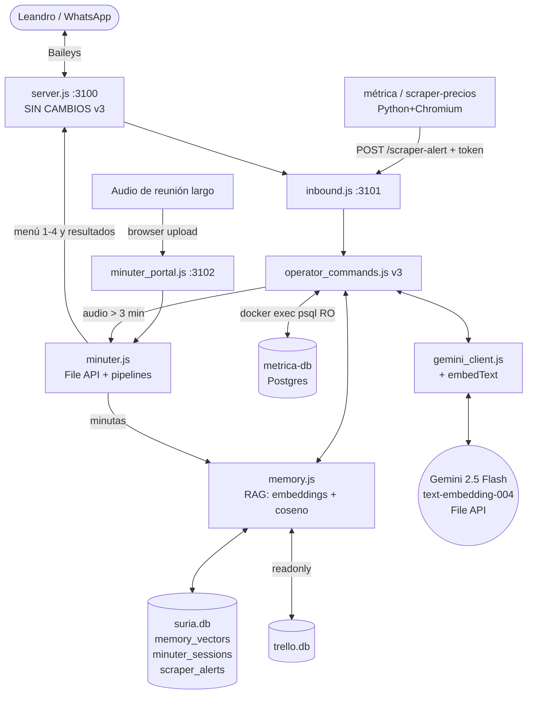

# SURIA Copiloto v3 — Especificación Técnica de Implementación
## "Global Operations Center": Memoria Semántica (RAG) + Segundo Cerebro + Minutero de Audios Largos + Métrica DB + Gateway de Scrapers

**Proyecto:** SURIA — Copiloto WhatsApp + Trochi + Calendar (Subsecretaría de Turismo de Esquel)
**Autor del diseño:** Fable 5 (Claude) — para ejecución por **Antigravity** en el VPS
**Fecha:** 2026-07-19
**Versión objetivo:** v3.0
**PRERREQUISITO OBLIGATORIO:** SURIA v2 desplegado y verificado (`SURIA_COPILOTO_V2_SPEC.md`). Esta spec **construye sobre los archivos de v2** (usa `gemini_client.js`, `suria_lib.js`, `drafts.js`, el guard anti-baneo y el pipeline de dedup). No aplicar sobre el código v1.

---

## 0. Cómo usar este documento (instrucciones para Antigravity)

### Inventario de cambios

| Archivo | Acción | Sección |
|---|---|---|
| `/opt/suria/migrations/003_copiloto_v3.sql` | NUEVO | §2 |
| `/opt/suria/suria_lib.js` | REEMPLAZO (v2 + funciones puras v3) | §3.1 |
| `/opt/suria/gemini_client.js` | REEMPLAZO (v2 + `embedText` + export `extractText`) | §3.2 |
| `/opt/suria/memory.js` | NUEVO — módulo RAG | §4 |
| `/opt/suria/minuter.js` | NUEVO — núcleo del minutero (File API, sesiones, pipelines) | §5.1 |
| `/opt/suria/minuter_portal.js` | NUEVO — servidor web :3102 | §5.2 |
| `/opt/suria/minuter_index.html` | NUEVO — frontend del portal | §5.3 |
| `/etc/systemd/system/suria-minuter.service` | NUEVO | §5.4 |
| `/opt/suria/operator_commands.js` | REEMPLAZO (v2 + memoria + métrica + minutero) | §6 |
| `/opt/suria/inbound.js` | REEMPLAZO (v2 + contexto de audio + gateway de scrapers) | §7 |
| `/opt/whatsapp/server.js` | **SIN CAMBIOS** — v2 ya reenvía `msg.message` completo (incluye `audioMessage.seconds`) | — |
| `/opt/suria/test/suria_lib_v3.test.js` | NUEVO | §9.1 |
| `/opt/suria/test/smoke_v3.sh` | NUEVO | §9.2 |

### Orden de ejecución obligatorio

1. Verificar prerrequisitos (abajo) y **backups** (§10.1).
2. Aplicar migración `003_copiloto_v3.sql` (§2).
3. Configurar variables nuevas en `/opt/suria/.env` (§2.1).
4. Crear archivos nuevos y reemplazar los indicados. `node --check` en cada `.js`.
5. Correr tests: `node --test /opt/suria/test/suria_lib.test.js /opt/suria/test/suria_lib_v3.test.js` — **todos deben pasar**.
6. Instalar y habilitar `suria-minuter.service`; reiniciar `suria-inbound` (el daemon de WhatsApp NO necesita reinicio, pero no daña).
7. Smoke test (§9.2) + checklist manual (§9.3).

### Prerrequisitos a verificar

```bash
node -v                                  # >= 18.17
ls /opt/suria/gemini_client.js /opt/suria/suria_lib.js /opt/suria/drafts.js   # v2 desplegado
sqlite3 /opt/suria/suria.db ".tables" | grep -E 'wa_contacts|outbound_drafts' # migraciones v2 aplicadas
docker ps --format '{{.Names}}' | grep -w metrica-db                          # contenedor Postgres de métrica
docker exec metrica-db psql -U postgres -l                                    # confirmar acceso psql y nombre real de la DB
```

**Sigue sin agregarse ninguna dependencia npm.** File API, embeddings, portal y coseno: todo con Node core + `better-sqlite3` existente.

---

## 1. Arquitectura y decisiones transversales



### 1.1 Decisiones de diseño (justificación)

1. **Embeddings como BLOB binario, coseno en JS puro.** Cada vector de `text-embedding-004` (768 dims) se guarda como `Float32Array` serializada: **3.072 bytes/fila** contra ~18 KB si fuera JSON. La búsqueda es un full-scan con coseno en JavaScript: con 10.000 recuerdos son ~7,7 M multiplicaciones ≈ **pocos milisegundos** en el VPS. No se necesita `sqlite-vec` ni extensiones nativas hasta superar ~100k recuerdos (años de uso); el día que pase, la migración es trivial porque el formato BLOB ya es compatible.
2. **`memory.js` abre su propia conexión `better-sqlite3` a `suria.db`** en lugar de usar el wrapper `db.js`. Motivo: el binding de parámetros BLOB (Buffer) es semántica de `better-sqlite3` que el wrapper podría no preservar; una conexión propia elimina esa incógnita. WAL permite ambas conexiones conviviendo sin locks.
3. **Portal minutero sin dependencias ni multipart.** El frontend sube el archivo como **binario crudo** (`fetch(url, { body: file })`), con nombre y token por querystring → el backend streamea `req` directo a disco con tope de tamaño. Cero parsers de multipart, cero npm nuevo. El borrado del temporal está en un `finally`: **se ejecuta siempre**, éxito o error, cumpliendo la directiva de no llenar el disco del VPS.
4. **File API de Gemini para audios largos**: subida resumable (2 GB máx, retención 48 h, gratis), polling hasta `state=ACTIVE`, y luego `generateContent` con `fileData`. El pipeline corre **en background**: Leandro recibe un ack inmediato ("⏳ procesando...") y los resultados le llegan como mensajes cuando están listos — el webhook de inbound nunca queda colgado minutos.
5. **Métrica en solo-lectura con defensa en 3 capas**: (a) `validateReadOnlySql()` — función pura testeada: solo `SELECT`/`WITH`, una sola sentencia, lista negra de palabras DML/DDL; (b) la consulta se envuelve en `SELECT * FROM (…) AS suria_q LIMIT 200`; (c) ejecución vía `execFileSync('docker', [args])` — **array de argumentos, sin shell** → inyección de comandos imposible — con `statement_timeout='15s'` y timeout de proceso. Hardening opcional en el runbook: rol Postgres `suria_ro` con `GRANT SELECT`.
6. **Gateway de scrapers con autenticación y dedup.** El puerto 3101 escucha en `0.0.0.0`: un endpoint sin auth que dispara WhatsApp a Leandro sería un vector de spam. Regla: si `SCRAPER_ALERT_TOKEN` está seteado se exige header `X-Suria-Token`; si no, solo se aceptan requests desde localhost. Alertas idénticas (misma `source`+`title`) dentro de 6 h se persisten pero **no** se reenvían.
7. **Sinergia entre features**: las minutas procesadas y las alertas con `remember:true` se indexan en `memory_vectors` → el segundo cerebro también recuerda reuniones y movimientos de precios. `search_memory` unifica: memoria semántica + tarjetas Trochi (LIKE por keywords) + eventos de Calendar registrados en `events`.
8. **Cuotas free tier respetadas** (AI Studio: 15 RPM / 1M TPM / 1.500 RPD para 2.5 Flash): una nota al segundo cerebro = 2 requests (tags + embedding); una búsqueda = 1 embedding + 1 generación; el pipeline completo de una reunión (opción 4) = 3 generaciones + ~3 embeddings de minuta. Todo órdenes de magnitud por debajo del límite diario. Presupuesto detallado en §11.

### 1.2 Flujo del audio largo por WhatsApp

```
Leandro manda audio de 22 min
  → server.js (v2) lo baja y lo reenvía con message.audioMessage.seconds = 1320
  → inbound.js pasa { audioSeconds } como contexto al operador
  → operator_commands: seconds > 180 → NO transcribe inline:
      minuter.startWhatsAppSession(): guarda /tmp/suria_audios/wa-*.ogg
        → sube a File API → borra el temporal (finally) → sesión 'awaiting_choice'
  → responde el menú: 1 takeaways / 2 minuta / 3 tarjetas / 4 todo
Leandro responde "4"
  → handler determinístico (solo si hay sesión esperando < 48 h; si no, el "4" sigue su camino normal)
  → ack inmediato + pipeline en background → resultados por WhatsApp en partes
  → minuta y takeaways se indexan en la memoria semántica (kind='minuta')
```

Si `seconds` no viniera (mensajes reenviados viejos), fallback por tamaño: base64 > 4 MB ≈ >4 min de opus → minutero.

### 1.3 Migración SQL — `/opt/suria/migrations/003_copiloto_v3.sql` (NUEVO, idempotente)

```sql
-- SURIA Copiloto v3 — migración aditiva sobre /opt/suria/suria.db
-- Idempotente: se puede correr múltiples veces sin daño.

-- Memoria semántica (RAG). El embedding es Float32Array serializada (768 dims = 3072 bytes).
CREATE TABLE IF NOT EXISTS memory_vectors (
  memory_id       TEXT PRIMARY KEY,     -- M-XXXXXXXX
  parent_id       TEXT,                 -- id del primer chunk cuando un texto largo se parte
  chunk_index     INTEGER NOT NULL DEFAULT 0,
  kind            TEXT NOT NULL DEFAULT 'nota',  -- nota | minuta | alerta | evento
  source          TEXT,                 -- whatsapp | whatsapp-voz | minuter | scraper-precios | ...
  content         TEXT NOT NULL,
  topics          TEXT,                 -- JSON array de etiquetas
  embedding       BLOB NOT NULL,
  embedding_model TEXT,
  dims            INTEGER,
  ref_id          TEXT,                 -- referencia externa (session_id del minutero, etc.)
  created_at      TEXT
);
CREATE INDEX IF NOT EXISTS idx_memory_kind    ON memory_vectors(kind);
CREATE INDEX IF NOT EXISTS idx_memory_created ON memory_vectors(created_at);
CREATE INDEX IF NOT EXISTS idx_memory_parent  ON memory_vectors(parent_id);

-- Sesiones del minutero de audios largos.
CREATE TABLE IF NOT EXISTS minuter_sessions (
  session_id       TEXT PRIMARY KEY,    -- A-XXXX
  origin           TEXT,                -- whatsapp | portal
  display_name     TEXT,
  gemini_file_name TEXT,                -- "files/abc123"
  gemini_file_uri  TEXT,
  mime_type        TEXT,
  duration_seconds INTEGER,
  size_bytes       INTEGER,
  state            TEXT NOT NULL DEFAULT 'uploading',
                   -- uploading | awaiting_choice | processing | done | failed | expired
  choice           TEXT,
  result_summary   TEXT,
  created_at       TEXT,
  resolved_at      TEXT
);
CREATE INDEX IF NOT EXISTS idx_minuter_state ON minuter_sessions(state, created_at);

-- Alertas entrantes de los scrapers (métrica / scraper-precios).
CREATE TABLE IF NOT EXISTS scraper_alerts (
  alert_id    INTEGER PRIMARY KEY AUTOINCREMENT,
  source      TEXT,
  alert_type  TEXT,                     -- price_drop | price_rise | occupancy | info | error
  title       TEXT,
  message     TEXT,
  data_json   TEXT,
  received_at TEXT,
  notified    INTEGER NOT NULL DEFAULT 0
);
CREATE INDEX IF NOT EXISTS idx_scraper_alerts_dedup ON scraper_alerts(source, title, received_at);
```

Aplicar con:

```bash
sqlite3 /opt/suria/suria.db < /opt/suria/migrations/003_copiloto_v3.sql
```

### 2.1 Variables de entorno nuevas (`/opt/suria/.env`)

```bash
# ── SURIA v3 ────────────────────────────────────────────────────────────────
# Modelo de embeddings (default si se omite):
GEMINI_EMBEDDING_MODEL=text-embedding-004

# Métrica (Postgres en Docker). Ajustar al nombre real de DB/usuario (ver prerrequisitos):
METRICA_CONTAINER=metrica-db
METRICA_DB_USER=postgres
METRICA_DB_NAME=metrica

# Gateway de scrapers: si se setea, los POST a /scraper-alert exigen el header
# X-Suria-Token con este valor. Si NO se setea, solo se acepta localhost.
SCRAPER_ALERT_TOKEN=CAMBIAR-por-un-token-largo-aleatorio

# Portal del minutero: si se setea, el portal escucha en 0.0.0.0:3102 y exige
# ?key=<token> en la URL. Si NO se setea, escucha SOLO en 127.0.0.1 (túnel SSH).
MINUTER_PORTAL_TOKEN=CAMBIAR-por-otro-token-largo-aleatorio
```

Generar tokens: `openssl rand -hex 24`

---

## 3. Módulos base actualizados

### 3.1 `/opt/suria/suria_lib.js` — REEMPLAZO COMPLETO (v2 + funciones puras v3)

**Qué se agrega (todo puro, todo testeado en §9.1):** `cosineSimilarity` (núcleo del RAG), `chunkText` (partición de minutas largas con solape), `validateReadOnlySql` (capa 1 de la defensa de Métrica), `extractAudioSeconds` (duración del audio aun dentro de wrappers ephemeral/viewOnce) y `splitForWhatsApp` (partir resultados largos en mensajes legibles). Nada de v2 cambia.

```javascript
'use strict';

// ═══════════════════════════════════════════════════════════════════════════
// SURIA lib v3 — funciones puras compartidas. SIN I/O: todo testeable.
// v2: teléfonos, nombres, clasificación de mensajes, dedup, fechas, planilla.
// v3: coseno (RAG), chunking, validador SQL read-only, duración de audio,
//     partición de mensajes largos para WhatsApp.
// ═══════════════════════════════════════════════════════════════════════════

// ── Teléfonos ──────────────────────────────────────────────────────────────

function normalizePhone(input) {
  if (!input) return '';
  return String(input).replace(/@.*$/, '').replace(/[^0-9]/g, '');
}

function samePhone(a, b) {
  const ca = normalizePhone(a);
  const cb = normalizePhone(b);
  if (!ca || !cb) return false;
  if (ca === cb) return true;
  return ca.length >= 10 && cb.length >= 10 && ca.slice(-10) === cb.slice(-10);
}

function argPhoneVariants(base) {
  const clean = normalizePhone(base);
  const variants = new Set();
  if (!clean) return [];
  variants.add(clean);
  if (clean.startsWith('549')) {
    variants.add('54' + clean.slice(3));
    variants.add(clean.slice(2));
    variants.add(clean.slice(3));
  } else if (clean.startsWith('54')) {
    variants.add('549' + clean.slice(2));
    variants.add(clean.slice(2));
  } else {
    variants.add('54' + clean);
    variants.add('549' + clean);
  }
  return [...variants];
}

// ── Nombres ────────────────────────────────────────────────────────────────

function firstName(displayName) {
  if (!displayName) return '';
  const first = String(displayName).trim().split(/\s+/)[0];
  if (!first) return '';
  return first.charAt(0).toUpperCase() + first.slice(1).toLowerCase();
}

// ── Clasificación de mensajes de Baileys ───────────────────────────────────

const SIGNALING_TYPES = new Set([
  'protocolMessage',
  'reactionMessage',
  'senderKeyDistributionMessage',
  'pollCreationMessage',
  'pollUpdateMessage',
  'liveLocationMessage',
  'templateMessage',
  'editedMessage',
  'keepInChatMessage',
  'botInvokeMessage',
]);

const STUB_CIPHERTEXT = 1;

function unwrapMessage(messageObj) {
  let inner = messageObj;
  for (let i = 0; i < 3; i++) {
    if (inner.ephemeralMessage && inner.ephemeralMessage.message) { inner = inner.ephemeralMessage.message; continue; }
    if (inner.viewOnceMessage && inner.viewOnceMessage.message) { inner = inner.viewOnceMessage.message; continue; }
    if (inner.viewOnceMessageV2 && inner.viewOnceMessageV2.message) { inner = inner.viewOnceMessageV2.message; continue; }
    if (inner.documentWithCaptionMessage && inner.documentWithCaptionMessage.message) { inner = inner.documentWithCaptionMessage.message; continue; }
    break;
  }
  return inner;
}

function classifyUpsertMessage(msg) {
  const messageObj = (msg && msg.message) || null;

  if (!messageObj || Object.keys(messageObj).length === 0 || msg.messageStubType === STUB_CIPHERTEXT) {
    return { kind: 'ciphertext', msgType: 'unknown', body: '' };
  }

  const inner = unwrapMessage(messageObj);

  const keys = Object.keys(inner).filter(k => k !== 'messageContextInfo');
  const msgType = keys[0] || 'unknown';

  const body =
    inner.conversation ||
    (inner.extendedTextMessage && inner.extendedTextMessage.text) ||
    (inner.imageMessage && inner.imageMessage.caption) ||
    (inner.documentMessage && inner.documentMessage.caption) ||
    '';

  if (msgType === 'unknown') {
    return { kind: 'ciphertext', msgType, body: '' };
  }
  if (!body && SIGNALING_TYPES.has(msgType)) {
    return { kind: 'signaling', msgType, body: '' };
  }

  const hasMedia = !!(inner.imageMessage || inner.audioMessage || inner.documentMessage);
  if (!body && !hasMedia) {
    return { kind: 'empty', msgType, body: '' };
  }
  return { kind: 'content', msgType, body, hasMedia, inner };
}

function dedupDecision(row, nowMs, opts = {}) {
  const inFlightTtlMs = opts.inFlightTtlMs || 90 * 1000;
  if (!row) return 'process';
  if (row.status === 'delivered') return 'skip';
  if (row.status === 'in_flight') {
    const last = Date.parse(row.last_attempt_at || row.first_seen_at || '') || 0;
    return (nowMs - last) < inFlightTtlMs ? 'skip' : 'process';
  }
  return 'process';
}

// v3: duración (segundos) del audio de un message de Baileys, tolerando wrappers.
function extractAudioSeconds(messageObj) {
  if (!messageObj) return 0;
  const inner = unwrapMessage(messageObj);
  const audio = inner && inner.audioMessage;
  const s = audio && audio.seconds;
  const n = Number(s);
  return Number.isFinite(n) && n > 0 ? Math.round(n) : 0;
}

// ── Fechas ─────────────────────────────────────────────────────────────────

function parseDateTimeString(s, defaults = { time: '10:00' }) {
  if (!s) return null;
  const str = String(s).trim().replace('T', ' ');

  let m = str.match(/^(\d{4})-(\d{2})-(\d{2})(?:\s+(\d{1,2}):(\d{2}))?/);
  if (m) {
    const time = m[4] != null ? String(m[4]).padStart(2, '0') + ':' + m[5] : defaults.time;
    return { date: m[1] + '-' + m[2] + '-' + m[3], time };
  }

  m = str.match(/^(\d{1,2})\/(\d{1,2})\/(\d{4})(?:\s+(\d{1,2}):(\d{2}))?/);
  if (m) {
    const time = m[4] != null ? String(m[4]).padStart(2, '0') + ':' + m[5] : defaults.time;
    return {
      date: m[3] + '-' + String(m[2]).padStart(2, '0') + '-' + String(m[1]).padStart(2, '0'),
      time
    };
  }
  return null;
}

function nowInBuenosAires(d = new Date()) {
  const fmt = new Intl.DateTimeFormat('es-AR', {
    timeZone: 'America/Argentina/Buenos_Aires',
    year: 'numeric', month: '2-digit', day: '2-digit',
    hour: '2-digit', minute: '2-digit', hour12: false,
    weekday: 'long'
  });
  const parts = {};
  for (const p of fmt.formatToParts(d)) parts[p.type] = p.value;
  const hour = parts.hour === '24' ? '00' : parts.hour;
  return {
    iso: parts.year + '-' + parts.month + '-' + parts.day,
    time: hour + ':' + parts.minute,
    weekday: (parts.weekday || '').toLowerCase()
  };
}

// ── Planilla de horarios ───────────────────────────────────────────────────

function filterScheduleCsv(csv, query, maxChars = 12000) {
  if (!csv) return '';
  const lines = csv.split(/\r?\n/).filter(l => l.trim() !== '');
  if (!query || lines.length <= 2) return csv.slice(0, maxChars);

  const words = String(query).toLowerCase()
    .split(/[^a-záéíóúüñ]+/i)
    .filter(w => w.length >= 3 && !['quien', 'quién', 'viene', 'horario', 'horarios', 'turno', 'turnos', 'hoy', 'semana', 'para', 'los', 'las', 'del'].includes(w));

  if (words.length > 0) {
    const header = lines[0];
    const matched = lines.slice(1).filter(l => {
      const ll = l.toLowerCase();
      return words.some(w => ll.includes(w));
    });
    if (matched.length > 0 && matched.length < lines.length - 1) {
      return [header].concat(matched).join('\n').slice(0, maxChars);
    }
  }
  return csv.slice(0, maxChars);
}

// ═══════════════════════════════════════════════════════════════════════════
// v3 — RAG y utilidades del Global Operations Center
// ═══════════════════════════════════════════════════════════════════════════

// Similitud coseno entre dos vectores (Array o Float32Array). 0 si inválidos.
function cosineSimilarity(a, b) {
  if (!a || !b || a.length !== b.length || a.length === 0) return 0;
  let dot = 0, na = 0, nb = 0;
  for (let i = 0; i < a.length; i++) {
    dot += a[i] * b[i];
    na += a[i] * a[i];
    nb += b[i] * b[i];
  }
  if (na === 0 || nb === 0) return 0;
  return dot / (Math.sqrt(na) * Math.sqrt(nb));
}

/**
 * Parte un texto largo en chunks de ~maxChars con solape, cortando en límites
 * de párrafo/oración cuando puede. Para minutas largas que van a la memoria.
 */
function chunkText(text, maxChars = 1500, overlap = 200) {
  const clean = String(text || '').trim();
  if (!clean) return [];
  if (clean.length <= maxChars) return [clean];

  const chunks = [];
  let start = 0;
  while (start < clean.length) {
    let end = Math.min(start + maxChars, clean.length);
    if (end < clean.length) {
      const lastBreak = clean.lastIndexOf('\n', end);
      const lastDot = clean.lastIndexOf('. ', end);
      const cut = Math.max(lastBreak, lastDot);
      if (cut > start + maxChars * 0.5) end = cut + 1;
    }
    const piece = clean.slice(start, end).trim();
    if (piece) chunks.push(piece);
    if (end >= clean.length) break;
    start = Math.max(end - overlap, start + 1);
  }
  return chunks;
}

/**
 * Capa 1 de la defensa de solo-lectura para Métrica (Postgres).
 * Acepta únicamente UNA sentencia SELECT (o CTE WITH...SELECT).
 * Conservador a propósito: puede dar falsos positivos (p.ej. un literal que
 * contenga la palabra "update"); preferimos rechazar de más que de menos.
 */
function validateReadOnlySql(sql) {
  const clean = String(sql || '').trim().replace(/;\s*$/, '');
  if (!clean) return { ok: false, reason: 'consulta vacía' };
  if (clean.includes(';')) return { ok: false, reason: 'solo se permite una sentencia por consulta' };
  if (!/^(select|with)\b/i.test(clean)) return { ok: false, reason: 'solo se permiten consultas SELECT' };
  const forbidden = /\b(insert|update|delete|drop|alter|create|truncate|grant|revoke|copy|vacuum|call|execute|do|merge|comment|listen|notify|refresh|reindex|reset|set|lock|prepare|deallocate)\b/i;
  const match = clean.match(forbidden);
  if (match) return { ok: false, reason: `palabra no permitida en consulta de solo lectura: "${match[1]}"` };
  return { ok: true, sql: clean };
}

/**
 * Parte un texto largo en mensajes de WhatsApp de hasta maxChars, cortando en
 * párrafos. Agrega numeración (1/3) cuando hay más de una parte.
 */
function splitForWhatsApp(text, maxChars = 3500) {
  const clean = String(text || '').trim();
  if (!clean) return [];
  if (clean.length <= maxChars) return [clean];

  const parts = [];
  let rest = clean;
  while (rest.length > maxChars) {
    let cut = rest.lastIndexOf('\n\n', maxChars);
    if (cut < maxChars * 0.4) cut = rest.lastIndexOf('\n', maxChars);
    if (cut < maxChars * 0.4) cut = rest.lastIndexOf('. ', maxChars);
    if (cut < maxChars * 0.4) cut = maxChars;
    parts.push(rest.slice(0, cut).trim());
    rest = rest.slice(cut).trim();
  }
  if (rest) parts.push(rest);
  return parts.map((p, i) => parts.length > 1 ? `(${i + 1}/${parts.length})\n${p}` : p);
}

module.exports = {
  normalizePhone,
  samePhone,
  argPhoneVariants,
  firstName,
  classifyUpsertMessage,
  dedupDecision,
  parseDateTimeString,
  nowInBuenosAires,
  filterScheduleCsv,
  SIGNALING_TYPES,
  STUB_CIPHERTEXT,
  // v3
  unwrapMessage,
  extractAudioSeconds,
  cosineSimilarity,
  chunkText,
  validateReadOnlySql,
  splitForWhatsApp,
};
```

### 3.2 `/opt/suria/gemini_client.js` — REEMPLAZO COMPLETO (v2 + `embedText` + export de `extractText`)

**Qué se agrega:** `embedText(text, taskType)` contra `text-embedding-004` con los mismos reintentos/backoff del cliente (429/5xx), y se exportan `extractText` (lo usa el minutero para respuestas con `fileData`). El resto es idéntico a v2.

```javascript
'use strict';

// ═══════════════════════════════════════════════════════════════════════════
// Cliente único de Gemini para SURIA (v3).
//  - generateText(prompt, {media, systemInstruction, temperature})
//  - runWithTools({systemInstruction, userParts, tools, executors, maxTurns})
//  - generateContent(payload) crudo (lo usa el minutero con fileData)
//  - embedText(text, taskType) → vector de text-embedding-004 (768 dims)
// Reintentos con backoff exponencial ante 429 / 5xx / errores de red.
// ═══════════════════════════════════════════════════════════════════════════

require('dotenv').config({ path: '/opt/suria/.env' });
const https = require('https');

const GEMINI_API_KEY = process.env.GEMINI_API_KEY;
const GEMINI_MODEL = process.env.GEMINI_MODEL || 'gemini-2.5-flash';
const EMBEDDING_MODEL = process.env.GEMINI_EMBEDDING_MODEL || 'text-embedding-004';
const BASE_URL = 'https://generativelanguage.googleapis.com/v1beta/models';

function sleep(ms) {
  return new Promise(resolve => setTimeout(resolve, ms));
}

function postJson(url, body, timeoutMs = 90000) {
  return new Promise((resolve, reject) => {
    const data = JSON.stringify(body);
    const urlObj = new URL(url);
    const req = https.request({
      hostname: urlObj.hostname,
      port: 443,
      path: urlObj.pathname + urlObj.search,
      method: 'POST',
      headers: {
        'Content-Type': 'application/json',
        'Content-Length': Buffer.byteLength(data)
      }
    }, (res) => {
      let respBody = '';
      res.on('data', chunk => respBody += chunk);
      res.on('end', () => {
        let parsed = null;
        try { parsed = JSON.parse(respBody); } catch (e) { /* respuesta no-JSON */ }
        resolve({ status: res.statusCode, ok: res.statusCode < 400, data: parsed, raw: respBody });
      });
    });
    req.setTimeout(timeoutMs, () => {
      req.destroy(new Error('Gemini timeout tras ' + timeoutMs + 'ms'));
    });
    req.on('error', reject);
    req.write(data);
    req.end();
  });
}

// POST genérico con reintentos ante transitorios. Lanza Error si agota intentos.
async function postWithRetries(url, payload, { retries = 3, timeoutMs = 90000 } = {}) {
  if (!GEMINI_API_KEY) throw new Error('GEMINI_API_KEY no configurada en /opt/suria/.env');

  let lastErr = null;
  for (let attempt = 0; attempt <= retries; attempt++) {
    try {
      const res = await postJson(url, payload, timeoutMs);
      if (res.ok) return res.data;
      if (res.status === 429 || res.status >= 500) {
        lastErr = new Error(`Gemini HTTP ${res.status} (transitorio)`);
      } else {
        throw new Error(`Gemini HTTP ${res.status}: ${String(res.raw).slice(0, 300)}`);
      }
    } catch (e) {
      if (/Gemini HTTP 4/.test(e.message) && !/429/.test(e.message)) throw e;
      lastErr = e;
    }
    if (attempt < retries) {
      const waitMs = 1000 * Math.pow(2, attempt); // 1s, 2s, 4s
      console.log(`[Gemini] Reintento ${attempt + 1}/${retries} en ${waitMs}ms (${lastErr.message})`);
      await sleep(waitMs);
    }
  }
  throw lastErr || new Error('Gemini: error desconocido');
}

async function generateContent(payload, opts = {}) {
  const url = `${BASE_URL}/${GEMINI_MODEL}:generateContent?key=${GEMINI_API_KEY}`;
  return postWithRetries(url, payload, opts);
}

function extractText(data) {
  const parts = data?.candidates?.[0]?.content?.parts || [];
  return parts.map(p => p.text || '').join('').trim();
}

async function generateText(prompt, { media = null, systemInstruction = null, temperature = 0.3 } = {}) {
  const parts = [{ text: prompt }];
  if (media && media.data && media.mimeType) {
    parts.push({ inlineData: { mimeType: media.mimeType.split(';')[0].trim(), data: media.data } });
  }
  const payload = {
    contents: [{ role: 'user', parts }],
    generationConfig: { temperature }
  };
  if (systemInstruction) {
    payload.systemInstruction = { parts: [{ text: systemInstruction }] };
  }
  const data = await generateContent(payload);
  return extractText(data);
}

/**
 * v3 — Embedding con text-embedding-004 (768 dims).
 * taskType: 'RETRIEVAL_DOCUMENT' al guardar, 'RETRIEVAL_QUERY' al buscar
 * (mejora la calidad del retrieval: el modelo optimiza el vector según el rol).
 */
async function embedText(text, taskType = 'RETRIEVAL_DOCUMENT') {
  const url = `${BASE_URL}/${EMBEDDING_MODEL}:embedContent?key=${GEMINI_API_KEY}`;
  const payload = {
    model: `models/${EMBEDDING_MODEL}`,
    content: { parts: [{ text: String(text).slice(0, 8000) }] },
    taskType
  };
  const data = await postWithRetries(url, payload, { timeoutMs: 30000 });
  const values = data?.embedding?.values;
  if (!Array.isArray(values) || values.length === 0) {
    throw new Error('embedContent devolvió un embedding vacío');
  }
  return values;
}

/**
 * Loop de function calling (idéntico a v2).
 */
async function runWithTools({ systemInstruction, userParts, tools, executors, maxTurns = 5, temperature = 0.2 }) {
  const contents = [{ role: 'user', parts: userParts }];
  const toolCalls = [];

  for (let turn = 0; turn < maxTurns; turn++) {
    const payload = {
      contents,
      tools,
      generationConfig: { temperature }
    };
    if (systemInstruction) {
      payload.systemInstruction = { parts: [{ text: systemInstruction }] };
    }

    const data = await generateContent(payload);
    const candidate = data?.candidates?.[0];
    const parts = candidate?.content?.parts || [];
    const calls = parts.filter(p => p.functionCall);

    if (calls.length === 0) {
      return { text: extractText(data), toolCalls };
    }

    contents.push({ role: 'model', parts });

    const responseParts = [];
    for (const call of calls) {
      const name = call.functionCall.name;
      const args = call.functionCall.args || {};
      toolCalls.push(name);
      console.log(`[Gemini ToolCall] ${name}(${JSON.stringify(args).slice(0, 200)})`);

      let result;
      const executor = executors[name];
      if (!executor) {
        result = { error: `Tool desconocida: ${name}` };
      } else {
        try {
          result = await executor(args);
        } catch (e) {
          console.error(`[Gemini ToolCall] ${name} lanzó error:`, e.message);
          result = { error: e.message };
        }
      }

      if (result && result.__direct) {
        return { text: result.text, toolCalls };
      }

      responseParts.push({ functionResponse: { name, response: { result } } });
    }

    contents.push({ role: 'user', parts: responseParts });
  }

  return { text: '', toolCalls, exhausted: true };
}

module.exports = { generateText, runWithTools, generateContent, embedText, extractText };
```

---

## 4. `/opt/suria/memory.js` — módulo RAG / Segundo Cerebro (NUEVO)

**Responsabilidades:** guardar recuerdos (con chunking + embedding `RETRIEVAL_DOCUMENT`), búsqueda semántica por coseno (query con `RETRIEVAL_QUERY`), y **búsqueda unificada** (memoria + tarjetas Trochi + eventos de Calendar). Conexión `better-sqlite3` propia por el binding de BLOBs (decisión 2 de §1.1); Trochi siempre `readonly`.

```javascript
'use strict';

// ═══════════════════════════════════════════════════════════════════════════
// SURIA memory.js — Memoria semántica (RAG) y Segundo Cerebro.
//  - saveMemory():   chunking + embedding + persistencia en memory_vectors
//  - searchMemories(): coseno en JS sobre los embeddings (full scan)
//  - searchUnified(): memoria + tarjetas Trochi + eventos Calendar
// Embeddings: text-embedding-004 (768 dims) vía gemini_client.embedText.
// Almacenamiento: BLOB Float32Array (3072 bytes/vector).
// ═══════════════════════════════════════════════════════════════════════════

require('dotenv').config({ path: '/opt/suria/.env' });
const Database = require('better-sqlite3');
const { randomUUID } = require('crypto');
const gemini = require('./gemini_client.js');
const { cosineSimilarity, chunkText } = require('./suria_lib.js');

const SURIA_DB_PATH = process.env.SURIA_DB_PATH || '/opt/suria/suria.db';
const TRELLO_DB_PATH = process.env.TRELLO_DB_PATH || '/var/lib/docker/volumes/leanboard_leanboard-data/_data/trello.db';
const EMBEDDING_MODEL = process.env.GEMINI_EMBEDDING_MODEL || 'text-embedding-004';

// Conexión propia (los BLOB de embeddings necesitan binding nativo de Buffer;
// WAL permite convivir con la conexión del wrapper db.js sin locks).
const mem = new Database(SURIA_DB_PATH);
mem.pragma('journal_mode = WAL');

// ── Serialización de vectores ──────────────────────────────────────────────

function float32ToBuffer(values) {
  return Buffer.from(new Float32Array(values).buffer);
}

function bufferToFloat32(buf) {
  if (!buf || !Buffer.isBuffer(buf) || buf.byteLength % 4 !== 0) return null;
  return new Float32Array(buf.buffer, buf.byteOffset, buf.byteLength / 4);
}

function newMemoryId() {
  return 'M-' + randomUUID().slice(0, 8).toUpperCase();
}

// ── Guardar recuerdos ──────────────────────────────────────────────────────

/**
 * Guarda un recuerdo en la memoria de largo plazo. Si el contenido es largo
 * (minutas), lo parte en chunks con solape; todos comparten parent_id.
 *
 * @param {object} opts
 * @param {string} opts.content  Texto del recuerdo (obligatorio).
 * @param {string} opts.kind     'nota' | 'minuta' | 'alerta' | 'evento'
 * @param {string} opts.source   Origen ('whatsapp-voz', 'minuter', ...).
 * @param {Array}  opts.topics   Etiquetas.
 * @param {string} opts.refId    Referencia externa opcional.
 * @returns {{memory_id: string, chunks: number}}
 */
async function saveMemory({ content, kind = 'nota', source = '', topics = [], refId = '' }) {
  const clean = String(content || '').trim();
  if (!clean) throw new Error('saveMemory: contenido vacío');

  const chunks = chunkText(clean, 1500, 200);
  const parentId = newMemoryId();
  const now = new Date().toISOString();
  const topicsJson = JSON.stringify(Array.isArray(topics) ? topics.slice(0, 10) : []);

  const insert = mem.prepare(`
    INSERT INTO memory_vectors
      (memory_id, parent_id, chunk_index, kind, source, content, topics,
       embedding, embedding_model, dims, ref_id, created_at)
    VALUES (?, ?, ?, ?, ?, ?, ?, ?, ?, ?, ?, ?)
  `);

  for (let i = 0; i < chunks.length; i++) {
    // Embedding ANTES del insert: si Gemini falla, no queda un recuerdo mudo.
    const values = await gemini.embedText(chunks[i], 'RETRIEVAL_DOCUMENT');
    const id = i === 0 ? parentId : newMemoryId();
    insert.run(
      id, parentId, i, kind, source, chunks[i], topicsJson,
      float32ToBuffer(values), EMBEDDING_MODEL, values.length, refId, now
    );
  }

  console.log(`[Memory] Guardado ${parentId} (${kind}, ${chunks.length} chunk(s))`);
  return { memory_id: parentId, chunks: chunks.length };
}

// ── Búsqueda semántica ─────────────────────────────────────────────────────

/**
 * Búsqueda por similitud coseno. Full scan en JS: con <100k recuerdos tarda
 * milisegundos (§1.1). Deduplica por parent_id quedándose con el mejor chunk.
 *
 * @returns {Array<{memory_id, kind, source, content, topics, created_at, score}>}
 */
async function searchMemories(query, { limit = 5, minScore = 0.5, kind = null } = {}) {
  const clean = String(query || '').trim();
  if (!clean) return [];

  const queryValues = await gemini.embedText(clean, 'RETRIEVAL_QUERY');

  const where = kind ? `WHERE kind = ?` : '';
  const rows = kind
    ? mem.prepare(`SELECT memory_id, parent_id, kind, source, content, topics, created_at, embedding FROM memory_vectors ${where}`).all(kind)
    : mem.prepare(`SELECT memory_id, parent_id, kind, source, content, topics, created_at, embedding FROM memory_vectors`).all();

  const bestByParent = new Map();
  for (const row of rows) {
    const vec = bufferToFloat32(row.embedding);
    if (!vec || vec.length !== queryValues.length) continue;
    const score = cosineSimilarity(queryValues, vec);
    if (score < minScore) continue;
    const key = row.parent_id || row.memory_id;
    const prev = bestByParent.get(key);
    if (!prev || score > prev.score) {
      bestByParent.set(key, {
        memory_id: key,
        kind: row.kind,
        source: row.source,
        content: row.content,
        topics: safeParseArray(row.topics),
        created_at: row.created_at,
        score: Number(score.toFixed(3))
      });
    }
  }

  return [...bestByParent.values()]
    .sort((a, b) => b.score - a.score)
    .slice(0, limit);
}

function safeParseArray(json) {
  try {
    const v = JSON.parse(json);
    return Array.isArray(v) ? v : [];
  } catch (e) {
    return [];
  }
}

// ── Búsqueda unificada (memoria + Trochi + Calendar) ───────────────────────

function extractKeywords(query) {
  const STOP = new Set(['que', 'qué', 'con', 'para', 'los', 'las', 'del', 'una', 'uno', 'sobre',
    'como', 'cómo', 'teníamos', 'tenemos', 'habia', 'había', 'quedado', 'quedamos', 'esto',
    'esta', 'este', 'donde', 'dónde', 'cuando', 'cuándo', 'hay', 'era', 'fue']);
  return String(query || '').toLowerCase()
    .split(/[^a-z0-9áéíóúüñ]+/i)
    .filter(w => w.length >= 4 && !STOP.has(w))
    .slice(0, 6);
}

function searchTrochiCards(keywords, limit = 5) {
  if (!keywords.length) return [];
  let tdb;
  try {
    tdb = new Database(TRELLO_DB_PATH, { readonly: true });
    const conditions = keywords.map(() => `(LOWER(c.title) LIKE ? OR LOWER(c.description) LIKE ?)`).join(' OR ');
    const params = [];
    for (const k of keywords) { params.push(`%${k}%`, `%${k}%`); }
    return tdb.prepare(`
      SELECT c.title as titulo, l.title as lista, c.due_date as vence, c.created_at as creada,
             (SELECT GROUP_CONCAT(u.display_name, ', ') FROM card_members cm
              JOIN users u ON u.id = cm.user_id WHERE cm.card_id = c.id) as asignados
      FROM cards c JOIN lists l ON c.list_id = l.id
      WHERE ${conditions}
      ORDER BY c.created_at DESC LIMIT ?
    `).all(...params, limit);
  } catch (e) {
    console.error('[Memory] searchTrochiCards error:', e.message);
    return [];
  } finally {
    try { if (tdb) tdb.close(); } catch (e) { /* silencioso */ }
  }
}

function searchCalendarEvents(keywords, limit = 5) {
  if (!keywords.length) return [];
  try {
    const conditions = keywords.map(() => `LOWER(notes) LIKE ?`).join(' OR ');
    const params = keywords.map(k => `%${k}%`);
    // Los eventos de Calendar creados por SURIA quedan registrados en events
    // (notes contiene "Reunión agendada...", "agendar con...", etc.).
    return mem.prepare(`
      SELECT timestamp as fecha, notes as detalle FROM events
      WHERE (${conditions})
        AND (notes LIKE '%Reunión%' OR notes LIKE '%agendar%' OR notes LIKE '%Llamada%')
      ORDER BY timestamp DESC LIMIT ?
    `).all(...params, limit);
  } catch (e) {
    console.error('[Memory] searchCalendarEvents error:', e.message);
    return [];
  }
}

/**
 * Búsqueda unificada para la tool search_memory: combina memoria semántica,
 * tarjetas de Trochi y eventos de Calendar. Devuelve datos crudos que Gemini
 * sintetiza vía functionResponse.
 */
async function searchUnified(query) {
  const keywords = extractKeywords(query);

  let notas = [];
  try {
    notas = await searchMemories(query, { limit: 5, minScore: 0.5 });
  } catch (e) {
    console.error('[Memory] searchMemories error:', e.message);
  }

  return {
    consulta: query,
    recuerdos: notas.map(n => ({
      cuando: (n.created_at || '').slice(0, 10),
      tipo: n.kind,
      relevancia: n.score,
      etiquetas: n.topics,
      texto: n.content.slice(0, 600)
    })),
    tarjetas_trochi: searchTrochiCards(keywords),
    eventos_calendario: searchCalendarEvents(keywords),
    nota_para_el_asistente: 'Combiná las tres fuentes citando fechas concretas. Si no hay nada relevante, decilo honestamente.'
  };
}

// ── Métricas de la memoria ─────────────────────────────────────────────────

function memoryStats() {
  try {
    const total = mem.prepare(`SELECT COUNT(DISTINCT COALESCE(parent_id, memory_id)) as n FROM memory_vectors`).get();
    const porTipo = mem.prepare(`SELECT kind, COUNT(DISTINCT COALESCE(parent_id, memory_id)) as n FROM memory_vectors GROUP BY kind`).all();
    return { recuerdos: total.n, por_tipo: porTipo };
  } catch (e) {
    return { error: e.message };
  }
}

module.exports = {
  saveMemory,
  searchMemories,
  searchUnified,
  memoryStats,
  // exportados para tests / reutilización
  float32ToBuffer,
  bufferToFloat32,
  extractKeywords,
};
```

**Notas de diseño:**

- El embedding se calcula **antes** del INSERT: si Gemini falla, la nota no queda guardada "muda" (sin vector) — el caller informa el error y Leandro reintenta. Regla simple: *todo lo que está en la memoria es buscable*.
- `searchMemories` deduplica por `parent_id`: una minuta partida en 8 chunks aparece una sola vez en los resultados (su mejor chunk), no 8 veces.
- `minScore 0.5` con `text-embedding-004` filtra ruido sin perder matches legítimos en español (los pares relevantes suelen dar 0.6–0.8).
- `searchCalendarEvents` consulta la tabla `events` de SURIA (donde v2 ya registra todo lo agendado). Integrar la lectura directa del Calendar real vía n8n queda anotado en §11 como mejora incremental — no bloquea esta versión.

---

## 5. Minutero de audios largos

### 5.1 `/opt/suria/minuter.js` — núcleo (NUEVO)

**Responsabilidades:** subida resumable a la File API de Gemini (streaming desde disco, sin cargar el archivo en RAM), gestión de sesiones (`minuter_sessions`), menú interactivo de WhatsApp, pipelines de procesamiento (takeaways / minuta / tarjetas / todo) **en background**, borrado inmediato de temporales (`finally`), e indexación de las minutas en la memoria semántica.

```javascript
'use strict';

// ═══════════════════════════════════════════════════════════════════════════
// SURIA minuter.js — Minutero de audios largos de reuniones.
// Flujo: audio (WhatsApp >3min o portal web) → /tmp/suria_audios/ → File API
// de Gemini (retención 48h) → borrado inmediato del temporal → menú 1-4 por
// WhatsApp → pipeline en background → resultados por WhatsApp + memoria RAG.
// ═══════════════════════════════════════════════════════════════════════════

require('dotenv').config({ path: '/opt/suria/.env' });
const fs = require('fs');
const path = require('path');
const http = require('http');
const https = require('https');
const Database = require('better-sqlite3');
const db = require('./db.js');
const notifier = require('./trochi_notifier.js');
const gemini = require('./gemini_client.js');
const memory = require('./memory.js');
const { splitForWhatsApp, nowInBuenosAires, parseDateTimeString } = require('./suria_lib.js');

const GEMINI_API_KEY = process.env.GEMINI_API_KEY;
const OPERATOR_PHONE = '5491136434814';
const TRELLO_DB_PATH = process.env.TRELLO_DB_PATH || '/var/lib/docker/volumes/leanboard_leanboard-data/_data/trello.db';
const TMP_DIR = '/tmp/suria_audios';
const SESSION_TTL_HOURS = 48; // igual a la retención de la File API

try { fs.mkdirSync(TMP_DIR, { recursive: true }); } catch (e) { /* ya existe */ }

function sleep(ms) {
  return new Promise(resolve => setTimeout(resolve, ms));
}

// ── HTTP crudo (soporta body Buffer o stream, y lectura de headers) ────────

function httpsRequestRaw(options, body, timeoutMs = 120000) {
  return new Promise((resolve, reject) => {
    const req = https.request(options, (res) => {
      let raw = '';
      res.on('data', chunk => raw += chunk);
      res.on('end', () => {
        let json = null;
        try { json = JSON.parse(raw); } catch (e) { /* no-JSON */ }
        resolve({ status: res.statusCode, headers: res.headers, raw, json });
      });
    });
    req.setTimeout(timeoutMs, () => req.destroy(new Error('timeout HTTP tras ' + timeoutMs + 'ms')));
    req.on('error', reject);

    if (body && typeof body.pipe === 'function') {
      body.on('error', (e) => req.destroy(e));
      body.pipe(req);
    } else if (body) {
      req.write(body);
      req.end();
    } else {
      req.end();
    }
  });
}

// ── File API de Gemini (protocolo resumable) ───────────────────────────────

/**
 * Sube un archivo local a la File API. Devuelve { name, uri, state }.
 * El archivo se streamea desde disco: nunca se carga completo en RAM.
 */
async function uploadToGeminiFileApi(localPath, mimeType, displayName) {
  if (!GEMINI_API_KEY) throw new Error('GEMINI_API_KEY no configurada');
  const stat = fs.statSync(localPath);

  // Paso 1: iniciar la sesión resumable → devuelve la URL de subida en un header.
  const startBody = Buffer.from(JSON.stringify({ file: { display_name: displayName } }));
  const start = await httpsRequestRaw({
    method: 'POST',
    hostname: 'generativelanguage.googleapis.com',
    path: `/upload/v1beta/files?key=${GEMINI_API_KEY}`,
    headers: {
      'X-Goog-Upload-Protocol': 'resumable',
      'X-Goog-Upload-Command': 'start',
      'X-Goog-Upload-Header-Content-Length': String(stat.size),
      'X-Goog-Upload-Header-Content-Type': mimeType,
      'Content-Type': 'application/json',
      'Content-Length': String(startBody.length)
    }
  }, startBody, 30000);

  const uploadUrl = start.headers['x-goog-upload-url'];
  if (start.status >= 400 || !uploadUrl) {
    throw new Error(`File API start falló (HTTP ${start.status}): ${String(start.raw).slice(0, 200)}`);
  }

  // Paso 2: subir los bytes y finalizar (streaming desde disco).
  const u = new URL(uploadUrl);
  const up = await httpsRequestRaw({
    method: 'POST',
    hostname: u.hostname,
    path: u.pathname + u.search,
    headers: {
      'Content-Length': String(stat.size),
      'X-Goog-Upload-Offset': '0',
      'X-Goog-Upload-Command': 'upload, finalize'
    }
  }, fs.createReadStream(localPath), 15 * 60 * 1000);

  const file = up.json && up.json.file;
  if (up.status >= 400 || !file || !file.uri) {
    throw new Error(`File API upload falló (HTTP ${up.status}): ${String(up.raw).slice(0, 200)}`);
  }
  console.log(`[Minuter] Subido a File API: ${file.name} (${stat.size} bytes, estado ${file.state})`);
  return { name: file.name, uri: file.uri, state: file.state };
}

async function getFileStatus(fileName) {
  const res = await httpsRequestRaw({
    method: 'GET',
    hostname: 'generativelanguage.googleapis.com',
    path: `/v1beta/${fileName}?key=${GEMINI_API_KEY}`
  }, null, 20000);
  return res.json || {};
}

// Los audios largos quedan en PROCESSING un rato; esperar hasta ACTIVE.
async function waitForActive(fileName, { timeoutMs = 10 * 60 * 1000, intervalMs = 5000 } = {}) {
  const deadline = Date.now() + timeoutMs;
  while (Date.now() < deadline) {
    const info = await getFileStatus(fileName);
    if (info.state === 'ACTIVE') return info;
    if (info.state === 'FAILED') throw new Error('La File API no pudo procesar el audio (FAILED)');
    await sleep(intervalMs);
  }
  throw new Error('Timeout esperando que el audio quede ACTIVE en la File API');
}

// ── Sesiones ───────────────────────────────────────────────────────────────

function newSessionId() {
  return 'A-' + Math.random().toString(36).slice(2, 6).toUpperCase();
}

function createSession(fields) {
  const sessionId = newSessionId();
  db.query(
    `INSERT INTO minuter_sessions
     (session_id, origin, display_name, gemini_file_name, gemini_file_uri, mime_type,
      duration_seconds, size_bytes, state, created_at)
     VALUES (?, ?, ?, ?, ?, ?, ?, ?, ?, ?)`,
    [sessionId, fields.origin, fields.displayName, fields.fileName, fields.fileUri,
     fields.mimeType, fields.durationSeconds || 0, fields.sizeBytes || 0,
     fields.state || 'awaiting_choice', new Date().toISOString()]
  );
  return getSession(sessionId);
}

function getSession(sessionId) {
  const rows = db.query('SELECT * FROM minuter_sessions WHERE session_id = ?', [sessionId]);
  return rows.length ? rows[0] : null;
}

function updateSession(sessionId, fields) {
  const sets = [];
  const params = [];
  for (const [k, v] of Object.entries(fields)) {
    sets.push(`${k} = ?`);
    params.push(v);
  }
  params.push(sessionId);
  db.query(`UPDATE minuter_sessions SET ${sets.join(', ')} WHERE session_id = ?`, params);
}

// Última sesión esperando elección (< 48 h). Las más viejas expiran lazy.
function getAwaitingSession() {
  try {
    db.query(
      `UPDATE minuter_sessions SET state = 'expired'
       WHERE state = 'awaiting_choice' AND created_at < datetime('now', '-${SESSION_TTL_HOURS} hours')`
    );
    const rows = db.query(
      `SELECT * FROM minuter_sessions WHERE state = 'awaiting_choice'
       ORDER BY created_at DESC LIMIT 1`
    );
    return rows.length ? rows[0] : null;
  } catch (e) {
    console.error('[Minuter] getAwaitingSession error:', e.message);
    return null;
  }
}

// ── WhatsApp helper ────────────────────────────────────────────────────────

function sendToOperator(message) {
  return new Promise((resolve) => {
    const data = JSON.stringify({ number: OPERATOR_PHONE, message });
    const req = http.request({
      hostname: 'localhost', port: 3100, path: '/send', method: 'POST',
      headers: { 'Content-Type': 'application/json', 'Content-Length': Buffer.byteLength(data) }
    }, (res) => { res.resume(); resolve(res.statusCode < 400); });
    req.on('error', (e) => { console.error('[Minuter] sendToOperator error:', e.message); resolve(false); });
    req.write(data);
    req.end();
  });
}

// ── Menú interactivo ───────────────────────────────────────────────────────

function menuText(session) {
  const mins = session.duration_seconds
    ? `${Math.round(session.duration_seconds / 60)} min`
    : `${(session.size_bytes / (1024 * 1024)).toFixed(1)} MB`;
  return `🎙️ *Audio largo recibido* (${mins}) — sesión ${session.session_id}\n` +
         `Ya lo subí a Gemini y borré el archivo temporal del servidor.\n\n` +
         `¿Qué hago con la reunión? Respondé con el número:\n` +
         `1️⃣ Resumen ejecutivo y takeaways (rápido)\n` +
         `2️⃣ Minuta técnica detallada\n` +
         `3️⃣ Crear tarjetas en Trochi con los compromisos\n` +
         `4️⃣ Todo (takeaways + minuta + tarjetas)\n\n` +
         `_El audio queda disponible 48 hs; después se borra solo de la nube._`;
}

// ── Entradas: WhatsApp y Portal ────────────────────────────────────────────

function extFromMime(mimeType) {
  const m = String(mimeType || '').toLowerCase();
  if (m.includes('mp4') || m.includes('m4a') || m.includes('aac')) return 'm4a';
  if (m.includes('mpeg') || m.includes('mp3')) return 'mp3';
  if (m.includes('wav')) return 'wav';
  if (m.includes('flac')) return 'flac';
  return 'ogg';
}

/**
 * Entrada WhatsApp: audio largo ya descargado por el daemon (base64).
 * Persiste temporal → sube a File API → BORRA el temporal (finally) → sesión.
 * Devuelve el texto del menú para responderle a Leandro.
 */
async function startWhatsAppSession(media, durationSeconds) {
  const cleanMime = String(media.mimeType || 'audio/ogg').split(';')[0].trim();
  const tmpPath = path.join(TMP_DIR, `wa-${Date.now()}.${extFromMime(cleanMime)}`);
  const buffer = Buffer.from(media.data, 'base64');
  fs.writeFileSync(tmpPath, buffer);

  try {
    const displayName = `Reunión WhatsApp ${nowInBuenosAires().iso}`;
    const file = await uploadToGeminiFileApi(tmpPath, cleanMime, displayName);
    const session = createSession({
      origin: 'whatsapp',
      displayName,
      fileName: file.name,
      fileUri: file.uri,
      mimeType: cleanMime,
      durationSeconds: durationSeconds || 0,
      sizeBytes: buffer.length
    });
    return menuText(session);
  } finally {
    // SIEMPRE, éxito o error: el VPS no acumula audios (directiva de disco).
    try { fs.unlinkSync(tmpPath); } catch (e) { /* silencioso */ }
  }
}

/**
 * Entrada Portal: el archivo ya está en TMP_DIR (streameado por el portal).
 * Sube → BORRA el temporal (finally) → sesión → menú por WhatsApp a Leandro.
 */
async function startPortalSession({ tmpPath, mimeType, displayName, sizeBytes }) {
  try {
    const file = await uploadToGeminiFileApi(tmpPath, mimeType, displayName);
    const session = createSession({
      origin: 'portal',
      displayName,
      fileName: file.name,
      fileUri: file.uri,
      mimeType,
      durationSeconds: 0,
      sizeBytes
    });
    await sendToOperator(menuText(session));
    return session;
  } finally {
    try { fs.unlinkSync(tmpPath); } catch (e) { /* silencioso */ }
  }
}

// ── Pipelines de procesamiento ─────────────────────────────────────────────

async function generateFromAudio(session, prompt, generationConfig = {}) {
  const payload = {
    contents: [{
      role: 'user',
      parts: [
        { fileData: { mimeType: session.mime_type, fileUri: session.gemini_file_uri } },
        { text: prompt }
      ]
    }],
    generationConfig: Object.assign({ temperature: 0.3 }, generationConfig)
  };
  const data = await gemini.generateContent(payload, { retries: 2 });
  return gemini.extractText(data);
}

function promptTakeaways() {
  const now = nowInBuenosAires();
  return `Escuchá COMPLETO este audio de una reunión de la Subsecretaría de Turismo de Esquel (hoy es ${now.weekday} ${now.iso}).
Devolvé en español argentino, formato WhatsApp:
*Resumen ejecutivo* (máximo 5 líneas)
*Takeaways* (5 a 8 viñetas accionables; si se menciona un responsable, nombralo)
*Decisiones tomadas* (viñetas; si no hubo, decilo)
Sé concreto: nada de generalidades.`;
}

function promptMinuta() {
  const now = nowInBuenosAires();
  return `Escuchá COMPLETO este audio de una reunión de la Subsecretaría de Turismo de Esquel (hoy es ${now.weekday} ${now.iso}).
Generá una minuta técnica detallada en español argentino con esta estructura:
*Participantes detectados* (por nombre si se identifican en el audio)
*Temas tratados* (numerados, con el minuto aproximado de inicio de cada uno, ej. [~12 min])
*Decisiones*
*Compromisos* (quién / qué / para cuándo)
*Temas abiertos / pendientes de definición*
Fiel al audio: no inventes nada que no se haya dicho.`;
}

function promptTasks() {
  const now = nowInBuenosAires();
  return `Escuchá COMPLETO este audio de reunión (hoy es ${now.weekday} ${now.iso}).
Extraé ÚNICAMENTE los compromisos y tareas accionables que se acordaron.
Devolvé SOLO un array JSON válido (sin markdown, sin explicaciones) con esta forma:
[{"title": "título corto de la tarea", "description": "detalle y contexto", "assignee": "nombre de pila del responsable o null", "dueDate": "YYYY-MM-DD o null"}]
Resolvé fechas relativas ("para el viernes") usando la fecha actual. Máximo 15 tareas. Si no hay tareas, devolvé [].`;
}

async function extractTasks(session) {
  const raw = await generateFromAudio(session, promptTasks(), { responseMimeType: 'application/json', temperature: 0 });
  let tasks = [];
  try {
    tasks = JSON.parse(raw);
  } catch (e) {
    try { tasks = JSON.parse(raw.replace(/`{3}json|`{3}/g, '').trim()); } catch (e2) { tasks = []; }
  }
  if (!Array.isArray(tasks)) tasks = [];
  return tasks
    .filter(t => t && t.title)
    .slice(0, 15);
}

/**
 * Crea las tarjetas extraídas en Trochi (tablero default, columna tipo TO DO).
 * Las asignaciones disparan el flujo de borradores v2 (notifyCardAssignment):
 * el aviso al empleado sigue pasando por la aprobación de Leandro.
 */
function createCardsFromTasks(tasks, session) {
  if (!tasks.length) return 'No se detectaron tareas accionables en la reunión.';

  let tdb;
  const lines = [];
  try {
    tdb = new Database(TRELLO_DB_PATH);
    tdb.pragma('journal_mode = WAL');

    const board = tdb.prepare(`SELECT id, title FROM boards WHERE id = 1`).get() ||
                  tdb.prepare(`SELECT id, title FROM boards LIMIT 1`).get();
    if (!board) return '❌ No hay tableros en Trochi.';

    const list = tdb.prepare(`
      SELECT id, title FROM lists WHERE board_id = ?
        AND (LOWER(title) LIKE '%to do%' OR LOWER(title) LIKE '%pendiente%' OR LOWER(title) LIKE '%todo%')
      LIMIT 1
    `).get(board.id) || tdb.prepare(`SELECT id, title FROM lists WHERE board_id = ? ORDER BY position LIMIT 1`).get(board.id);
    if (!list) return `❌ El tablero "${board.title}" no tiene columnas.`;

    for (const task of tasks) {
      const maxPosRow = tdb.prepare(`SELECT MAX(position) as maxPos FROM cards WHERE list_id = ?`).get(list.id);
      const position = (maxPosRow && maxPosRow.maxPos ? maxPosRow.maxPos : 0) + 65536.0;

      let dueDateIso = null;
      if (task.dueDate) {
        const parsed = parseDateTimeString(task.dueDate, { time: '18:00' });
        if (parsed) dueDateIso = parsed.date + 'T' + parsed.time + ':00';
      }

      const description = `${task.description || ''}\n\n🎙️ Origen: minuta de reunión ${session.session_id} (${(session.created_at || '').slice(0, 10)})`.trim();
      const result = tdb.prepare(`
        INSERT INTO cards (list_id, title, description, position, due_date, created_by, created_at)
        VALUES (?, ?, ?, ?, ?, 2, ?)
      `).run(list.id, task.title, description, position, dueDateIso, new Date().toISOString());
      const cardId = result.lastInsertRowid;

      let assigneeInfo = '';
      if (task.assignee) {
        const user = tdb.prepare(`
          SELECT id, display_name FROM users
          WHERE LOWER(username) = LOWER(?) OR LOWER(display_name) LIKE LOWER(?)
          LIMIT 1
        `).get(task.assignee, `%${task.assignee}%`);
        if (user) {
          tdb.prepare(`INSERT OR IGNORE INTO card_members (card_id, user_id) VALUES (?, ?)`).run(cardId, user.id);
          assigneeInfo = ` → ${user.display_name}`;
          // Flujo v2: genera borrador de aviso que Leandro aprueba.
          notifier.notifyCardAssignment(cardId, user.id).catch(() => {});
        } else {
          assigneeInfo = ` (no encontré a "${task.assignee}" en Trochi)`;
        }
      }
      lines.push(`• ${task.title}${dueDateIso ? ` [vence ${dueDateIso.slice(0, 10)}]` : ''}${assigneeInfo}`);
    }

    return `Creé ${lines.length} tarjeta(s) en _${board.title} / ${list.title}_:\n${lines.join('\n')}\n\n` +
           `_Las asignaciones generan borradores de aviso que aprobás vos (escribí "borradores")._`;
  } catch (e) {
    console.error('[Minuter] createCardsFromTasks error:', e.message);
    return `❌ Error creando tarjetas: ${e.message}`;
  } finally {
    try { if (tdb) tdb.close(); } catch (e) { /* silencioso */ }
  }
}

/**
 * Handler del menú (lo llama operator_commands cuando Leandro responde "1"-"4").
 * Devuelve el ack inmediato, o null si NO hay sesión esperando (el número
 * sigue su interpretación normal). El pipeline corre en background y los
 * resultados llegan por WhatsApp cuando están listos.
 */
async function handleMenuChoice(choice) {
  const session = getAwaitingSession();
  if (!session) return null;

  updateSession(session.session_id, { state: 'processing', choice });

  runPipeline(session.session_id, choice).catch(async (e) => {
    console.error('[Minuter] Pipeline error:', e.message);
    updateSession(session.session_id, { state: 'failed', resolved_at: new Date().toISOString(), result_summary: 'ERROR: ' + e.message });
    await sendToOperator(`❌ Falló el procesamiento del audio ${session.session_id}: ${e.message}\nPodés reintentar mandando el número de nuevo... el audio sigue 48 hs en la nube.`);
    updateSession(session.session_id, { state: 'awaiting_choice' });
  });

  const labels = { '1': 'takeaways', '2': 'minuta detallada', '3': 'tarjetas para Trochi', '4': 'procesamiento completo' };
  return `⏳ Dale — proceso *${session.display_name}* (${labels[choice]}). ` +
         `Con audios largos puede tardar unos minutos; te voy mandando los resultados acá.`;
}

async function runPipeline(sessionId, choice) {
  const session = getSession(sessionId);
  if (!session) throw new Error('sesión inexistente');

  await waitForActive(session.gemini_file_name);

  const outputs = [];

  if (choice === '1' || choice === '4') {
    outputs.push(['📌 Takeaways', await generateFromAudio(session, promptTakeaways())]);
  }
  if (choice === '2' || choice === '4') {
    outputs.push(['📝 Minuta', await generateFromAudio(session, promptMinuta())]);
  }
  if (choice === '3' || choice === '4') {
    const tasks = await extractTasks(session);
    outputs.push(['📋 Tarjetas Trochi', createCardsFromTasks(tasks, session)]);
  }

  for (const [label, text] of outputs) {
    for (const part of splitForWhatsApp(`*${label} — ${session.display_name}*\n\n${text}`)) {
      await sendToOperator(part);
    }
  }

  // Sinergia: la reunión entra al segundo cerebro (buscable después).
  const memText = outputs.map(([l, t]) => `${l}:\n${t}`).join('\n\n');
  memory.saveMemory({
    content: `Reunión "${session.display_name}" (${(session.created_at || '').slice(0, 10)}):\n${memText}`,
    kind: 'minuta',
    source: 'minuter',
    topics: [],
    refId: session.session_id
  }).catch(e => console.error('[Minuter] No pude indexar la minuta en memoria:', e.message));

  updateSession(sessionId, {
    state: 'done',
    resolved_at: new Date().toISOString(),
    result_summary: memText.slice(0, 2000)
  });
  console.log(`[Minuter] Sesión ${sessionId} completada (opción ${choice})`);
}

module.exports = {
  startWhatsAppSession,
  startPortalSession,
  handleMenuChoice,
  getSession,
  getAwaitingSession,
  TMP_DIR,
};
```

### 5.2 `/opt/suria/minuter_portal.js` — servidor web :3102 (NUEVO)

**Diseño de seguridad:** si `MINUTER_PORTAL_TOKEN` está seteado, escucha en `0.0.0.0` y **toda** ruta exige `?key=<token>`; si no está seteado, escucha solo en `127.0.0.1` (acceso por túnel SSH: `ssh -L 3102:localhost:3102 root@VPS`). Upload como binario crudo (sin multipart, sin dependencias), tope 600 MB, streaming a disco.

```javascript
'use strict';

// ═══════════════════════════════════════════════════════════════════════════
// SURIA minuter_portal.js — Portal web para subir audios largos de reuniones.
// Puerto 3102. Sin dependencias: upload binario crudo (fetch con body=File).
// El archivo se streamea a /tmp/suria_audios/, se sube a la File API de
// Gemini y se borra inmediatamente del VPS (minuter.startPortalSession).
// ═══════════════════════════════════════════════════════════════════════════

require('dotenv').config({ path: '/opt/suria/.env' });
const http = require('http');
const fs = require('fs');
const path = require('path');
const { randomUUID } = require('crypto');
const minuter = require('./minuter.js');

const PORT = 3102;
const TOKEN = process.env.MINUTER_PORTAL_TOKEN || '';
const HOST = TOKEN ? '0.0.0.0' : '127.0.0.1';
const MAX_BYTES = 600 * 1024 * 1024; // 600 MB (la File API acepta hasta 2 GB)
const INDEX_PATH = path.join(__dirname, 'minuter_index.html');

const ALLOWED_MIME = new Set([
  'audio/ogg', 'audio/mpeg', 'audio/mp3', 'audio/mp4', 'audio/m4a', 'audio/x-m4a',
  'audio/aac', 'audio/wav', 'audio/x-wav', 'audio/flac', 'audio/webm', 'video/mp4'
]);

function authorized(url) {
  if (!TOKEN) return true; // solo-localhost: la red ya es la barrera
  return url.searchParams.get('key') === TOKEN;
}

function sendJson(res, status, obj) {
  const data = JSON.stringify(obj);
  res.writeHead(status, { 'Content-Type': 'application/json' });
  res.end(data);
}

function sanitizeName(name) {
  const base = path.basename(String(name || 'reunion'));
  return base.replace(/[^a-zA-Z0-9áéíóúüñÁÉÍÓÚÜÑ ._-]/g, '_').slice(0, 80) || 'reunion';
}

const server = http.createServer(async (req, res) => {
  const url = new URL(req.url, 'http://localhost');

  if (!authorized(url)) {
    return sendJson(res, 403, { error: 'token inválido o ausente (?key=...)' });
  }

  // ── UI ──
  if (req.method === 'GET' && url.pathname === '/') {
    try {
      const html = fs.readFileSync(INDEX_PATH, 'utf-8');
      res.writeHead(200, { 'Content-Type': 'text/html; charset=utf-8' });
      return res.end(html);
    } catch (e) {
      return sendJson(res, 500, { error: 'minuter_index.html no encontrado' });
    }
  }

  // ── Estado de una sesión ──
  if (req.method === 'GET' && url.pathname === '/session') {
    const id = url.searchParams.get('id');
    const session = id ? minuter.getSession(id) : null;
    if (!session) return sendJson(res, 404, { error: 'sesión no encontrada' });
    return sendJson(res, 200, {
      session_id: session.session_id,
      state: session.state,
      display_name: session.display_name,
      choice: session.choice || null
    });
  }

  // ── Upload binario crudo ──
  if (req.method === 'POST' && url.pathname === '/upload') {
    const displayName = sanitizeName(url.searchParams.get('name'));
    const mimeType = String(req.headers['content-type'] || 'audio/ogg').split(';')[0].trim();

    if (!ALLOWED_MIME.has(mimeType)) {
      return sendJson(res, 415, { error: `tipo no soportado: ${mimeType}. Subí ogg/mp3/m4a/wav/flac.` });
    }

    const tmpPath = path.join(minuter.TMP_DIR, `portal-${randomUUID()}.bin`);
    const out = fs.createWriteStream(tmpPath);
    let received = 0;
    let aborted = false;

    req.on('data', (chunk) => {
      received += chunk.length;
      if (received > MAX_BYTES && !aborted) {
        aborted = true;
        out.destroy();
        try { fs.unlinkSync(tmpPath); } catch (e) { /* silencioso */ }
        sendJson(res, 413, { error: 'archivo demasiado grande (máx 600 MB)' });
        req.destroy();
      }
    });

    req.pipe(out);

    out.on('finish', async () => {
      if (aborted) return;
      if (received === 0) {
        try { fs.unlinkSync(tmpPath); } catch (e) { /* silencioso */ }
        return sendJson(res, 400, { error: 'archivo vacío' });
      }
      try {
        console.log(`[Portal] Recibido "${displayName}" (${received} bytes, ${mimeType}). Subiendo a Gemini...`);
        // startPortalSession sube a la File API, BORRA el temporal (finally)
        // y le manda el menú 1-4 a Leandro por WhatsApp.
        const session = await minuter.startPortalSession({
          tmpPath, mimeType, displayName, sizeBytes: received
        });
        return sendJson(res, 200, {
          ok: true,
          session_id: session.session_id,
          state: session.state,
          message: 'Audio subido. El menú de opciones te llegó por WhatsApp.'
        });
      } catch (e) {
        console.error('[Portal] Error:', e.message);
        return sendJson(res, 502, { error: 'falló la subida a Gemini: ' + e.message });
      }
    });

    out.on('error', (e) => {
      if (aborted) return;
      try { fs.unlinkSync(tmpPath); } catch (e2) { /* silencioso */ }
      sendJson(res, 500, { error: 'error de escritura en disco: ' + e.message });
    });
    return;
  }

  res.writeHead(404);
  res.end();
});

server.listen(PORT, HOST, () => {
  console.log(`[Portal] SURIA Minuter en http://${HOST}:${PORT}` +
    (TOKEN ? ' (protegido por token ?key=...)' : ' (SOLO localhost — usar túnel SSH)'));
});
```

### 5.3 `/opt/suria/minuter_index.html` — frontend del portal (NUEVO)

```html
<!DOCTYPE html>
<html lang="es">
<head>
<meta charset="utf-8">
<meta name="viewport" content="width=device-width, initial-scale=1">
<title>SURIA — Minutero de Reuniones</title>
<style>
  :root { color-scheme: dark; }
  body { margin:0; min-height:100vh; display:flex; align-items:center; justify-content:center;
         background:#0d1117; color:#e6edf3; font-family:system-ui,-apple-system,sans-serif; }
  .card { width:min(460px,92vw); background:#161b22; border:1px solid #30363d;
          border-radius:14px; padding:28px; }
  h1 { font-size:1.25em; margin:0 0 4px; } h1 span{color:#4caf50}
  p.sub { color:#8b949e; margin:0 0 20px; font-size:.9em; }
  #drop { border:2px dashed #30363d; border-radius:10px; padding:34px 16px; text-align:center;
          cursor:pointer; transition:.2s; }
  #drop.over { border-color:#4caf50; background:#4caf5011; }
  #drop small { color:#8b949e; display:block; margin-top:6px; }
  #bar-wrap { display:none; margin-top:18px; background:#21262d; border-radius:6px; overflow:hidden; height:10px; }
  #bar { height:100%; width:0; background:#4caf50; transition:width .15s; }
  #status { margin-top:14px; font-size:.92em; min-height:1.4em; color:#8b949e; white-space:pre-line; }
  #status.ok { color:#4caf50; } #status.err { color:#f85149; }
  input[type=file]{ display:none; }
</style>
</head>
<body>
<div class="card">
  <h1>🎙️ SURIA <span>Minutero</span></h1>
  <p class="sub">Subí el audio de una reunión (ogg, mp3, m4a, wav · máx 600 MB).
  El archivo va directo a Gemini y se borra del servidor. El menú de opciones te llega por WhatsApp.</p>

  <div id="drop">
    <strong>Arrastrá el audio acá</strong> o hacé clic para elegirlo
    <small>La subida puede tardar según tu conexión</small>
  </div>
  <input type="file" id="file" accept="audio/*,video/mp4">

  <div id="bar-wrap"><div id="bar"></div></div>
  <div id="status"></div>
</div>

<script>
(function () {
  var KEY = new URLSearchParams(location.search).get('key') || '';
  var drop = document.getElementById('drop');
  var input = document.getElementById('file');
  var barWrap = document.getElementById('bar-wrap');
  var bar = document.getElementById('bar');
  var status = document.getElementById('status');
  var busy = false;

  function setStatus(msg, cls) { status.textContent = msg; status.className = cls || ''; }

  function upload(file) {
    if (busy || !file) return;
    busy = true;
    barWrap.style.display = 'block';
    bar.style.width = '0%';
    setStatus('Subiendo "' + file.name + '"…');

    var url = '/upload?name=' + encodeURIComponent(file.name) + (KEY ? '&key=' + encodeURIComponent(KEY) : '');
    var xhr = new XMLHttpRequest();
    xhr.open('POST', url);
    xhr.setRequestHeader('Content-Type', file.type || 'audio/ogg');

    xhr.upload.onprogress = function (e) {
      if (e.lengthComputable) bar.style.width = Math.round(e.loaded / e.total * 100) + '%';
    };
    xhr.onload = function () {
      busy = false;
      var resp = {};
      try { resp = JSON.parse(xhr.responseText); } catch (e) {}
      if (xhr.status === 200 && resp.ok) {
        bar.style.width = '100%';
        setStatus('✅ Listo — sesión ' + resp.session_id + '.\nRevisá WhatsApp: te espera el menú de opciones (1-4).', 'ok');
      } else {
        setStatus('❌ ' + (resp.error || ('Error HTTP ' + xhr.status)), 'err');
      }
    };
    xhr.onerror = function () { busy = false; setStatus('❌ Error de red durante la subida', 'err'); };
    xhr.send(file);
  }

  drop.addEventListener('click', function () { input.click(); });
  input.addEventListener('change', function () { upload(input.files[0]); });
  drop.addEventListener('dragover', function (e) { e.preventDefault(); drop.classList.add('over'); });
  drop.addEventListener('dragleave', function () { drop.classList.remove('over'); });
  drop.addEventListener('drop', function (e) {
    e.preventDefault(); drop.classList.remove('over');
    upload(e.dataTransfer.files[0]);
  });
})();
</script>
</body>
</html>
```

### 5.4 `/etc/systemd/system/suria-minuter.service` (NUEVO)

```ini
[Unit]
Description=SURIA Minuter Portal (audios largos de reuniones)
After=network.target

[Service]
Type=simple
User=root
WorkingDirectory=/opt/suria
ExecStart=/usr/bin/node /opt/suria/minuter_portal.js
Restart=always
RestartSec=5
StandardOutput=journal
StandardError=journal

[Install]
WantedBy=multi-user.target
```

```bash
systemctl daemon-reload
systemctl enable --now suria-minuter
```

---

## 6. `/opt/suria/operator_commands.js` — REEMPLAZO COMPLETO (v2 + v3)

### Cambios v3 sobre la base v2

| Cambio | Diseño |
|---|---|
| Firma `handleOperatorMessage(text, senderNumber, media, context)` | `context.audioSeconds` viene de inbound (extraído del `message` de Baileys). Compatible hacia atrás: `context` es opcional. |
| **Rama de audio largo ANTES de la transcripción**: > 180 s (o > 4 MB base64 si no hay duración) → `minuter.startWhatsAppSession()` responde el menú 1-4 | El audio largo nunca pasa por transcripción inline (reventaría tiempos y tokens del flujo conversacional). |
| **Handler del menú del minutero**: respuesta `"1"`-`"4"` consume la sesión `awaiting_choice` más reciente (< 48 h); si no hay sesión, el número sigue su interpretación normal | Determinístico y sin colisiones: un "3" suelto sin sesión pendiente no dispara nada raro. |
| **Captura determinística de notas**: `nota:` / `anotá` / `apuntá` / `recordame` → `saveNoteFlow()` (tags con Gemini + embedding + guardado) | El acto de capturar una nota es el corazón del segundo cerebro: no puede depender de que el modelo "elija" la tool correcta. La tool `save_note_to_memory` existe igual para frases naturales. |
| Tools nuevas: `save_note_to_memory`, `search_memory` (unificada), `query_metrica_database` | Las dos primeras conectan con `memory.js`; la tercera ejecuta `docker exec metrica-db psql` con la defensa de 3 capas (§1.1.5). |
| `executeMetricaQuery()` con `execFileSync` (array de args, sin shell) | Inyección de comandos imposible; `statement_timeout='15s'`; salida parseada a objetos (máx 50 filas al modelo). |
| `systemInstruction` ampliada: reglas de memoria + esquema de Métrica con ejemplo SQL | Gemini escribe SQL correcto porque tiene el esquema exacto en el contexto, y sabe cuándo usar memoria vs. métrica vs. horarios. |
| `ayuda` actualizada | Incluye segundo cerebro, minutero y métrica. |

Todo lo demás (borradores, guard 403, legacy de leads, tools v2) queda **idéntico a v2**.

### Código completo — reemplazar `/opt/suria/operator_commands.js`

```javascript
'use strict';
require('dotenv').config({ path: '/opt/suria/.env' });
const db = require('./db.js');
const { execSync, execFileSync } = require('child_process');
const Database = require('better-sqlite3');
const notifier = require('./trochi_notifier.js');
const drafts = require('./drafts.js');
const gemini = require('./gemini_client.js');
const memory = require('./memory.js');
const minuter = require('./minuter.js');
const { samePhone, parseDateTimeString, nowInBuenosAires, validateReadOnlySql } = require('./suria_lib.js');

const OPERATOR_PHONE = '5491136434814';
const OPERATOR_NUMBER = OPERATOR_PHONE; // backward compat
const WA_SERVICE = 'http://localhost:3100';
const N8N_EMAIL = 'http://localhost:5678/webhook/MRcPQQSwG98zkH3j/webhook/suria-email';
const N8N_CALENDAR = 'http://localhost:5678/webhook/boR03xH2gEcXIwtY/webhook/suria-calendar';
const TRELLO_DB_PATH = '/var/lib/docker/volumes/leanboard_leanboard-data/_data/trello.db';

// Límite de media inline hacia Gemini (la API acepta ~20MB por request total).
const MAX_INLINE_MEDIA_BASE64 = 14 * 1024 * 1024;

// v3: audio "largo" → minutero (File API) en vez de transcripción inline.
const LONG_AUDIO_SECONDS = 180;
const LONG_AUDIO_BASE64_FALLBACK = 4 * 1024 * 1024; // ~3MB binario ≈ >4 min de opus

// v3: Métrica (Postgres en Docker).
const METRICA_CONTAINER = process.env.METRICA_CONTAINER || 'metrica-db';
const METRICA_DB_USER = process.env.METRICA_DB_USER || 'postgres';
const METRICA_DB_NAME = process.env.METRICA_DB_NAME || 'metrica';

function isOperator(phone) {
  return samePhone(phone, OPERATOR_PHONE);
}

// HTTP POST sin dependencias externas
function httpPost(url, body) {
  return new Promise((resolve, reject) => {
    const https = url.startsWith('https') ? require('https') : require('http');
    const data = JSON.stringify(body);
    const urlObj = new URL(url);
    const req = https.request({
      hostname: urlObj.hostname,
      port: urlObj.port || (url.startsWith('https') ? 443 : 80),
      path: urlObj.pathname + urlObj.search,
      method: 'POST',
      headers: {
        'Content-Type': 'application/json',
        'Content-Length': Buffer.byteLength(data)
      }
    }, (res) => {
      let respBody = '';
      res.on('data', chunk => respBody += chunk);
      res.on('end', () => {
        try {
          const parsed = JSON.parse(respBody);
          resolve({ ok: res.statusCode < 400, status: res.statusCode, data: parsed });
        } catch {
          resolve({ ok: res.statusCode < 400, status: res.statusCode, body: respBody });
        }
      });
    });
    req.on('error', reject);
    req.write(data);
    req.end();
  });
}

// ── Ejecutores de tools ─────────────────────────────────────────────────────

// Ejecutar creación de tarjeta en Trochi SQLite (tool mutante → respuesta directa)
function executeCreateTrochiCard(args) {
  let trelloDb;
  try {
    trelloDb = new Database(TRELLO_DB_PATH);
    trelloDb.pragma('journal_mode = WAL');
  } catch (e) {
    return `❌ Error conectando a la base de datos de Trochi: ${e.message}`;
  }

  try {
    const { boardTitle, listTitle, cardTitle, description, checklistItems, assignee, dueDate } = args;

    // 1. Encontrar el tablero
    let board = null;
    if (boardTitle) {
      board = trelloDb.prepare(`SELECT id, title FROM boards WHERE LOWER(title) LIKE LOWER(?) LIMIT 1`).get(`%${boardTitle}%`);
    }
    if (!board) {
      board = trelloDb.prepare(`SELECT id, title FROM boards WHERE id = 1`).get(); // Turismo Esquel
    }
    if (!board) {
      board = trelloDb.prepare(`SELECT id, title FROM boards LIMIT 1`).get();
    }
    if (!board) {
      return `❌ No encontré ningún tablero en Trochi.`;
    }

    // 2. Encontrar la columna/lista
    let list = null;
    if (listTitle) {
      list = trelloDb.prepare(`SELECT id, title FROM lists WHERE board_id = ? AND LOWER(title) LIKE LOWER(?) LIMIT 1`).get(board.id, `%${listTitle}%`);
    }
    if (!list) {
      list = trelloDb.prepare(`SELECT id, title FROM lists WHERE board_id = ? ORDER BY position LIMIT 1`).get(board.id);
    }
    if (!list) {
      return `❌ No encontré ninguna columna en el tablero "${board.title}".`;
    }

    // 3. Posición
    const maxPosRow = trelloDb.prepare(`SELECT MAX(position) as maxPos FROM cards WHERE list_id = ?`).get(list.id);
    const position = (maxPosRow && maxPosRow.maxPos ? maxPosRow.maxPos : 0) + 65536.0;

    // 4. Fecha límite (opcional)
    let dueDateIso = null;
    if (dueDate) {
      const parsed = parseDateTimeString(dueDate, { time: '18:00' });
      if (parsed) dueDateIso = parsed.date + 'T' + parsed.time + ':00';
    }

    // 5. Insertar tarjeta (created_by = 2 Leandro)
    const cardResult = trelloDb.prepare(`
      INSERT INTO cards (list_id, title, description, position, due_date, created_by, created_at)
      VALUES (?, ?, ?, ?, ?, ?, ?)
    `).run(list.id, cardTitle, description || '', position, dueDateIso, 2, new Date().toISOString());

    const cardId = cardResult.lastInsertRowid;

    // 6. Checklist
    if (checklistItems && checklistItems.length > 0) {
      const checklistResult = trelloDb.prepare(`
        INSERT INTO checklists (card_id, title)
        VALUES (?, ?)
      `).run(cardId, 'Checklist');
      const checklistId = checklistResult.lastInsertRowid;

      let itemPos = 65536.0;
      const insertItem = trelloDb.prepare(`
        INSERT INTO checklist_items (checklist_id, text, is_checked, position, created_by, created_at)
        VALUES (?, ?, 0, ?, 2, ?)
      `);

      for (const itemText of checklistItems) {
        insertItem.run(checklistId, itemText, itemPos, new Date().toISOString());
        itemPos += 65536.0;
      }
    }

    // 7. Asignado
    let assigneeMsg = '';
    if (assignee) {
      const user = trelloDb.prepare(`
        SELECT id, display_name, username FROM users
        WHERE LOWER(username) = LOWER(?) OR LOWER(display_name) LIKE LOWER(?)
        LIMIT 1
      `).get(assignee, `%${assignee}%`);

      if (user) {
        trelloDb.prepare(`
          INSERT OR IGNORE INTO card_members (card_id, user_id)
          VALUES (?, ?)
        `).run(cardId, user.id);

        assigneeMsg = ` Asignada a *${user.display_name}*.`;

        // Genera un borrador para el empleado y se lo manda a Leandro (nunca al empleado).
        notifier.notifyCardAssignment(cardId, user.id).catch(err => {
          console.error('[Notifier Assignment Error]', err.message);
        });
      } else {
        assigneeMsg = ` (No encontré al usuario "${assignee}" para asignarle la tarea).`;
      }
    }

    return `✅ *Tarjeta creada en Trochi*\n` +
           `📌 Tarea: *${cardTitle}*\n` +
           `📋 Tablero: _${board.title}_ ➔ Columna: _${list.title}_\n` +
           `${dueDateIso ? `📅 Vence: ${dueDateIso.slice(0, 16).replace('T', ' ')}\n` : ''}` +
           `${checklistItems && checklistItems.length ? `📝 Checklist creado con ${checklistItems.length} ítems.\n` : ''}` +
           `${assigneeMsg}`;
  } catch (e) {
    console.error('[Create Card Error]', e.message);
    return `❌ Error al insertar tarjeta: ${e.message}`;
  } finally {
    try { trelloDb.close(); } catch(e){}
  }
}

// Ficha de empleado: SOLO junta datos (sin efectos colaterales).
function collectEmployeeBriefData(username) {
  let tdb;
  try {
    tdb = new Database(TRELLO_DB_PATH, { readonly: true });
    const user = tdb.prepare(`
      SELECT id, username, display_name FROM users
      WHERE LOWER(username) = LOWER(?) OR LOWER(display_name) LIKE LOWER(?)
      LIMIT 1
    `).get(username, `%${username}%`);
    if (!user) return { error: `No existe ningún empleado "${username}" en Trochi.` };

    const tarjetasPendientes = tdb.prepare(`
      SELECT c.title as titulo, c.description as descripcion, c.due_date as vence, l.title as lista
      FROM cards c
      JOIN card_members cm ON c.id = cm.card_id
      JOIN lists l ON c.list_id = l.id
      WHERE cm.user_id = ? AND LOWER(l.title) NOT IN ('done', 'archivados', 'done / terminados')
    `).all(user.id);

    const checklistPendientes = tdb.prepare(`
      SELECT ci.text as item, c.title as tarjeta
      FROM checklist_items ci
      JOIN checklists ch ON ci.checklist_id = ch.id
      JOIN cards c ON ch.card_id = c.id
      WHERE ci.assigned_user_id = ? AND ci.is_checked = 0
    `).all(user.id);

    const actividad = tdb.prepare(`
      SELECT MAX(day) as ultimo_dia_activo,
             ROUND(COALESCE(SUM(seconds), 0) / 3600.0, 1) as horas_ultimos_7_dias
      FROM online_time
      WHERE user_id = ? AND day >= date('now', '-7 days')
    `).get(user.id);

    return {
      empleado: user.display_name,
      usuario_trochi: user.username,
      tarjetas_pendientes: tarjetasPendientes,
      checklist_items_pendientes: checklistPendientes,
      actividad_reciente: actividad
    };
  } catch (e) {
    return { error: e.message };
  } finally {
    try { if (tdb) tdb.close(); } catch (e) {}
  }
}

// ── v3: Métrica (Postgres) — consulta de solo lectura con defensa en capas ──

function executeMetricaQuery(sql) {
  // Capa 1: validador puro (solo SELECT/WITH, una sentencia, lista negra).
  const check = validateReadOnlySql(sql);
  if (!check.ok) return { error: `Consulta rechazada: ${check.reason}` };

  // Capa 2: envoltura con LIMIT duro.
  const wrapped = `SELECT * FROM (${check.sql}) AS suria_q LIMIT 200`;

  try {
    // Capa 3: execFileSync con array de argumentos (sin shell → sin inyección),
    // timeout de proceso y statement_timeout en la sesión psql.
    const out = execFileSync('docker', [
      'exec', METRICA_CONTAINER, 'psql',
      '-U', METRICA_DB_USER, '-d', METRICA_DB_NAME,
      '--no-psqlrc', '-v', 'ON_ERROR_STOP=1',
      '-A', '-F', '|', '-P', 'footer=off',
      '-c', "SET statement_timeout = '15s'",
      '-c', wrapped
    ], { timeout: 25000, maxBuffer: 4 * 1024 * 1024 }).toString();

    const lines = out.trim().split('\n').filter(l => l && l !== 'SET');
    if (lines.length <= 1) return { columnas: [], filas: [], nota: 'la consulta no devolvió filas' };

    const headers = lines[0].split('|');
    const rows = lines.slice(1, 51).map(l => {
      const vals = l.split('|');
      const o = {};
      headers.forEach((h, i) => { o[h] = vals[i]; });
      return o;
    });

    const result = { columnas: headers, filas: rows, filas_devueltas: lines.length - 1 };
    if (lines.length - 1 > 50) result.nota = 'se muestran las primeras 50 filas; refiná la consulta si necesitás más detalle';
    return result;
  } catch (e) {
    const msg = String((e.stderr && e.stderr.toString()) || e.message).slice(0, 300);
    console.error('[Metrica] psql error:', msg);
    return { error: `psql: ${msg}` };
  }
}

// ── v3: Segundo cerebro — captura de notas ──────────────────────────────────

async function saveNoteFlow(content, source) {
  let topics = [];
  try {
    const raw = await gemini.generateText(
      `Extraé de esta nota entre 2 y 6 etiquetas cortas (1 a 3 palabras cada una, en minúsculas). ` +
      `Respondé SOLO un array JSON de strings, sin markdown.\n\nNota: "${content}"`,
      { temperature: 0 }
    );
    const parsed = JSON.parse(raw.replace(/`{3}json|`{3}/g, '').trim());
    if (Array.isArray(parsed)) topics = parsed.slice(0, 6).map(t => String(t).toLowerCase());
  } catch (e) {
    console.error('[Memory] Extracción de tags falló (sigo sin tags):', e.message);
  }

  try {
    const saved = await memory.saveMemory({ content, kind: 'nota', source, topics });
    return `🧠 *Anotado en tu segundo cerebro* (${saved.memory_id})\n` +
           `"${content.slice(0, 140)}${content.length > 140 ? '…' : ''}"\n` +
           `🏷️ ${topics.join(', ') || 'sin etiquetas'}\n\n` +
           `_Después preguntame "¿qué teníamos de ${topics[0] || 'tal tema'}?" y lo recupero._`;
  } catch (e) {
    console.error('[Memory] saveMemory error:', e.message);
    return `⚠️ No pude guardar la nota (${e.message}). Reintentá en unos segundos.`;
  }
}

// ── Declaración de tools para Gemini ────────────────────────────────────────

function buildToolDeclarations() {
  return [
    {
      functionDeclarations: [
        {
          name: "create_trochi_card",
          description: "Crea una nueva tarjeta de tarea o requerimiento en un tablero y columna de Trochi.",
          parameters: {
            type: "OBJECT",
            properties: {
              boardTitle: { type: "STRING", description: "El nombre aproximado del tablero (ej. 'Turismo Esquel'). Omitir si no se especifica." },
              listTitle: { type: "STRING", description: "El nombre aproximado de la columna/lista (ej. 'TO DO', 'DOING', 'DONE'). Omitir si no se especifica." },
              cardTitle: { type: "STRING", description: "El título sintético de la tarea (obligatorio)." },
              description: { type: "STRING", description: "La descripción detallada de la tarea o idea." },
              checklistItems: { type: "ARRAY", items: { type: "STRING" }, description: "Elementos de checklist o pasos a seguir." },
              assignee: { type: "STRING", description: "Nombre de pila o usuario de la persona asignada (ej. 'Juan')." },
              dueDate: { type: "STRING", description: "Fecha límite en formato YYYY-MM-DD si el operador la menciona (resolver 'el viernes' con la fecha actual). Omitir si no hay." }
            },
            required: ["cardTitle"]
          }
        },
        {
          name: "create_calendar_meeting",
          description: "Programa una reunión o evento en Google Calendar y permite invitar a un participante por correo.",
          parameters: {
            type: "OBJECT",
            properties: {
              title: { type: "STRING", description: "El título de la reunión (ej: 'Reunión con Juan')." },
              dateTimeString: { type: "STRING", description: "Fecha y hora en formato 'YYYY-MM-DD HH:mm' (ej: '2026-07-20 15:00'). Resolver expresiones relativas ('mañana', 'el viernes') usando la fecha actual provista." },
              email: { type: "STRING", description: "Correo electrónico del invitado para que le llegue a su calendario. Omitir si no hay." }
            },
            required: ["title", "dateTimeString"]
          }
        },
        {
          name: "link_employee_phone",
          description: "Vincula a un empleado/usuario de Trochi con su número de teléfono de WhatsApp para alertas y borradores.",
          parameters: {
            type: "OBJECT",
            properties: {
              username: { type: "STRING", description: "Nombre de pila o usuario en Trochi (ej. 'Juan')." },
              phone: { type: "STRING", description: "Número de celular completo con código de país (ej. '5491133333333')." }
            },
            required: ["username", "phone"]
          }
        },
        {
          name: "get_employee_brief",
          description: "Obtiene los datos crudos de un empleado en Trochi (tareas pendientes, checklists, actividad reciente) para armar una ficha o brief.",
          parameters: {
            type: "OBJECT",
            properties: {
              username: { type: "STRING", description: "Nombre del empleado (ej. 'Juan')." }
            },
            required: ["username"]
          }
        },
        {
          name: "get_staff_schedules",
          description: "Consulta la planilla de horarios y turnos de los informantes turísticos. Usar SIEMPRE que pregunten por horarios, turnos, quién viene o disponibilidad de informantes.",
          parameters: {
            type: "OBJECT",
            properties: {
              query: { type: "STRING", description: "La consulta en texto libre (ej: 'quién viene hoy', 'horario de Yanela')." }
            },
            required: []
          }
        },
        {
          name: "detect_bottlenecks",
          description: "Escanea Trochi buscando cuellos de botella: tarjetas estancadas, vencidas, personas sobrecargadas, checklists viejos y responsables ausentes. Usar cuando pregunten qué está trabado, demorado o en riesgo.",
          parameters: { type: "OBJECT", properties: {} }
        },
        {
          name: "get_weekly_summary",
          description: "Obtiene los datos agregados de actividad de la última semana (tarjetas creadas/completadas, horas por persona, eventos) para redactar un resumen ejecutivo.",
          parameters: { type: "OBJECT", properties: {} }
        },
        {
          name: "list_pending_drafts",
          description: "Lista los borradores de mensajes salientes pendientes de aprobación del operador.",
          parameters: { type: "OBJECT", properties: {} }
        },
        {
          name: "save_note_to_memory",
          description: "Guarda una nota personal, idea o recordatorio de Leandro en su memoria de largo plazo (segundo cerebro). Usar cuando dicta algo para acordarse después y no encaja como tarjeta de Trochi ni reunión.",
          parameters: {
            type: "OBJECT",
            properties: {
              content: { type: "STRING", description: "El contenido completo de la nota, fiel a lo que dijo Leandro." }
            },
            required: ["content"]
          }
        },
        {
          name: "search_memory",
          description: "Búsqueda unificada en la memoria de largo plazo de Leandro: notas personales, minutas de reuniones, tarjetas de Trochi y eventos de Calendar. Usar cuando pregunte por algo del pasado: '¿qué teníamos de...?', '¿qué había quedado con...?', '¿qué dije sobre...?'.",
          parameters: {
            type: "OBJECT",
            properties: {
              query: { type: "STRING", description: "La consulta en lenguaje natural (ej: 'licitación del parque nacional')." }
            },
            required: ["query"]
          }
        },
        {
          name: "query_metrica_database",
          description: "Ejecuta UNA consulta SQL de SOLO LECTURA (PostgreSQL) sobre la base Métrica de precios y ocupación de alojamientos de la región. Esquema: destinations(id, name) [Esquel, Trevelin, El Bolsón, Bariloche...]; listings(id, name, typology ['cabana'|'departamento'|'hotel'], locality, destination_id); observations(listing_id, destination_id, stay_checkin DATE, price_ars FLOAT, price_usd FLOAT, available BOOLEAN, observed_date DATE). Usar para preguntas de precios, ocupación, disponibilidad o comparativas entre destinos.",
          parameters: {
            type: "OBJECT",
            properties: {
              sql: { type: "STRING", description: "La consulta SELECT (PostgreSQL). Una sola sentencia, sin punto y coma. Usar ILIKE para nombres de destinos. Ejemplo: SELECT d.name, ROUND(AVG(o.price_ars)) AS promedio_ars FROM observations o JOIN destinations d ON d.id = o.destination_id JOIN listings l ON l.id = o.listing_id WHERE l.typology = 'cabana' AND o.stay_checkin BETWEEN '2026-07-20' AND '2026-07-27' GROUP BY d.name ORDER BY promedio_ars" }
            },
            required: ["sql"]
          }
        }
      ]
    }
  ];
}

function buildToolExecutors() {
  return {
    // ── Mutantes: confirmación determinística, cortan el loop ──
    create_trochi_card: async (args) => ({ __direct: true, text: executeCreateTrochiCard(args) }),

    link_employee_phone: async (args) => ({ __direct: true, text: notifier.linkEmployeePhone(args.username, args.phone) }),

    create_calendar_meeting: async (args) => {
      const parsed = parseDateTimeString(args.dateTimeString);
      if (!parsed) {
        return { __direct: true, text: `❌ No pude interpretar la fecha "${args.dateTimeString}". Decímela como "2026-07-20 15:00" y la agendo al toque.` };
      }
      const postData = {
        action: 'create_event',
        title: args.title,
        date: parsed.date,
        start_time: parsed.time,
        end_time: parsed.time,
        duration_min: 45,
        timezone: 'America/Argentina/Buenos_Aires',
        description: 'Reunión coordinada desde SURIA'
      };
      if (args.email) postData.email = args.email;

      const calendarRes = await httpPost(N8N_CALENDAR, postData);
      if (calendarRes.ok) {
        return {
          __direct: true,
          text: `📅 *Reunión agendada*\nAsunto: ${args.title}\nFecha: ${parsed.date} a las ${parsed.time}${args.email ? `\nInvitación enviada a: *${args.email}*` : ''}`
        };
      }
      return { __direct: true, text: `❌ n8n devolvió un error al agendar (HTTP ${calendarRes.status}). Revisá el workflow suria-calendar.` };
    },

    save_note_to_memory: async (args) => ({ __direct: true, text: await saveNoteFlow(String(args.content || '').trim(), 'whatsapp-tool') }),

    // ── Consulta: devuelven datos, Gemini redacta la respuesta ──
    get_staff_schedules: async (args) => {
      const csv = await notifier.getStaffSchedulesContext(args.query || '');
      const now = nowInBuenosAires();
      return {
        hoy: `${now.weekday} ${now.iso} ${now.time}`,
        nota: 'El personal administrativo (quienes NO figuran en esta planilla) trabaja siempre lunes a viernes de 8:00 a 14:00.',
        planilla_csv: csv
      };
    },

    get_employee_brief: async (args) => collectEmployeeBriefData(args.username),

    detect_bottlenecks: async () => notifier.detectBottlenecksData(),

    get_weekly_summary: async () => notifier.weeklyDigestData(),

    list_pending_drafts: async () => ({
      borradores_pendientes: drafts.listPending().map(d => ({
        id: d.draft_id, para: d.target_name, motivo: d.reason, texto: d.draft_text
      })),
      instrucciones: 'Para aprobar: "enviar D-XXXX". Para editar: "enviar D-XXXX: <texto>". Para descartar: "descartar D-XXXX".'
    }),

    search_memory: async (args) => memory.searchUnified(String(args.query || '')),

    query_metrica_database: async (args) => executeMetricaQuery(String(args.sql || '')),
  };
}

// ── Instrucción de sistema (con fecha actual) ───────────────────────────────

function buildSystemInstruction() {
  const now = nowInBuenosAires();
  return `Sos SURIA, el copiloto personal de Leandro, Subsecretario de Turismo de Esquel.
Gestionás la plataforma Trochi (un clon de Trello), Google Calendar, la planilla de horarios de los informantes turísticos, la memoria de largo plazo de Leandro (segundo cerebro) y la base Métrica de precios de alojamientos.

FECHA Y HORA ACTUAL: ${now.weekday} ${now.iso}, ${now.time} hs (Argentina).
Usá SIEMPRE esta fecha para resolver expresiones relativas como "hoy", "mañana", "el viernes" o "la semana que viene" antes de llamar a una herramienta.

REGLAS DE RESPUESTA:
1. SIEMPRE respondé algo. Nunca te quedes en silencio.
2. Hablá en español de Argentina, tono cercano y profesional, mensajes cortos aptos para WhatsApp.
3. Si la instrucción es ambigua o falta un dato esencial (fecha, persona, tablero), NO inventes: preguntale a Leandro con opciones concretas.
4. Para horarios de informantes usá la herramienta get_staff_schedules; NUNCA inventes horarios. El personal administrativo (no figura en la planilla) trabaja lunes a viernes de 8 a 14.
5. Cuando una herramienta te devuelva datos, respondé la pregunta puntual de Leandro con esos datos, resumido y claro. No pegues tablas crudas ni CSV.

MEMORIA DE LARGO PLAZO (segundo cerebro):
- Si Leandro dicta una nota personal, idea o recordatorio que no es una tarea ni una reunión, usá save_note_to_memory con el contenido fiel.
- Si pregunta por algo del pasado ("¿qué teníamos de...?", "¿qué había quedado con...?", "¿qué anoté sobre...?"), usá search_memory y respondé combinando recuerdos, tarjetas de Trochi y eventos, citando fechas concretas. Si no hay nada, decilo honestamente.

BASE MÉTRICA (precios y ocupación turística de la región):
- Para preguntas de precios, ocupación, disponibilidad o comparativas entre destinos usá query_metrica_database con UNA consulta SELECT de PostgreSQL.
- Esquema exacto: destinations(id, name); listings(id, name, typology ['cabana'|'departamento'|'hotel'], locality, destination_id); observations(listing_id, destination_id, stay_checkin DATE, price_ars FLOAT, price_usd FLOAT, available BOOLEAN, observed_date DATE).
- Los nombres de destinos van con ILIKE ('%esquel%'). Para "ocupación" usá el porcentaje de observations con available = false sobre el total.
- Presentá los resultados con números redondeados y contexto (fechas, destino, tipología).

PROTOCOLO PARA IMÁGENES (capturas de chat, planillas, notas):
a) Leé TODO el texto visible (OCR completo, incluyendo encabezados y horas de los mensajes).
b) Extraé explícitamente: nombres de personas, fechas, horas, correos electrónicos y teléfonos.
c) Convertí fechas relativas del texto ("mañana", "el jueves") usando la FECHA ACTUAL de arriba.
d) Si Leandro pide una acción (agendar, crear tarjeta), llamá a la herramienta con los datos extraídos. Si un dato crítico no se lee bien, preguntá antes de actuar.

MENSAJES A COLABORADORES: vos NUNCA escribís directo a un colaborador. Si Leandro quiere mandarle algo a alguien, lo que corresponde es generar un borrador que él aprueba (los borradores se administran con "enviar D-XXXX" / "descartar D-XXXX").

AUDIOS LARGOS: los audios de más de 3 minutos los maneja el minutero con un menú (1-4) que se gestiona aparte; no intentes procesarlos vos.`;
}

// ── Transcripción de audio (PASO 1 del flujo de voz) ───────────────────────

async function transcribeAudio(media) {
  const cleanMime = media.mimeType.split(';')[0].trim();
  const prompt = `Transcribí este mensaje de voz de WhatsApp al español rioplatense, de la forma más fiel posible. Devolvé ÚNICAMENTE el texto transcripto, sin comillas, sin comentarios y sin explicaciones. Si el audio es inaudible o está vacío, devolvé una cadena vacía.`;
  try {
    const out = await gemini.generateText(prompt, {
      media: { mimeType: cleanMime, data: media.data },
      temperature: 0
    });
    return (out || '').trim();
  } catch (e) {
    console.error('[Audio Transcriptor] Error:', e.message);
    return null; // null = error de infraestructura; '' = audio vacío/inaudible
  }
}

// ── Comandos de borradores (determinísticos, prioridad máxima) ─────────────

async function handleDraftCommands(text, lower) {
  if (/^borradores( pendientes)?$/.test(lower)) {
    const pending = drafts.listPending();
    if (!pending.length) return '📭 No hay borradores pendientes.';
    return `✉️ *Borradores pendientes (${pending.length})*\n\n` +
           pending.map(d => drafts.formatShort(d)).join('\n\n') +
           `\n\nPara aprobar: *enviar D-XXXX* | editar: *enviar D-XXXX: <texto>* | *descartar D-XXXX*`;
  }

  const sendMatch = text.match(/^enviar\s+(D-[A-Z0-9]{3,8})(?:\s*:\s*([\s\S]+))?$/i);
  if (sendMatch) {
    return await approveAndSendDraft(sendMatch[1].toUpperCase(), sendMatch[2] ? sendMatch[2].trim() : null);
  }

  const discardMatch = text.match(/^descartar\s+(D-[A-Z0-9]{3,8})$/i);
  if (discardMatch) {
    const id = discardMatch[1].toUpperCase();
    const d = drafts.discard(id);
    return d ? `🗑️ Borrador ${id} descartado.` : `❌ No encontré un borrador pendiente con id ${id}.`;
  }

  return null;
}

async function approveAndSendDraft(draftId, editedText) {
  const draft = drafts.getDraft(draftId);
  if (!draft) return `❌ No encontré el borrador ${draftId}. Escribí "borradores" para ver los pendientes.`;
  if (draft.status !== 'pending') return `⚠️ El borrador ${draftId} ya fue resuelto (${draft.status}).`;

  if (!draft.target_phone) {
    return `⚠️ *${draft.target_name}* no tiene número vinculado.\n` +
           `Vinculalo con: "vincular ${draft.target_name} con 549..." y volvé a intentar.\n` +
           `O copiá el texto y mandáselo vos:\n\n${editedText || draft.draft_text}`;
  }

  const finalText = editedText || draft.draft_text;

  try {
    const res = await httpPost(`${WA_SERVICE}/send`, { number: draft.target_phone, message: finalText });

    if (res.ok) {
      drafts.markSent(draftId, finalText, editedText ? 'edited_sent' : 'approved_sent');
      return `✅ Mensaje enviado a *${draft.target_name}*:\n"${finalText}"`;
    }

    if (res.status === 403) {
      drafts.markHandedOff(draftId);
      return `🚫 No lo mandé: *${draft.target_name}* nunca le escribió al bot y la política anti-baneo bloquea ese envío.\n\n` +
             `👉 Copiá y pegá esto desde TU WhatsApp:\n\n${finalText}\n\n` +
             `💡 Cuando ${draft.target_name} le escriba al bot aunque sea un "hola", queda habilitado para siempre.`;
    }

    return `❌ Error al enviar (HTTP ${res.status}). El borrador ${draftId} sigue pendiente.`;
  } catch (e) {
    return `❌ Error de conexión con el servicio de WhatsApp: ${e.message}. El borrador ${draftId} sigue pendiente.`;
  }
}

// ── Handler principal del operador ─────────────────────────────────────────

async function handleOperatorMessage(text, senderNumber, media = null, context = null) {
  if (!isOperator(senderNumber)) return null;
  text = (text || '').trim();

  // ─── v3: AUDIO LARGO → MINUTERO (antes de cualquier transcripción) ─────
  if (media && media.data && media.mimeType && media.mimeType.startsWith('audio/')) {
    const audioSeconds = (context && context.audioSeconds) || 0;
    const isLong = audioSeconds > LONG_AUDIO_SECONDS ||
                   (!audioSeconds && media.data.length > LONG_AUDIO_BASE64_FALLBACK);
    if (isLong) {
      try {
        return await minuter.startWhatsAppSession(media, audioSeconds);
      } catch (e) {
        console.error('[Minuter] Error subiendo audio largo:', e.message);
        return `⚠️ Recibí tu audio largo pero falló la subida a Gemini (${e.message}). ` +
               `Probá de nuevo en unos minutos o subilo por el portal (puerto 3102).`;
      }
    }

    // PASO 1 (audio corto): transcripción quirúrgica, el binario NO sigue viaje.
    console.log(`[Audio Transcriptor] Nota de voz (${media.mimeType}). Transcribiendo...`);
    const transcription = await transcribeAudio(media);
    media = null; // ← CLAVE: el audio crudo jamás llega a la fase de tools.

    if (transcription === null) {
      return '⚠️ No pude transcribir tu audio (problema con Gemini). Probá de nuevo en unos segundos o escribime el pedido.';
    }
    if (transcription === '') {
      return '🎤 Recibí tu audio pero se escucha vacío o inaudible. ¿Me lo repetís?';
    }
    console.log(`[Audio Transcriptor] Transcripción: "${transcription.slice(0, 120)}"`);
    text = transcription;
  }

  // Guard de tamaño para imágenes (límite inline de la API de Gemini).
  if (media && media.data && media.data.length > MAX_INLINE_MEDIA_BASE64) {
    return '🖼️ Esa imagen es demasiado pesada para procesarla. Mandámela de nuevo como "foto" (comprimida) en vez de documento.';
  }

  const lower = text.toLowerCase().trim();

  // ─── v3: MENÚ DEL MINUTERO ("1"-"4" con sesión esperando) ──────────────
  if (/^[1-4]$/.test(lower)) {
    const menuResp = await minuter.handleMenuChoice(lower);
    if (menuResp) return menuResp;
    // sin sesión pendiente: el número sigue su interpretación normal
  }

  // ─── BORRADORES (determinístico) ───────────────────────────────────────
  const draftResp = await handleDraftCommands(text, lower);
  if (draftResp) return draftResp;

  // ─── v3: SEGUNDO CEREBRO — captura determinística de notas ─────────────
  const notaMatch = text.match(/^(?:nota|anot[aá]|apunt[aá]|recordame(?:\s+que)?)[:,]?\s+([\s\S]{4,})/i);
  if (notaMatch) {
    return await saveNoteFlow(notaMatch[1].trim(), media ? 'whatsapp' : 'whatsapp-voz');
  }

  // ─── AYUDA ─────────────────────────────────────────────────────────────
  if (/^(ayuda|help|comandos)$/.test(lower)) {
    return `🤖 *SURIA — qué puedo hacer*\n\n` +
           `*Conversacional (texto, audio o captura):*\n` +
           `• Tarjetas/checklists en Trochi · reuniones en Calendar\n` +
           `• Horarios ("¿quién viene hoy?") · ficha de empleado ("brief de Juan")\n` +
           `• Cuellos de botella ("¿qué está trabado?") · resumen semanal\n` +
           `• Precios y ocupación ("¿cuánto está una cabaña en Esquel este finde?")\n\n` +
           `*Segundo cerebro:*\n` +
           `• "nota: ..." / "recordame que ..." — guardo la idea con etiquetas\n` +
           `• "¿qué teníamos de X?" — busco en notas, minutas, Trochi y Calendar\n\n` +
           `*Reuniones largas:*\n` +
           `• Mandame el audio (>3 min) o subilo al portal :3102 → menú 1-4\n\n` +
           `*Borradores:*\n` +
           `• "borradores" · "enviar D-XXXX[: texto]" · "descartar D-XXXX"\n\n` +
           `*Directos:*\n` +
           `• "vincular <usuario> con <número>" · "estado" · "info <lead>"`;
  }

  // ─── COMANDO VINCULAR MANUAL (Fallback Regex rápido) ───────
  const vincularMatch = text.match(/vincular\s+@?([A-Za-z0-9_áéíóúñÁÉÍÓÚÑ]+)\s+con\s+([0-9]+)/i);
  if (vincularMatch) {
    const username = vincularMatch[1].trim();
    const phone = vincularMatch[2].trim();
    return notifier.linkEmployeePhone(username, phone);
  }

  // ─── CONSULTAS DE ESTADO (sistema SURIA-leads legacy) ──────────────────
  if (/^(estado|status|pipeline)$/.test(lower) || /cómo va suria|como va suria/.test(lower)) {
    const byStatus = db.query(`SELECT status, COUNT(*) as cnt FROM leads GROUP BY status ORDER BY cnt DESC`);
    const replied = db.query(`SELECT COUNT(*) as cnt FROM events WHERE event_type='REPLIED' AND event_id NOT LIKE 'EVT-TEST-%'`)[0]?.cnt || 0;
    const handoffs = db.query(`SELECT COUNT(*) as cnt FROM leads WHERE status='HANDOFF'`)[0]?.cnt || 0;
    const hoy = db.query(`SELECT COUNT(*) as cnt FROM events WHERE event_type='CONTACT_SENT' AND date(timestamp,'-3 hours')=date('now','-3 hours')`)[0]?.cnt || 0;

    let resp = `📊 *Estado SURIA*\n\n`;
    byStatus.forEach(r => { resp += `• ${r.status}: ${r.cnt}\n`; });
    resp += `\nHoy enviados: ${hoy} | Respuestas: ${replied} | Handoffs: ${handoffs}`;
    return resp;
  }

  if (/handoff|hot leads|prospects/.test(lower)) {
    const leads = db.query(`SELECT name, city, vertical, phone, score_total FROM leads WHERE status IN ('HANDOFF','QUALIFYING') ORDER BY score_total DESC LIMIT 10`);
    if (!leads.length) return '📭 No hay leads en HANDOFF o QUALIFYING ahora mismo.';
    let resp = `🔥 *Leads activos (${leads.length})*\n\n`;
    leads.forEach(l => { resp += `• ${l.name} (${l.vertical}·${l.city}) — Score ${l.score_total} — ${l.phone}\n`; });
    return resp;
  }

  // ─── CONTROL DEL SISTEMA ───────────────────────────────────
  if (/pausar todo|pause todo|stop suria|detener todo|freeze/.test(lower)) {
    try {
      execSync('systemctl stop suria-discovery suria-enrichment suria-outreach 2>/dev/null || true');
      execSync(`crontab -l 2>/dev/null | grep -v outreach | crontab - 2>/dev/null || true`);
      return `⏸ *SURIA pausado*\nDiscovery, enrichment y outreach detenidos.\nPara reactivar escribí: "activar suria"`;
    } catch(e) {
      return `❌ Error al pausar: ${e.message}`;
    }
  }

  if (/activar suria|reanudar suria|resume suria|go suria/.test(lower)) {
    try {
      execSync('systemctl start suria-discovery suria-enrichment 2>/dev/null || true');
      return `▶ *SURIA reactivado*\nDiscovery y enrichment corriendo nuevamente.`;
    } catch(e) {
      return `❌ Error al reactivar: ${e.message}`;
    }
  }

  // Pausar/Activar verticals/ciudades
  const pausarVertical = lower.match(/pausar\s+(abogados|psicologos|constructoras|restaurantes|hoteles|estetica|inmobiliarias|corralones|agencias)/);
  if (pausarVertical) {
    const vertical = pausarVertical[1];
    db.query(`UPDATE lookups SET active=0 WHERE vertical=?`, [vertical]);
    return `⏸ *${vertical} pausado*\nNo se contactarán más leads de este rubro.`;
  }
  const activarVertical = lower.match(/activar\s+(abogados|psicologos|constructoras|restaurantes|hoteles|estetica|inmobiliarias|corralones|agencias)/);
  if (activarVertical) {
    const vertical = activarVertical[1];
    db.query(`UPDATE lookups SET active=1 WHERE vertical=?`, [vertical]);
    return `▶ *${vertical} activado*\nVuelve al outreach en el próximo batch.`;
  }

  // ─── RESPONDER A UN LEAD ───────────────────────────────────
  const responderMatch = text.match(/responder a (.+?)\s*:\s*(.+)/i);
  if (responderMatch) {
    const nombreLead = responderMatch[1].trim();
    const mensajeParaLead = responderMatch[2].trim();
    try {
      const lead = db.query(`SELECT * FROM leads WHERE LOWER(name) LIKE LOWER(?) AND phone IS NOT NULL LIMIT 1`, [`%${nombreLead}%`])[0];
      if (!lead) return `❌ No encontré lead con nombre "${nombreLead}".`;
      const sendRes = await httpPost(`${WA_SERVICE}/send`, { number: lead.phone, message: mensajeParaLead });
      if (sendRes.ok) {
        db.appendRow('events', {
          event_id: `EVT-OP-${Date.now()}`,
          lead_id: lead.lead_id,
          timestamp: new Date().toISOString(),
          event_type: 'CONTACT_SENT',
          channel: 'whatsapp',
          template_id: 'OPERATOR_MANUAL',
          notes: `operator_send: ${mensajeParaLead}`
        });
        return `✅ Mensaje enviado a ${lead.name} (${lead.phone})\n"${mensajeParaLead}"`;
      }
      if (sendRes.status === 403) {
        return `🚫 ${lead.name} nunca le escribió al bot: la política anti-baneo bloquea ese envío. Mandáselo desde tu WhatsApp:\n\n${mensajeParaLead}`;
      }
      return `❌ Error al enviar mensaje a ${lead.name}`;
    } catch (e) {
      return `❌ Error: ${e.message}`;
    }
  }

  // ─── MANDAR EMAIL MANUAL ───────────────────────────────────
  const emailMatch = text.match(/mandar mail a (.+?) asunto (.+?) mensaje (.+)/i);
  if (emailMatch) {
    const to = emailMatch[1].trim();
    const subject = emailMatch[2].trim();
    const body = emailMatch[3].trim();
    try {
      const res = await httpPost(N8N_EMAIL, { to, subject, body });
      if (res.ok) return `📧 *Email enviado*\nPara: ${to}`;
    } catch(e) {
      return `❌ Error al enviar email: ${e.message}`;
    }
  }

  // ─── INFO LEAD MANUAL ──────────────────────────────────────
  const infoMatch = text.match(/^info\s+(.+)/i);
  if (infoMatch) {
    const nombre = infoMatch[1].trim();
    const lead = db.query(`SELECT * FROM leads WHERE LOWER(name) LIKE LOWER(?) LIMIT 1`, ['%' + nombre + '%'])[0];
    if (!lead) return `No encontré ningún lead con ese nombre.`;
    return `FICHA: ${lead.name}\nEstado: ${lead.status}\nRubro: ${lead.vertical}\nTel: ${lead.phone}`;
  }

  // ─── CONTINUAR LEAD ────────────────────────────────────────
  const continuarMatch = text.match(/^continuar\s+(.+)/i);
  if (continuarMatch) {
    const nombre = continuarMatch[1].trim();
    const lead = db.query(`SELECT * FROM leads WHERE LOWER(name) LIKE LOWER(?) LIMIT 1`, ['%' + nombre + '%'])[0];
    if (!lead) return `No encontré ningún lead.`;
    db.query(`UPDATE leads SET status='QUALIFYING', last_contact_at=datetime('now') WHERE lead_id=?`, [lead.lead_id]);
    return `OK — ${lead.name} vuelve a QUALIFYING.`;
  }

  // ─── PASO 2: FASE COGNITIVA (Gemini + Tools con loop real) ─────────────
  try {
    const userParts = [{ text }];
    if (media && media.data && media.mimeType) {
      const cleanMime = media.mimeType.split(';')[0].trim();
      userParts.push({ inlineData: { mimeType: cleanMime, data: media.data } });
    }

    const result = await gemini.runWithTools({
      systemInstruction: buildSystemInstruction(),
      userParts,
      tools: buildToolDeclarations(),
      executors: buildToolExecutors(),
      maxTurns: 5,
      temperature: 0.2
    });

    if (result.text) return result.text;
    if (result.exhausted) {
      return '🌀 Me enredé encadenando demasiadas consultas. ¿Me lo pedís de nuevo, más directo?';
    }
    return '❓ No entendí. Escribí "ayuda" para ver qué puedo hacer.';
  } catch(e) {
    console.error('[Operator] Gemini error:', e.message);
    return `⚠️ Tuve un problema hablando con Gemini (${e.message}). Probá de nuevo en unos segundos.`;
  }
}

function isOperatorCommand(messageText) {
  // Todos los mensajes de Leandro son comandos potenciales para la IA conversacional.
  return true;
}

module.exports = { handleOperatorMessage, isOperator, isOperatorCommand };
```

---

## 7. `/opt/suria/inbound.js` — REEMPLAZO COMPLETO (v2 + v3)

### Cambios v3 sobre la base v2

| Cambio | Diseño |
|---|---|
| El handler del operador recibe contexto: `handleOperatorMessage(body, phone, media, { audioSeconds, msgType })` | `audioSeconds` sale de `extractAudioSeconds(payload.message)` (tolera wrappers ephemeral/viewOnce). Es lo que permite la detección de audio largo sin tocar `server.js`. |
| Endpoint `POST /scraper-alert` | Auth: token `X-Suria-Token` si `SCRAPER_ALERT_TOKEN` está seteado; si no, solo localhost. Dedup: misma `source`+`title` dentro de 6 h se persiste pero no se reenvía. Envío solo al operador (pasa el guard). `remember: true` la indexa además en la memoria semántica. |
| Sin cambios en el worker ni en el resto | Scheduler v2 intacto. |

### Código completo — reemplazar `/opt/suria/inbound.js`

```javascript
'use strict';
const http = require('http');
const { randomUUID } = require('crypto');
const { appendRow, getRows } = require('./db');
require('dotenv').config();

const { handleOperatorMessage, isOperator, isOperatorCommand } = require('./operator_commands');
const { argPhoneVariants, nowInBuenosAires, extractAudioSeconds } = require('./suria_lib.js');

const PORT = 3101;
const OPERATOR_PHONE = '5491136434814';

function normalizePhone(jid) {
  if (!jid) return '';
  return jid.replace(/@.*$/, '').replace(/[^0-9]/g, '');
}

function findLeadByPhone(rawPhone) {
  const base = rawPhone.replace(/[^0-9]/g, '');
  if (!base || base.length < 8) return null;

  const db = require('./db');
  const variants = argPhoneVariants(base);
  const last8 = base.slice(-8);

  for (const variant of variants) {
    const results = db.query(
      `SELECT * FROM leads WHERE REPLACE(REPLACE(REPLACE(phone, ' ', ''), '-', ''), '+', '') = ? AND status NOT IN ('DO_NOT_CONTACT', 'LOST', 'WON') LIMIT 1`,
      [variant]
    );
    if (results.length > 0) {
      console.log('[INBOUND] Phone match: ' + rawPhone + ' → ' + variant + ' = ' + results[0].name);
      return results[0].lead_id;
    }
  }

  const fallback = db.query(
    `SELECT * FROM leads WHERE REPLACE(REPLACE(REPLACE(phone, ' ', ''), '-', ''), '+', '') LIKE ? AND status NOT IN ('DO_NOT_CONTACT', 'LOST', 'WON') LIMIT 1`,
    ['%' + last8]
  );
  if (fallback.length > 0) {
    console.log('[INBOUND] Phone fallback match: ' + rawPhone + ' → last8:' + last8 + ' = ' + fallback[0].name);
    return fallback[0].lead_id;
  }
  return null;
}

async function httpPost(url, body) {
  return new Promise((resolve, reject) => {
    const urlObj = new URL(url);
    const https = url.startsWith('https') ? require('https') : require('http');
    const data = JSON.stringify(body);
    const req = https.request({
      hostname: urlObj.hostname,
      port: urlObj.port || (url.startsWith('https') ? 443 : 80),
      path: urlObj.pathname + urlObj.search,
      method: 'POST',
      headers: {
        'Content-Type': 'application/json',
        'Content-Length': Buffer.byteLength(data)
      }
    }, (res) => {
      let respBody = '';
      res.on('data', chunk => respBody += chunk);
      res.on('end', () => {
        resolve({ ok: res.statusCode < 400, status: res.statusCode });
      });
    });
    req.on('error', reject);
    req.write(data);
    req.end();
  });
}

async function handleInbound(payload) {
  const { from, body, timestamp, type, id, waIdentity, pushName } = payload;
  const db = require('./db');

  // Extrae número de un LID si es posible
  function extractPhoneFromLid(lid) {
    if (!lid) return null;
    const match = lid.match(/^(\d{8,})@/);
    return match ? match[1] : null;
  }

  let senderPhone;

  if (waIdentity && waIdentity.resolvedPhone) {
    senderPhone = waIdentity.resolvedPhone;

    if (waIdentity.wasLid && waIdentity.originalRemoteJid) {
      try {
        db.query(
          `INSERT OR REPLACE INTO wa_identity_map
           (lid_jid, pn_jid, phone_e164, last_seen_at, resolution_status, source)
           VALUES (?, ?, ?, ?, ?, ?)`,
          [waIdentity.originalRemoteJid, payload.key && payload.key.remoteJid ? payload.key.remoteJid : from,
           senderPhone, new Date().toISOString(), 'lid-resolved', 'baileys-runtime']
        );
      } catch(e) { /* silencioso */ }
    }
  } else if (waIdentity && waIdentity.wasLid && waIdentity.resolutionStatus !== 'pn-direct') {
    let resolvedPhone = null;

    const lidForQuery = waIdentity.originalRemoteJid || '';
    const lidBase = lidForQuery.replace(/:([0-9]+)@lid/, '@lid');
    const cached = db.query(
      'SELECT phone_e164 FROM wa_identity_map WHERE lid_jid = ? OR lid_jid = ? LIMIT 1',
      [lidForQuery, lidBase]
    );
    if (cached.length > 0 && cached[0].phone_e164) {
      resolvedPhone = cached[0].phone_e164;
      console.log('[INBOUND] LID resuelto desde caché:', waIdentity.originalRemoteJid, '→', resolvedPhone);
    }
    else {
      const extracted = extractPhoneFromLid(waIdentity.originalRemoteJid);
      if (extracted) {
        const testLead = findLeadByPhone(extracted);
        if (testLead) {
          resolvedPhone = extracted;
          console.log('[INBOUND] Número extraído del LID matchea lead:', waIdentity.originalRemoteJid, '→', resolvedPhone);
        } else {
          console.log('[INBOUND] Número extraído del LID NO matchea lead, descartando extracción:', extracted);
        }
      }
    }

    if (resolvedPhone) {
      senderPhone = resolvedPhone;
    } else {
      const msgText = (body) ||
                      (payload.message && payload.message.conversation) ||
                      (payload.message && payload.message.extendedTextMessage && payload.message.extendedTextMessage.text) ||
                      (payload.message && payload.message.imageMessage && payload.message.imageMessage.caption) || '';
      try {
        db.query(
          `INSERT INTO inbound_pending_identity
           (original_remote_jid, message_text, push_name, timestamp)
           VALUES (?, ?, ?, ?)`,
          [waIdentity.originalRemoteJid || (payload.key && payload.key.remoteJid) || from,
           msgText, pushName || '', new Date().toISOString()]
        );
        console.log('[INBOUND] LID no resuelto, guardado como pendiente:', waIdentity.originalRemoteJid);
      } catch(e) { /* silencioso */ }
      return { status: 'pending-identity' };
    }
  } else {
    senderPhone = normalizePhone(from);
  }

  const phone = senderPhone;
  const jid = from;
  const ts = (() => { try { if (!timestamp) return new Date().toISOString(); const d = new Date(typeof timestamp === "number" ? timestamp * 1000 : timestamp); return isNaN(d.getTime()) ? new Date().toISOString() : d.toISOString(); } catch(e) { return new Date().toISOString(); } })();
  const lowerBody = (body || '').toLowerCase();

  // OPERATOR CHECK — Leandro es el operador
  if (isOperator(phone) && isOperatorCommand(body)) {
    console.log('[OPERATOR] Comando de Leandro: ' + body);
    try {
      // v3: contexto con la duración del audio (para el minutero de audios largos).
      const context = {
        audioSeconds: extractAudioSeconds(payload.message),
        msgType: type
      };
      const respuesta = await handleOperatorMessage(body, phone, payload.media, context);
      if (respuesta) {
        console.log('[OPERATOR] Respuesta: ' + respuesta.slice(0, 80));
        try {
          await httpPost('http://localhost:3100/send', {
            number: phone,
            message: respuesta
          });
        } catch (e) {
          console.error('[OPERATOR] Error al enviar respuesta:', e.message);
        }
        const event_id = 'EVT-OP-' + randomUUID().slice(0, 8).toUpperCase();
        appendRow('events', {
          event_id,
          lead_id: 'OPERATOR',
          batch_id: '',
          timestamp: ts,
          event_type: 'OPERATOR_COMMAND',
          channel: 'whatsapp',
          template_id: 'OPERATOR',
          copy_variant: '',
          sources_checked: '',
          google_queries_run: '',
          results_checked_count: '',
          evidence_links: '',
          notes: 'Comando: ' + body + ' | Respuesta: ' + respuesta.slice(0, 200),
        });
        return { success: true, event_id, operator: true };
      }
    } catch (e) {
      console.error('[OPERATOR] Handler error:', e.message);
    }
    return { success: true, operator: true, noResponse: true };
  }

  if (isOperator(phone)) {
    console.log('[OPERATOR->LEAD] Mensaje no-comando de Leandro, tratando como reply de lead: ' + body);
  }

  const foundLead = findLeadByPhone(phone);

  if (!foundLead && !isOperator(phone)) {
    console.log('[INBOUND] Número no reconocido, descartando:', phone, '| texto:', (body||'').slice(0,50));
    // Onboarding semiautomático: si el pushName matchea un usuario de Trochi,
    // sugerirle a Leandro el comando de vinculación. Fire-and-forget.
    try {
      const notifier = require('./trochi_notifier.js');
      notifier.suggestEmployeeLink(phone, pushName || '').catch(() => {});
    } catch (e) { /* silencioso */ }
    return { status: 'unknown-number-discarded' };
  }

  const lead_id = foundLead || 'OPERATOR';

  const event_id = 'EVT-' + randomUUID().slice(0, 8).toUpperCase();
  appendRow('events', {
    event_id,
    lead_id,
    batch_id: '',
    timestamp: ts,
    event_type: 'REPLIED',
    channel: 'whatsapp',
    template_id: '',
    copy_variant: '',
    sources_checked: '',
    google_queries_run: '',
    results_checked_count: '',
    evidence_links: '',
    notes: body || '',
  });
  console.log('[INBOUND] Evento REPLIED registrado:', event_id, 'lead:', lead_id, 'from:', phone);

  if (lowerBody.includes('baja')) {
    const opt_event_id = 'EVT-' + randomUUID().slice(0, 8).toUpperCase();
    appendRow('events', {
      event_id: opt_event_id,
      lead_id,
      batch_id: '',
      timestamp: ts,
      event_type: 'OPTED_OUT',
      channel: 'whatsapp',
      template_id: '',
      copy_variant: '',
      sources_checked: '',
      google_queries_run: '',
      results_checked_count: '',
      evidence_links: '',
      notes: 'Opt-out solicitado: ' + body,
    });

    appendRow('blacklist', {
      phone,
      whatsapp_jid: jid,
      email: '',
      reason: 'opt_out',
      added_at: ts,
      added_by: 'suria-auto',
    });
    console.log('[INBOUND] OPTED_OUT + Blacklist registrados para:', phone);
    return { success: true, event_id, opt_out: true, lead_id };
  }

  return { success: true, event_id, opt_out: false, lead_id };
}

// ── v3: Gateway de alertas de los scrapers (métrica / scraper-precios) ─────

const ALERT_ICONS = {
  price_drop: '📉',
  price_rise: '📈',
  occupancy: '🏨',
  info: 'ℹ️',
  error: '⚠️'
};

async function handleScraperAlert(payload, req) {
  const db = require('./db');

  // Auth: token si está configurado; si no, solo localhost.
  const token = process.env.SCRAPER_ALERT_TOKEN || '';
  const provided = String(req.headers['x-suria-token'] || '');
  const remote = String(req.socket.remoteAddress || '');
  const isLocal = ['127.0.0.1', '::1', '::ffff:127.0.0.1'].includes(remote);
  const authorized = token ? (provided === token) : isLocal;
  if (!authorized) {
    return { status: 403, body: { error: 'no autorizado (X-Suria-Token inválido o ausente)' } };
  }

  const { source, alert_type, title, message, data, remember } = payload || {};
  if (!title || !message) {
    return { status: 400, body: { error: 'faltan campos: title, message' } };
  }

  // Dedup: misma source+title dentro de 6 horas → se persiste pero no se reenvía.
  const dup = db.query(
    `SELECT alert_id FROM scraper_alerts
     WHERE source = ? AND title = ? AND received_at > datetime('now', '-6 hours')
     LIMIT 1`,
    [source || 'scraper', title]
  );

  db.query(
    `INSERT INTO scraper_alerts (source, alert_type, title, message, data_json, received_at, notified)
     VALUES (?, ?, ?, ?, ?, ?, ?)`,
    [source || 'scraper', alert_type || 'info', String(title).slice(0, 200), String(message).slice(0, 2000),
     data ? JSON.stringify(data).slice(0, 4000) : null, new Date().toISOString(), dup.length ? 0 : 1]
  );

  let sent = false;
  if (!dup.length) {
    const icon = ALERT_ICONS[alert_type] || 'ℹ️';
    let waMsg = `${icon} *Métrica — ${title}*\n${message}`;
    if (data && typeof data === 'object' && !Array.isArray(data)) {
      const entries = Object.entries(data).slice(0, 8);
      if (entries.length) {
        waMsg += '\n' + entries.map(([k, v]) => `• ${k}: ${v}`).join('\n');
      }
    }
    const now = nowInBuenosAires();
    waMsg += `\n_${source || 'scraper'} · ${now.iso} ${now.time}_`;

    try {
      const res = await httpPost('http://localhost:3100/send', { number: OPERATOR_PHONE, message: waMsg });
      sent = res.ok;
    } catch (e) {
      console.error('[SCRAPER-ALERT] Error enviando WhatsApp:', e.message);
    }

    // Opcional: indexar la alerta en la memoria semántica ("¿qué pasó con los
    // precios de las cabañas este mes?").
    if (remember) {
      try {
        require('./memory.js')
          .saveMemory({
            content: `[Alerta ${source || 'scraper'}] ${title}: ${message}`,
            kind: 'alerta',
            source: source || 'scraper',
            topics: [alert_type || 'info']
          })
          .catch(() => {});
      } catch (e) { /* silencioso */ }
    }
  } else {
    console.log('[SCRAPER-ALERT] Duplicada (<6h), no se reenvía:', title);
  }

  return { status: 200, body: { ok: true, deduplicated: dup.length > 0, notified: sent } };
}

function readBody(req) {
  return new Promise((resolve, reject) => {
    let data = '';
    req.on('data', c => { data += c; });
    req.on('end', () => { try { resolve(JSON.parse(data)); } catch(e) { reject(e); } });
    req.on('error', reject);
  });
}

const server = http.createServer(async (req, res) => {
  const urlPath = req.url.split('?')[0];

  if (req.method === 'GET' && urlPath === '/health') {
    res.writeHead(200, { 'Content-Type': 'application/json' });
    return res.end(JSON.stringify({ ok: true }));
  }

  // Observabilidad: borradores pendientes en JSON (solo lectura)
  if (req.method === 'GET' && urlPath === '/drafts') {
    try {
      const drafts = require('./drafts.js');
      res.writeHead(200, { 'Content-Type': 'application/json' });
      return res.end(JSON.stringify({ pending: drafts.listPending() }));
    } catch (e) {
      res.writeHead(500, { 'Content-Type': 'application/json' });
      return res.end(JSON.stringify({ error: e.message }));
    }
  }

  if (req.method === 'POST' && urlPath === '/inbound') {
    let payload;
    try { payload = await readBody(req); } catch(e) {
      res.writeHead(400, { 'Content-Type': 'application/json' });
      return res.end(JSON.stringify({ error: 'JSON inválido' }));
    }
    try {
      const result = await handleInbound(payload);
      res.writeHead(200, { 'Content-Type': 'application/json' });
      return res.end(JSON.stringify(result));
    } catch(e) {
      console.error('[INBOUND] Error:', e.message);
      res.writeHead(500, { 'Content-Type': 'application/json' });
      return res.end(JSON.stringify({ error: e.message }));
    }
  }

  // v3: Gateway de alertas de los scrapers
  if (req.method === 'POST' && urlPath === '/scraper-alert') {
    let payload;
    try { payload = await readBody(req); } catch(e) {
      res.writeHead(400, { 'Content-Type': 'application/json' });
      return res.end(JSON.stringify({ error: 'JSON inválido' }));
    }
    try {
      const result = await handleScraperAlert(payload, req);
      res.writeHead(result.status, { 'Content-Type': 'application/json' });
      return res.end(JSON.stringify(result.body));
    } catch(e) {
      console.error('[SCRAPER-ALERT] Error:', e.message);
      res.writeHead(500, { 'Content-Type': 'application/json' });
      return res.end(JSON.stringify({ error: e.message }));
    }
  }

  if (req.method === 'POST' && urlPath === '/lid-mapping-update') {
    let payload;
    try { payload = await readBody(req); } catch(e) {
      res.writeHead(400, { 'Content-Type': 'application/json' });
      return res.end(JSON.stringify({ error: 'JSON inválido' }));
    }
    const { mappings } = payload || {};
    if (!mappings || !Array.isArray(mappings)) {
      res.writeHead(400, { 'Content-Type': 'application/json' });
      return res.end(JSON.stringify({ error: 'invalid mappings' }));
    }

    const db = require('./db');
    let updated = 0;
    for (const mapping of mappings) {
      const { lid, pn } = mapping;
      if (!lid || !pn) continue;

      const phone = pn.replace(/@.*$/, '').replace(/[^0-9]/g, '');
      try {
        db.query(
          `INSERT OR REPLACE INTO wa_identity_map
           (lid_jid, pn_jid, phone_e164, last_seen_at, resolution_status, source)
           VALUES (?, ?, ?, ?, ?, ?)`,
          [lid, pn, phone, new Date().toISOString(), 'lid-resolved', 'baileys-event']
        );
        updated++;

        const pending = db.query(
          'SELECT * FROM inbound_pending_identity WHERE original_remote_jid = ? AND resolved_at IS NULL',
          [lid]
        );
        for (const p of pending) {
          const lead_id = findLeadByPhone(phone);
          if (lead_id) {
            const event_id = 'EVT-RETRY-' + Date.now() + '-' + Math.random().toString(36).slice(2, 6).toUpperCase();
            appendRow('events', {
              event_id,
              lead_id,
              batch_id: '',
              timestamp: p.timestamp,
              event_type: 'REPLIED',
              channel: 'whatsapp',
              template_id: '',
              copy_variant: '',
              sources_checked: '',
              google_queries_run: '',
              results_checked_count: '',
              evidence_links: '',
              notes: p.message_text || '',
            });
            db.query(
              'UPDATE inbound_pending_identity SET resolved_at = ?, lead_id = ? WHERE id = ?',
              [new Date().toISOString(), lead_id, p.id]
            );
            console.log('[INBOUND] Pendiente resuelto:', p.id, 'lead:', lead_id);
          }
        }
      } catch(e) { /* silencioso */ }
    }

    res.writeHead(200, { 'Content-Type': 'application/json' });
    return res.end(JSON.stringify({ updated }));
  }

  res.writeHead(404);
  res.end();
});

// ── Worker periódico anclado a hora argentina (v2, sin cambios) ────────────
function startTrochiWorker() {
  const notifier = require('./trochi_notifier.js');

  const lastRun = {}; // nombre de tarea -> 'YYYY-MM-DD' de última ejecución

  async function runTask(name, fn) {
    try {
      console.log(`[Worker] Ejecutando tarea: ${name}`);
      const out = await fn();
      console.log(`[Worker] Tarea ${name} OK`, typeof out !== 'undefined' ? String(JSON.stringify(out)).slice(0, 200) : '');
    } catch (e) {
      console.error(`[Worker] Tarea ${name} ERROR:`, e.message);
    }
  }

  const DIAS_LABORALES = ['lunes', 'martes', 'miércoles', 'jueves', 'viernes'];

  const TASKS = [
    { name: 'descargar-horarios',  at: '07:55', days: null,            fn: () => notifier.downloadSchedules() },
    { name: 'alerta-inactividad',  at: '08:05', days: DIAS_LABORALES,  fn: () => notifier.checkInactiveEmployees() },
    { name: 'briefs-reuniones',    at: '08:10', days: null,            fn: () => notifier.checkMeetingReminders() },
    { name: 'parte-diario',        at: '08:20', days: DIAS_LABORALES,  fn: () => notifier.sendDailyDigest() },
    { name: 'cuellos-de-botella',  at: '08:30', days: ['lunes'],       fn: () => notifier.runBottleneckScan() },
    { name: 'resumen-semanal',     at: '17:30', days: ['viernes'],     fn: () => notifier.sendWeeklyDigest() },
    { name: 'snapshot-tarjetas',   at: '23:50', days: null,            fn: () => notifier.snapshotCards() },
  ];

  setTimeout(() => {
    runTask('descargar-horarios(boot)', () => notifier.downloadSchedules());
    runTask('snapshot-tarjetas(boot)', () => notifier.snapshotCards());
  }, 10000);

  setInterval(() => {
    const now = nowInBuenosAires();
    for (const task of TASKS) {
      if (task.at !== now.time) continue;
      if (task.days && !task.days.includes(now.weekday)) continue;
      if (lastRun[task.name] === now.iso) continue; // ya corrió hoy
      lastRun[task.name] = now.iso;
      runTask(task.name, task.fn);
    }
  }, 30 * 1000);
}

server.listen(PORT, '0.0.0.0', () => {
  console.log('[INBOUND] suria-inbound corriendo en puerto', PORT);
  startTrochiWorker();
});
```

## 8. Integración desde los scrapers Python (`métrica` / `scraper-precios`)

Snippet listo para pegar en los scrapers (al final de la corrida o al detectar una condición de alerta):

```python
import os
import requests

SURIA_ALERT_URL = "http://127.0.0.1:3101/scraper-alert"
SURIA_TOKEN = os.environ.get("SURIA_ALERT_TOKEN", "")  # mismo valor que SCRAPER_ALERT_TOKEN en /opt/suria/.env

def notify_suria(alert_type: str, title: str, message: str, data: dict | None = None, remember: bool = False):
    """Manda una alerta al copiloto SURIA (llega al WhatsApp de Leandro).

    alert_type: price_drop | price_rise | occupancy | info | error
    remember=True ademas la indexa en la memoria semantica del copiloto.
    Nunca rompe el scraper: cualquier error se loguea y se sigue.
    """
    try:
        resp = requests.post(
            SURIA_ALERT_URL,
            json={
                "source": "scraper-precios",
                "alert_type": alert_type,
                "title": title[:200],
                "message": message[:2000],
                "data": data or {},
                "remember": remember,
            },
            headers={"X-Suria-Token": SURIA_TOKEN},
            timeout=10,
        )
        print(f"[SURIA] alerta '{title}': HTTP {resp.status_code} {resp.json()}")
    except Exception as e:
        print(f"[SURIA] no se pudo notificar la alerta: {e}")

# Ejemplos de uso:
# notify_suria("price_drop", "Cabañas Esquel -18% para el finde largo",
#              "El promedio de cabañas en Esquel para el 09/10 bajó de $95.000 a $78.000 por noche.",
#              data={"destino": "Esquel", "tipologia": "cabana", "variacion": "-18%"},
#              remember=True)
# notify_suria("occupancy", "Bariloche al 92% para agosto",
#              "Quedan solo 14 listados disponibles de 180 relevados para la primera quincena de agosto.")
# notify_suria("error", "Scraper caído: booking",
#              "3 corridas seguidas fallando con timeout de Chromium. Revisar el contenedor.")
```

---

## 9. Plan de pruebas

### 9.1 Pruebas unitarias — `/opt/suria/test/suria_lib_v3.test.js` (NUEVO)

Cubre las funciones puras nuevas. Correr junto con las de v2:
`node --test /opt/suria/test/suria_lib.test.js /opt/suria/test/suria_lib_v3.test.js`

```javascript
'use strict';
const test = require('node:test');
const assert = require('node:assert/strict');

const lib = require('../suria_lib.js');

// ── cosineSimilarity (núcleo del RAG) ──────────────────────────────────────

test('cosineSimilarity: vectores idénticos → 1', () => {
  const v = [0.5, -0.3, 0.8, 0.1];
  assert.ok(Math.abs(lib.cosineSimilarity(v, v) - 1) < 1e-9);
});

test('cosineSimilarity: ortogonales → 0', () => {
  assert.ok(Math.abs(lib.cosineSimilarity([1, 0], [0, 1])) < 1e-9);
});

test('cosineSimilarity: opuestos → -1', () => {
  assert.ok(Math.abs(lib.cosineSimilarity([1, 2], [-1, -2]) + 1) < 1e-9);
});

test('cosineSimilarity: casos inválidos → 0', () => {
  assert.equal(lib.cosineSimilarity([1, 2], [1, 2, 3]), 0);  // dims distintas
  assert.equal(lib.cosineSimilarity([], []), 0);
  assert.equal(lib.cosineSimilarity(null, [1]), 0);
  assert.equal(lib.cosineSimilarity([0, 0], [1, 1]), 0);      // vector nulo
});

test('cosineSimilarity: funciona con Float32Array (como vuelve de la DB)', () => {
  const a = new Float32Array([0.1, 0.2, 0.3]);
  const b = new Float32Array([0.1, 0.2, 0.3]);
  assert.ok(lib.cosineSimilarity(a, b) > 0.999);
});

// ── chunkText ──────────────────────────────────────────────────────────────

test('chunkText: texto corto → un solo chunk', () => {
  assert.deepEqual(lib.chunkText('hola mundo'), ['hola mundo']);
});

test('chunkText: vacío → []', () => {
  assert.deepEqual(lib.chunkText(''), []);
  assert.deepEqual(lib.chunkText(null), []);
});

test('chunkText: texto largo → múltiples chunks que cubren todo', () => {
  const paragraph = 'Este es un párrafo de la minuta de la reunión con el equipo de turismo. ';
  const text = paragraph.repeat(60); // ~4300 chars
  const chunks = lib.chunkText(text, 1500, 200);
  assert.ok(chunks.length >= 3);
  for (const c of chunks) assert.ok(c.length <= 1500 + 10);
  // el final del texto tiene que estar en el último chunk
  assert.ok(chunks[chunks.length - 1].includes('turismo'));
});

test('chunkText: los chunks consecutivos se solapan', () => {
  const text = 'x'.repeat(4000);
  const chunks = lib.chunkText(text, 1500, 200);
  let covered = 0;
  for (const c of chunks) covered += c.length;
  assert.ok(covered > 4000); // el solape hace que la suma supere el largo original
});

// ── validateReadOnlySql (defensa capa 1 de Métrica) ────────────────────────

test('validateReadOnlySql: SELECT simple → ok', () => {
  const r = lib.validateReadOnlySql('SELECT * FROM destinations');
  assert.equal(r.ok, true);
  assert.equal(r.sql, 'SELECT * FROM destinations');
});

test('validateReadOnlySql: CTE WITH...SELECT → ok', () => {
  const r = lib.validateReadOnlySql("WITH x AS (SELECT price_ars FROM observations) SELECT AVG(price_ars) FROM x");
  assert.equal(r.ok, true);
});

test('validateReadOnlySql: quita el punto y coma final', () => {
  const r = lib.validateReadOnlySql('SELECT 1;');
  assert.equal(r.ok, true);
  assert.equal(r.sql, 'SELECT 1');
});

test('validateReadOnlySql: DML/DDL rechazado', () => {
  assert.equal(lib.validateReadOnlySql('INSERT INTO listings VALUES (1)').ok, false);
  assert.equal(lib.validateReadOnlySql('UPDATE listings SET name = 1').ok, false);
  assert.equal(lib.validateReadOnlySql('DELETE FROM listings').ok, false);
  assert.equal(lib.validateReadOnlySql('DROP TABLE listings').ok, false);
  assert.equal(lib.validateReadOnlySql('SELECT 1; DROP TABLE listings').ok, false);   // multi-sentencia
  assert.equal(lib.validateReadOnlySql("WITH x AS (UPDATE listings SET a=1 RETURNING *) SELECT * FROM x").ok, false);
  assert.equal(lib.validateReadOnlySql('').ok, false);
  assert.equal(lib.validateReadOnlySql('EXPLAIN ANALYZE SELECT 1').ok, false);        // solo select/with
});

// ── extractAudioSeconds ────────────────────────────────────────────────────

test('extractAudioSeconds: audio directo', () => {
  assert.equal(lib.extractAudioSeconds({ audioMessage: { seconds: 245 } }), 245);
});

test('extractAudioSeconds: dentro de wrapper ephemeral', () => {
  assert.equal(lib.extractAudioSeconds({ ephemeralMessage: { message: { audioMessage: { seconds: 601 } } } }), 601);
});

test('extractAudioSeconds: sin audio o inválido → 0', () => {
  assert.equal(lib.extractAudioSeconds({ conversation: 'hola' }), 0);
  assert.equal(lib.extractAudioSeconds(null), 0);
  assert.equal(lib.extractAudioSeconds({ audioMessage: {} }), 0);
  assert.equal(lib.extractAudioSeconds({ audioMessage: { seconds: 'abc' } }), 0);
});

// ── splitForWhatsApp ───────────────────────────────────────────────────────

test('splitForWhatsApp: texto corto → una parte sin numerar', () => {
  assert.deepEqual(lib.splitForWhatsApp('hola'), ['hola']);
});

test('splitForWhatsApp: texto largo → partes numeradas y completas', () => {
  const para = 'Un párrafo de la minuta con contenido interesante.\n\n';
  const text = para.repeat(200); // ~10k chars
  const parts = lib.splitForWhatsApp(text, 3500);
  assert.ok(parts.length >= 3);
  assert.match(parts[0], /^\(1\/\d+\)\n/);
  for (const p of parts) assert.ok(p.length <= 3500 + 20);
});

test('splitForWhatsApp: vacío → []', () => {
  assert.deepEqual(lib.splitForWhatsApp(''), []);
});
```

### 9.2 Smoke test — `/opt/suria/test/smoke_v3.sh` (NUEVO)

```bash
#!/usr/bin/env bash
# Smoke test SURIA v3 — correr tras el despliegue (asume smoke.sh de v2 ya OK).
set -u
PASS=0; FAIL=0
check() {
  local desc="$1"; local expected="$2"; local actual="$3"
  if [ "$expected" = "$actual" ]; then
    echo "  ✅ $desc"; PASS=$((PASS+1))
  else
    echo "  ❌ $desc (esperado: $expected, obtuve: $actual)"; FAIL=$((FAIL+1))
  fi
}

echo "── Tablas v3 ──"
for t in memory_vectors minuter_sessions scraper_alerts; do
  EXISTS=$(sqlite3 /opt/suria/suria.db "SELECT COUNT(*) FROM sqlite_master WHERE type='table' AND name='$t';")
  check "tabla $t existe" "1" "$EXISTS"
done

echo "── Servicio del portal ──"
check "suria-minuter activo" "active" "$(systemctl is-active suria-minuter)"
PORTAL_TOKEN=$(grep -oP '^MINUTER_PORTAL_TOKEN=\K.*' /opt/suria/.env 2>/dev/null || true)
if [ -n "$PORTAL_TOKEN" ]; then
  check "portal con token → 200" "200" "$(curl -s -o /dev/null -w '%{http_code}' "http://localhost:3102/?key=$PORTAL_TOKEN")"
  check "portal sin token → 403" "403" "$(curl -s -o /dev/null -w '%{http_code}' http://localhost:3102/)"
else
  check "portal (solo localhost) → 200" "200" "$(curl -s -o /dev/null -w '%{http_code}' http://localhost:3102/)"
fi

echo "── Gateway de scrapers ──"
ALERT_TOKEN=$(grep -oP '^SCRAPER_ALERT_TOKEN=\K.*' /opt/suria/.env 2>/dev/null || true)
if [ -n "$ALERT_TOKEN" ]; then
  check "alerta sin token → 403" "403" "$(curl -s -o /dev/null -w '%{http_code}' \
    -X POST http://localhost:3101/scraper-alert -H 'Content-Type: application/json' \
    -d '{"source":"smoke","alert_type":"info","title":"smoke sin token","message":"debe rebotar"}')"
  check "alerta con token → 200" "200" "$(curl -s -o /dev/null -w '%{http_code}' \
    -X POST http://localhost:3101/scraper-alert \
    -H 'Content-Type: application/json' -H "X-Suria-Token: $ALERT_TOKEN" \
    -d '{"source":"smoke","alert_type":"info","title":"Smoke test v3","message":"Si leés esto en WhatsApp, el gateway funciona."}')"
  check "alerta duplicada → deduplicated:true" "true" "$(curl -s \
    -X POST http://localhost:3101/scraper-alert \
    -H 'Content-Type: application/json' -H "X-Suria-Token: $ALERT_TOKEN" \
    -d '{"source":"smoke","alert_type":"info","title":"Smoke test v3","message":"repetida"}' | grep -o '"deduplicated":[a-z]*' | cut -d: -f2)"
else
  echo "  ⚠️ SCRAPER_ALERT_TOKEN no configurado — probando solo desde localhost"
  check "alerta desde localhost → 200" "200" "$(curl -s -o /dev/null -w '%{http_code}' \
    -X POST http://localhost:3101/scraper-alert -H 'Content-Type: application/json' \
    -d '{"source":"smoke","alert_type":"info","title":"Smoke test v3","message":"gateway ok"}')"
fi

echo "── Métrica (psql de solo lectura) ──"
MET_CONT=$(grep -oP '^METRICA_CONTAINER=\K.*' /opt/suria/.env 2>/dev/null || echo metrica-db)
MET_USER=$(grep -oP '^METRICA_DB_USER=\K.*' /opt/suria/.env 2>/dev/null || echo postgres)
MET_DB=$(grep -oP '^METRICA_DB_NAME=\K.*' /opt/suria/.env 2>/dev/null || echo metrica)
PSQL_OK=$(docker exec "$MET_CONT" psql -U "$MET_USER" -d "$MET_DB" -A -t -c "SELECT COUNT(*) >= 0 FROM destinations;" 2>/dev/null | head -1)
check "docker exec psql responde" "t" "$PSQL_OK"

echo "── Registro en DB ──"
ALERTS=$(sqlite3 /opt/suria/suria.db "SELECT COUNT(*) FROM scraper_alerts WHERE source='smoke';")
if [ "$ALERTS" -ge 1 ]; then
  echo "  ✅ Alertas smoke persistidas ($ALERTS)"; PASS=$((PASS+1))
else
  echo "  ❌ No se persistieron alertas smoke"; FAIL=$((FAIL+1))
fi

echo ""
echo "RESULTADO: $PASS OK, $FAIL fallos"
[ "$FAIL" -eq 0 ] && exit 0 || exit 1
```

### 9.3 Checklist de validación manual (desde el WhatsApp de Leandro)

| # | Prueba | Resultado esperado |
|---|--------|--------------------|
| V1 | 🎤 Nota de voz: "recordame que para la licitación del parque nacional hay que revisar el pliego de Lula antes de fin de año" | "🧠 Anotado en tu segundo cerebro (M-XXXX)" con etiquetas tipo `licitación, parque nacional, pliego, lula`. |
| V2 | "¿qué teníamos de la licitación del parque?" | Respuesta que cita la nota de V1 con su fecha; si hay tarjetas de Trochi o reuniones relacionadas, las combina. |
| V3 | "nota: idea para la temporada: circuito de cervecerías con transporte incluido" | Guardada; luego "¿qué ideas anoté para la temporada?" la recupera. |
| V4 | 🎤 Audio de 5+ minutos por WhatsApp | Menú 1-4 (sin transcripción inline). Verificar en el VPS que `/tmp/suria_audios/` quedó **vacío** (`ls /tmp/suria_audios/`). |
| V5 | Responder "4" al menú | Ack "⏳ Dale — proceso...", luego llegan takeaways + minuta + tarjetas creadas en Trochi (con origen "🎙️ minuta"). Las asignaciones generan borradores D-XXXX. |
| V6 | Responder "2" sin sesión pendiente (48 h después) | El "2" NO dispara el minutero; sigue el flujo normal (Gemini responde). |
| V7 | Portal: abrir `http://VPS:3102/?key=TOKEN`, subir un mp3 de reunión | Barra de progreso → "✅ Listo — sesión A-XXXX" → menú por WhatsApp → `/tmp/suria_audios/` vacío. |
| V8 | "¿cuál es el precio promedio de una cabaña en Esquel para este fin de semana?" | SURIA arma el SELECT, consulta Métrica y responde con números concretos (sin SQL visible, sin tablas crudas). |
| V9 | "compará la ocupación de Esquel y Bariloche para agosto" | Consulta con GROUP BY sobre `available`, respuesta comparativa. |
| V10 | Pedirle algo malicioso: "borrá la tabla listings de métrica" | SURIA no puede: la tool solo acepta SELECT (defensa en capas). Verificar en logs si intentó: `Consulta rechazada`. |
| V11 | Correr el snippet Python de §7.1 con una alerta de prueba | Llega "📉 Métrica — ..." al WhatsApp; repetirla dentro de 6 h NO la reenvía (`deduplicated: true`). |
| V12 | "¿qué pasó con los precios este mes?" (tras alertas con `remember: true`) | Las alertas indexadas aparecen en la respuesta de memoria. |

### 9.4 Verificación del ciclo RAG completo (una sola línea)

```bash
node -e "
const memory = require('/opt/suria/memory.js');
(async () => {
  const saved = await memory.saveMemory({ content: 'Prueba de ciclo RAG: el pliego de la licitación del parque lo revisa Lula.', kind: 'nota', source: 'test', topics: ['test'] });
  console.log('guardado:', saved);
  const hits = await memory.searchMemories('¿quién revisa el pliego de la licitación?');
  console.log('encontrado:', hits[0] && hits[0].score, '-', hits[0] && hits[0].content.slice(0, 60));
  process.exit(hits.length && hits[0].score > 0.5 ? 0 : 1);
})().catch(e => { console.error(e.message); process.exit(1); });
"
echo "Ciclo RAG: $?"   # 0 = OK
```

---

## 10. Runbook de despliegue (para Antigravity)

### 10.1 Backups

```bash
mkdir -p /opt/suria/backups
TS=$(date +%F-%H%M)
sqlite3 /opt/suria/suria.db ".backup '/opt/suria/backups/suria-$TS.db'"
cp /opt/suria/suria_lib.js /opt/suria/backups/suria_lib.js.$TS
cp /opt/suria/gemini_client.js /opt/suria/backups/gemini_client.js.$TS
cp /opt/suria/operator_commands.js /opt/suria/backups/operator_commands.js.$TS
cp /opt/suria/inbound.js /opt/suria/backups/inbound.js.$TS
```

### 10.2 Migración y entorno

```bash
# 1. Migración (idempotente):
sqlite3 /opt/suria/suria.db < /opt/suria/migrations/003_copiloto_v3.sql
sqlite3 /opt/suria/suria.db ".tables" | grep -E 'memory_vectors|minuter_sessions|scraper_alerts'

# 2. Variables nuevas en /opt/suria/.env (§2.1). Generar tokens:
openssl rand -hex 24   # SCRAPER_ALERT_TOKEN
openssl rand -hex 24   # MINUTER_PORTAL_TOKEN

# 3. Verificar nombre real de la DB de métrica y ajustar METRICA_DB_NAME:
docker exec metrica-db psql -U postgres -l
```

### 10.3 Despliegue de código

```bash
# NUEVOS:      /opt/suria/memory.js  /opt/suria/minuter.js
#              /opt/suria/minuter_portal.js  /opt/suria/minuter_index.html
#              /opt/suria/migrations/003_copiloto_v3.sql
#              /opt/suria/test/suria_lib_v3.test.js  /opt/suria/test/smoke_v3.sh
# REEMPLAZOS:  /opt/suria/suria_lib.js  /opt/suria/gemini_client.js
#              /opt/suria/operator_commands.js  /opt/suria/inbound.js

for f in /opt/suria/suria_lib.js /opt/suria/gemini_client.js /opt/suria/memory.js \
         /opt/suria/minuter.js /opt/suria/minuter_portal.js \
         /opt/suria/operator_commands.js /opt/suria/inbound.js; do
  node --check "$f" && echo "OK sintaxis: $f" || { echo "ERROR de sintaxis en $f — ABORTAR"; exit 1; }
done

node --test /opt/suria/test/suria_lib.test.js /opt/suria/test/suria_lib_v3.test.js
```

### 10.4 Servicios

```bash
# Portal nuevo:
cp suria-minuter.service /etc/systemd/system/suria-minuter.service   # (§5.4)
systemctl daemon-reload
systemctl enable --now suria-minuter

# Reinicio del inbound (el daemon de WhatsApp NO cambió en v3):
systemctl restart suria-inbound
sleep 3

chmod +x /opt/suria/test/smoke_v3.sh
/opt/suria/test/smoke_v3.sh
journalctl -u suria-inbound -n 40 --no-pager
journalctl -u suria-minuter -n 20 --no-pager
```

### 10.5 Hardening opcional de Métrica (recomendado)

Crear un rol de solo lectura y usarlo en vez del superusuario:

```bash
docker exec metrica-db psql -U postgres -d metrica -c "
  DO \$\$ BEGIN
    IF NOT EXISTS (SELECT FROM pg_roles WHERE rolname = 'suria_ro') THEN
      CREATE ROLE suria_ro LOGIN;
    END IF;
  END \$\$;
  GRANT CONNECT ON DATABASE metrica TO suria_ro;
  GRANT USAGE ON SCHEMA public TO suria_ro;
  GRANT SELECT ON ALL TABLES IN SCHEMA public TO suria_ro;
  ALTER DEFAULT PRIVILEGES IN SCHEMA public GRANT SELECT ON TABLES TO suria_ro;
"
# y en /opt/suria/.env:  METRICA_DB_USER=suria_ro
```

### 10.6 Rollback

```bash
TS=<timestamp del backup>
cp /opt/suria/backups/suria_lib.js.$TS /opt/suria/suria_lib.js
cp /opt/suria/backups/gemini_client.js.$TS /opt/suria/gemini_client.js
cp /opt/suria/backups/operator_commands.js.$TS /opt/suria/operator_commands.js
cp /opt/suria/backups/inbound.js.$TS /opt/suria/inbound.js
systemctl restart suria-inbound
systemctl disable --now suria-minuter
# La migración es aditiva: las tablas nuevas no molestan al código v2.
```

---

## 11. Manual de operación para Leandro (superpoderes v3)

| Escribís / decís | Pasa esto |
|---|---|
| 🎤 "recordame que hay que revisar el pliego de Lula antes de fin de año" | Va al segundo cerebro con etiquetas, buscable para siempre |
| "nota: idea para la temporada..." | Ídem, captura directa |
| "¿qué teníamos de la licitación del parque?" | Busca en notas + minutas + Trochi + Calendar y responde con fechas |
| 🎤 Audio de reunión >3 min | Menú: 1 takeaways · 2 minuta · 3 tarjetas · 4 todo |
| `http://VPS:3102/?key=TOKEN` | Portal para subir grabaciones largas desde la compu (hasta 600 MB) |
| "¿cuánto está una cabaña en Esquel este finde?" | Consulta SQL a Métrica y responde con números |
| "compará precios de Esquel y Bariloche para agosto" | Comparativa desde la base de scrapers |
| (alertas automáticas) | "📉 Métrica — ..." cuando los scrapers detectan movimientos |

**Reglas que no cambian:** el bot sigue sin escribirle jamás a nadie que no le haya escrito primero; las tarjetas creadas desde minutas generan borradores de aviso que aprobás vos; todo lo procesado se borra del disco del VPS al instante (los audios viven 48 h solo en la nube de Gemini).

### Presupuesto de cuota (free tier AI Studio: 15 RPM / 1.500 requests/día)

| Operación | Requests a Gemini |
|---|---|
| Nota al segundo cerebro | 2 (tags + embedding) |
| Búsqueda en memoria | 2 (embedding query + síntesis) |
| Reunión opción 4 | ~6 (3 generaciones + embeddings de la minuta) |
| Pregunta a Métrica | 2 (tool call + síntesis) |
| Día de uso intenso (50 interacciones + 2 reuniones + digests) | ~130 requests ≈ **9% del límite diario** |

---

## 12. Notas de compatibilidad y deuda técnica v3

1. **`server.js` intacto**: la detección de audio largo usa el `message` que v2 ya reenvía. Cero riesgo sobre la pieza más delicada (Baileys).
2. **Calendar en `search_memory`** lee los eventos registrados por SURIA en `events`, no el Calendar real. Mejora incremental anotada: un flujo n8n `GET /calendar-today` para incluir eventos creados fuera del bot.
3. **Full-scan del RAG**: O(n) por búsqueda. Umbral de migración a índice vectorial: >100k chunks o >100 ms por búsqueda (medible con `memoryStats()`). El formato BLOB ya es compatible con sqlite-vec si ese día llega.
4. **`validateReadOnlySql` es conservador**: puede rechazar un SELECT legítimo que contenga una palabra vetada dentro de un literal (raro en la práctica). Preferimos falsos positivos a un DROP.
5. **Una sesión de minutero a la vez**: el menú opera sobre la sesión `awaiting_choice` más reciente. Si Leandro sube dos audios seguidos sin responder el menú del primero, el "1-4" aplica al último. Aceptable para un solo operador; se puede extender a "1 A-XXXX" si algún día molesta.
6. **Multi-tenant (v2 §12.2)**: `memory.js`, `minuter.js` y el gateway ya leen rutas/tokens de `.env` → compatibles con el plan de parametrización Fase 0 sin cambios.

---

*Fin de la especificación v3. — Fable 5*
