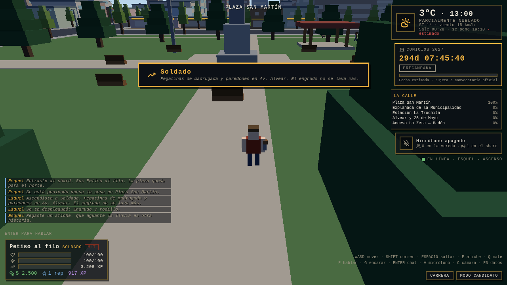

# Auditoría posterior a la Fase 4

> **Estado:** seis hallazgos, seis cerrados · rama `claude/esquel-2027-architecture-6aegk3`
> Se auditó el repo completo —38.000 líneas, cinco commits— buscando lo que las
> cuatro fases dejaron pasar, no repitiendo la deuda ya declarada.

## Por qué esta pasada existe

Cada fase se verificó contra sus propios criterios y los cumplió. Pero un
criterio por fase no ve las costuras **entre** fases, y ahí estaban los dos
agujeros más grandes: un contrato que la Fase 0 definió y nadie conectó, y una
garantía de privacidad que la Fase 4 declaró y no sostuvo.

El método fue buscar contradicciones mecánicas, no leer código en busca de
intuiciones:

| Qué se buscó | Cómo |
|---|---|
| Mensajes de protocolo declarados y sin handler | Cruce del enum contra los dos árboles de código |
| Endpoints que el cliente llama y no existen | Extracción de rutas del cliente contra `backend-php/api/` |
| Constantes de diseño que nadie lee | `grep` de cada export de `balance.ts` |
| Funciones exportadas sin llamador | Cruce de exports contra usos |
| SQL concatenado, salida sin escapar, `innerHTML` | Barrido por patrón |
| Puertas de autenticación sin freno | Comparación entre la puerta del jugador y la del panel |

---

## Los seis hallazgos

### A · El seudónimo de telemetría lo elegía el cliente — **alto**

`TelemetryEvent.subject` viajaba en el cuerpo del evento, el servidor lo copiaba
tal cual y `ingest.php` aceptaba cualquier cosa de 32 hex —o cualquier cosa que
empezara con `dev-`, una puerta que yo mismo dejé para la sesión de desarrollo—.

Un jugador autenticado podía mandar cuarenta eventos con cuarenta sujetos
inventados. Consecuencias, de menor a mayor:

1. La proyección electoral —el producto que justifica toda la Fase 4— se puede
   fabricar.
2. El límite de veinte eventos por segundo **por sujeto** se esquiva cambiando el
   campo que limita.
3. La peor: el k-anonimato se convierte en una herramienta de des-anonimización.
   Un barrio con un solo vecino real no publica nada; el atacante mete catorce
   sujetos falsos, el barrio cruza el umbral de quince, y como sabe cuáles de esos
   catorce son suyos, los resta y se queda con el dato del único vecino real.

**Lo que se hizo.** El seudónimo pasa a viajar **firmado adentro del JWT**
(`telemetrySubject`), lo mintea Hostinger con la sal del período, y el servidor de
juego **sella con él cada evento** antes de mirarlo — antes del rate limit y antes
del conteo de personas distintas. `ingest.php` sólo acepta 32 hex exactos; la
puerta `dev-` se cerró.

`npm run test:intel --workspace server-vps` reproduce el ataque. Sin el sello, el
test falla así:

```
✗ cuarenta sujetos inventados cuentan como una sola persona — esperado 1, salió 40
✗ el barrio NO cruza el umbral de k-anonimato — esperado false, salió true
✗ y por lo tanto no publica dominante — esperado null, salió 4
```

### B · Nadie ascendía de rango, nunca — **alto**

`checkPromotion()` está en `/shared` desde la Fase 0, tiene test propio en
`check:balance`, y **el servidor no la llamaba jamás**. `player.rankTier` se fijaba
del JWT al entrar y no cambiaba en toda la sesión.

Eran tres eslabones rotos, no uno, y por eso arreglar el primero no habría
alcanzado:

1. **Nadie llamaba a `checkPromotion`.** La XP crecía en cuatro lugares y no
   disparaba nada.
2. **La lealtad no se movía.** Se fijaba en 0,20 al entrar; el rango 2 pide 0,35.
   Las constantes `LOYALTY` estaban en `balance.ts` desde la Fase 0 y no las leía
   nadie. Aunque hubiera llamado a `checkPromotion`, habría devuelto siempre "no".
3. **La XP del servidor era de la sesión, no acumulada.** Arrancaba en cero cada
   vez, así que comparaba la XP de un rato contra un umbral de cientos de horas.

Lo que quedaba inalcanzable: el árbol de diez rangos entero, los ítems de carrera
que habilitan misiones (megáfono, camioneta), el chat global de rango 7, y el
panel de carrera prometiendo un ascenso que no iba a llegar.

**Lo que se hizo.** El progreso acumulado viaja firmado en el JWT (`xp`,
`reputation`, `loyalty`); la sala arranca de ahí; la lealtad se mueve con los
ritmos que la Fase 0 ya había definido; `checkRankUp()` corre después de cada uno
de los cuatro pagos y sube de a varios escalones si corresponde; el ascenso se
avisa por `s2c.rank.up`, se canta en el chat del barrio y se persiste. La lealtad
también se persiste, en la columna `personajes.lealtad` que existía sin usarse.



Verificado en `test:smoke` (17/17, dos casos nuevos: cruzar el umbral asciende, no
cruzarlo no asciende) y en un navegador real con `tools/browser-tests/ascenso.mjs`.

### C · La puerta del panel no tenía freno — **medio**

`admin/login.php` no tenía protección contra fuerza bruta, mientras que la puerta
del jugador la tiene desde la Fase 2. Está al revés: el panel abre todo el dataset
de inteligencia y la consola de Live-Ops, y la vía de clave maestra no necesita
adivinar un usuario — es un solo secreto a martillar.

**Lo que se hizo.** Seis intentos por IP en quince minutos, contados sobre la
misma tabla de sesiones con un marcador propio (no cuenta los cierres de sesión
legítimos, que si no un administrador se dejaría afuera solo). Entrar bien limpia
el contador. Los fallos gastan el mismo tiempo en todos los caminos.

### D · La captura de zona no llegaba a la pantalla — **medio**

El servidor emitía `s2c.zone.flip` cuando una facción capturaba una esquina
después de cinco minutos de aguante, y **el cliente no lo escuchaba**. El dato
llegaba por el chat, mezclado entre un choripán y un ladrido.

**Lo que se hizo.** El cliente lo escucha, y tanto la captura como el ascenso
tienen ahora un cartel propio (`MomentBanner`) que aparece unos segundos y se
retira solo. Los dos son el pago de una curva larga; un momento que se pierde en
el scroll no es un momento.

### E · Código que aparentaba ser una función — **bajo**

- `refreshCardIndex()` llamaba a `/catalog/cards`, un endpoint que no existe, y no
  lo llamaba nadie.
- El índice de cartas del cliente era una **segunda copia escrita a mano** de las
  24 cartas. Una segunda lista es una lista que en algún momento discrepa: la
  carta podía anunciar que cuesta 3 de labia y el servidor cobrar 4.
- `c2s.rally.call`, `c2s.interact` y `s2c.weather` estaban declarados en el
  protocolo y muertos en los dos lados.

**Lo que se hizo.** El catálogo de cartas se movió a `/shared/constants/cards.ts`
y el cliente importa de ahí: una sola lista. Los tres mensajes muertos salieron
del protocolo — un protocolo describe lo que existe. `rally_call` era la habilidad
`convocar_movilizacion` del rango 3: queda anotada como diseñada y no construida,
que es distinto de anunciada y no construida.

### F · `npm run lint` miente desde la Fase 0 — **abierto**

No hay `eslint.config.js` y ESLint 10 ya no lee `.eslintrc`. El script existe,
falla, y no está en el CI. **No se arregló en esta pasada**: sumar un linter a
38.000 líneas escritas sin él produce cientos de hallazgos y eso es un trabajo con
su propio alcance, no una nota al pie de una auditoría. Queda como lo que es:
deuda declarada, no deuda escondida.

---

## Lo que la auditoría dice del proceso

Los dos hallazgos altos comparten una forma: **el contrato estaba bien y la
conexión no existía**. `checkPromotion` y `LOYALTY` se escribieron en la Fase 0 con
sus tests; el consumidor tenía que aparecer en la Fase 3 y no apareció. El
seudónimo se diseñó bien en la Fase 0 y la Fase 4 lo transportó sin sellarlo.

Ninguna verificación de fase podía encontrarlos, porque cada una probaba lo que
esa fase construía. Un `typecheck` en verde no dice nada de una función que nadie
llama, y un test de balance verifica la fórmula, no que alguien la use.

Lo que sí los encontró, en minutos: cruzar mecánicamente **lo declarado contra lo
usado**. Vale la pena que eso viva en el CI y no en una auditoría manual —queda
propuesto abajo.

## Lo que salió de la auditoría, además de los arreglos

**`npm run check:wiring`**, ya en el CI. Es la verificación que encontró tres de
los seis hallazgos, convertida en algo que corre solo:

1. Todo mensaje del protocolo tiene emisor y receptor.
2. Toda ruta de la API que el cliente llama existe.
3. Las siete reglas de juego de `/shared` tienen consumidor **en el servidor**.

El punto 3 es el que importa y tiene una sutileza que costó encontrar: buscar el
consumidor *en cualquier lado* no alcanzaba. `checkPromotion()` la llamaba el
cliente para dibujar «te faltan 900 XP» mientras el servidor no la llamaba nunca,
así que el cartel decía la verdad sobre un ascenso que jamás iba a ocurrir. Una
regla consumida sólo por quien la muestra está tan muerta como una que no consume
nadie. La verificación se probó rompiendo a propósito los tres bugs originales.

## Lo que queda propuesto

| Tema | Por qué |
|---|---|
| `eslint.config.js` | El hallazgo F, con su propio alcance |
| Agregación nocturna de telemetría | `metrics.php` calcula sobre la tabla cruda; aguanta hasta unos millones de filas |
| `rally_call` | Habilidad de rango 3 diseñada y sin construir |
| El `.ps1` de empaquetado | Verificado estructuralmente, nunca ejecutado: no hay PowerShell en este entorno |
