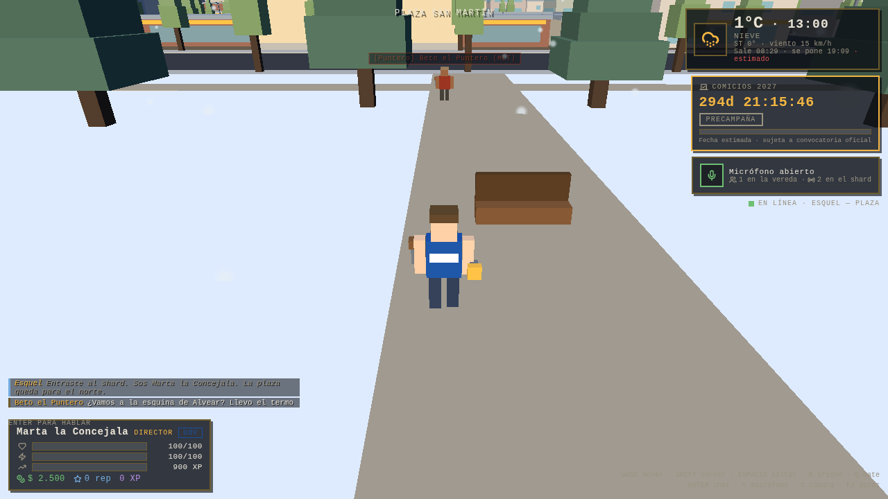

# Fase 2 — Multijugador, voz espacial y puente Hostinger ⇄ VPS

> **Estado:** entregado · verificado con dos navegadores reales contra el servidor real
> Rama: `claude/esquel-2027-architecture-6aegk3`



## 1. Qué se construyó

| Bloque | Archivos | Qué hace |
|---|---|---|
| **Sala autoritativa** | `server-vps/src/rooms/EsquelCityRoom.ts` | Hasta 120 vecinos por shard, simulación a 20 Hz, ciclo de vida con reconexión de 30 s, chat en tres canales, militancia con XP y persistencia diferida |
| **Interest management** | `server-vps/src/systems/AoiIndex.ts` | Tabla hash por manzana. Cada cliente recibe transformadas **sólo** de quienes están a menos de 4 manzanas |
| **Anti-cheat** | `server-vps/src/systems/MovementValidator.ts` | Velocidad, teletransporte, límites y altura. Corrige con `s2c.reconcile`; expulsa recién al duodécimo intento |
| **Esquemas replicados** | `server-vps/src/schema/` | `PlayerState` (identidad política, manzana, animación, voz) y `EsquelWorldState` (reloj de Esquel, clima, fase electoral, facciones) |
| **Voz por proximidad** | `server-vps/src/voice/VoiceSignaling.ts` + `client/src/audio/SpatialVoiceManager.ts` | Señalización WebRTC sobre el WebSocket del juego; audio P2P con `PannerNode` 3D, cancelación de eco y detección de voz |
| **Auth en Hostinger** | `backend-php/api/auth/` | Registro de 30 s y login con Argon2id, JWT HS256 con el payload que consume el VPS |
| **Puente de stats** | `backend-php/api/sync/flush-stats.php` + `server-vps/src/services/HostingerBridge.ts` | Deltas firmados con HMAC, idempotentes por lote, con cola de reintento |
| **Avatares multijugador** | `client/src/entities/` | Avatares voxel con color de facción y accesorios por rango; interpolación y placas `[Rango] Alias (Facción)` |
| **HUD social** | `client/src/ui/` | Burbujas de chat pixel-art, ondas de voz sobre la cabeza, panel de micrófono y onboarding de 30 s |

### Cómo se reparte el ancho de banda

```
estado replicado (Colyseus)   → padrón + mundo, escritura gruesa a 1 Hz
canal AOI (dirigido, 10 Hz)   → transformadas finas, sólo vecinos a < 4 manzanas
voz (WebRTC P2P)              → audio directo entre navegadores, < 25 m
```

@colyseus/schema 2.x no tiene filtros por cliente, así que el interest management se
hace con mensajes dirigidos en vez de con el estado replicado. Es más código, pero da
control exacto: con 120 jugadores desparramados por el centro, cada uno recibe entre 3
y 20 transformadas por paquete en vez de 119.

## 2. Cómo se verificó

Cuatro suites, todas ejecutadas:

```
npm run typecheck     → shared + tools + client + server-vps, strict, 0 errores
npm run test:jwt      → 8/8 · PHP firma y Node verifica, y al revés
npm run test:smoke    → 15/15 · servidor real + dos clientes Colyseus
npm run build:client  → bundle de 195 KB (63 KB gzip) para la app
```

**Paridad de JWT (PHP ⇄ Node), 8/8:** Node acepta el token de PHP con sus claims de
juego; PHP acepta el de Node con acentos y todo; los dos rechazan una firma falsa, un
secreto distinto y un token vencido.

**Prueba de humo del multijugador, 15/15:** un token inválido no entra; dos vecinos
entran con JWT firmado; el padrón replicado trae identidad política; se ven por el
canal AOI; el chat local se escucha a 12 m; la malla de voz los empareja con ganancia
y paneo; el servidor reenvía la oferta SDP; un teletransporte se corrige; pegar un
afiche da XP; el mundo trae reloj, clima y fase electoral; al caminar dos manzanas
dejan de llegar paquetes y el chat local ya no se escucha; `/metrics` reporta la
población.

**Dos navegadores reales, 12/12** (`docs/media/multijugador-plaza.png`): los tokens
los mintea el PHP de Hostinger, cada pestaña abre su WebSocket contra el VPS, cada
una ve la placa de la otra con su rango y su facción, el chat local llega con burbuja
sobre la cabeza y las dos abren el micrófono y quedan emparejadas en la malla de voz.

## 3. Tres bugs que encontraron las pruebas

1. **El foco del chat.** `ENTER` abría la caja pero el `focus()` iba en un
   `setTimeout(0)`, que con render concurrente corre antes de que React monte el
   input. Resultado: el mensaje se escribía "al aire" y las teclas se comían como
   atajos del juego —incluida la `V`, que abría y cerraba el micrófono. Ahora el foco
   se pide en un `useEffect` sobre `chatOpen`.
2. **Cabeceras HTTP con guión largo.** El nombre del shard («Esquel — Centro 01») iba
   en un header y los headers son Latin-1: el `fetch` del puente moría con
   *"character at index 7 has a value of 8212"*. Se sanea a ASCII antes de mandarlo.
3. **La cámara adentro de un pino.** Los colisionadores de los árboles llegaban a
   media altura, así que la cámara en tercera persona los atravesaba y quedaba metida
   en el follaje: pantalla verde oscuro. Ahora el colisionador va hasta la copa y el
   margen de la cámara es más generoso.

Y una calibración vieja corregida: la iluminación de la Fase 1 estaba ajustada
mirando la plaza **nevada** (albedo alto). La BRDF de Lambert de three divide el
difuso por π, así que sobre tierra y asfalto —albedo 0,05-0,15— la ciudad se veía
casi negra. Las intensidades ahora compensan esa división.

## 4. Decisiones de esta fase

1. **HS256 en vez de EdDSA.** Los dos extremos son nuestros, así que el secreto
   compartido alcanza y desaparece el JWKS. Las dos implementaciones están escritas a
   mano, sin librería, y se verifican entre sí en cada build. Si algún día un tercero
   tiene que validar tokens sin poder emitirlos, se pasa a EdDSA y sólo cambia la
   firma: el payload no se toca.
2. **Email opcional.** El registro pide alias y contraseña; el email es opcional
   (migración `0002_registro_rapido.sql`). Menos fricción, y el índice único sigue
   valiendo para quienes sí lo cargan.
3. **El canal general se gana.** El chat a toda la ciudad se abre recién en rango 7
   (Subsecretario). Antes de eso, se camina el barrio.
4. **La guita no se replica.** XP y reputación viajan en el padrón —se ven en la
   placa—, pero la plata es privada: va sólo a su dueño.
5. **Sin Composer en Hostinger.** Autoload PSR-4 de doce líneas. En un hosting
   compartido, cada dependencia es una cosa más que se puede romper.

## 5. Deuda conocida

| Tema | Estado | Cuándo |
|---|---|---|
| Registro contra MySQL real | El código está y `php -l` pasa, pero en este entorno no hay MySQL: los tokens de las pruebas los mintea el mismo `Jwt.php` | F3, con la base levantada |
| Malla de voz > 8 pares | Por encima del tope se priorizan los más cercanos; falta el SFU para movilizaciones grandes | F3 |
| Reconexión rápida | La ventana de 30 s está; falta reenviar el estado de misión en curso | F3 |
| Sharding | Un solo proceso por puerto; falta el lobby que reparte jugadores entre shards | F5 |
| Denuncias | Se registran en el log del shard; falta persistirlas en `moderacion_denuncias` | F4 |

## 6. Qué necesita el próximo bloque

1. **MySQL de verdad** para correr `register.php` de punta a punta y validar el
   volcado de stats contra la base.
2. **El secreto compartido** (`JWT_SECRET` y `HOSTINGER_API_KEY`) generado y puesto
   en los dos entornos.
3. **Dominio y subdominio de tiempo real** (`rt.esquel2027.ar`) con TLS: el navegador
   no abre un `ws://` desde una página `https://`.
4. **Un VPS con GPU-less pero CPU real** para medir el tick a 20 Hz con 120 jugadores;
   lo de acá corre en SwiftShader y no dice nada del rendimiento.
