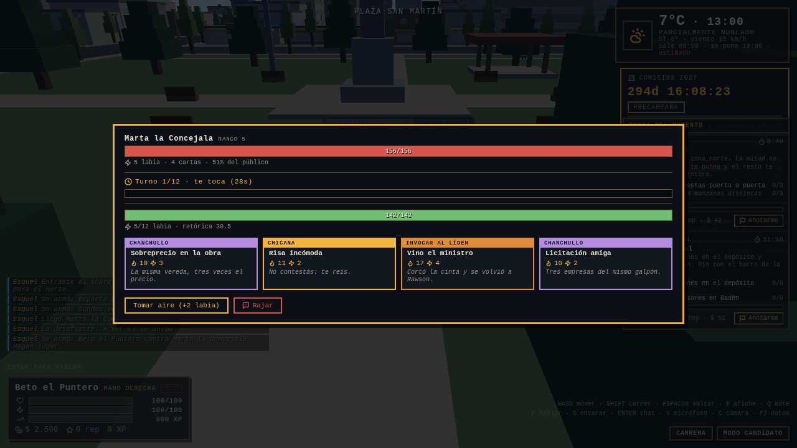
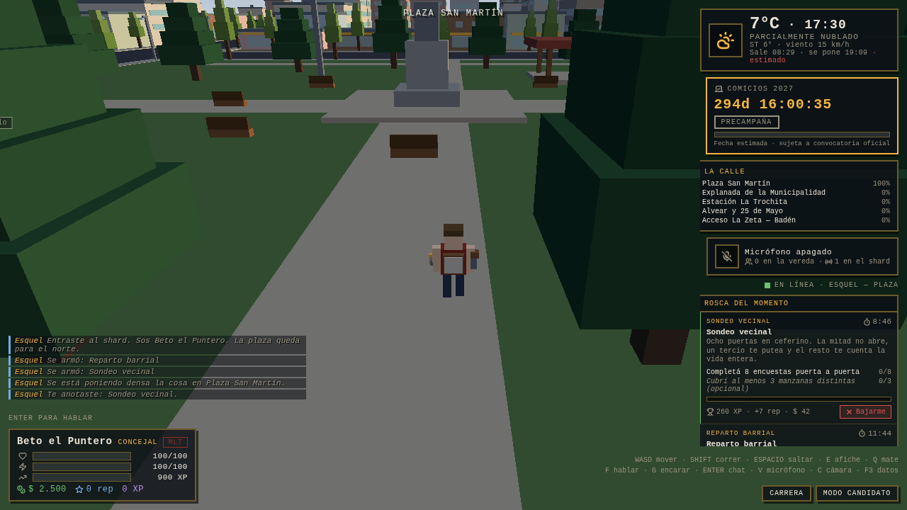
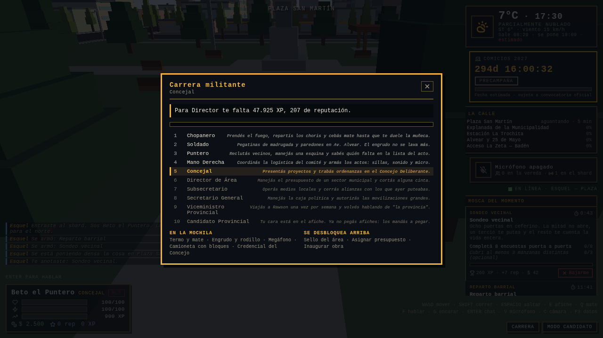

# Fase 3 — Duelos de chicanas, territorio, Live-Ops y los dos modos

> **Estado:** entregado · verificado con dos navegadores reales contra el servidor real
> Rama: `claude/esquel-2027-architecture-6aegk3`



## 1. Qué se construyó

| Bloque | Archivos | Qué hace |
|---|---|---|
| **Carrera militante** | `shared/types/career.ts` | Los diez escalones de Chopanero a Candidato Provincial, cada uno con su oficio, su arena, las herramientas que desbloquea, las acciones que habilita y hasta dónde llega su voz en el chat |
| **Duelo de chicanas** | `shared/types/debate.ts` · `shared/util/debate.ts` · `server-vps/src/debate/` | Seis familias con rueda cerrada de contras, 24 cartas, credibilidad y labia, motor autoritativo con turnos, cooldowns, timeouts y cierre |
| **Territorio** | `server-vps/src/territory/TerritoryManager.ts` | Las cinco zonas medidas cada 10 s con `PoderZona(F) = Σ(Rango^0,75 · caída) · cohesión · voz`, captura al 60% sostenido cinco minutos, banderas y buffs |
| **Live-Ops** | `server-vps/src/quests/` | Las 10 tipologías con sus disparadores (noticia, clima real, territorio, calendario, panel de admin), progreso validado en el servidor y carrera contra la facción rival |
| **Modo Candidato** | `client/src/modes/` · `server-vps/src/modes/ModeRegistry.ts` | Single-player de 12 dilemas con tres arquetipos asimétricos y cuatro variables; el servidor valida el resultado y capa el pago |
| **Modo Ciudadano** | `client/src/modes/CitizenMode.ts` | Traduce el estado del jugador al progreso de carrera y contesta «¿qué me falta para el ascenso?» |
| **NPCs del pueblo** | `client/src/entities/npc/NPCManager.ts` | Cuatro arquetipos con patrullaje y FSM: el Loco (minijuego de reflejos), el Deportista (buff), la Doña (cura) y los perros callejeros |
| **UI de juego** | `client/src/ui/` | Mesa de cartas, rastreador de misiones, panel de zonas, escalera de rangos y la pantalla de campaña |
| **Persistencia** | `backend-php/api/sync/flush-stats.php` + migración `0003` | Historial de misiones con sus contadores y campañas del Modo Candidato, idempotentes por lote y por participación |

### Los dos modos, y cómo se tocan

```
Modo Candidato (single-player)      Modo Ciudadano (MMO)
  3 arquetipos asimétricos            10 rangos, del choripán al afiche propio
  12 dilemas, 4 variables             misiones, duelos, territorio y voz
  final → resultado firmado    ──→    el servidor lo valida y lo paga
                                      con tope por rango (0,4 + 0,06·rango)
```

La campaña se juega entera en el cliente —es un juego de decisiones, no de
simulación— pero **no paga sola**: manda el resultado con su semilla y sus doce
decisiones, y `ModeRegistry.settleCampaign()` verifica la duración, la coherencia
entre decisiones y turnos y el rango de los indicadores antes de convertir nada en
XP. Un chopanero no saca de una campaña lo que saca un candidato.

## 2. Cómo se verificó

Todas las suites, ejecutadas:

```
npm run typecheck                      → shared + tools + client + server, strict, 0 errores
npm run check:balance                  → rangos, seeds, credibilidad, labia y territorio
npm run validate:schemas               → JSON Schema y fachadas
npm run test:jwt                       → 8/8 · PHP ⇄ Node
npm run test:smoke                     → 15/15 · servidor real + dos clientes
npm run test:debate --workspace server-vps → 400 duelos, 7,92 turnos de promedio
npm run build:client                   → 252 KB (82 KB gzip)
node tools/browser-tests/duelo-chicanas.mjs → 12/12 · dos navegadores reales
node tools/browser-tests/hud-fase3.mjs      → misiones, zonas y campaña en pantalla
```

### El balance del duelo se mide, no se estima

`test:debate` juega cientos de duelos completos con bots codiciosos y mazos
legales al azar. Falla si el promedio se sale de 6–9 turnos o si alguna carta con
al menos 20 duelos jugados tiene el piso de su intervalo de confianza del 95%
(Wilson) por encima del 65% de victorias.

| Duelos | Promedio | Mediana | Rango | Dominantes |
|---:|---:|---:|---:|---:|
| 100 | 8,05 | 8 | 3–13 | 0 |
| 400 | 7,92 | 7 | 2–13 | 0 |
| 800 | 8,39 | 8 | 2–13 | 0 |

De 400 duelos: 345 cerraron por credibilidad, 41 por agotar turnos y 14 fueron
empate técnico. El detalle de cómo se llegó a estos números —qué se recortó y por
qué— está en [`balance-formulas.md` §3.6](../game-design/balance-formulas.md).

### Dos navegadores reales, 12/12



Beto (rango 4, Frente Vecinal) encara a Marta (rango 5, otra lista) con la tecla
`G` a ocho metros. A Marta le llega el cartel, se la banca, y la mesa se abre en
las dos pantallas con las credibilidades correctas —142 y 156, que es exactamente
lo que dicta la fórmula para esos rangos—. Beto juega, el daño baja la barra de
Marta en las dos pantallas y el registro cuenta lo mismo de los dos lados.

La otra prueba conecta un vecino solo y verifica lo que se ve sin pelear: las
misiones anunciadas llegan al rastreador, «Anotarme» queda registrado en el
servidor, las cinco zonas se replican con su porcentaje y su aguante, y la campaña
del Modo Candidato se juega entera hasta el final y se cobra.



## 3. Cuatro bugs que encontraron las pruebas

1. **El «Anotarme» no se anotaba.** El servidor contestaba con `QUEST_UPDATED`,
   que el cliente nunca escuchaba: el botón mandaba el mensaje, el jugador quedaba
   anotado del lado del servidor y en pantalla no cambiaba nada. Ahora la respuesta
   personal al alta lleva `joined: true` (la difusión al resto sigue llevando sólo
   el headcount) y el cliente la escucha.
2. **La misión anunciada tiraba el cliente.** `NetworkClient` ya desenvuelve
   `{ quest }` antes de llamar al handler, pero el handler lo volvía a desenvolver:
   `Cannot read properties of undefined (reading 'id')` en cada misión que se
   anunciaba.
3. **La cabecera con guión largo, otra vez.** El nombre del shard
   («Esquel — Plaza») viajaba crudo en `x-esquel-shard` y las cabeceras HTTP son
   Latin-1: el volcado moría con *"character at index 7 has a value of 8212"* antes
   de mandar un solo byte. Ahora se sanea a ASCII en el borde, sin tocar el nombre
   que ve el jugador.
4. **El HUD se pisaba a sí mismo.** El rastreador de misiones estaba centrado
   verticalmente y se montaba sobre el clima y los comicios; los botones de modo
   empujaron el panel de stats hacia arriba, adentro del chat. Ahora la derecha es
   una sola columna que apila todo y frena arriba de la ayuda de teclas, y los
   anclajes del chat salen de una medición del panel, no de un número inventado.

## 4. Decisiones de esta fase

1. **Seis familias, no ocho.** Dato Duro y Empatía Vecinal quedaron afuera: la
   rueda cerraba igual con seis y cada familia pasó a tener una identidad clara.
   La migración las reasigna en vez de borrarlas, para no romper historiales.
2. **`CARPETAZO` no contrarresta a `PROMESA_INVIABLE`.** Ya la castiga por su
   condicional (×1,60 si el rival prometió el turno anterior); sumarle además el
   multiplicador de familia lo convertía en la carta obligatoria del meta. Se
   probó, se midió, se sacó.
3. **Piso de daño.** `DAMAGE_FLOOR = 8` se suma a toda carta antes de escalar.
   Sin él, la brecha entre una chicana de poder 11 y un bombazo de 32 era tan
   grande que armar mazo dejaba de ser una decisión.
4. **La captura lleva cinco minutos.** El 60% de poder evita que la zona cambie
   de manos por un empate; los cinco minutos de aguante evitan que la cambie una
   corrida de treinta segundos. El territorio se gana quedándose.
5. **El control de zona entra al duelo.** `INVOCAR_AL_LIDER` pega ×1,50 con la
   esquina bajo control de tu facción y ×0,80 sin ella. Es el único punto donde
   los tres sistemas —territorio, duelo y facción— se tocan en una sola cuenta.
6. **Los seeds se generan.** Las cartas y las misiones ya no se escriben a mano
   en SQL: los emite `server-vps/scripts/gen-catalog-seeds.ts` desde el catálogo
   TypeScript, y el CI falla si el .sql versionado difiere de lo que sale del
   código.
7. **Los NPCs no tocan el store.** `NPCManager` emite eventos con efectos y quien
   lo monta decide qué hacer con ellos. El mismo código sirve para la escena y
   para un test sin Three andando.

## 5. Deuda conocida

| Tema | Estado | Cuándo |
|---|---|---|
| Mazos personalizados | El servidor valida `DebateDeck` pero todos arrancan con el mazo automático por rango; falta la pantalla de armado | F4 |
| Espectadores del duelo | El favor del público ya cuenta a los que están cerca, pero no se puede *mirar* un duelo ajeno desde la vereda | F4 |
| Perros callejeros multijugador | Viven en el cliente: el perro que te sigue no lo ven los demás | F4 |
| Minijuego del Loco | Es de reflejos puros; no distingue dificultad por rango ni da variantes | F4 |
| Panel de admin de Live-Ops | El mensaje `ADMIN_SPAWN_QUEST` está y valida el rol, pero no hay pantalla que lo use | F4 |
| Webhook de noticias | `NewsSignal` está tipado y el catálogo sabe reaccionar; falta el endpoint que recibe la noticia | F4 |
| Historial contra MySQL real | El SQL está escrito y el CI lo aplica sobre MySQL 8, pero el `flush-stats.php` con misiones adentro no se corrió contra una base con datos | F4, con la base poblada |

## 6. Qué necesita el próximo bloque

1. **La base poblada** para verificar el historial de misiones y las campañas de
   punta a punta, no sólo el esquema.
2. **Una fuente de noticias locales** (RSS o scraping acordado) para enchufar el
   disparador por noticia de las Live-Ops.
3. **Decidir el alcance del dashboard**: qué ve un candidato, qué ve un comercio
   patrocinante y qué no ve nadie. De eso depende el diseño de los agregados con
   k-anonimato de la Fase 4.
