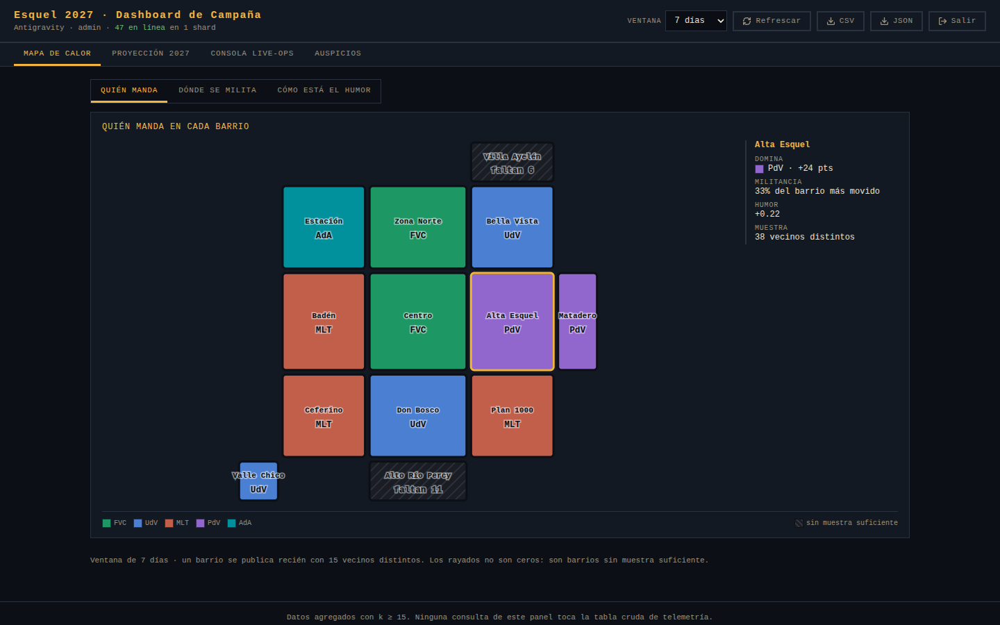
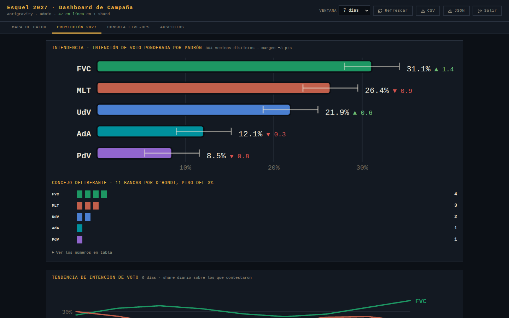
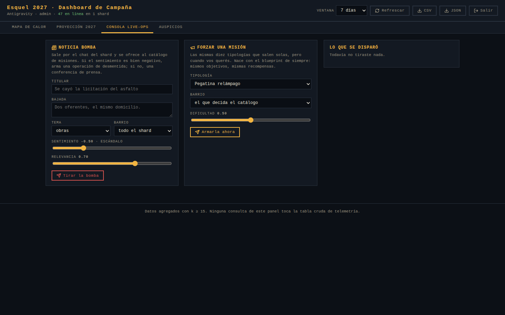

# Fase 4 — Inteligencia política, dashboard, auspicios y despliegue

> **Estado:** entregado · el sistema completo, empaquetado y listo para subir
> Rama: `claude/esquel-2027-architecture-6aegk3`



## 1. Qué se construyó

| Bloque | Archivos | Qué hace |
|---|---|---|
| **Contrato de inteligencia** | `shared/types/intelligence.ts` · `shared/util/intelligence.ts` | Las seis señales agregadas, la matriz demográfica de reporte, D'Hondt, margen de error con corrección por población finita y la compuerta de k-anonimato |
| **Colector del cliente** | `client/src/intelligence/TelemetryCollector.ts` | Cola no bloqueante en memoria, lotes cada 30 s o al cambiar de barrio, reintento exponencial y compuerta de consentimiento en el borde |
| **Motor del shard** | `server-vps/src/intelligence/IntelligenceEngine.ts` | Agrega en vivo por barrio y relaya lo crudo, firmado, a `ingest.php`. Cuenta personas distintas, no eventos |
| **Ingesta y métricas** | `backend-php/api/intelligence/` · `src/Telemetry.php` | `ingest.php` con doble candado de idempotencia y lista blanca; `metrics.php` con todo lo que pinta el dashboard, ya con k-anonimato |
| **Dashboard** | `client/src/admin/` | Mapa de calor de los trece barrios, proyección de intendencia y bancas, tendencia, consola Live-Ops y exportación CSV/JSON |
| **Puerta del panel** | `backend-php/api/admin/login.php` · `src/AdminAuth.php` | Cuenta con rol o clave maestra; la sesión queda en `admin_sesiones`, revocable de a una |
| **Auspicios** | `shared/constants/sponsors.ts` · `client/src/world/sponsorship/` | Tres comercios en su dirección real, marquesina de cubos sobre la fachada, buffs y medición de tránsito a 15 m |
| **Infraestructura** | `backend-php/config/database.php` · `.htaccess` · `server-vps/ecosystem.config.cjs` | PDO con reintentos, enrutamiento SPA + `/api` + GZIP + caché + seguridad, PM2 en fork con rotación de logs y `pm2 deploy` |
| **Empaquetado** | `tools/deploy/package-hostinger.{sh,ps1}` · `docs/prompts/DEPLOY-GUIDE.md` | Arman `hostinger-deploy.zip` verificado y la guía paso a paso para los dos servidores |

### Las dos capas de datos, y por qué están separadas

```
cliente          →  evento crudo     (telemetry.ts)      alto volumen, entra al socket
   ↓ socket autenticado
VPS              →  agrega en vivo   (IntelligenceEngine) el mapa de calor de ahora
   ↓ HMAC firmado, por lote
Hostinger        →  persiste crudo   (ingest.php)         180 días de retención
   ↓ consulta con k-anonimato
dashboard        →  señal agregada   (intelligence.ts)    seis familias, nunca la tabla cruda
```

`telemetry.ts` es lo que **entra**; `intelligence.ts` es lo que **sale**. El
dashboard no consulta la tabla cruda ni una vez: si un número le llegó, se puede
mostrar. La compuerta vive en el backend a propósito — una que viviera en la
interfaz sería una que alguien puede saltarse llamando a la API directo.

## 2. Cómo se verificó

Todas las suites, ejecutadas:

```
npm run typecheck                          → shared + tools + client + server, 0 errores
npm run check:balance                      → rangos, seeds, credibilidad, territorio
npm run validate:schemas                   → JSON Schema y fachadas
npm run test:jwt                           → 8/8 · PHP ⇄ Node
npm run test:intelligence                  → 45/45 · bancas, error muestral, k-anon, paridad PHP
npm run test:smoke                         → 15/15 · servidor real + dos clientes
npm run test:debate --workspace server-vps → 400 duelos, 7,92 turnos de promedio
npm run test:intel  --workspace server-vps → 30/30 · el motor político del shard
npm run build:client                       → 270 KB + 32 KB del dashboard (aparte)
./tools/deploy/package-hostinger.sh        → hostinger-deploy.zip · 1,5 MB · 66 archivos
node tools/browser-tests/dashboard.mjs     → 9/9 · el panel dibujado en un navegador real
```

### El reparto de bancas se verifica contra ejemplos calculados a mano

D'Hondt está implementado **dos veces** —TypeScript para el motor del shard, PHP
para el dashboard— y las dos tienen que dar exactamente lo mismo: si divergen, un
candidato ve dos números de bancas distintos según dónde mire.
`test:intelligence` compara las dos implementaciones sobre cuatro repartos, y
además contrasta contra ejemplos resueltos a mano:

| Caso | Cocientes | Resultado |
|---|---|---|
| 100 / 80 / 30 / 20 en 8 bancas | 100, 80, 50, 40, 33,3, 30, 26,7, 25 | 4 / 3 / 1 / 0 |
| 340 / 280 / 160 / 60 en 7 bancas | 340, 280, 170, 160, 140, 113,3, 93,3 | 3 / 3 / 1 / 0 |
| Con una lista al 2% | — | queda afuera por el piso del 3% |
| Empate exacto | — | gana el id más bajo, igual en las dos corridas |

### El k-anonimato se prueba con un barrio que no llega

`test:intel` mete 30 vecinos distintos en el Centro y 4 en Valle Chico. El Centro
publica y tiene dominante; Valle Chico devuelve `publishable: false`, sin
dominante, con militancia en cero y **conservando el conteo de 4**, que es lo que
le permite al panel decir «faltan 11» en vez de dibujar un cero.



### La ponderación por padrón hace lo que promete

En la misma prueba: la facción 1 gana el Centro 20 a 10, la facción 2 se lleva
Badén 20 a 0. Sin ponderar, la 1 estaría arriba. Con los pesos de padrón
—Centro 0,19 y Badén 0,10— la 2 termina **56,3% contra 43,7%**. Es exactamente el
sesgo que la ponderación existe para corregir: en el juego se milita más en el
Centro que en el Badén, y eso no cambia el padrón.

### El panel, dibujado en un navegador de verdad

`tools/browser-tests/dashboard.mjs` abre `/admin` en Chromium con un
`DashboardSnapshot` sintético y verifica los trece barrios dibujados, los dos que
no llegan al umbral rayados, las once bancas repartidas, el tooltip de la
tendencia siguiendo al mouse, la consola montada y los tres comercios con sus
métricas. **9/9, sin errores de consola.**



## 3. Decisiones de esta fase

1. **La paleta de los gráficos se derivó, no se eligió a ojo.** Los colores de
   facción del juego están calibrados para un avatar iluminado en 3D; sobre el
   fondo oscuro del panel quedaban fuera de la banda de luminosidad, dos de ellos
   por debajo del piso de croma y tres por debajo de 3:1 de contraste. Se llevaron
   **los mismos tonos** a L=0,60 en OKLCH tomando el máximo croma que aguanta cada
   tono dentro del gamut. El resultado pasa las cinco verificaciones sobre
   `#0c1016`. El peor par adyacente queda en ΔE 8,1 con deuteranopía —justo en el
   piso—, así que **todos** los gráficos llevan etiqueta directa: el color
   identifica, el texto confirma.
2. **Tres barrios más.** Matadero, Villa Ayelén y Alto Río Percy entraron porque
   el mapa de calor necesitaba el pueblo entero, no sólo la parte donde se juega.
   Son diez columnas de siete tablas: la migración `0004` las modifica todas de
   una pasada, y agregar valores a un ENUM no toca las filas existentes.
3. **La telemetría viaja por el socket del juego.** No hay endpoint público de
   ingesta que se pueda inundar desde una consola: el lote va por el WebSocket ya
   autenticado y el VPS lo mide por sujeto (20 eventos/segundo). El endpoint HTTP
   de ingesta sólo acepta cuerpos firmados con HMAC desde el VPS.
4. **La franja de reporte tiene cuatro cubetas, no seis.** El dato se recolecta
   con las seis bandas finas que declara el jugador y se publica con las cuatro de
   cualquier informe político. No es una simplificación caprichosa: cuatro cubetas
   se llenan y superan el umbral de k-anonimato; seis no.
5. **El dashboard va en el mismo bundle, cargado aparte.** Comparte los contratos
   de `/shared` y en un hosting compartido una segunda aplicación es una segunda
   cosa que mantener. Va en un chunk propio de 32 KB: el que entra a jugar no baja
   los gráficos que nunca va a ver.
6. **PM2 en `fork`, nunca en `cluster`.** Colyseus guarda el estado de las salas
   en la memoria del proceso; en cluster, dos jugadores que entran a «la misma»
   sala caerían en mundos distintos sin verse. Se escala con un proceso por puerto
   detrás de nginx, y cada proceso es un shard.
7. **Los tres comercios son arquetipos, no comercios identificados.** «La
   chocolatería del centro» describe un rubro y una cuadra, no a un titular.
   Cargar un comercio real requiere contrato firmado y consentimiento expreso de
   uso de nombre, marca y fachada, y eso no se genera: se carga a mano.

## 4. Tres bugs que encontraron las pruebas

1. **La configuración de PM2 no era ejecutable.** El workspace declara
   `"type": "module"`, así que `pm2.config.js` era ESM y su `module.exports` no
   existía. Nadie lo había notado porque nunca se lo había cargado desde Node. Es
   ahora `ecosystem.config.cjs`, y el `require` se verifica en el CI.
2. **La etiqueta de la barra se montaba sobre el bigote del margen de error.** El
   texto se posicionaba después del final de la barra, pero el bigote se extiende
   más allá cuando el margen es ancho. Ahora arranca después de lo que termine más
   a la derecha, sea la barra o el bigote.
3. **El mapa de calor se salía de la pantalla.** El lienzo cubría los 25×25 de la
   grilla del mundo, pero los barrios no llenan las esquinas: media pantalla en
   blanco y tres barrios abajo del pliegue. Se recorta al rectángulo que ocupan y
   se limita por alto.

## 5. Deuda conocida

| Tema | Estado | Cuándo |
|---|---|---|
| Agregación nocturna | `metrics.php` calcula sobre la tabla cruda con una ventana de días. Anda bien hasta unos cuantos millones de filas; después hay que llenar `telemetria_agregados` con un cron y leer de ahí | F5, cuando el volumen lo pida |
| El script `.ps1` | Estructuralmente verificado (bloques y comillas balanceados) pero **no ejecutado**: no hay PowerShell en este entorno. El `.sh` sí corrió y produjo el zip | Probar en una máquina Windows |
| `npm run lint` | Sigue roto desde la Fase 0: no hay `eslint.config.js` y ESLint 10 ya no lee `.eslintrc`. No está en el CI, así que no rompe nada, pero el script miente | F5 |
| Webhook de noticias reales | La consola Live-Ops dispara noticias a mano y el catálogo sabe reaccionar a `NewsSignal`; falta el endpoint que recibe un RSS local | F5 |
| Buff de labia | El chocolate manda una acción al servidor, pero el duelo todavía no lee un buff comercial al abrirse | F5 |
| Perros callejeros multijugador | Viven en el cliente: el perro que te sigue no lo ven los demás | F5 |
| Autogestión de comercios | El dashboard muestra las métricas de todos; falta el panel donde un comerciante ve sólo las suyas | F5 |

## 6. Qué hace falta para que esto esté en el aire

Nada de código. Cuatro cosas del mundo real:

1. **La cuenta de Hostinger** con el dominio y el certificado, y **el VPS** con su
   IP fija y el subdominio `rt.` apuntado.
2. **Los cuatro secretos generados** (`JWT_SECRET`, `HOSTINGER_API_KEY`,
   `TELEMETRY_SALT`, `IP_HASH_SALT`) puestos en los dos entornos. Los dos primeros
   tienen que coincidir carácter por carácter entre Hostinger y el VPS: es la
   causa número uno de despliegues que cargan y no conectan.
3. **La clave maestra del dashboard**, hasheada con
   `php -r "echo password_hash('…', PASSWORD_ARGON2ID);"`.
4. **Una decisión editorial:** el juego es sátira política de un pueblo real. Las
   facciones son ficticias y la política editorial está en
   `shared/constants/factions.ts`, pero antes de abrirlo al público conviene que
   una persona de Esquel lea los textos y diga qué se pasa de rosca. Eso no lo
   puede decidir el código.

El paso a paso completo está en [`DEPLOY-GUIDE.md`](./DEPLOY-GUIDE.md).
